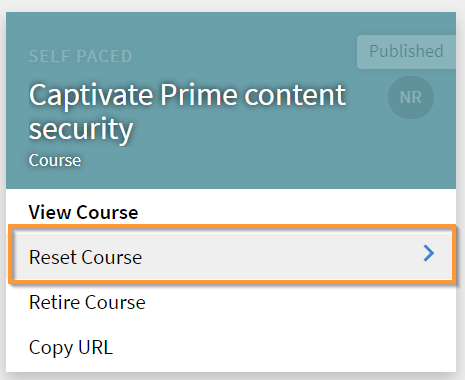

# Permitir control total del catálogo compartido

## Crear catálogo {#createcatalog}

Como administrador, puede crear un catálogo de cursos, programas de aprendizaje, ayudas de trabajo y certificaciones.

Para obtener más información, consulte [Catálogos](/help/migrated/administrators/feature-summary/catalogs.md).

## Compartir catálogo {#sharecatalog}

Puede compartir los catálogos con usuarios internos de una organización o con cualquier usuario externo. Sin embargo, el uso compartido es exclusivo. En otras palabras, un catálogo compartido internamente no se puede compartir con grupos externos y viceversa.

Los cursos, los programas de aprendizaje, las ayudas de trabajo y las certificaciones son los objetos de aprendizaje admitidos para el catálogo compartido.

Para obtener más información, consulte [Compartir catálogos](/help/migrated/administrators/feature-summary/catalogs.md).

## Permitir control total del catálogo compartido {#fullcontrol}

Puede conceder acceso completo al catálogo a cuentas externas. El administrador de la cuenta puede aceptar el catálogo y, en consecuencia, añadir o eliminar aprendizajes o módulos.

Para otorgar control total a una cuenta externa:

1. Después de añadir los aprendizajes a un catálogo, debe compartir el catálogo con usuarios externos.
1. En el cuadro de diálogo Cuenta externa, añada el subdominio y el ID de correo electrónico del administrador de la organización externa.
1. En la opción Control de catálogo, active el botón para permitir a los usuarios externos el control total del catálogo.

   

   *Permitir control total del catálogo compartido*

   Cuando se permite el control total del catálogo, el administrador de la organización externa acepta la solicitud para permitir modificaciones en el catálogo. A continuación, el autor de la organización externa puede editar los cursos o añadir módulos.

   Consulte las secciones siguientes para obtener más información.

## Administrador de la organización externa {#administratorofexternalorganization}

Una vez que el administrador de la organización anterior activa el control total del catálogo, el administrador de la organización externa acepta la solicitud y la visualiza.

1. Haga clic en el icono de notificación para ver la notificación para aceptar el catálogo.

   <!---->

1. Para aceptar la invitación para el catálogo, haga clic en Aceptar.
1. En la lista de catálogos, si inicia el catálogo que se ha compartido con usted, puede ver un mensaje que indica que el catálogo ahora tiene control total.

   

   *Ver detalles del catálogo*

1. Puede modificar el nombre del catálogo y la descripción.

## Compartir catálogo para el programa de aprendizaje, la certificación y las ayudas de trabajo {#sharecatalogforlearningprogramcertificationandjobaids}

Al igual que la concesión del control total del catálogo para los cursos, el administrador también puede conceder el control total del catálogo para lo siguiente:

* Programas de aprendizaje
* Certificaciones
* Ayudas de trabajo

## Restablecer curso {#resetcourse}

1. En la tarjeta de catálogo que tiene un vínculo roto, haga clic en **[!UICONTROL Restablecer curso]**.

<!-- -->

1. Aparece un mensaje de alerta después de hacer clic en el botón Restablecer. Restablecimiento del curso:

   * Quita todo el contenido recién agregado del catálogo.
   * Actualiza el catálogo sincronizado con el catálogo compartido original.
   * Restaura la relación con el objeto de aprendizaje principal.

   El restablecimiento del catálogo es irreversible. Los cambios realizados en el catálogo no se pueden deshacer.

1. Para aceptar los cambios, haga clic en Sí.
1. En el Catálogo de cursos, puede ver que el catálogo no contiene el mensaje *Vínculo roto* ya no.

   Al ver los detalles del catálogo, puede ver que el catálogo se ha restaurado a su estado original.

## Volver a añadir un objeto de aprendizaje {#readdalearningobject}

Si ha eliminado un curso, un programa de aprendizaje, una certificación o una ayuda de trabajo por error, puede restaurarlo.

Para restaurar un objeto de aprendizaje eliminado, haga clic en Volver a añadir.

Esta acción invierte la acción y restaura el objeto de aprendizaje en la vista de catálogo.

*Agregar de nuevo un objeto de aprendizaje*

Después de hacer clic en el botón Volver a añadir, aparece un mensaje de confirmación que indica que el objeto de aprendizaje se ha añadido correctamente al catálogo.

## Organización externa {#externalorganization}

Una vez que el administrador de la cuenta externa haya aceptado el catálogo, el autor podrá añadir cursos y programas de aprendizaje.

1. Como usuario, recibirá una notificación de que el catálogo ya está disponible en su cuenta.
1. Para ver la lista de cursos, haga clic en **[!UICONTROL Cursos]** en el panel de navegación izquierdo. Puede ver todos los cursos creados por usted y compartidos con usted.
1. Para ver los detalles del curso, haga clic en **[!UICONTROL Ver curso]** en la tarjeta del curso.

   <!---->

1. En la página de detalles del curso, puede ver información sobre el curso y los módulos compartidos. Para añadir un módulo, haga clic en Añadir módulos. Cuando se agregan módulos a los módulos existentes, los nuevos módulos aparecen al final de los módulos existentes. Siempre puede reorganizar los módulos.
1. Una vez agregados los módulos, haga clic en Volver a publicar.

   Después de volver a publicar los módulos, en la tarjeta del catálogo, verá un mensaje *Vínculo roto*.

   Dado que ha actualizado el catálogo original con nuevos módulos, la relación existente con el curso adquirido ya no existe.

   El objeto de aprendizaje no estará sincronizado con la cuenta de origen porque se ha modificado su contenido.

   <!---->

Después de añadir y volver a publicar el módulo, si cree que ha añadido o eliminado por error un curso del catálogo anteriormente, puede restablecer el módulo y revertirlo a su estado original cuando se compartió por primera vez con control total.
