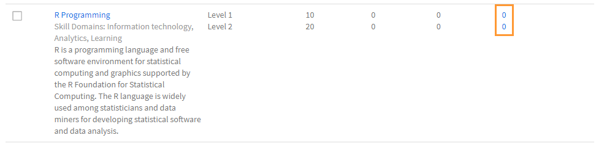

# Crear y modificar aptitudes y niveles

Cree, asigne y modifique aptitudes y niveles.

El mapa de aptitudes es un grupo de conjuntos de conocimiento y características de aptitudes de un empleado en una empresa. Estos mapas de aptitudes ayudan a las empresas/organizaciones a establecer o mejorar las expectativas de rendimiento para sus empleados. Las aptitudes permiten a los empleados alinear los comportamientos con las expectativas de la empresa.

Adobe Learning Manager le permite asignar el rendimiento de los alumnos según sus conjuntos de aptitudes al mapa de aptitudes. Cuando los alumnos completan algunos cursos, pueden saber su posición respecto a cada aptitud mediante la visualización de los mapas de aptitudes.

La finalidad básica de las aptitudes en el sistema de gestión de aprendizaje Learning Manager (LMS) es proporcionar al administrador una herramienta que adecue la formación a los objetivos de negocio.

## Añadir una aptitud {#addaskill}

Como administrador, puede efectuar las acciones siguientes:

* Asignar un dominio a una aptitud.
* Agregar varios niveles de una aptitud.
* Agregar una insignia a un nivel.

Para añadir una aptitud, siga los pasos que se indican a continuación:

1. En el panel izquierdo, seleccione **[!UICONTROL Aptitudes]** > **[!UICONTROL Agregar]** > **[!UICONTROL Agregar Aptitudes]**. Asigne un nombre a la aptitud y escriba una descripción.

   

   *Agregar nombre y descripción de una aptitud*

1. Asigne un dominio a la aptitud. Al crear una aptitud, puede asignarla a los dominios de aptitudes más relevantes que admita Learning Manager. Para obtener más información, consulte [***Asignar aptitud con dominios***](/help/migrated/administrators/feature-summary/curation-skills.md).

   Empiece a escribir el dominio en el campo y podrá ver recomendaciones. Seleccione la opción o las opciones relevantes para la aptitud.

   

   *Agregar un dominio*

1. Asigne los niveles a la aptitud. Para añadir un nivel, haga clic en **[!UICONTROL Agregar]**.

   Puede crear aptitudes y asignarlas a los empleados. Las aptitudes tienen varios niveles. Para alcanzar cada nivel, debe obtenerse un determinado número de créditos.

   Como máximo se pueden asignar tres niveles a una aptitud. El programa de formación consiste en inscribir a alumnos en varios objetos de aprendizaje, lo cual después se convierte en un número de créditos que satisfacen los requisitos de los diferentes niveles de una aptitud.

   Cuando se han conseguido estos objetos de aprendizaje y niveles, el alumno está capacitado para ser más productivo que antes.

   

   *Agregar niveles de aptitud*

   Al añadir una aptitud, también puede asignar decimales a los créditos. Los créditos muestran hasta dos decimales.

   El uso de decimales solo está disponible en inglés.

1. Elija una insignia para el nivel. En la lista desplegable **[!UICONTROL Insignia]**, seleccione la imagen que deberá utilizarse como insignia de ese nivel.
1. Para guardar los cambios, haga clic en **[!UICONTROL Guardar]**.

   Una vez que se ha creado la aptitud, puede buscarla en la página **[!UICONTROL Aptitud]**. También puede ver los dominios y una breve descripción de la aptitud, así como los niveles y los créditos que se han asignado a cada nivel.

   

   *Ver lista de aptitudes*

## Asignar la aptitud a alumnos {#assigntheskilltolearners}

Los administradores pueden asignar las aptitudes a los alumnos.

Después de crear las aptitudes y guardarlas, aparecerán en la página de aptitudes. Ya puede comenzar a asignar estas aptitudes a los alumnos de la siguiente manera:

1. En la página **[!UICONTROL Aptitud]**, haga clic en el hipervínculo con la cantidad de alumnos que se han inscrito en la aptitud. En el caso de una aptitud que se acaba de crear, la cantidad de alumnos en todos los niveles es cero.

   

   *Ver alumnos asignados a una aptitud*

   En este ejemplo, agregue alumnos a Nivel 1. Haga clic en el hipervínculo junto a Nivel 1.

1. En el cuadro de diálogo Alumnos, haga clic en **[!UICONTROL Añadir alumnos]**.

   

   *Cómo añadir alumnos*

1. Busque alumnos y añádalos. También es posible añadir grupos de usuarios.

   

   *Buscar y agregar alumnos*

1. Para guardar los cambios, haga clic en **[!UICONTROL Guardar]**.

   Después de asignar los alumnos, todos los alumnos de un grupo de usuarios, si los hay, se inscriben automáticamente en la aptitud de forma predeterminada. Puede hacer que los alumnos decidan no participar en la inscripción automática haciendo clic en el botón **[!UICONTROL Inscripción automática]**.

   

   *Deshabilitar inscripción automática*

   Los alumnos individuales pueden inscribirse automáticamente o el administrador puede inscribirse en un programa de aprendizaje.

1. Después de hacer clic en **[!UICONTROL Cerrar]**, puede ver el número total de alumnos que se han asignado a la aptitud que había creado.

   En este ejemplo, hay dos alumnos individuales y tres alumnos en un grupo de usuarios.

   

   *Número de alumnos asignados a una aptitud*

## Asignar la aptitud a un curso {#assignskilltocourse}

Después de haber creado la aptitud, un autor puede crear un curso y asignar la aptitud a dicho curso.

*Asignar aptitudes a un curso*

Después de que el autor publique el curso, en la página **[!UICONTROL Aptitud]**, puede ver la cantidad de cursos asociados con un nivel de aptitud, el cual se incrementa al asignar la aptitud a un curso nuevo.

*Número de cursos asociados a un nivel de aptitud*

## Asignar una ayuda de trabajo a la aptitud {#assignajobaidtotheskill}

Las ayudas de trabajo consisten en contenido al que puede tener acceso un alumno sin inscribirse en ningún objeto de aprendizaje concreto como un curso o un programa de aprendizaje.

Al crear una ayuda de trabajo, un autor puede asociarle un nivel de aptitud. Si se crea una ayuda de trabajo sin ninguna aptitud y se asocia a un curso que tiene una aptitud, dicha aptitud no se vincula con la ayuda de trabajo.

*Crear una ayuda de trabajo*

En la página **[!UICONTROL Aptitud]**, puede ver el número de ayudas de trabajo que están asociadas con ese nivel de aptitud.

*Número de ayudas de trabajo de una aptitud*

## Buscar una aptitud {#searchskill}

Busque cualquier aptitud escribiendo el nombre de dicha aptitud y eligiéndola entre las opciones disponibles. La búsqueda de escritura anticipada también funciona en este caso.

Puede buscar aptitudes en las secciones **[!UICONTROL Activo]** y **[!UICONTROL Retirado]** de la página Aptitudes.

## Editar una aptitud {#editaskill}

En la página **[!UICONTROL Aptitud]**, haga clic en la aptitud que desea modificar. En el cuadro de diálogo **[!UICONTROL Editar aptitud]**, realice los cambios necesarios, por ejemplo:

* Añadir o eliminar un dominio de aptitud.
* Editar el nombre y la descripción de la aptitud.
* Añadir un nivel de aptitud o modificar uno que ya exista.
* Añadir o eliminar una insignia de una aptitud.

Después de haber efectuado los cambios, haga clic en **[!UICONTROL Guardar]**.

## Retirar una aptitud {#retireaskill}

Para retirar una aptitud, en la página **[!UICONTROL Aptitud]**, haga clic en la aptitud que desea retirar.

En el menú **[!UICONTROL Acciones]**, en la esquina superior derecha de la página, haga clic en **[!UICONTROL Retirar]**.

Si se retira una aptitud, esta ya no aparece en el curso.

Si se retira una aptitud, no se puede asociar con cursos ni ayudas de trabajo, ni asignarse a alumnos hasta que se vuelva a publicar. El hecho de retirar una aptitud no afecta a las asociaciones y asignaciones existentes.

## Volver a publicar una aptitud {#republishaskill}

Tras haber retirado una aptitud, dicha aptitud aparece en la ficha **[!UICONTROL Retirado]**. En la ficha figuran todas las aptitudes que se han retirado.

Para volver a publicar una aptitud que se había retirado, seleccione dicha aptitud; a continuación, en el menú **[!UICONTROL Acciones]**, haga clic en **[!UICONTROL Volver a publicar]**.

De este modo, se restaura la aptitud, la cual aparecerá de nuevo en la ficha **[!UICONTROL Activo]**.

## Eliminar una aptitud {#deleteaskill}

Solo es posible eliminar una aptitud que antes se haya retirado.

En la ficha **[!UICONTROL Retirado]**, seleccione la aptitud que desea eliminar; a continuación, en el menú **[!UICONTROL Acciones]**, haga clic en **[!UICONTROL Eliminar]**.

Puede eliminar una aptitud solo cuando no está asociada a ningún alumno, curso ni ayuda de trabajo.

## Asignar aptitudes a instructores

Agregue un archivo CSV que contenga las aptitudes de los instructores. Estas aptitudes se añaden a continuación a la lista de aptitudes.

1. En la esquina superior derecha de la pantalla, seleccione **[!UICONTROL Agregar]** > **[!UICONTROL Asignar aptitudes al instructor]**.
1. Cargue un archivo csv. Las columnas del archivo CSV son:

   * Nombre de la aptitud
   * Nivel de aptitud
   * Correo electrónico del instructor o UUID del instructor

   Para las cuentas habilitadas para UUID, sustituya la columna Correo electrónico del instructor por UUID del instructor.

   Haga clic en Guardar.

   

   *Agregar aptitudes de instructor desde un archivo CSV*

1. Verá un mensaje emergente de confirmación.

   Nota: El siguiente mensaje de error aparece si el archivo CSV tiene campos incorrectos.

   

   *Mensaje de error para campos incorrectos*

### Página Aptitudes

En la página Aptitudes, hay una columna denominada Instructores, que indica el número de instructores asignados a una aptitud. Si hace clic en el número de instructores, aparece un mensaje emergente que muestra los instructores asignados a la aptitud.

*Página de aptitudes*

### Descargar el archivo CSV de asignación de aptitudes

1. En la página Aptitudes, haga clic en **[!UICONTROL Agregar]** > **[!UICONTROL Asignar aptitudes al instructor]**.
1. En el cuadro de diálogo, haga clic en **[!UICONTROL Asignación agregada anteriormente]**.
1. Se descargará el último archivo CSV que haya cargado.

>[!NOTE]
>
>Le recomendamos que descargue primero el archivo CSV de asignación de aptitudes, lo edite y, a continuación, cargue el archivo.

## Preguntas más frecuentes {#frequentlyaskedquestions}

+++¿Cómo puedo eliminar a un alumno de una aptitud?

No es posible eliminar a un alumno de una aptitud. Ahora bien, se pueden añadir alumnos o grupos de usuarios a la aptitud.
+++

+++Cómo inscribir automáticamente alumnos en una aptitud

La función de inscripción automática solo es para grupos de usuarios. Al inscribir un grupo de usuarios, por ejemplo Todos los autores, en una aptitud y guardarla, la inscripción automática está activada de forma predeterminada. Por lo tanto, cualquier incorporación nueva al grupo de usuarios Todos los autores se asigna también a la aptitud.

Si detiene la inscripción automática relativa a ese nivel de aptitud para Todos los autores, no se asigna la aptitud a los nuevos usuarios que se agreguen al grupo de usuarios Todos los autores.
+++

+++Cómo reiniciar la inscripción automática?

Inscriba de nuevo el mismo grupo de usuarios en el nivel de aptitud en el que se detuvo la inscripción automática.

De esta manera, se reinicia la inscripción automática y se asigna la aptitud a los alumnos que se agregaron al grupo cuando esta función estaba desactivada.

Es decir, cada vez que vuelve a inscribir un grupo de usuarios para iniciar la inscripción automática, actualiza los miembros del grupo de usuarios y asigna la aptitud a todos los miembros actuales.
+++

+++¿Cómo puedo asignar una aptitud a un curso?

Para obtener más información sobre el procedimiento, consulte la sección [Asignar aptitudes a un curso](skills-levels.md#assignskilltocourse).
+++

+++¿Cómo cambio un nivel de aptitud?

Para cambiar uno o más niveles de una aptitud, edite la aptitud y modifique las propiedades de los niveles.
+++

+++ ¿Cómo habilito las insignias y las aptitudes para que estén vinculadas a la finalización del curso?

Las aptitudes se pueden vincular a la finalización del curso al crear un curso como autor. En la sección Configuración, puede configurar los criterios de aptitud para la finalización del curso.

A fin de activar instancias para la finalización del curso, en la sección **[!UICONTROL Instancias]** de la aplicación de autor, active la insignia correspondiente.
+++

+++¿Puede un administrador marcar una insignia como completa aunque esta muestre el estado &quot;En curso&quot;?

Un administrador puede marcar un objeto de aprendizaje como completado. La aptitud y las insignias se asocian con el objeto de aprendizaje y no se pueden marcar como **[!UICONTROL completadas]** por separado.

Es decir, para conseguir la insignia, **se debe completar el objeto de aprendizaje asociado**.
+++

### Vínculos relacionados

* [Aptitudes y Adobe Learning Manager](https://elearning.adobe.com/2018/11/skills-captivate-prime/)
