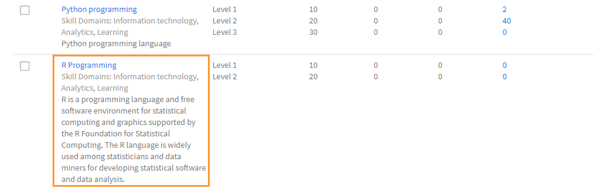

# Crear y modificar aptitudes y niveles

Cree, asigne y modifique aptitudes y niveles.

El mapa de aptitudes es una agrupación de conjuntos de aptitudes, conocimientos y atributos de un empleado en una organización. Estos mapas de habilidades ayudan a las empresas/organizaciones a establecer o aumentar las expectativas de rendimiento de sus empleados. Las habilidades permiten a los empleados alinear sus comportamientos con las expectativas de la organización.

Adobe Learning Manager le permite asignar el rendimiento de los alumnos en función de sus conjuntos de aptitudes mediante el mapa de aptitudes. Cuando los alumnos completan algunos cursos, pueden saber su posición respecto a cada aptitud mediante la visualización de los mapas de aptitudes.

El propósito fundamental de las habilidades en el LMS de Learning Manager es proporcionar al administrador una herramienta que alinee el aprendizaje con los objetivos empresariales.

## Añadir una aptitud {#addaskill}

Como administrador, puede realizar lo siguiente:

* Asigne un dominio a una aptitud.
* Añadir varios niveles de una aptitud.
* Agregar una insignia a un nivel.

Para añadir una aptitud, siga los pasos que se indican a continuación:

1. En el panel izquierdo, haga clic en **[!UICONTROL Aptitudes]**. Asigne un nombre a la aptitud y escriba una descripción.

   

   *Añadir nombre y descripción de una aptitud*

1. Asigne un dominio a la aptitud. Al crear una aptitud, puede asignarla a los dominios de aptitudes más relevantes que admita Learning Manager. Para obtener más información, consulte [***Asignar aptitud con dominios***](/help/migrated/administrators/feature-summary/curation-skills.md).

   Comience a escribir el dominio en el campo y podrá ver recomendaciones. Seleccione la opción o las opciones que sean relevantes para la aptitud.

   

   *Añadir un dominio*

1. Asigne los niveles a la aptitud. Para añadir un nivel, haga clic en **[!UICONTROL Añadir]**.

   Puede crear aptitudes y asignarlas a los empleados. Las aptitudes tienen varios niveles y cada nivel requiere que se obtenga un determinado número de créditos.

   Puede asignar un máximo de tres niveles a una aptitud. La ruta de aprendizaje consiste en inscribir alumnos en varios objetos de aprendizaje, lo que se traduce en un determinado número de créditos que cumplen los requisitos de los distintos niveles de una aptitud.

   Una vez alcanzados estos objetos de aprendizaje (OA) y niveles, el alumno está preparado para rendir a un nivel más productivo que antes.

   

   *Añadir niveles de aptitud*

   Al añadir una aptitud, también puede asignar decimales a los créditos. Los créditos se muestran hasta dos posiciones decimales.

   La compatibilidad con decimales solo está disponible en inglés.

1. Elija una insignia para el nivel. Desde el **[!UICONTROL Insignia]** , seleccione una imagen que debe utilizarse como insignia para ese nivel.
1. Para guardar los cambios, haga clic en **[!UICONTROL Guardar]**.

   Una vez creada la aptitud, puede buscarla en el **[!UICONTROL Aptitud]** página. También puede ver los dominios y una breve descripción de la aptitud. También puede ver los niveles y los créditos que se han asignado a cada nivel.

   

   *Ver lista de aptitudes oif*

## Asignar la aptitud a alumnos {#assigntheskilltolearners}

Los administradores pueden asignar las aptitudes a los alumnos.

Después de crear sus aptitudes y guardarlas, aparecerán en la página de aptitudes. Ahora puede comenzar a asignar estas aptitudes a los alumnos de la siguiente manera:

1. En la **[!UICONTROL Aptitud]** , haga clic en el hipervínculo con el número de alumnos inscritos en la aptitud. Para una aptitud recién creada, el número de alumnos de todos los niveles es cero.

   

   *Ver alumnos asignados a una aptitud*

   En este ejemplo, agregue alumnos a Nivel 1. Haga clic en el hipervínculo junto a Nivel 1.

1. En el cuadro de diálogo Alumnos, haga clic en **[!UICONTROL Añadir alumnos]**.

   

   *Añadir alumnos*

1. Busque alumnos y añada alumnos. También puede añadir grupos de usuarios.

   

   *Buscar y añadir alumnos*

1. Para guardar los cambios, haga clic en **[!UICONTROL Guardar]**.

   Después de asignar los alumnos, todos los alumnos de un grupo de usuarios, si los hay, se inscriben automáticamente en la aptitud de forma predeterminada. Puede hacer que los alumnos decidan no participar en la inscripción automática haciendo clic en **[!UICONTROL Inscripción automática]** botón.

   

   *Desactivar la inscripción automática*

   Los alumnos individuales pueden inscribirse automáticamente o el administrador puede inscribirse en un programa de aprendizaje.

1. Después de hacer clic **[!UICONTROL Cerrar]**, puede ver el número total de alumnos que se han asignado a la aptitud que ha creado.

   En este ejemplo, hay dos alumnos individuales y tres alumnos en un grupo de usuarios.

   

   *Número de alumnos asignados a una aptitud*

## Asignar la aptitud a un curso {#assignskilltocourse}

Una vez creada la aptitud, un autor puede crear un curso y asignarle la aptitud.

*Asignar aptitudes a un curso*

Después de que el autor publique el curso, en la **[!UICONTROL Aptitud]** , puede ver el número de cursos asociados a un nivel de aptitud, que se incrementa al asignar la aptitud a un nuevo curso.

*Número de cursos asociados a un nivel de aptitud*

## Asignar una ayuda de trabajo a la aptitud {#assignajobaidtotheskill}

Las ayudas de trabajo son contenido de formación al que puede acceder un alumno sin inscribirse en ningún objeto de aprendizaje específico, como un curso o un programa de aprendizaje.

Al crear una ayuda de trabajo, un autor puede asociarle un nivel de aptitud. Crear una ayuda de trabajo sin ninguna aptitud y asociarla a un curso con una aptitud no vincula la aptitud a la ayuda de trabajo.

*Crear una ayuda de trabajo*

En la **[!UICONTROL Aptitud]** , puede ver el número de ayudas de trabajo asociadas a ese nivel de aptitud.

*Número de ayudas de trabajo de una aptitud*

## Buscar una aptitud {#searchskill}

Busque cualquier aptitud escribiendo el nombre de la aptitud y eligiéndola entre las opciones disponibles. La búsqueda de escritura anticipada también se aplica aquí.

Puede buscar aptitudes en ambos **[!UICONTROL Activo]** y **[!UICONTROL Retirado]** de la página Aptitudes.

## Editar una aptitud {#editaskill}

En la **[!UICONTROL Aptitud]** , haga clic en la aptitud que desee modificar. En la **[!UICONTROL Editar aptitud]** , realice los cambios necesarios, por ejemplo,

* Añadir o eliminar un dominio de aptitud.
* Editar el nombre y la descripción de la aptitud.
* Añadir un nivel de aptitud o modificar uno existente.
* Añadir o eliminar una insignia de una aptitud.

Una vez que haya realizado los cambios, haga clic en **[!UICONTROL Guardar]**.

## Retirar una aptitud {#retireaskill}

Para retirar una aptitud, haga clic en el botón **[!UICONTROL Aptitud]** , seleccione la aptitud que desea retirar.

Desde el **[!UICONTROL Acciones]** , en la esquina superior derecha de la página, haga clic en **[!UICONTROL Retirar]**.

Cuando se retira una aptitud, esta ya no aparece en el curso.

Cuando se retira una aptitud, no se puede asociar a más cursos o ayudas de trabajo ni asignarse a alumnos hasta que se vuelva a publicar. Las asociaciones y asignaciones existentes no se ven afectadas por el retiro de la aptitud.

## Volver a publicar una aptitud {#republishaskill}

Una vez que haya retirado una aptitud, la aptitud retirada aparece en el **[!UICONTROL Retirado]** . La ficha muestra la lista de todas las aptitudes que se han retirado.

Para volver a publicar una aptitud que se ha retirado, elija la aptitud y en el **[!UICONTROL Acciones]** menú, haga clic en **[!UICONTROL Volver a publicar]**.

Esto restaura la aptitud y puede verla de nuevo en el **[!UICONTROL Activo]** .

## Eliminar una aptitud {#deleteaskill}

Solo puede eliminar una aptitud que se haya retirado anteriormente.

En la **[!UICONTROL Retirado]** , seleccione la aptitud que desea eliminar y, a continuación, en el **[!UICONTROL Acciones]** menú, haga clic en **[!UICONTROL Eliminar]**.

Solo puede eliminar una aptitud cuando no está asociada a ningún alumno, curso ni ayuda de trabajo.

## Asignar aptitudes a instructores

Añada un archivo CSV que incluya las aptitudes de los instructores. Estas aptitudes se añaden a continuación a la lista de aptitudes.

1. En la esquina superior derecha de la pantalla, seleccione **[!UICONTROL Añadir]** > **[!UICONTROL Asignar aptitudes al instructor]**.
1. Cargue un archivo csv. Las columnas del archivo CSV son:

   * Nombre de aptitud
   * Nivel de aptitud
   * Correo electrónico del instructor o UUID del instructor

   Para las cuentas habilitadas para UUID, sustituya la columna Correo electrónico del instructor por UUID del instructor.

   Haga clic en Guardar.

   

   *Añadir aptitudes de instructores desde un CSV*

1. Verá un mensaje emergente de confirmación.

   Nota: El siguiente mensaje de error aparece si el archivo CSV tiene campos incorrectos.

   

   *Mensaje de error para campos incorrectos*

### Página Aptitudes

En la página Aptitudes, hay una columna denominada Instructores, que indica el número de instructores asignados a una aptitud. Si hace clic en el número de instructores, aparece un mensaje emergente que muestra los instructores asignados a la aptitud.

*Página Aptitudes*

### Descargar el archivo CSV de asignación de aptitudes

1. En la página Aptitudes, haga clic en **[!UICONTROL Añadir]** > **[!UICONTROL Asignar aptitudes al instructor]**.
1. En el cuadro de diálogo, haga clic **[!UICONTROL Asignación Añadida Anteriormente]**.
1. Se descargará el último archivo CSV que haya cargado.

>[!NOTE]
>
>Le recomendamos que descargue primero el archivo CSV de asignación de aptitudes, lo edite y, a continuación, cargue el archivo.

## Preguntas más frecuentes {#frequentlyaskedquestions}

+++¿Cómo puedo eliminar a un alumno de una aptitud?

No se puede eliminar a un alumno de una aptitud. Sin embargo, puede añadir nuevos alumnos o grupos de usuarios a la aptitud.
+++

+++Cómo inscribir automáticamente alumnos en una aptitud

La función de inscripción automática solo está disponible para grupos de usuarios. Al inscribir un grupo de usuarios, por ejemplo Todos los autores, en una aptitud y guardarla, la inscripción automática está activada de forma predeterminada. Por lo tanto, cualquier incorporación nueva al grupo de usuarios Todos los autores también se asigna a la aptitud.

Si detiene la inscripción automática para ese nivel de aptitud para Todos los autores, no se asignará la aptitud a los nuevos usuarios que se agreguen al grupo de usuarios Todos los autores.
+++

+++Cómo reiniciar la inscripción automática?

Inscriba de nuevo el mismo grupo de usuarios en el nivel de aptitud para el que se detuvo la inscripción automática.

De este modo, se reinicia la inscripción automática y también se asigna la aptitud a los alumnos que se agregaron al grupo cuando esta función estaba desactivada.

Es decir, cada vez que se vuelve a inscribir un grupo de usuarios para iniciar la inscripción automática, se actualizan los miembros del grupo de usuarios y se asigna la aptitud a todos los miembros actuales.
+++

+++¿Cómo puedo asignar una aptitud a un curso?

Consulte la sección [Asignar aptitudes a un curso](skills-levels.md#assignskilltocourse) para obtener más información sobre el procedimiento.
+++

+++¿Cómo cambio un nivel de aptitud?

Para cambiar uno o más niveles de una aptitud, edite la aptitud y modifique las propiedades de los niveles existentes.
+++

+++ ¿Cómo habilito las insignias y las aptitudes para que estén vinculadas a la finalización del curso?

Las aptitudes se pueden vincular a la finalización del curso al crear un curso como autor. En la sección Configuración, puede definir los criterios de aptitud para la finalización del curso.

Para activar las insignias para la finalización del curso, en la **[!UICONTROL Instancias]** de la aplicación de autor, habilite la insignia correspondiente.
+++

+++¿Puede un administrador marcar una insignia como completa aunque esta muestre el estado &quot;En curso&quot;?

Un administrador puede marcar un objeto de aprendizaje como completado. La aptitud y las insignias están asociadas al objeto de aprendizaje y no se pueden marcar **[!UICONTROL Completar]** por separado.

En otras palabras, para lograr la insignia, **se debe completar el objeto de aprendizaje asociado**.
+++

### Más de este tipo

* [Gestor de aprendizaje de aptitudes y Adobe](https://elearning.adobe.com/2018/11/skills-captivate-prime/)
