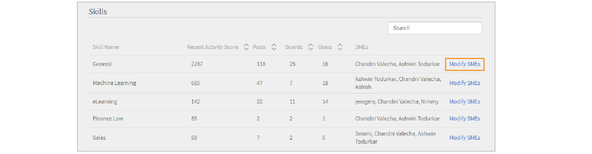

# Supervisión y moderación de Aprendizaje social como administrador

El administrador puede activar, desactivar y supervisar las actividades que se efectúan en Aprendizaje social. Cuando está activada la función Aprendizaje social, los alumnos pueden verla y empezar a participar en ella.

## Activar y configurar las opciones de Aprendizaje social {#enableandconfiguresettingsinsociallearning}

Si desea activar y configurar las opciones de Aprendizaje social, efectúe el procedimiento siguiente:

1. En el panel de navegación de la izquierda, haga clic en **[!UICONTROL Aprendizaje social]**. Se le redirigirá a la página de actividad.
1. Habilitar **[!UICONTROL Aprendizaje social]** mediante la función **[!UICONTROL Habilitar]** en la página Actividad si la está activando por primera vez. De lo contrario, se puede activar desde la **[!UICONTROL Configuración]** página.

   Aparece un cuadro de diálogo similar a la captura de pantalla siguiente.

    

   *Activar el aprendizaje social*

<!--  -->

El administrador puede configurar opciones de Aprendizaje social. La configuración incluye tipos de gestión del contenido como **[!UICONTROL Conservación solo manual]** y **[!UICONTROL Sin gestión]**. La configuración del ámbito se puede establecer en un ámbito diferente, como el tipo de usuario (interno/externo) o cualquier otro campo activo presente en la cuenta. El administrador define la ruta de la dirección URL desde donde los alumnos pueden descargar la aplicación Adobe Learning Manager para escritorio.

## Revisión de contenido {#contentcuration}

Debido a que Aprendizaje social es un tipo de aprendizaje informal, funciona de manera similar a otras plataformas de redes sociales. A menudo, las redes sociales distraen a las personas porque consumen con frecuencia contenido irrelevante que afecta a su productividad. Esta opinión se puede contrarrestar mediante la revisión y la moderación del contenido.

**[!UICONTROL Conservación solo manual]** y **[!UICONTROL Sin gestión]** Hay dos opciones de revisión que el administrador puede seleccionar.

**[!UICONTROL Gestión manual asistida automáticamente]:** Learning Manager cuenta con un motor de revisión automática basado en inteligencia artificial que puede descubrir de forma inteligente la esencia del contenido en cualquier formato que se pueda proporcionar posteriormente a los alumnos deseados. También puede aprobar o rechazar la publicación de un contenido en función de su puntuación de confianza.

Por ejemplo, Adarsh es un alumno y encontró un blog interesante, por lo que lo publica en la plataforma de aprendizaje social de Adobe Learning Manager. A continuación, la publicación se envía al motor de gestión de contenido basado en IA, que predice las aptitudes presentes en el contenido y las compara con las aptitudes asociadas del tablero. Si alguna de las aptitudes coincide, el contenido se publica; de lo contrario, se envía para una revisión solo manual.

La puntuación de confianza mínima necesaria para publicar es del 50 %.

**[!UICONTROL Conservación solo manual]:** Para comprobar la autenticidad del contenido antes de que se active, el administrador puede activar la configuración de gestión solo manual. Tras activarla, el contenido se transfiere a los principales expertos en la materia (tres como máximo) para que lo revisen. Sobre la base de la respuesta media, la publicación se aprueba o se rechaza en consecuencia. Si la respuesta es mayor que el 50 por ciento, la publicación se publica o se rechaza. Para obtener más información sobre los expertos en la materia, [haga clic aquí](social-learning-configurations-as-an-admin.md#SubjectMatterExpertsSMEs).

## Revisión automática de contenido {#autocuration}

La moderación del contenido de forma manual suele ser susceptible de errores y requiere mucho tiempo. Además, el proceso no es escalable ni adecuado para un gran volumen de actividades sociales. Por lo tanto, la revisión automática del contenido es fundamental cuando se atiende a muchos usuarios que están activos socialmente.

En Learning Manager, existe una opción para revisar contenido automáticamente. La revisión la efectúa un motor de inteligencia artificial, el cual asigna trabajos con aptitudes predefinidas, después de que el administrador asigne las aptitudes predefinidas con una aptitud. Para obtener más información, consulte [Asignación de dominios de aptitudes](curation-skills.md).

En la revisión automática, se permiten los tipos de contenido siguientes:

* PDF
* Archivos de audio y vídeo
* Presentaciones PPT o PPTX
* Documentos .doc o .docx

Un administrador puede habilitar la opción para revisar contenido automáticamente desde la aplicación de administrador.

1. En el panel izquierdo de la aplicación de administrador, haga clic en **[!UICONTROL Aprendizaje social]**.
1. En la página, haga clic en la ficha **[!UICONTROL Configuración]**.
1. Active la opción **[!UICONTROL Revisión manual con asistencia automática]**.

   

   *Seleccione la opción Gestión manual con asistencia automática*

Cuando un usuario carga contenido en un tablero, un algoritmo basado en inteligencia artificial extrae el texto del contenido y luego el texto se pasa al motor de revisión. El motor de revisión trata de encontrar las aptitudes presentes en el contenido.

Las aptitudes previstas del contenido cargado se emparejan con las del tablero en el que se cargó el contenido.  Si alguna aptitud coincide con una puntuación de confianza de más del 50 % de la aptitud del tablero, el contenido se publica en el tablero. Si la puntuación de confianza es inferior al 50 %, el contenido se envía para revisión manual.

Cada vez que se revisa automáticamente contenido, el usuario recibe una notificación de que el contenido está disponible en el tablero donde se cargó anteriormente.

*Diagrama de flujo de la configuración de revisión*

Se recomienda que el administrador añada expertos en la materia para aptitudes si está activada la opción Revisión solo manual. El administrador puede agregar expertos en la materia al proporcionar puntos de experto en la materia por adelantado a los usuarios con experiencia en una aptitud. Para obtener más información sobre cómo proporcionar puntos a las PYME,  [haga clic aquí](social-learning-configurations-as-an-admin.md#SubjectMatterExpertsSMEs).

**Sin gestión:** Las publicaciones de todos los alumnos se publican automáticamente sin moderación de contenido.

<!---->

## Preguntas frecuentes sobre la revisión automática de contenido {#faq-auto-curation}

+++ ¿Cuánto tiempo tiene un experto en la materia para seleccionar una publicación?

Un experto en la materia dispone de un mínimo de 24 horas para revisar una publicación. Debido a las diferencias de zona horaria, puede aumentar a 47 horas.

+++

+++¿Pasa al siguiente conjunto de tres expertos en la materia si los tres están disponibles? ¿Siempre participan tres expertos en la materia?

La solicitud de revisión pasa a máxima prioridad para los expertos en la materia el primer día. Si no responden, la solicitud pasa a los tres siguientes expertos en la materia al día siguiente.

Si los tres nuevos expertos en la materia no responden, la solicitud pasa a los moderadores del tablero.

Si los moderadores del tablero no responden, la solicitud se aprueba automáticamente.

+++

+++Si dos expertos en la materia realizan la revisión y uno no la realiza, ¿la solicitud pasa al cuarto experto o la solicitud obtiene el promedio de la valoración de la publicación correspondiente a la primera ronda de expertos en la materia?

Para aprobar la publicación, se requiere un porcentaje de aprobación del 50 %. Del mismo modo, se utiliza una tasa de rechazo del 50 % para denegar la publicación. En cada aprobación realizada por un experto en la materia, la evaluación se realiza si se ha alcanzado el 50 %.

Si no se alcanza el 50 % después de un día, se envía al siguiente conjunto de expertos en la materia y caducan las solicitudes de revisión anteriores que no hayan recibido respuesta.

Por ejemplo, el primer día, se envía la solicitud de revisión a tres expertos en la materia; uno de ellos la aprueba y dos de ellos no responden. Al día siguiente, la solicitud de revisión se envía al siguiente conjunto de tres expertos en la materia; en este nivel, hay cuatro expertos en la materia activos en total. Al menos dos expertos en la materia deben aprobarla para que la revisión obtenga el visto bueno.(En el caso de que dos la aprueben y dos la rechacen, se utilizará la valoración que primero alcance el 50 %).

+++

+++Según lo que veo, solo se asigna un &quot;moderador&quot; (y no es obligatorio) cuando alguien crea un nuevo tablero. ¿En qué casos un alumno puede asignar un &quot;moderador&quot; a un tablero si se van a asignar expertos en la materia a la aptitud a la que está asociado un tablero?

A continuación se indican las responsabilidades de un moderador del tablero social:

* Posibilidad de editar el nombre, la descripción y la configuración de visibilidad del tablero, además de otros parámetros.
* Posibilidad de eliminar una publicación en el tablero en caso de que esta no sea adecuada para el público.
* El moderador recibe notificaciones de &quot;Informar de una irregularidad&quot; en el tablero.
* El moderador recibe solicitudes de revisión si no hay ningún experto en la materia presente para el tablero.

+++

+++Nuestro equipo de formación añadirá/supervisará las aptitudes asociadas al nivel de aptitud, así como los expertos en la materia asignados a las aptitudes.

Los expertos en la materia se añaden o se asignan en función de la aptitud, no del nivel de aptitudes. Esto es como se ha diseñado.

+++

+++¿Cuál es la diferencia entre un &quot;moderador&quot; de aprendizaje social y un &quot;experto en la materia&quot; de aprendizaje social?

**Moderadores:** propietarios secundarios del tablero. Los creadores los añaden cuando crean el tablero para que puedan controlarlo en ausencia del creador. De forma predeterminada, el creador del tablero es el moderador.

**PYME:** Los expertos en la materia son expertos en habilidades específicas. El administrador puede asignar expertos en la materia a una aptitud específica para que revise el contenido de esa aptitud. Los expertos en la materia reciben las solicitudes de revisión de los tableros vinculados a sus aptitudes. Los alumnos también pueden convertirse en expertos en la materia si obtienen los puntos de experiencia necesarios.

+++

+++Si hay dos o tres expertos en la materia asignados a una aptitud, ¿la aprobación o el rechazo de una publicación de Aprendizaje social dependen de la revisión de todos los expertos en la materia o de quién la realice primero?

Para aprobar la publicación, se requiere un porcentaje de aprobación del 50 %. Del mismo modo, se utiliza una tasa de rechazo del 50 % para denegar la publicación. En cada aprobación realizada por un experto en la materia, la evaluación se realiza si se ha alcanzado el 50 %.

Si no se alcanza el 50 % después de un día, se envía al siguiente conjunto de expertos en la materia y caducan las solicitudes de revisión anteriores que no hayan recibido respuesta.

+++

## Configuración del ámbito {#scopesettings}

En Aprendizaje social, un ámbito determina los tableros que se pueden ver, lo cual controla la visibilidad del contenido. Si un usuario tiene un ámbito, por ejemplo, ***Proveedor_A***, solo puede ver los tableros y publicaciones asociadas creados por otras personas que pertenezcan al mismo ámbito ***Proveedor_A***.

De este modo, los administradores mantienen una serie de usuarios, por ejemplo proveedores, socios o departamentos en una organización aparte.

El aprendizaje social y las tablas de posiciones se pueden activar para usuarios internos y externos.

Hay secciones independientes para activar usuarios internos y externos.

**Activar para alumnos internos**

En esta sección, puede elegir la característica de usuario para definir el ámbito de aprendizaje social para usuarios internos. Usuarios con las mismas características **valor** compartir el mismo espacio de Aprendizaje social.

Desde el **Característica de usuario** , elija la opción que corresponda.

*Seleccione las características del usuario para definir el ámbito*

De forma predeterminada, la opción **[!UICONTROL Todos los usuarios internos]** en la opción Lista desplegable de características de usuario siempre está seleccionada.

Puede elegir el ámbito de los usuarios internos en función de sus campos activos.

**Activar para alumnos externos**

Para definir el ámbito del aprendizaje de los usuarios externos, utilice un perfil externo. Los alumnos con el mismo perfil externo comparten un espacio común de aprendizaje social.

*Habilitar ámbito para alumnos externos*

El ámbito de los usuarios externos se determina en función de sus perfiles externos.

Por ejemplo, en la lista de arriba, si activa **[!UICONTROL Acme Corp]**, todos los alumnos que pertenezcan a Acme Corp pueden ver los tableros que han creado. Si desactiva la opción **Henry Cavill**, los alumnos no pueden ver ningún tablero creado por Henry Cavill.

El administrador puede examinar la visibilidad del contenido según el campo activo que se visualiza en **[!UICONTROL Característica de usuario]**.

Por ejemplo, el administrador puede definir el ámbito en **[!UICONTROL Tipo de usuario (interno/externo)]**. Al establecer el ámbito en Tipo de usuario, el contenido compartido en la plataforma de Aprendizaje social por cualquier alumno interno solo es visible para otros alumnos internos de la organización, no para los usuarios externos, y viceversa.

Cuando el administrador selecciona una opción de Característica de usuario, la función Aprendizaje social se puede limitar a alumnos y grupos de alumnos marcando la casilla de verificación debajo del campo Característica de usuario. Haga clic en el campo de valor para seleccionar el alumno o los grupos de alumnos para quienes desea activar la función Aprendizaje social.

De forma predeterminada, el ámbito lo establece el **[!UICONTROL Tipo de usuario]** alumnos internos o externos.

Si el campo activo no contiene ningún valor, el administrador no tendrá acceso a la lista desplegable del campo **[!UICONTROL Valor]**.

<!-- -->

Los usuarios también pueden publicar su contenido mediante la aplicación de Adobe Learning Manager para escritorio. En función de si el usuario es de Mac o Windows, debe hacerse clic en los vínculos para descargar la aplicación y aplicar las instrucciones para instalarla en el sistema correspondiente. Si tiene problemas para realizar la instalación, [haga clic aquí](../../kb/troubleshooting-issues-with-adobe-learning-manager-desktop-app.md).

## Permisos de creación de tableros {#permission}

Para restringir la creación de tableros de todos los alumnos y moderarlos con eficacia, un administrador puede otorgar permisos a fin de crear tableros para un determinado grupo de usuarios.

*Definir permisos para crear un tablero*

De forma predeterminada, la opción **[!UICONTROL Todos los alumnos]** está activada.

**[!UICONTROL Todos los alumnos]:** Si elige esta opción, todos los usuarios internos y externos pueden crear tableros.

**Un grupo de alumnos:** si elige esta opción, los usuarios con permiso para crear un tablero son los únicos que ven el vínculo **[!UICONTROL Crear un nuevo tablero]** en Aprendizaje social. Elija el grupo de usuarios al que se debe conceder permiso para crear un tablero. También puede añadir grupos de usuarios generados automáticamente y personalizados.

<!---->

Los usuarios que comparten el mismo ámbito solo pueden ver el tablero. Los usuarios que no tienen el permiso no pueden ver el vínculo **[!UICONTROL Crear un nuevo tablero]**.

Para que el cambio surta efecto, espere 60 minutos.

## Usuarios especiales {#privilege}

Un administrador puede otorgar privilegios especiales a un grupo de usuarios y determinar los miembros del grupo que pueden participar en todos los tableros. El grupo de usuarios especiales pasa por alto cualquier restricción que se hubiera definido en la configuración del ámbito.

El grupo de usuarios puede ser de generación automática o personalizado.

Un usuario al que se otorgue este privilegio tiene acceso a todos los tableros, excepto los **tableros privados**.

*Otorgar privilegios especiales*

Cuando el administrador selecciona un grupo de usuarios, de forma predeterminada todos los usuarios del grupo pueden acceder a todos los tableros, sea cual sea el ámbito del usuario. Cualquier usuario con estos privilegios superiores puede ver y participar en todos los tableros internos y externos.

Los usuarios especiales reciben solicitudes de revisión en todos los ámbitos si los usuarios tienen suficientes puntos de experto en la materia para esa aptitud.

Si el usuario carece de los correspondientes puntos de experto en la materia, los privilegios de revisión se transfieren a los tres expertos en la materia principales de la aptitud.

En el ámbito nuevo, el usuario adquiere puntos para actividades en los tableros.

En las secciones de la tabla de posiciones de Social, un usuario puede ver a todos los usuarios de su mismo ámbito y a los usuarios especiales.

Si se le han otorgado privilegios de usuario especial, puede ver a todos los usuarios de la cuenta en su tabla de posiciones, sean cuales sean los ámbitos de los usuarios.

Si los usuarios especiales se convierten en PYMES al obtener puntos suficientes, aparecen en el **[!UICONTROL Principales expertos en la materia]** en la tabla de líderes sociales.

Para que el cambio surta efecto, espere 60 minutos.

## Personalizar el banner social {#customize-social-banner}

El administrador puede personalizar el título y el subtítulo que aparecen en la imagen de encabezado de la página principal de Aprendizaje social. Independientemente de lo que el administrador decida introducir como título y subtítulo, las mismas funciones se encuentran en la página principal de Aprendizaje social del alumno.

1. En la aplicación de administración, haga clic en **[!UICONTROL Aprendizaje social]** > **[!UICONTROL Configuración]**.
1. Haga clic en **[!UICONTROL Personalizar]**.
1. Cambie la imagen del banner. Las dimensiones de la imagen deben ser al menos **1600 x 240 px**.
1. Active la opción para ocultar o mostrar el **[!UICONTROL Más información]** en el banner.
1. Introduzca el título y el subtítulo en los campos especificados a continuación:

   

   *Personalizar el banner social*

Dispone de otras opciones:

* **[!UICONTROL Idioma]:** En la lista desplegable, elija el idioma al que traducir el título y el subtítulo. También puede añadir texto personalizado para diferentes idiomas.
* **[!UICONTROL Replicar]:** Haga clic en este botón para replicar el título y el subtítulo en todos los idiomas.
* **[!UICONTROL Restablecer]:** Haga clic en este botón para volver al título y al subtítulo originales.

En la página principal de Aprendizaje social, la información proporcionada por el administrador se muestra como encabezado de página.

<!---->

## Tendencias {#trends}

Las tendencias de actividad social del alumno se pueden ver y seguir en la pestaña Actividad en la sección Tendencias . Estos datos se pueden ver durante diferentes períodos de tiempo, por ejemplo los últimos siete días, el mes pasado, los últimos tres meses y todo el tiempo.

Los últimos siete días es el valor predeterminado del filtro de fecha.

>[!NOTE]
>
>Los últimos siete días es el valor predeterminado del filtro de fecha.

La primera pantalla proporciona al administrador la información siguiente relativa al período de tiempo seleccionado en el filtro de fecha:

1. **[!UICONTROL Nuevas publicaciones]**: muestra el número de publicaciones que se han creado en ese intervalo temporal. También se muestra el número total de publicaciones de todo el período.
1. **[!UICONTROL Porcentaje de usuarios activos]**: muestra el porcentaje total de usuarios activos de Aprendizaje social en comparación con el número total de usuarios disponibles en la cuenta.
1. **[!UICONTROL Nuevas placas]**: muestra el número de tableros nuevos que se han creado. También se muestra el número total de tableros para todo el período.

La segunda pantalla es un gráfico de líneas que muestra la tendencia del número de tableros o publicaciones que se han publicado durante el período de tiempo seleccionado en el filtro de fecha. Haga clic en el filtro para ver diferentes opciones de períodos de tiempo, por ejemplo los últimos siete días, el mes pasado, los últimos tres meses y todo el tiempo.

*Gráfico de líneas que muestra la tendencia*

## Aptitudes {#skills}

Puede ver todas las aptitudes que se han utilizado en la plataforma de actividad social en esta sección. El administrador puede usar el campo de búsqueda para buscar una aptitud que aún no se utiliza al crear un tablero y asignarle expertos en la materia. Cuando lleva a cabo esta acción, los expertos en la materia reciben una notificación de que se crea un tablero mediante esta aptitud y que pueden revisar la publicación como parte del flujo de trabajo de la revisión manual.

No se muestran aptitudes para una cuenta que tenga desactivada la función Aprendizaje social. La barra de búsqueda también está disponible para dichas cuentas, a fin de que el administrador disponga de la función para buscar una aptitud y añadirle expertos en la materia.

El administrador puede ver la puntuación de la actividad, el número de publicaciones, tableros y usuarios, y asignar expertos en la materia para cada aptitud que se utiliza al crear un tablero o una publicación.

<!---->

<table>
 <tbody>
  <tr>
   <td>
    
<b>N.º Ap. soc.</b>
</td>
   <td>
    
<b>Nombre de la columna</b>
</td>
   <td>
    
<b>Explicación</b>
</td>
  </tr>
  <tr>
   <td>
    
1
</td>
   <td>
    
Nombre de la aptitud
</td>
   <td>
    
Muestra los nombres de las aptitudes que se utilizan en Aprendizaje social.
</td>
  </tr>
  <tr>
   <td>
    
2
</td>
   <td>
    
Puntuación de actividad
</td>
   <td>
    
Muestra la suma de los puntos de actividad de todos los tableros que pertenecen a la aptitud.
</td>
  </tr>
  <tr>
   <td>
    
3
</td>
   <td>
    
Publicaciones
</td>
   <td>
    
Muestra el número total de publicaciones creadas mediante una aptitud.
</td>
  </tr>
  <tr>
   <td>
    
4
</td>
   <td>
    
Tableros
</td>
   <td>
    
Muestra el número total de tableros creados mediante una aptitud.
</td>
  </tr>
  <tr>
   <td>
    
5
</td>
   <td>
    
Usuarios
</td>
   <td>
    
Muestra el número total de alumnos que han utilizado esa aptitud.
</td>
  </tr>
  <tr>
   <td>
    
6
</td>
   <td>
    
EM
</td>
   <td>
    
Muestra los tres principales expertos en la materia de esa aptitud. Se pueden añadir o modificar expertos en la materia haciendo clic en el vínculo.
</td>
  </tr>
 </tbody>
</table>

## Dominio de aptitudes {#skilldomain}

En función de las aptitudes utilizadas principalmente por los usuarios finales de Learning Manager, Adobe Learning Manager ha categorizado una lista de 25 dominios de aptitudes que el sistema de gestión automática utiliza para seleccionar contenido. El administrador debe asignar las aptitudes empresariales configuradas a los dominios de aptitudes proporcionados por Captivate Prime. La asignación de aptitudes se puede realizar desde la página Aptitud de administrador al crear una aptitud o modificando una aptitud existente. Para obtener más información sobre cómo asignar o añadir una aptitud, [haga clic aquí](skills-levels.md#Createaskillandalevel).

+++Lista de dominios de aptitudes que utiliza el sistema de revisión de Learning Manager

1. Contabilidad
1. Análisis
1. Ética de negocios
1. Derecho empresarial
1. Proceso empresarial
1. Seguridad informática
1. Administración de la relación con los clientes
1. Diseño
1. Finanzas
1. Gestión de recursos humanos
1. Tecnologías de la información
1. Aprendizaje
1. Gestión
1. Marketing
1. Medicina
1. Producción y fabricación
1. Gestión de la calidad
1. Ventas
1. Investigación científica e ingeniería
1. Redes sociales
1. Aptitudes sociales
1. Gestión estratégica
1. Gestión de la cadena de suministro
1. Comunicación técnica
1. Seguridad laboral

+++

## Expertos en la materia {#subjectmatterexpertssmes}

**Expertos en la materia** son personas que tienen un conocimiento y experiencia considerable en una habilidad. Una **PYME** desempeña un papel importante en el aprendizaje social cuando el administrador ha configurado la configuración de revisión como manual o cuando el método de revisión automática no puede seleccionar el contenido. En la columna de expertos en la materia solo se muestran los tres expertos principales.

## Requisitos para ser experto en la materia {#requirementstobeansme}

Solo se puede llegar a ser experto en la materia obteniendo puntos de experto en la materia mediante la realización de actividades en Aprendizaje social. El administrador puede otorgar puntos a una PYME en función de su experiencia en el nivel de aptitud.

## Añadir expertos en la materia a una aptitud {#addingsmestoaskill}

Siga los pasos que se indican a continuación para añadir expertos en la materia a una aptitud:

1. Haga clic en **[!UICONTROL Añadir expertos en la materia]** o **[!UICONTROL Modificar expertos en la materia]**.

   

   *Añadir o modificar SME*

1. Haga clic en **[!UICONTROL Opciones avanzadas]** en el cuadro de diálogo emergente.

   

   *Cuadro de diálogo Ver opciones avanzadas*

1. Busque al usuario con experiencia en la aptitud. Una vez que se encuentre el usuario, escriba el número de puntos que desea darle en la **Agregar puntos** cuadro de entrada.

   Si el usuario ya tiene puntos, los puntos nuevos otorgados al usuario se suman al número actual de puntos.

   De forma predeterminada, el punto actual es 0 para cada nuevo usuario de Aprendizaje social.

   

   *Añadir puntos para un usuario*

1. Al seleccionar la casilla de verificación **[!UICONTROL Habilitar puntos de EM mínimos]**, se puede establecer el mínimo de puntos que requiere un usuario para que aparezca como experto en la materia en la lista EM principales. Tras definir el mínimo, los expertos en la materia con puntuación igual o inferior a él no aparecen en las listas de expertos en la materia.

   Si el **[!UICONTROL Activar puntos mínimos de SME]** Si la casilla de verificación no está seleccionada, los tres usuarios principales con puntos más altos se consideran expertos en la materia para esa aptitud en particular.

1. Haga clic en **[!UICONTROL Guardar]** para mostrar los cambios que se han realizado.

## Sistema de puntos de los expertos en la materia {#smepointsystem}

**Los expertos en la materia reciben puntos según los criterios siguientes:**

* Se otorgan 2 puntos a un usuario cada vez que otro usuario vota a favor de una publicación que sea creación suya.
* Se otorgan 2 puntos a un usuario cada vez que otro usuario vota a favor de su comentario.
* Se otorgan 5 puntos a un alumno cuando responde a una pregunta.
* Se otorgan 2 puntos más al alumno cada vez que la respuesta que ha proporcionado recibe un voto a favor.

## Puntos de estado de experto en la materia según la actividad de revisión {#smestatuspointsbasedoncurationactivity}

**Los expertos en la materia también reciben puntos según las actividades de revisión siguientes:**

* Cuando una publicación se envía a revisión manual porque el proceso automático no sabe decidir si el contenido es relevante o no, el experto en la materia obtiene 5 puntos al enviar la moderación.

## Configuraciones de las descargas {#downloadconfigurations}

<!---->

En Servidores Enterprise, el administrador puede cambiar la ubicación desde la cual los alumnos pueden descargar la aplicación para escritorio en Windows y Mac.

*Cambiar la ubicación de descarga*

La URL del servidor Enterprise debe hospedarse de manera pública.

## Actividades sociales para el plan de facturación de usuarios activos mensuales {#socialactivitiesformonthlyactiveusersbillingplan}

Cada vez que un usuario crea un nuevo tablero social, publicación social o comentario social, se contaría como actividad válida para ser contada contra el **Usuario de activación mensual**(MAU) si la cuenta sigue el modelo de facturación MAU. Para obtener más información, consulte [Gestión de la facturación](billing-management.md).

## Preguntas más frecuentes {#frequentlyaskedquestions}

+++Cómo habilitar el aprendizaje social para alumnos externos

En **[!UICONTROL Aprendizaje social]** > **[!UICONTROL Configuración]**, en la sección Configuración del ámbito, habilite la opción **[!UICONTROL Activar para alumnos externos]**. En el menú desplegable, seleccione un perfil externo y defina el ámbito de aprendizaje de ese perfil.

*Seleccione la opción Activar para alumnos externos .*
+++
