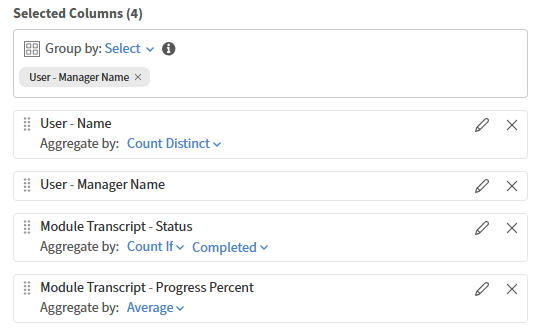

# Ordenar columnas de informe en Report Builder

## Información general

La ordenación determina el orden de las filas en el archivo de informe descargado. Aplique la ordenación siempre que sea importante una salida coherente.

## Agregar una ordenación

En este ejemplo, encontrará los cursos que tienen las finalizaciones más altas.

1. Inicie Report Builder y seleccione **Crear informe**.
2. Escriba el nombre y la descripción del informe.
3. Seleccione las siguientes columnas: <dataset>:<column name>

   * Objeto de aprendizaje: Nombre del objeto de aprendizaje
   * Objeto de aprendizaje: Estado del objeto de aprendizaje
   * Objeto de aprendizaje: recuento de finalización

4. En la sección Ordenación, seleccione **Agregar ordenación**.
5. Seleccione **Objeto de aprendizaje - Recuento de finalización**.
6. Seleccione un orden de clasificación: **Ascendente** o **Descendente**

   

7. Seleccione **Agregar**.
8. Seleccione **Guardar informe** y seleccione **Acciones** > **Descargar** para descargar el informe.

El informe descargado muestra una lista de todos los registros, ordenados por el número de finalizaciones del curso.

## Agregar ordenación de varias columnas

En este ejemplo, generará un informe para medir el rendimiento de los administradores.

Para ordenar por varias columnas:

1. Inicie Report Builder y seleccione **Crear informe**.
2. Escriba el nombre y la descripción del informe.
3. Seleccione las siguientes columnas: <dataset>:<column name>

   * Usuario: nombre
   * Usuario: nombre del responsable
   * Transcripción del módulo: estado
   * Transcripción del módulo: porcentaje de progreso

4. Añada los siguientes agregados:

   * Agrupar por nombre de responsable de usuario
   * Recuento de Nombre de Usuario Distinto
   * Count If=COMPLETED Transcripción del módulo - Estado
   * Transcripción Media Del Módulo: Porcentaje De Progreso

   

5. En la sección Ordenar, agregue la siguiente ordenación de varias columnas:

   * Transcripción del módulo - Estado: Descendente
   * Usuario - Nombre del responsable: Ascendente

   

6. Seleccione **Guardar informe** y seleccione **Acciones** > **Descargar** para descargar el informe.

El informe descargado proporciona un resumen del rendimiento según el responsable en el que se muestran distintos recuentos de alumnos, recuentos de inscripciones basados en el estado y porcentajes medios de progreso. Se destacan los niveles de participación y el progreso de la formación en los diferentes grupos de gestores.
