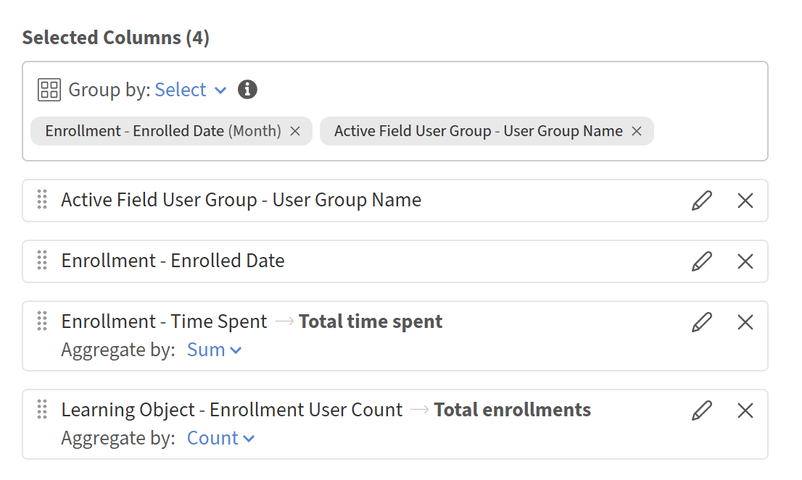

# Seguimiento de la participación por grupo de usuarios en Report Builder

Este informe ayuda a los gestores de formación y a los administradores de aprendizaje y desarrollo a identificar los grupos de usuarios más activos y las tendencias de participación cada mes. Utiliza los conjuntos de datos **Active Field User Group** e **Enrollment** con funciones de agrupación y agregado para producir una fila de resumen por grupo de usuarios al mes.

## Crear el informe de participación por grupo de usuarios

1. Inicie Report Builder y seleccione **Crear informe**.
2. Seleccione **Crear informe**. Escriba un nombre, por ejemplo, Participación por grupo de usuarios MoM.
3. En el panel **Seleccionar columnas**, expanda **Grupo de usuarios de campos activos** y seleccione **+** junto a **Nombre de grupo de usuarios**. La columna aparece en el panel **Columnas seleccionadas**.
4. Expanda **Inscripción** y seleccione **+** junto a **Fecha de inscripción**.
5. Seleccione **+** junto a **Tiempo empleado**. Seleccione el icono **editar** (lápiz) e introduzca el alias Tiempo total empleado.
6. Expanda **Objeto de aprendizaje** y seleccione **+** junto a **Recuento de usuarios de inscripción**. Seleccione el icono **edit** e introduzca el alias Inscripciones totales.
7. Seleccionar **Agrupar por: Seleccione** en la parte superior del panel **Columnas seleccionadas**.
8. Elija **Inscripción - Fecha de inscripción** y establezca la granularidad en **Mes**. Elija **Grupo de usuarios de campos activos - Nombre de grupo de usuarios**. Ambos aparecen como etiquetas: Inscripción - Fecha de inscripción (mes) y Grupo de usuarios de campos activos - Nombre de grupo de usuarios.
9. En la fila **Inscripción - Tiempo empleado**, seleccione **Agregar por** y elija **Suma**.
10. En la fila **Objeto de aprendizaje - Recuento de usuarios de inscripción**, seleccione **Agregar por** y elija **Recuento**.

    

11. Seleccione **Agregar filtro**. Elija **Inscripción - Fecha de inscripción**, seleccione un intervalo relativo como **Últimos 3 meses,** o introduzca un intervalo de fechas específico.
12. Seleccione **+ Agregar ordenación**. Ordenar por **Inscripción - Fecha de inscripción** ascendente; a continuación, agregar una ordenación secundaria por **tiempo total empleado** descendente.
13. Seleccione **Guardar informe** y seleccione **Acciones** > **Descargar** para descargar el informe.

El informe tendrá una fila por grupo de usuarios al mes, que mostrará el tiempo total dedicado y el total de inscripciones para ese período.
