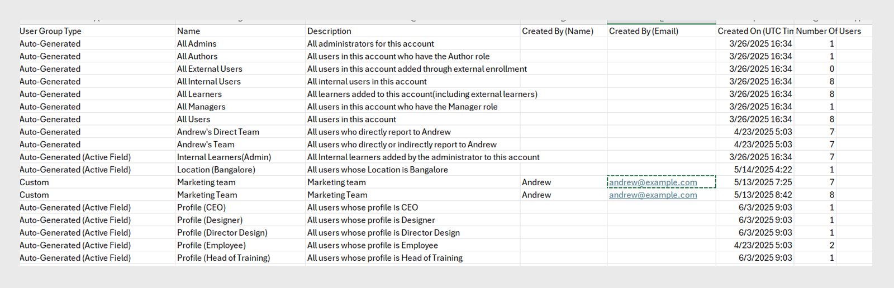

# Grupos de usuarios en Adobe Learning Manager

Los grupos de usuarios de Adobe Learning Manager le ayudan a organizar a los alumnos en función de atributos comunes como el departamento, la ubicación o la función. La agrupación de usuarios facilita la asignación de cursos, la administración de permisos y el seguimiento del progreso del aprendizaje para varios usuarios a la vez.

>[!INFO]
>
>Vea este curso de formación de ALM Academy para aprender a crear un grupo de usuarios por nombres, ID de correo electrónico y la combinación de varios grupos de usuarios generados automáticamente.   

## Tipos de grupos de usuarios

Adobe Learning Manager admite los siguientes grupos de usuarios:

1. **Grupos de usuarios generados automáticamente:** En Adobe Learning Manager, el sistema crea automáticamente algunos grupos de usuarios en función de las funciones y los atributos de los usuarios. Estos grupos definidos por el sistema incluyen Todos los autores, Todos los administradores, Todos los alumnos y Todos los responsables. Adobe Learning Manager genera estos grupos para ayudar a organizar a los usuarios por función. No puede cambiar el nombre de estos grupos definidos por el sistema ni eliminarlos.

2. **Grupos de usuarios personalizados:** En Adobe Learning Manager, los administradores pueden crear grupos de usuarios personalizados para organizar a los alumnos en función de criterios específicos. Estos grupos son dinámicos y añaden automáticamente usuarios que cumplen las condiciones definidas. Los grupos personalizados ayudan a asignar rutas de aprendizaje específicas, aplicar marcas personalizadas y generar informes centrados. Son una herramienta flexible para gestionar y personalizar la experiencia de aprendizaje.

## Crear un grupo de usuarios personalizado

Los administradores crean manualmente grupos de usuarios para organizar a los usuarios en función de los atributos definidos. Estos grupos pueden ser dinámicos y agregar automáticamente usuarios que cumplan los criterios especificados. Los grupos de usuarios simplifican tareas como la asignación de rutas de aprendizaje, la aplicación de marcas personalizadas y la generación de informes orientados.

Para crear un grupo de usuarios personalizado:

1. Seleccione **Usuarios** en la página principal del administrador.
2. Seleccione **Grupos de usuarios** y, a continuación, seleccione **Agregar**.

   
   _Botón para agregar un nuevo grupo de usuarios en la página Grupos de usuarios_

3. Escriba el nombre del grupo y la descripción.

   
   _Campos de entrada para escribir el nombre del grupo y la descripción opcional_

## Añadir usuarios al grupo de usuarios

Los administradores pueden añadir usuarios a un grupo de usuarios de dos maneras:

### Sección Usuarios

Los administradores pueden utilizar los conjuntos de inclusión y exclusión para añadir o quitar usuarios o grupos de usuarios en la sección Usuarios.

* **Conjuntos de inclusión** agrega usuarios a un grupo de usuarios personalizado. Puede incluir uno o más grupos de usuarios y Adobe Learning Manager utiliza la lógica (AND/OR) para decidir qué usuario incluir. Consulte esta [sección](#_Inclusion_and_exclusion) para obtener más información sobre la lógica AND/OR.
* **Conjuntos de exclusión** quita usuarios del grupo, incluso si formaban parte del conjunto de inclusión. Esto perfecciona la lista de usuarios del grupo.

Para añadir usuarios al grupo:

1. Busque y seleccione usuarios o grupos de usuarios existentes en el campo **Incluir alumnos**.

_Configuración de inclusión para agregar usuarios o grupos específicos a un grupo de usuarios personalizado_

### Sección ID de correo electrónico

1. Escriba las direcciones de correo electrónico de los usuarios en un formato separado por comas, punto y coma o salto de línea para añadir los usuarios al grupo.

2. Seleccione **Validar ID de correo electrónico**.

   
   _Seleccione Validar ID de correo electrónico para validar los ID de correo electrónico introducidos_

   Aparecerá un error si Adobe Learning Manager no tiene el ID de correo electrónico o si el ID de correo electrónico es incorrecto.

   
   _Campo para introducir varias direcciones de correo electrónico manualmente para agregar usuarios a un grupo_

3. Seleccione **Guardar** para crear el grupo.

## Excluir usuarios del grupo

Los administradores pueden excluir usuarios específicos de un grupo de usuarios incluso si cumplen los criterios del grupo. Esto resulta útil cuando desea realizar excepciones, como impedir que ciertos usuarios reciban cursos asignados o aparezcan en informes vinculados a ese grupo.

Para excluir usuarios específicos o grupos de usuarios completos al crear un grupo de usuarios personalizado:

1. Seleccione **Grupos de usuarios** y, a continuación, seleccione **Agregar**.
2. Vaya a la sección **Excluir alumnos**.
3. Seleccione los usuarios o grupos que desee excluir.

_Configuración de exclusión para quitar usuarios o grupos de un grupo personalizado_

## Ver miembros del grupo

Los administradores pueden ver una lista de usuarios de un grupo de usuarios, incluidos detalles como el nombre, el ID de correo electrónico y el estado. Para ver la lista de usuarios:

1. Seleccione **Usuarios** y luego **Grupos de usuarios**.
2. Seleccione un grupo y, a continuación, seleccione el valor en **No. de la columna Personas**.

_Lista de usuarios actualmente incluidos en un grupo de usuarios seleccionado_

_Lista de usuarios disponibles en el grupo de usuarios seleccionado_

## Descargar miembros del grupo

Los administradores pueden descargar una lista de miembros del grupo para revisar los detalles del usuario, como el nombre, el correo electrónico, el estado, la fecha de adición (zona horaria UTC), la fecha de eliminación (zona horaria UTC) y la fecha del último inicio de sesión (zona horaria UTC). Esto ayuda con el seguimiento, la creación de informes y la auditoría de la pertenencia a grupos.

1. Seleccione **Usuarios** y luego **Grupos de usuarios**.
2. Seleccione el icono de descarga junto a un grupo para exportar el informe como archivo CSV.

_Icono de descarga para exportar datos de miembros de grupo como archivo CSV_

A continuación se indican las columnas del informe de miembros del grupo:

* **Nombre**: nombre del usuario
* **Correo electrónico**: Id. de correo electrónico del usuario
* **Estado**: estado del usuario (registrado o no registrado).
* **Fecha de adición (zona horaria UTC)**: fecha en que el usuario se agregó a la zona horaria UTC.
* **Fecha de eliminación (zona horaria UTC)**: fecha en la que se eliminó el usuario en la zona horaria UTC.
* **Fecha del último inicio de sesión (zona horaria UTC)**: fecha en la que el usuario inició sesión por última vez en la zona horaria UTC.

_El archivo CSV de muestra contiene los detalles del usuario_

## Editar un grupo de usuarios

Los administradores pueden editar un grupo para cambiar su nombre, descripción u otros detalles.

Para editar un grupo de usuarios:

1. Seleccione **Usuarios** en la página principal del administrador.
2. Seleccione **Grupos de usuarios**.
3. Seleccione el grupo de usuarios que desee editar.
4. Realice los cambios necesarios, como la actualización del nombre, la descripción u otros detalles.
5. Seleccione **Guardar** para aplicar los cambios. Los cambios se aplicarán al grupo de usuarios.

_Campos para modificar el nombre del grupo de usuarios, su descripción o las reglas de pertenencia_

## Eliminar un grupo de usuarios

Los administradores pueden eliminar grupos de usuarios que ya no sean necesarios para mantener la lista de grupos organizada y actualizada.

Para eliminar un grupo de usuarios:

1. Seleccione **Usuarios** y luego **Grupos de usuarios**.
2. Seleccione el grupo que desea eliminar.
3. Seleccione **Acciones** y, a continuación, seleccione **Eliminar**.

   
   Opción _Eliminar en el menú Acciones para quitar un grupo de usuarios_

4. Confirme la eliminación cuando se le solicite. Se eliminará el grupo de usuarios.

## Descargar informe de grupo de usuarios

Los informes de grupos de usuarios de Adobe Learning Manager proporcionan a los administradores y responsables información sobre el rendimiento de los diferentes grupos de usuarios, como departamentos, funciones o socios externos. Estos informes permiten realizar comparaciones entre grupos para evaluar el progreso del aprendizaje, las tasas de finalización de los cursos y los niveles de participación.

Para descargar el informe:

1. Seleccione **Usuarios** y luego **Grupos de usuarios**.
2. Seleccione **Acciones** y, a continuación, seleccione **Descargar informe de grupo de usuarios**.

_Opción para descargar información y metadatos a nivel de grupo desde el menú Acciones_

Este informe incluye:

| Columna | Descripción |
|---|---|
| Tipo de grupo de usuarios | Categoría del grupo de usuarios, como grupo personalizado o generado automáticamente. |
| Nombre | Nombre asignado al grupo de usuarios. |
| Descripción | Una breve explicación del propósito o ámbito del grupo de usuarios. |
| Creado por (nombre) | El nombre completo del administrador que creó el grupo. |
| Creado por (correo electrónico) | La dirección de correo electrónico del administrador que creó el grupo. |
| Creado el (zona horaria UTC) | La fecha y la hora en que se creó el grupo, que se muestran en Hora universal coordinada (UTC). |
| Número de usuarios | Número total de usuarios incluidos actualmente en el grupo. |

_El informe del grupo de usuarios contiene todos los campos_

## Reglas de inclusión y exclusión para crear grupos de usuarios personalizados

Al crear un **grupo de usuarios personalizado** agregando grupos de usuarios existentes o generados automáticamente, Adobe Learning Manager aplica **reglas de inclusión y exclusión** específicas basadas en la **lógica AND/OR**. Estas reglas dependen de cómo se combinen los grupos de usuarios en los conjuntos de inclusión y exclusión.

Puede añadir uno o más grupos de usuarios generados automáticamente al conjunto de inclusión. La lógica aplicada depende de cómo se seleccionen estos grupos:

### Usar lógica AND en grupos de usuarios

Si selecciona varios grupos de usuarios dentro del mismo conjunto de inclusión, los usuarios deben cumplir todas las condiciones para ser incluidos.

Por ejemplo,

* Grupo del equipo de ventas: 120 usuarios
* Ubicación (Bangalore) grupo: 80 usuarios
* Usuarios comunes en **ambos** grupos: 40 usuarios

Adobe Learning Manager utiliza la lógica AND para crear un grupo con solo 40 usuarios. Estos usuarios forman parte del equipo de ventas y también se encuentran en Bangalore, cumpliendo ambas condiciones.

_Ejemplo que muestra varios grupos combinados mediante lógica AND_

### Usar lógica OR en grupos de usuarios

Si añade grupos de usuarios en conjuntos de inclusión independientes, se incluyen los usuarios que cumplan cualquier condición. Por ejemplo:

* Grupo del equipo de ventas: 120 usuarios
* Ubicación (Bangalore) grupo: 80 usuarios
* Total de usuarios en cualquier grupo: 160 usuarios (algunos usuarios pueden estar en ambos grupos)

Cuando usas la lógica OR, Adobe Learning Manager añade usuarios que están en el equipo de ventas o en Bangalore. Esto significa que incluye a los usuarios que cumplan cualquiera de las dos condiciones. Como resultado, el grupo incluye 160 usuarios después de eliminar los duplicados.

_Ejemplo que muestra varios grupos combinados mediante lógica OR_
