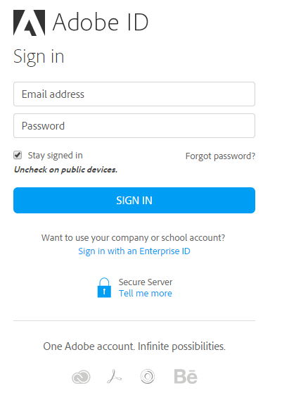

# Inicio de sesión de usuario

Al utilizar Adobe Learning Manager por primera vez, debe crear la cuenta mediante los pasos que se indican a continuación:

1. Inicie Adobe Learning Manager mediante el vínculo seguro que recibió en el correo electrónico de bienvenida de su administrador.\
   Aparece la pantalla de inicio de sesión.
1. Haga clic en Iniciar sesión.

*Iniciar sesión en Adobe Learning Manager*

1. Introduzca el Adobe ID y la contraseña y haga clic en Iniciar sesión.\
   Si ha olvidado la contraseña, haga clic en **[!UICONTROL ¿Ha olvidado la contraseña?]** y proporcione el ID de correo electrónico que utilizó para crear Adobe ID.

1. Otra opción es utilizar su Enterprise ID haciendo clic en el vínculo **[!UICONTROL Iniciar sesión con un Enterprise ID]**.

>[!NOTE]
>
>Una vez que inicie sesión por primera vez, su Adobe ID se asociará a la cuenta de su empresa. Para las sesiones subsiguientes, puede marcar la URL de su cuenta (segunda URL) que recibió en el correo electrónico de bienvenida.

## Métodos de inicio de sesión de usuario {#userloginmethods}

Si es un usuario interno de la organización, puede iniciar sesión en Learning Manager con el Adobe ID o mediante el método de inicio de sesión único.

Si es un usuario externo de la organización, puede iniciar sesión en Learning Manager mediante el Adobe ID, el inicio de sesión único o el ID de Learning Manager.
