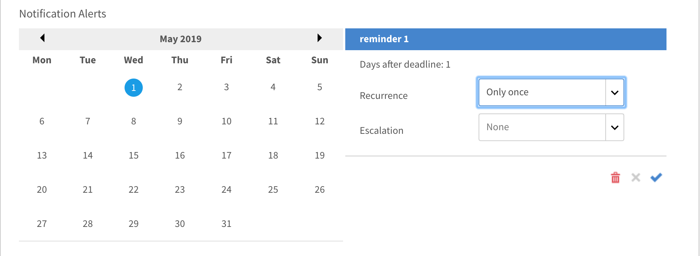
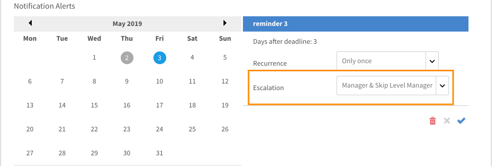

# Notificaciones

La función Notificaciones se aplica a todos los usuarios de Adobe Learning Manager. Sin embargo, cada usuario, según su función, recibe distintos tipos de notificaciones en distintos escenarios. Todas las alertas y notificaciones a los usuarios se muestran en el cuadro de diálogo emergente de notificaciones.

## Notificaciones de acceso {#accessnotifications}

Los usuarios pueden ver las notificaciones haciendo clic en el icono de notificaciones en la esquina superior derecha de la ventana. Este cuadro de diálogo emergente muestra resaltadas todas las notificaciones junto con la hora en que se produjeron con una barra de desplazamiento. Para ver más información sobre todas las notificaciones, haga clic en Mostrar todas las notificaciones en la parte inferior del cuadro de diálogo emergente. Aparece la página Notificaciones.

Puede saber el número de notificaciones más recientes según el número resaltado en la parte superior del icono de notificaciones. Por ejemplo, si hay cinco notificaciones más recientes después de su inicio de sesión anterior, puede ver el número 5 que se muestra en la parte superior del icono de notificaciones. Estos números desaparecen una vez que se leen todas las notificaciones más recientes.

## Tipos de notificaciones para administradores {#typesofnotificationsforadministrators}

Los administradores reciben notificaciones en las siguientes instancias:

* Siempre que se carga correctamente una lista csv de usuarios.
* Siempre que la carga de una lista csv de usuarios no se realice correctamente. El administrador recibe un mensaje con el motivo del error.
* El administrador también puede configurar alertas de notificación a nivel de instancia para cursos y programas de aprendizaje. En este caso, el administrador obtiene las notificaciones en función de la frecuencia seleccionada en el nivel de instancia.

>[!NOTE]
>
>Si un administrador tiene privilegios de autor o responsable además de su función, el administrador recibe notificaciones relativas a cada función.

En la siguiente captura de pantalla se muestra una ventana de notificación de ejemplo para la función de administrador:

*Ver notificaciones del administrador*

Esta ventana emergente muestra resaltadas todas las notificaciones junto con la hora de aparición y una barra de desplazamiento. Puede saber el número de notificaciones más recientes en función del número resaltado en la parte superior del icono de notificaciones. Por ejemplo, si hay cinco notificaciones más recientes después de su inicio de sesión anterior, puede ver el número 5 que se muestra en la parte superior del icono de notificaciones. Estos números desaparecen una vez que se leen todas las notificaciones más recientes.

Haga clic en **[!UICONTROL Mostrar todas las notificaciones]** situado en la parte inferior de la ventana emergente de notificaciones para ver todas las notificaciones en una página independiente.

## Configurar notificaciones de escalación de varios niveles {#setupmultilevelescalationnotifications}

Los correos electrónicos de escalación cuando los alumnos incumplen las fechas límite se pueden enviar al responsable y a un responsable de omisión. Puede configurar notificaciones de escalación de varios niveles para la no finalización del curso durante el proceso de creación de un curso, o incluso después de que se haya creado. Las notificaciones de escalación se pueden configurar para que se envíen con una frecuencia establecida para que se envíen a un responsable o a un administrador de omisión.

1. Inicie sesión como administrador o autor y haga clic en Cursos.
1. Seleccione el curso para el que desea modificar las notificaciones de escalación y haga clic en **[!UICONTROL Ver curso]**.

   

   *Seleccione la opción Ver curso*

1. Haga clic en **[!UICONTROL Instancias]** > **[!UICONTROL Alertas de notificación]**.

   

   *Seleccione la opción Alertas de notificación*

1. Se abre un calendario que indica el plazo establecido para el curso resaltado en rojo. Haga clic en la fecha resaltada para ver los recordatorios configurados para el alumno.

   

   *Ver recordatorios de fechas límite*

1. Establezca recordatorios seleccionando fechas anteriores a la fecha límite. Esto le permite configurar recordatorios para el alumno sobre la próxima fecha límite.

   

   *Establecer una fecha de recordatorio de fecha límite*

1. Seleccione una fecha posterior a la fecha límite para configurar una programación de recordatorios para el alumno y notificaciones de escalación al responsable.

   

   *Establecer recordatorios y fechas de escalación*

1. Si el alumno sigue sin completar el curso incluso después de la escalación al responsable, la configuración le permite escalar al responsable de omisión del alumno. Haga clic en una fecha posterior a la fecha límite ampliada, seleccione la periodicidad de los recordatorios, el número de días para la programación y seleccione **Responsable y responsable de nivel de omisión** en el **Escalación** menú desplegable. Haga clic en la marca de verificación azul para guardar la configuración de las notificaciones.

   

   *Guardar la configuración de notificaciones*

## Preguntas más frecuentes {#frequentlyaskedquestions}

+++Cómo configurar notificaciones de recordatorio en la instancia?

En una instancia, haga clic en Alertas de notificación. Se abre un calendario que indica el plazo establecido para el curso resaltado en rojo. Haga clic en la fecha resaltada para ver los recordatorios configurados para el alumno. Establezca los recordatorios, como se explica en este [sección](user-notifications.md#Setupmultilevelescalationnotifications).
+++
