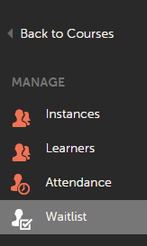

# Gestión de la lista de espera y la asistencia

Los administradores pueden gestionar la lista de espera y la asistencia a los cursos de los alumnos.

## Gestión de la lista de espera {#waitlistmanagement}

Los alumnos se colocan en una lista de espera para los cursos de clase cuando la capacidad es limitada, según el orden de inscripción. Los administradores pueden seleccionar los alumnos en lista de espera y asignar puestos reemplazando el límite de puestos de cualquier curso de clase. Los alumnos se inscriben en el curso tan pronto como el administrador asigna un lugar.

1. Haga clic en **[!UICONTROL Cursos]** en el panel izquierdo después de iniciar sesión como administrador.
1. En la lista de cursos disponibles, haga clic en el nombre del curso de cualquier curso de clase que desee. Aparece una nueva página con información detallada sobre el curso.

*Seleccionar la opción Lista de espera*

1. Haga clic en **[!UICONTROL Lista de espera]** en el panel izquierdo de la página de detalles del curso. Lista de alumnos en lista de espera aparece en la página.
1. Seleccione a los alumnos y haga clic en **[!UICONTROL Asignar puestos]** para inscribir a los alumnos directamente en los cursos reemplazando el límite de puestos.

## Gestión de la asistencia {#attendancemanagement}

Esta función es aplicable solo a los cursos de clase y clase virtual. Puede registrar la asistencia siguiendo estos pasos:

1. Haga clic en Cursos en el panel izquierdo después de iniciar sesión como administrador.
1. En la lista de cursos disponibles, haga clic en el nombre del curso de cualquier módulo o curso de clase que quiera. Aparece una nueva página con información detallada sobre el curso.
1. Haga clic en la ficha Asistencia, seleccione los alumnos y haga clic en Guardar para marcar la asistencia.

>[!NOTE]
>
>Si hay varios módulos en un curso y el alumno ha completado solo uno de ellos, puede seleccionar un solo módulo y hacer clic en Guardar. Si este completa todos los módulos de un curso, puede hacer clic en la opción Seleccionar todo y después en Guardar.

La asistencia a la sesión de clase virtual basada en Adobe Connect se marca automáticamente entre 2 y 3 horas después de la sesión. La finalización del curso de clase virtual del alumno se marca solo después de que se haya marcado la asistencia.
