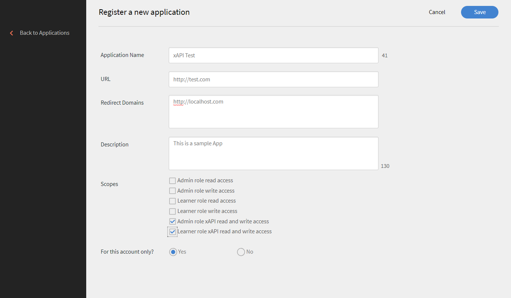
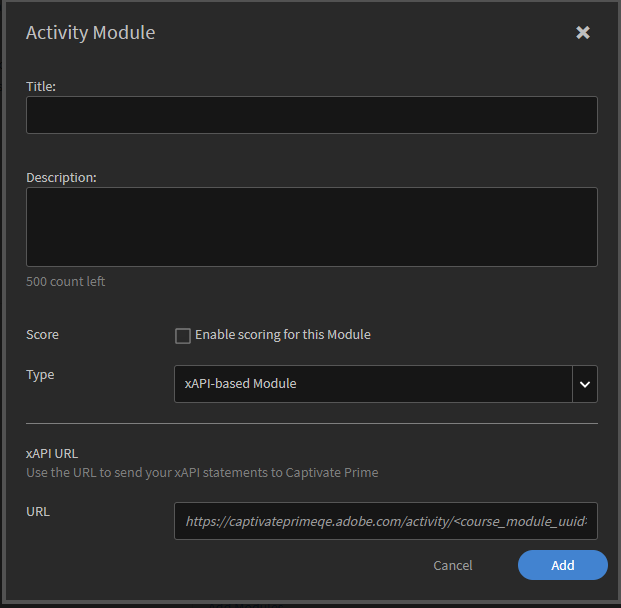
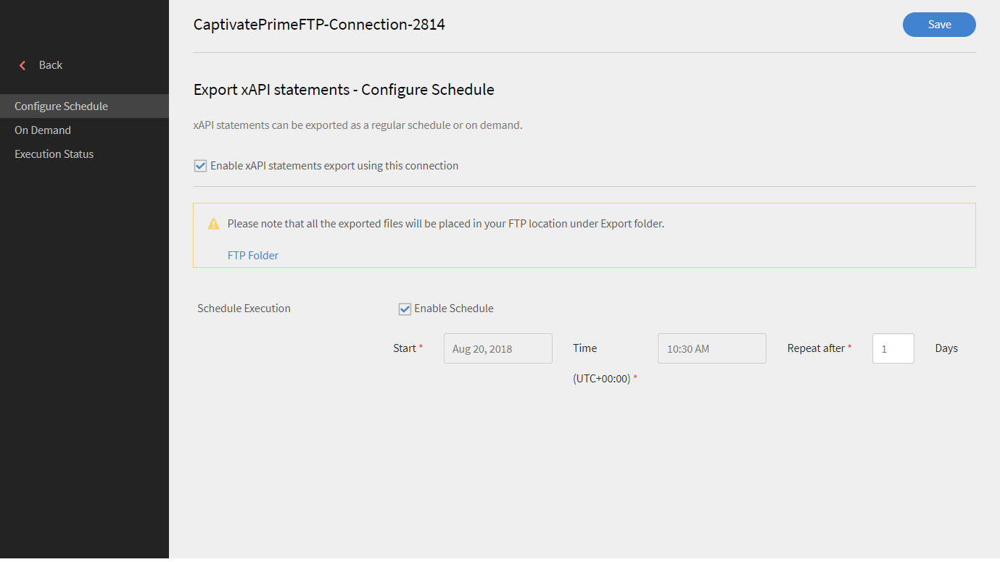

# xAPI en Learning Manager

## ¿Qué es xAPI? {#whatisxapi}

Experience API o xAPI es una especificación de software de aprendizaje electrónico que permite que el contenido de aprendizaje y los sistemas de aprendizaje se comuniquen entre si de manera que se registra y se hace el seguimiento de toda clase de experiencias de aprendizaje. Las experiencias de aprendizaje se registran en un LRS (Learning Record Store) o almacén de registros de aprendizaje. Los LRS pueden coexistir con los tradicionales LMS o sistemas de gestión de aprendizaje o por si solos.

Para obtener más información sobre xAPI, consulte [Especificaciones de xAPIc](https://github.com/adlnet/xAPI-Spec).

## ¿Cómo admite xAPI Learning Manager? {#howdoeslearningmanagersupportxapi}

Learning Manager dispone de un LRS interno. Ese LRS tiene capacidad plena para aceptar declaraciones de xAPI de contenido que se ha alojado en Learning Manager. Incluso acepta declaraciones de xAPI generadas por terceros. Estas declaraciones de xAPI se almacenan en Learning Manager; a continuación, pueden exportarse y visualizarse en cualquier sistema de almacenamiento de datos de otro proveedor.

## ¿Cuándo se utiliza xAPI? {#whendoyouusexapi}

Cada vez es más necesario captar experiencias de aprendizaje del usuario final que abarquen varios sistemas.  También es necesario hacer un seguimiento de la participación exacta del alumno respecto al contenido de la formación. Va más allá de los estados Iniciado, En curso y Finalizado, que son los únicos atributos capturados por SCORM.

## Uso de xAPI en Learning Manager {#usingxapiinprime}

### Configure la aplicación {#setupyourapplication}

1. Inicie sesión como Administrador de integración. Seleccione **[!UICONTROL Aplicaciones> Registrar]**.

   

   *Iniciar página para registrar una aplicación*

1. Registre una aplicación nueva.

   

   *Registrar una nueva aplicación*

1. Defina el ámbito de la aplicación.

   * Si está activada la opción **[!UICONTROL Acceso de lectura y escritura para xAPI de la función Administrador]**, el administrador puede publicar y obtener documentos y declaraciones de xAPI.
   * Si está activada la opción **[!UICONTROL Acceso de lectura y escritura para xAPI de la función Alumno]**, el administrador puede publicar y obtener documentos y declaraciones de xAPI.

1. Guarde los cambios. Obtiene el ID y el secreto de desarrollador.

**Puntos finales**:

Haga clic en el vínculo siguiente para ver el documento xAPI Swagger:

[Documento xAPI Swagger](https://learningmanagereu.adobe.com/docs/primeapi/xapi/)

>[!NOTE]
>
>La versión de xAPI admitida en Learning Manager es 1.0.3.


## Autenticación de API {#apiauthentication}

Learning Manager xAPI utiliza el marco de OAuth 2.0 para autenticar y autorizar sus aplicaciones cliente. Una vez que haya registrado la aplicación, puede obtener el ID y el secreto de cliente. La URL de obtención se utiliza en el navegador, ya que autentica a los usuarios de Learning Manager mediante sus cuentas preconfiguradas, como SSO o Adobe ID.

```
GET https://learningmanager.adobe.com/oauth/o/authorize?client_id=<Enter your clientId>&redirect_uri=<Enter a url to redirect to>&state=<Any String data>&scope=<admin:xapi or learner:xapi>&response_type=CODE.
```

## Seguimiento de declaraciones de xAPI como objeto de aprendizaje de Learning Manager {#trackingxapistatementsasprimelo}

Como autor, ahora puede elegir el módulo de xAPI al crear cursos para supervisar la experiencia del usuario fuera de Learning Manager. Por ejemplo, puede usar esta función para evaluar las actividades de los usuarios en una plataforma de terceros utilizada para el consumo de cursos.

1. Al crear un **[!UICONTROL Módulo de actividad]**, en la opción **[!UICONTROL Tipo]**&#x200B;utilice el menú emergente para seleccionar **[!UICONTROL Módulo basado en xAPI.]**

   

   *Seleccione la opción Módulo basado en xAPI*

1. Se le solicita que proporcione un IRI. Si no se proporciona, Learning Manager genera uno automáticamente.

   El IRI de una actividad es exclusivo de una cuenta. Es decir, dos módulos de Learning Manager no pueden tener el mismo IRI. Se genera un nuevo IRI en los casos siguientes:

   * Cuando se comparte un curso con el módulo xAPI entre cuentas.
   * Cuando se repite una certificación con el módulo de xAPI


   Cualquier declaración de xAPI con el IRI mencionado se controla en el módulo anterior y se refleja en los informes de Learning Manager.

1. Para copiar el IRI generado automáticamente, vuelva a visitar la página Módulo de actividad.
1. Publique el módulo.

**Aspectos que tener en cuenta:**

* Actualmente, Learning Manager solo admite mbox como identificador. No se admiten otros identificadores, como mboz_sha1, openid , account.

* stateId y profileId es un UUID cuando se utilizan con Learning Manager.
* La solicitud de PUT no sobrescribe el documento para los agentes/perfil, actividad/perfil y actividad/estado de xAPI
* El grupo no identificado no es compatible con Actor.
* El parámetro &quot;related_activities&quot; no se admite en la instrucción GET.
* Los parámetros &#39;format=ids&#39; y &#39;format=canonical&#39; no se admiten en declaraciones GET.
* La anulación de la sentencia xAPI no deshace ninguna acción que se haya producido en Learning Manager cuando se publicó la sentencia.

## Generar informes {#generatereports}

Los informes de xAPI se pueden generar como informes de Excel. Como administrador, abra **[!UICONTROL Informes > Informes de Excel > Informe de actividad de xAPI]**.

El informe descargado obtiene toda la información publicada por el alumno y el administrador para cualquier declaración.

Los mismos informes se pueden generar y programar mediante conectores de FTP y Box para cualquier integración de terceros. Siga estos pasos:

Inicie sesión como **Administrador de integración > Abra el conector de FTP/Box > Seleccione el informe de actividad de xAPI** en el panel izquierdo. Elija programar/ generar un informe.



*Programar o generar un informe*

* Cuando solo se envía una puntuación RAW en una instrucción xAPI sin puntuación máxima, la puntuación de prueba no se muestra en LT.

* Para obtener la puntuación porcentual en Learning Manager, las puntuaciones escaladas se envían a través de xAPI.

## Informe de muestra {#samplereport}

[Informes de xAPI de muestra](assets/xapireport8842560559890766717csv.zip)
