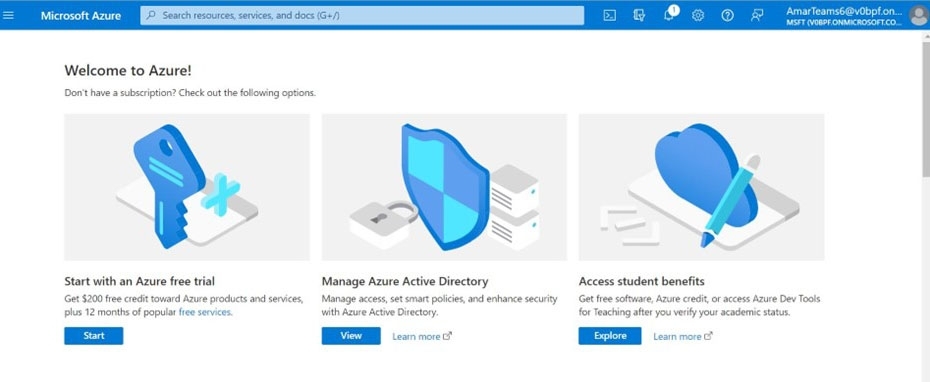

# Aplicación Adobe Learning Manager para Microsofts Teams

## Cómo realizar la configuración

La configuración de ALM en MS Teams implica tres pasos y necesita la ayuda del administrador de ALM y el administrador de Microsoft Azure. En algunas organizaciones, el administrador de Azure y los administradores de MS Teams no son iguales, por lo que también se requieren administradores de MS Teams adicionales.

**Administrador de ALM: la función de administrador de integración aprueba la aplicación para equipos**

Una vez que el administrador de integración apruebe la aplicación de MS Teams, la aplicación de Adobe Learning Manager estará disponible en la tienda de aplicaciones de MS Teams y los alumnos podrán acceder a ella. Sin embargo, la aplicación no tendrá notificaciones, inicio de sesión silencioso y la aplicación no estará anclada para los alumnos de MS Teams.

**El administrador de Microsoft Azure aprueba el permiso para la aplicación ALM en el panel de Azure**

El administrador de Azure tendrá que aprobar los permisos necesarios para la aplicación de ALM. Esto permitirá que la aplicación ALM envíe notificaciones a MS Teams y permita el inicio de sesión silencioso. En el inicio de sesión silencioso, los usuarios no tienen que iniciar sesión por separado en Adobe Learning Manager en el navegador.

El administrador de **MS Teams crea una directiva para los equipos de ALM**

El administrador de MS Teams de su Centro de administración debe fijar la aplicación de ALM para todos sus usuarios y permitirla como una política global. En caso de que solo un determinado grupo de la empresa utilice ALM, el administrador de MS Teams debe elegir una política personalizada y aplicarla solo a ese grupo específico.

## La función de administrador de integración aprueba la aplicación para equipos

Siga los pasos mostrados a continuación:

1. En la aplicación del administrador de integración, seleccione **[!UICONTROL Aplicaciones]** > **[!UICONTROL Aplicaciones destacadas]** y seleccione la **[!UICONTROL aplicación de ALM Teams]**.

   
   *Seleccionar aplicación de ALM Teams*

1. En la esquina superior derecha de la pantalla, seleccione **[!UICONTROL Aprobar]**.

   
   *Seleccione Aprobar en la página de configuración de la aplicación*

1. Seleccione **[!UICONTROL Aceptar]** en el cuadro de diálogo que aparece.

   
   *Seleccionar Aceptar después de la aprobación*

1. Una vez aprobada, podrá ver &quot;Aplicación ALM para equipos&quot; en la sección Aplicaciones externas .

   
   La aplicación *ALM Teams aparece en la página Aplicaciones*

Ahora, los usuarios pueden acceder a la aplicación ALM en MS Teams.

## El administrador de Microsoft Azure aprueba el permiso para la aplicación ALM en el panel de Azure

Siga los pasos mostrados a continuación:

1. Como administrador de Azure, vaya a la sección Administrar Azure Active Directory en el panel de Azure.

   
   *Iniciar Azure Dashboard*

1. Pegue el siguiente vínculo en una ventana independiente del navegador:

   `https://login.microsoftonline.com/<tenantIdTobeReplaced>/oauth2/authorize?client_id=8d349d9f-bf59-4ece-8022-a41e87d81903&response_type=code&redirect_uri=https://learningmanager.adobe.com`

1. En el vínculo anterior, reemplace `<tenantIdTobeReplaced>` por el id. de inquilino disponible en la página Información general siguiente. Introduzca la nueva dirección URL.

1. Añada la aplicación de Adobe Learning Manager a sus aplicaciones de Azure.

   
   *Añadir a Azure*

1. Seleccione el separador Aplicaciones de Empresa y seleccione Todas las Aplicaciones. Verá ALMTeamsApp en la lista.

   
   *Ver la aplicación ALM*

1. Haga clic en la aplicación y vaya a la pestaña Permisos .

   
   *Ver la ficha Permisos*

1. En la pestaña Permisos, seleccione &#39;**[!UICONTROL Conceder consentimiento de administrador para MSFT]**&#39; para dar permisos a la aplicación ALM para equipos.

   
   *Seleccionar permisos*

1. Seleccione **[!UICONTROL Aceptar]**.

   
   *Seleccionar Aceptar*

1. Una vez concedidos, estos permisos otorgarán a la aplicación ALM para permitir inicios de sesión silenciosos y enviar notificaciones a los alumnos en la aplicación MS Teams.

   
   *Se ha concedido acceso*

## El administrador de MS Teams crea una política para la aplicación Teams

Siga los pasos mostrados a continuación:

1. Como administrador de MS Teams, en el Centro de administración, cree una normativa para añadir la aplicación Teams a la aplicación Teams de los alumnos.

   
   *Crear una directiva*

1. Vaya a la sección Directivas de instalación. Cree una directiva global y seleccione **[!UICONTROL Agregar aplicaciones]** en la subsección Aplicaciones fijadas.

   
   *Agregar la directiva*

1. En el cuadro de diálogo siguiente, busque **[!UICONTROL Adobe Learning Manager]** y añada la aplicación. Esto añade Adobe Learning Manager en la sección Aplicaciones instaladas .

   
   *Instalar la aplicación*

1. Guarde esta directiva. Esto hace que la aplicación esté disponible para todos los miembros de la organización.

Como alternativa, los administradores pueden crear una directiva personalizada en lugar de una directiva global. Agregue Adobe Learning Manager a esa directiva personalizada y, a continuación, aplique la directiva personalizada solo a los usuarios que necesiten acceder a Adobe Learning Manager.
