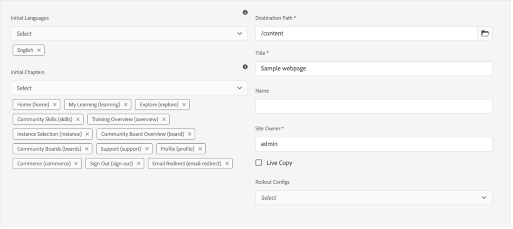

# Paquete de sitios de referencia de Adobe Learning Manager (sitios de referencia de ALM) para AEM Sites

Adobe Learning Manager (ALM) se integra con los sitios de Adobe Experience Manager (AEM). Esto le permite crear su propio sitio web e interfaces móviles interactivas para Adobe Learning Manager con un esfuerzo de codificación mínimo. Con esta integración, puede crear experiencias de aprendizaje personalizadas para los usuarios.

Para crear esta experiencia, ALM proporciona un paquete de sitios de referencia de Adobe Learning Manager (paquete de sitios de referencia de ALM) para AEM Sites en forma de archivo ZIP que puede instalar en la instancia de AEM Sites.

El paquete incluye plantillas de página web y componentes de sitio web de AEM Sites, junto con widgets incrustables, como, por ejemplo, catálogos de aprendizaje, calendarios, etc.

Después de instalar el paquete de sitios de referencia de ALM, puede comenzar a crear un sitio web para Adobe Learning Manager que puede alojar en la instancia de AEM Sites. Los usuarios pueden arrastrar y soltar los componentes en el sitio web.

Instalar paquete de sitios de referencia de ALM

## Requisitos previos

* Licencias para AEM Sites y Adobe Commerce
* AEM local 6.5 o Adobe Experience Manager - Cloud Service
* Adobe Commerce 2.4.3

Después de proteger el entorno de AEM Sites, debe instalar el paquete de sitios de referencia de ALM. Este paquete incluye componentes de sitios web y páginas web de AEM que ayudan a crear la plataforma de aprendizaje.

El paquete del sitio de referencia se aloja en la [**Repositorio de GitHub**](https://github.com/adobe/adobe-learning-manager-reference-site/releases/tag/1.0.0).

Para obtener más información, consulte el archivo README (Léame).

## Crear una aplicación en [!DNL Adobe Learning Manager]

Después de instalar el paquete de sitios de AEM, debe configurar una aplicación de ALM para conectar el portal de aprendizaje con el sitio de AEM.

Este escenario es aplicable cuando se utiliza AEM con [!DNL Adobe Learning Manager].

Siga los pasos indicados a continuación:

1. Como administrador de integración, haga clic en **[!UICONTROL Aplicaciones]**.
1. Para crear una nueva aplicación, en la esquina superior derecha de la página, haga clic en **[!UICONTROL Registrar]**.
1. En la pantalla Registrar una nueva aplicación, introduzca la siguiente información:

   1. Nombre de la aplicación: el nombre de la aplicación que está creando.
   1. URL: la dirección URL de su organización.
   1. Dominios de redirección: los dominios de alojamiento del sitio web de AEM. También puede especificar caracteres comodín.
   1. Descripción: la descripción de la aplicación.
   1. Ámbitos: seleccione las opciones de acceso de lectura y escritura para la función de alumno.
   1. ¿Solo para esta cuenta?: seleccione Sí a fin de utilizar la aplicación para la cuenta de ALM existente.

1. Después de realizar los cambios, haga clic en Guardar.

Anote las credenciales de la aplicación que aparecen en la pantalla.

*Credenciales de aplicación*

Para aprobar la aplicación, haga clic en **[!UICONTROL Aprobar]**.

## Obtener tokens

1. En la ficha Recursos del desarrollador, haga clic en **[!UICONTROL Tokens de acceso para pruebas y desarrollo]**.

   

   *Seleccionar tokens de acceso para pruebas y desarrollo*

1. Introduzca los siguientes datos:

   
   *Introduzca los detalles del token*

   1. Obtener el código OAuth: introduzca el ID de cliente de la sección anterior y cambie el ámbito. Haga clic en Enviar para obtener el código Oauth.
   1. Obtener token de actualización: introduzca el ID y el secreto de cliente de la sección anterior. Introduzca también el código OAuth obtenido en el paso anterior. Haga clic en Enviar.
   1. Obtener token de acceso: introduzca el ID y el secreto de cliente de la sección anterior. Introduzca también el token de actualización obtenido en el paso anterior. Haga clic en Enviar.
   1. Obtener detalles del token de acceso: introduzca el token de acceso obtenido en el paso anterior. Haga clic en Enviar.

1. Puede obtener los detalles de la respuesta JSON que se muestra a continuación. La respuesta consta del token de acceso, el token de actualización, la función de usuario, el ID de cuenta, el ID de usuario y el tiempo de caducidad. Anote el token de actualización, ya que volverá a utilizarlo.

## Configurar la cuenta de ALM en AEM

1. Inicie la instancia de AEM.
1. Haga clic en Configuración > Cloud Service.
1. Haga clic en Configuración de Adobe Learning Manager.

   
   *Seleccione la configuración de Adobe Learning Manager*

1. Haga clic en Crear > Carpeta de configuración. Asigne un nombre a la carpeta.

   
   *Crear configuración*

1. En el proyecto de aprendizaje, seleccione la configuración que ha creado.

1. Introduzca los detalles de la configuración.

   
   *Crear carpeta de configuración*

   1. Modo de Adobe de Learning Manager: elija cómo desea que los alumnos que han iniciado sesión y los que no lo han hecho inicien la experiencia de aprendizaje.
   1. URL de Adobe Learning Manager: introduzca la dirección URL de la instancia de ALM en la que se alojan los servicios de aprendizaje.
   1. ID de cuenta: ID de la cuenta de ALM.
   1. ID de cliente, secreto de cliente y token de actualización de autor: introduzca las credenciales que obtuvo al crear la aplicación en ALM.
   1. Personalización del widget: para obtener más información, consulte [Integración con AEM](/help/migrated/integrate-aem-learning-manager.md) `.`

1. Guarde y cierre la configuración.

### AEM + Adobe Learning Manager (usuarios que han iniciado sesión o que no)

Adobe Learning Manager le permite ahora mostrar su producto y cursos de formación a sus clientes y socios actuales y potenciales sin necesidad de crear una cuenta o iniciar sesión. Esta función le ayudará a impulsar la adopción del producto y la formación ofreciendo a los alumnos una vista previa rápida y sencilla de los cursos de formación, lo que ayuda a destacar y promocionar las características del producto. Por lo tanto, puede mostrar sus productos y ofertas, sobre todo, a clientes y socios potenciales, lo que aumentará el conocimiento de los productos. La facilidad de acceso y una mayor disponibilidad aumentan el interés, lo que ayuda a impulsar las inscripciones en cursos de formación y la adopción del aprendizaje.

Con este flujo de trabajo, un alumno puede previsualizar un curso, acceder la información de formación o buscar un curso sin necesidad de iniciar sesión en Adobe Learning Manager. Este flujo de trabajo no es aplicable a la interfaz nativa de Learning Manager (aplicable SOLO para AEM Sites y otras interfaces descentralizadas).

**Configurar y habilitar el conector de la plataforma de aprendizaje**

En esta sección, se destacan los pasos necesarios para configurar y activar el siguiente conector:

**Training Data Access**

Este conector permite que la interfaz de usuario descentralizada basada en AEM Sites u otra personalizada recupere y procese información de formación para los alumnos y realice una búsqueda perfecta de información de formación antes o después de que el alumno inicie sesión.

Este conector solo es necesario si utiliza interfaces basadas en AEM Sites u otras interfaces descentralizadas.

El conector exporta los metadatos de formación a un almacén de datos y una solución de recuperación, así como a un sistema de activación de búsqueda. Por lo tanto, puede configurar la interfaz de usuario descentralizada basada en AEM Sites u otra personalizada para utilizar estos dos servicios con el fin de recuperar datos de formación, procesar páginas web y proporcionar a los alumnos una función de búsqueda de formación optimizada. Por ejemplo, una interfaz basada en AEM Sites que no tenga iniciada una sesión puede utilizar los metadatos exportados para ayudar al alumno a buscar y examinar páginas que muestren información de formación o acceder a ellas.

Active este conector para crear y procesar páginas web basadas en AEM Sites y ofrecer experiencias personalizadas a los alumnos antes y después de iniciar sesión. Active este conector para crear y procesar páginas web basadas en AEM Sites y ofrecer experiencias personalizadas a los alumnos antes y después de iniciar sesión.

* URL base de cdn de Adobe Learning Manager: introduzca la dirección URL base de la ruta del servicio de CDN de recuperación de datos desde la página de conexión de Training Data Access.
* Token de actualización de administrador : introduzca el token de actualización que determinó en la sección anterior.
* URL base de metadatos de formación : introduzca la dirección URL base de la ruta del servicio de activación de búsqueda y recuperación de datos de búsqueda desde la página de conexión Acceso a datos de formación.
* URL de registro de Adobe Learning Manager: introduzca la URL de registro automático generada por el administrador de integración para la cuenta, que utilizan los alumnos para inscribirse en cursos de formación.

### AEM + Adobe Learning Manager + Adobe Commerce (usuarios que han iniciado sesión o que no)

Adobe Learning Manager ahora proporciona soluciones que le ayudan a integrar perfectamente la plataforma de aprendizaje con Adobe Commerce. Esta versión le permitirá conectar fácilmente las interfaces nativas basadas en sitios de AEM u otras interfaces de Learning Manager descentralizadas a Adobe Commerce. Esta integración le permite desarrollar las funciones de comercio electrónico en la plataforma de aprendizaje. Ahora puede ofrecer formación de pago a sus clientes y socios comerciales, así como permitir compras de formación fácilmente en interfaces de Learning Manager nativas y no nativas. Un alumno también puede previsualizar un curso, acceder la información de formación o buscar un curso sin necesidad de iniciar sesión en Adobe Learning Manager.

Un usuario puede utilizar la aplicación ya AEM y aprobarla, en lugar de crear una.

* URL base de cdn de Adobe Learning Manager: introduzca la dirección URL base de la ruta del servicio de CDN de recuperación de datos desde la página de conexión de Adobe Commerce.
* URL de Adobe Commerce : introduzca la dirección URL de la instancia de Adobe Commerce que está utilizando.
* Ruta del proxy de GraphQL: los componentes de Learning Manager del cliente acceden directamente al terminal de Adobe Commerce GraphQL y, por lo tanto, puede producirse un error de CORS. Para evitar este error, todas las llamadas deben servirse desde el mismo terminal que AEM o a través de un proxy que agregue encabezados CORS.
* Nombre de la tienda de Adobe Commerce : introduzca el nombre de la tienda de Adobe Commerce que determinó en la sección anterior.
* Duración del token de cliente de Adobe Commerce (en segundos) : introduzca la duración del token de cliente, que indica el período predeterminado para una sesión de inicio de sesión.
* Token de actualización de administrador : introduzca el token de actualización que determinó en la sección anterior.

## Personalizar páginas web

Personalice sus páginas web utilizando el sitio de referencias de AEM y los widgets disponibles.

1. Inicie la instancia de AEM.
1. Haga clic en Sitios y abra la página de configuración.
1. Haga clic en **[!UICONTROL Sitio de aprendizaje]** > **[!UICONTROL Maestros de idiomas]** > **[!UICONTROL Inglés]**. Todas las páginas web del proyecto se incluyen en la carpeta.

   
   *Ver todas las páginas web*

1. Seleccione cualquier plantilla y haga clic en **[!UICONTROL Editar]**.

1. En la página, haga clic en el botón de configuración del componente y cambie las propiedades del componente.

   
   *Botón Seleccionar configuración*

1. Obtenga una vista previa de los cambios o puede publicar la página.

## Crear páginas web

Además de las plantillas que puede utilizar que proporciona el paquete de sitios de referencia, también puede crear páginas web basadas en las plantillas de AEM.

1. En la página de AEM principal, haga clic en Crear > Página.

1. Elija la plantilla que desea personalizar. Haga clic en Siguiente.

1. Especifique las propiedades de la página.

   
   *Propiedades de página*

1. Para crear la página, haga clic en **[!UICONTROL Crear]**.

1. Seleccione la nueva página y haga clic en **[!UICONTROL Editar]**.

1. Inserte un componente en la página, por ejemplo, **Aprendizaje: Contenido**.

   
   *Filtrar por sitio*

1. Elija los filtros de catálogo necesarios que se mostrarán en la página.

## Crear un sitio a partir de un modelo

El paquete del sitio de referencia de ALM proporciona un &quot;Plan del sitio de aprendizaje&quot;, que le permite crear un sitio web para su plataforma de aprendizaje. Los modelos de AEM le permiten crear páginas web directamente a partir de componentes de AEM Sites. No es necesario utilizar una plantilla.

1. En la página de inicio AEM, haga clic en **[!UICONTROL Sites]**.

1. Haga clic en **[!UICONTROL Crear]** > **[!UICONTROL Sitio]**.

1. Haga clic en Plan del sitio de aprendizaje.

   

   *Crear sitio a partir del plano*

1. Haga clic en Siguiente.

1. En la página de propiedades, introduzca los metadatos de la página. Haga clic en Crear.

   
   *Seleccionar modelo de sitio de aprendizaje*

1. Haga clic en el hipervínculo Inicio para desplazarse a la página principal del sitio que ha creado. En esta página, puede personalizar los widgets y los componentes de catálogo.

## Codificar el sitio web

Además de utilizar las plantillas integradas y crear el sitio web desde cero mediante los componentes WYSIWYG, también puede escribir el código y crear el sitio.

El código se encuentra en el [repositorio de GitHub del sitio de referencia](https://github.com/adobe/adobe-learning-manager-reference-site) para que pueda empezar.

Las partes principales de la plantilla son:

* core: Paquete de Java que contiene todas las funciones principales, como servicios OSGi, listeners o planificadores, así como código Java relacionado con componentes, como servlets o filtros de solicitud.
* ui.apps: contiene las partes /apps (y /etc) del proyecto, es decir, clientes, bibliotecas, componentes y plantillas de JS&amp;CSS.
* ui.content: contiene contenido de ejemplo que utiliza los componentes de ui.apps
* ui.frontend: contiene componentes React.

Todo el código se encuentra en el repositorio para que pueda empezar a trabajar.

## Importar y añadir componentes de Learning Manager a una plantilla o una página web existentes

La instalación del paquete de sitios de referencia de AEM añade los componentes de Learning Manager a la instancia de AEM Sites. De forma predeterminada, puede añadir estos componentes al sitio de aprendizaje del proyecto web (sitio web) que proporcionamos listo para su uso. Estos componentes también están disponibles en el sitio web que cree a partir del modelo del sitio de aprendizaje.

Sin embargo, si desea utilizar estos componentes de Learning Manager recién añadidos a su proyecto o sitio web existentes, debe importarlos mediante el siguiente procedimiento.

1. Instale el paquete del sitio de referencia de ALM.

1. Abra el proyecto web y vaya al archivo HTML (de la plantilla o la página web en las que desea añadir los componentes de Learning Manager).
1. Unirse a una reunión

   Abra el archivo HTML y añada los siguientes fragmentos de código al componente de página para que el código se ejecute antes de que se procesen los componentes de aprendizaje presentes en la página.

   *`<sly data-sly-use.configModel="com.adobe.learning.core.models.GlobalConfigurationModel"/>`*
   *`<meta name="cp-config" content="${configModel.config}" />`*

   El código anterior añade la configuración asignada en la etiqueta meta de la página, lo que es necesario para que se procesen los componentes de aprendizaje. Para obtener más información, consulte [Adobe Learning Manager sitr de referencia](https://github.com/adobe/adobe-learning-manager-reference-site/blob/master/ui.apps/src/main/content/jcr_root/apps/learning/components/page/customheaderlibs.html).

1. Asegúrese de haber asignado la configuración al proyecto web.
1. Abra la plantilla de AEM Sites donde desee importar los componentes de Learning Manager.
1. En el editor de páginas de plantilla, vaya al contenedor Componentes permitidos y seleccione **Política**.
1. En la página de políticas, vaya a Propiedades > Componentes permitidos y seleccione los siguientes componentes &quot;Aprendizaje - Contenido&quot;, &quot;Aprendizaje - Formulario&quot; y &quot;Aprendizaje - Estructura&quot;

El siguiente procedimiento permite que la plantilla cumpla las dependencias de bibliotecas de clientes de los componentes de Learning Manager importados.

Las páginas web que incluyen estos componentes deben cargar estas bibliotecas para procesar y utilizar correctamente los componentes.

1. En el editor de páginas de plantilla, haga clic en Información de página y, a continuación, en Política de página.
1. En la página de políticas, desplácese a Propiedades > Bibliotecas de clientes y añada estas a la página de plantilla:

   1. learning.site
   1. learning.ui
   1. learning.commerce

Después de guardar esta plantilla, puede añadir los componentes de Learning Manager en todas las páginas web derivadas de esta plantilla.
