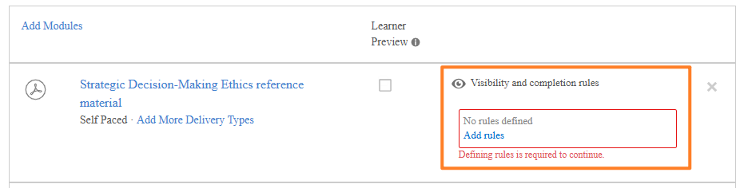

# Cursos adaptativos para autores

## Crear y configurar un curso adaptable

Crea un curso con reglas de finalización y visibilidad por módulo para que los distintos alumnos vean y completen contenido diferente en función de sus grupos de usuarios.

>[!NOTE]
>
>El tipo de curso adaptable solo está disponible si se han habilitado **reglas de visibilidad y finalización** para tu cuenta. Si no ve la opción para crear un curso adaptable, solicite a su administrador que habilite el aprendizaje adaptable.

### Crear un curso adaptable

1. Inicie sesión en Adobe Learning Manager como autor.

   

2. En la barra de navegación izquierda, seleccione **Cursos**. A continuación, seleccione **Agregar**.
3. Introduzca el nombre del curso, la descripción y otros detalles.
4. Seleccione el conmutador **Reglas de visibilidad y finalización del contenido**.

   

5. Seleccione **Sí** en el cuadro de diálogo de confirmación.

   

   **Agregar módulos a un curso adaptable**

   Añada los módulos necesarios. Añada módulos de contenido cargando contenido, seleccionándolos de la biblioteca de contenido o añadiendo sesiones de clase o de clase virtual.

   **Tipos de módulo que admiten reglas adaptables (módulos de contenido):**

   * Aprendizaje online a ritmo personalizado
   * Sesiones de clase
   * Sesiones de clase virtual
   * Módulos de actividad

   **Tipos de módulo que NO admiten reglas adaptables:**

   * **Módulos previos al trabajo:** Se muestran a todos los alumnos antes de que comience el contenido principal. No se pueden establecer reglas de visibilidad o finalización.
   * **Módulos de prueba:** Disponible para todos los alumnos. Completar una prueba finaliza todo el curso independientemente del estado del módulo de contenido. No se pueden establecer reglas de visibilidad o finalización.
   * **Ayudas de trabajo:** visibles para todos los alumnos inscritos en todo momento.

6. Seleccione **Agregar**.

### Configurar reglas de visibilidad y finalización para cada módulo

Después de añadir un módulo de contenido, configure sus reglas adaptables:

1. Seleccione el módulo que desea configurar.
2. En la configuración del módulo, busque la sección **Reglas de visibilidad y finalización**.

   

3. Seleccione **Agregar reglas** para agregar los grupos de usuarios que pueden ver este módulo.

   

   

   Los alumnos de estos grupos ven el módulo en el curso, pero no tienen que completarlo a menos que también estén en Obligatorio.

4. Seleccione **Guardar**.
5. Repita el proceso para cada módulo de contenido del curso.

**Reglas clave:**

* Un alumno que pertenezca a varios grupos de usuarios obtiene el resultado más restrictivo: si algún grupo hace que un módulo sea obligatorio, es obligatorio para ese alumno.
* Debe configurar al menos un módulo como **Obligatorio** para al menos un grupo de usuarios para poder publicar. El sistema bloquea la publicación hasta que se cumpla esta condición.

### Curso en estado de borrador

Cuando un curso se encuentra en estado Borrador, representa la fase en la que toda la estructura adaptable se puede diseñar, configurar y perfeccionar completamente antes de que se bloquee para los alumnos. En esta fase, los autores pueden definir si el curso debe funcionar como un curso adaptativo o un curso normal, y esta decisión será reversible hasta que se publique el curso. Esto hace que la fase de borrador sea crítica, ya que es el único punto en el que se puede establecer o cambiar la naturaleza adaptativa central del curso.

En el borrador, los autores tienen un control completo sobre la estructura del curso. Pueden añadir, eliminar y reordenar módulos libremente para dar forma al flujo de aprendizaje previsto. Al mismo tiempo, pueden configurar el comportamiento adaptativo a nivel granular mediante la definición de reglas de visibilidad para cada módulo. Estas reglas determinan qué grupos de usuarios pueden acceder a módulos específicos, lo que permite al curso ofrecer posteriormente experiencias de aprendizaje personalizadas. Junto con la visibilidad, los autores también pueden definir reglas de finalización, marcando los módulos como obligatorios u opcionales para diferentes grupos de usuarios. El sistema requiere que al menos un módulo sea obligatorio para garantizar criterios de finalización significativos.

El estado de borrador también permite la edición sin restricciones de la lógica adaptable. Los autores pueden añadir, modificar o eliminar reglas de forma iterativa sin restricciones del sistema, lo que permite experimentar con diferentes configuraciones antes de finalizar el curso. Además de la configuración adaptable, todos los elementos del curso estándar siguen siendo editables, incluidos los metadatos del curso, como el título y la descripción, así como el contenido de aprendizaje subyacente, incluidos los módulos SCORM u otros activos.

Es importante comprender que la configuración adaptable del borrador se aplica únicamente a los módulos de cursos principales. Otros componentes, como el contenido previo al trabajo o de prueba, no admiten reglas adaptables y no se ven afectados por las configuraciones de visibilidad o finalización.

Por último, el estado de borrador sirve como última oportunidad para validar la configuración del curso antes de su publicación. Una vez publicado el curso, la configuración adaptable se convierte en permanente y no se puede revertir.

### Vista previa como alumno

Al seleccionar **Vista previa como alumno**, se muestran todos los módulos del curso, independientemente de las reglas del grupo de usuarios. Esto ofrece a los autores y administradores una vista completa de la estructura del curso. Los alumnos de producción solo ven los módulos que sus grupos de usuarios hacen visibles.

### Publish: un curso adaptable

La publicación de un curso adaptable sigue el mismo flujo de trabajo que la publicación de un curso normal.

Después de configurar todos los módulos y sus reglas, seleccione **Publish**.

Una vez publicado, el curso está disponible para su inscripción. Los alumnos solo ven los módulos configurados para sus grupos de usuarios cuando abren el curso.

>[!IMPORTANT]
>
>Una vez publicado, no puede cambiar el curso de adaptable a normal ni viceversa. Compruebe la configuración antes de publicar.

### Actualizar un curso adaptable publicado

Puede actualizar un curso adaptativo publicado en cualquier momento. Los cambios se aplican a los alumnos inscritos en tiempo casi real.

Tenga en cuenta que ya no puede cambiar la configuración de visibilidad en el curso adaptable. No puede convertir el curso en no adaptable.

### Añadir o modificar módulos

1. Abra el curso publicado.
2. Seleccione **Editar**.
3. Añada, edite o elimine módulos y ajuste sus reglas de visibilidad y finalización.
4. Vuelva a publicar el curso.

**Impacto:**

| Cambiar | Efecto en los alumnos inscritos en curso |
|---|---|
| Nuevo módulo obligatorio añadido (visible para un grupo de usuarios de un alumno) | Se añade un módulo a su requisito de finalización. Si el módulo es una sesión de clase o de clase virtual sin puestos restantes, el alumno se incluirá en la lista de espera de dicho módulo. |
| Módulo eliminado o que se oculta para un grupo de usuarios de un alumno | Módulo eliminado de su requisito de finalización. Si este era el último módulo obligatorio, el curso se completará automáticamente para el alumno. |
| El módulo ha cambiado de obligatorio a opcional para el grupo de usuarios de un alumno | El módulo permanece visible; el alumno ya no necesita completarlo para completar el curso. |
| Nuevo módulo obligatorio añadido (el alumno ya ha completado el curso) | El módulo pasa a estar visible para el alumno, pero este no obtiene automáticamente una licencia ni accede a ella. El nuevo módulo estará accesible solo cuando se active la finalización de la actualización. |

### Comportamiento de cambio de instancia

Un alumno que cambie instancias de un curso adaptable seguirá adelante con su progreso:

* Los módulos que ya han completado permanecen completados en la nueva instancia.
* Los puestos se consumen sólo para los módulos visibles no completados en la nueva instancia.
* Si los módulos visibles en la nueva instancia no tienen puestos disponibles, el alumno se muestra en lista de espera para esas sesiones.

## Administrar límites de puestos y listas de espera en cursos adaptables

Los cursos adaptables de Adobe Learning Manager imponen límites de puestos en el nivel de sesión de clase individual o de clase virtual. A diferencia de los cursos normales, en los que una sesión completa bloquea toda la inscripción, un curso adaptable inscribe al alumno inmediatamente y le ofrece una lista de espera solo en las sesiones específicas en las que no hay puestos disponibles. El alumno puede acceder a todos los demás módulos sin interrupción.

### Funcionamiento de los límites de licencias en cursos adaptables

Cuando un alumno se inscribe en un curso adaptable que incluye módulos de clase o de clase virtual, el sistema comprueba la disponibilidad de puestos solo para las sesiones que son visibles para el alumno en función de sus grupos de usuarios.

* Si todas las sesiones de clase visibles o virtuales tienen puestos disponibles, el alumno se inscribe y tiene acceso completo inmediatamente.
* Si una o más sesiones visibles no tienen puestos disponibles, el alumno se inscribe y se lista de espera inmediatamente solo en esas sesiones específicas. Pueden comenzar y avanzar a través de todos los demás módulos de inmediato.

En la siguiente tabla se describen todos los escenarios de puestos y listas de espera para cursos adaptables.

| Condición en la inscripción | Resultado |
|---|---|
| Todas las sesiones de clase real y virtual visibles tienen puestos disponibles | Inscrito con acceso completo a todos los módulos |
| Una o varias sesiones de clase real y clase virtual visibles están completas | Inscrito; en lista de espera solo en sesiones completas; todos los demás módulos accesibles inmediatamente |
| El alumno ya se ha inscrito; El autor agrega una nueva sesión de clase real o virtual obligatoria sin puestos | El alumno está en lista de espera en la nueva sesión; progreso existente y acceso no afectado |
| El alumno se da de baja | Todos los puestos ocupados se liberaron inmediatamente; alumnos de la siguiente lista de espera borrados en el orden de fecha de inscripción |
| El cambio del grupo de usuarios elimina una sesión del conjunto visible del alumno | Asiento liberado inmediatamente |
| El alumno finaliza el curso; nueva sesión obligatoria de clase real y clase virtual se hace visible | Módulo visible pero sin asiento asignado automáticamente. El alumno debe activar la finalización de la actualización para acceder a la sesión. |
| El administrador o el instructor asignan puestos | Todas las sesiones de clase real y clase virtual en lista de espera de ese alumno se borran simultáneamente |

### Ver la lista de espera

1. Abra el curso adaptable en la vista de administrador.
2. Seleccione **Alumnos**.
3. Seleccione la ficha **Lista de espera**.

La ficha Lista de espera enumera los alumnos que están en lista de espera en uno o varios módulos. En el caso de los cursos adaptables, el informe se encuentra en el nivel de módulo de instancia de curso en lugar de en el nivel de instancia de curso, ya que un alumno puede estar en curso en algunos módulos mientras está en lista de espera en otros simultáneamente.

### Borrar la lista de espera y asignar puestos

Cuando hay una licencia disponible, debido a que un alumno se da de baja, a un aumento del límite de plazas o a la asignación manual, los alumnos en lista de espera se borran en el orden de fecha de inscripción (primero la fecha de inscripción más antigua).

Para asignar puestos manualmente a uno o varios alumnos:

1. Abra el curso adaptable.
2. Seleccione la pestaña **Alumnos** > **Lista de espera**.
3. Seleccione la casilla de verificación junto al alumno o alumnos para los que desea asignar puestos.
4. Seleccione **Asignar puestos**.

Al seleccionar Asignar puestos, se borra al alumno seleccionado de la lista de espera en todas las sesiones de la lista de espera simultáneamente, no solo en la sesión que esté viendo en ese momento. El sistema supone que el asiento se ha organizado física o virtualmente para el alumno.

**Desencadenadores de autorización de lista de espera:**

La lista de espera se procesa automáticamente cuando se produce cualquiera de las siguientes situaciones:

* Un alumno se da de baja del curso (se libera de su puesto en todas las sesiones celebradas)
* Se aumenta el límite de puestos para una sesión
* Un alumno cambia instancias
* Un administrador o instructor asigna puestos

>[!NOTE]
>
>Al crear una nueva instancia de un curso adaptable, la opción **Notificar a los alumnos en lista de espera** no está disponible. Este comportamiento es el esperado y difiere de los cursos normales.

En un curso normal, se realiza un seguimiento de la lista de espera en el nivel de instancia, por lo que el sistema puede solicitarle que notifique a los alumnos en espera cuando se abra una nueva instancia. En un curso adaptable, se realiza el seguimiento de las listas de espera en el nivel de clase individual o de clase virtual **session**, no en el nivel de instancia. No hay una lista de espera de nivel de instancia para notificar cuando se crea una nueva instancia, por lo que el mensaje no aparece y no se envían notificaciones automáticas.

## Finalización de la actualización del activador para un curso adaptable

Actualizar finalización en Adobe Learning Manager permite volver a evaluar la finalización de un curso adaptable de un alumno cuando cambian sus requisitos de aprendizaje. Esto es relevante cuando cambia un grupo de usuarios de un alumno, cuando un autor actualiza las reglas del módulo o cuando un alumno desea volver a realizar un curso adaptable en su perfil actual.

### ¿Qué hace la finalización de actualizaciones?

En un curso adaptable, el conjunto de módulos obligatorios de un alumno viene determinado por los grupos de usuarios en el momento en que completa el curso. Si sus grupos de usuarios cambian más adelante, o si el autor agrega nuevos módulos obligatorios, es posible que el alumno deba completar contenido adicional para cumplir los requisitos de su nuevo perfil.

La finalización de la actualización hace dos cosas:

1. Revierte la finalización del curso existente del alumno si ahora tiene nuevos módulos obligatorios incompletos.
2. Crea un nuevo registro en la transcripción del alumno que representa el requisito de finalización actualizado.

El registro de finalización original se conserva en la transcripción del alumno como una entrada histórica. Los módulos completados anteriormente permanecen completados. El alumno no necesita repetirlos a menos que sean específicamente módulos obligatorios nuevos que no estaban visibles o que no se habían completado antes.

### Cuando se aplica la finalización de la actualización

**Escenario 1: El cambio del grupo de usuarios agrega nuevos módulos obligatorios**

Un alumno finaliza un curso adaptable. Su grupo de usuarios cambia posteriormente y el nuevo grupo de usuarios hace obligatorios los módulos opcionales u ocultos anteriormente.

* La entrada de finalización existente permanece en la transcripción del alumno.
* Si el alumno tiene nuevos módulos obligatorios no completados, se crea una nueva fila de transcripciones de alumnos y el curso se muestra como en curso.
* El alumno debe completar los nuevos módulos obligatorios para lograr una nueva finalización.

**Escenario 2: El cambio del grupo de usuarios no genera nuevos módulos obligatorios**

Un alumno finaliza un curso adaptable. Su grupo de usuarios cambia, pero los requisitos del nuevo grupo de usuarios ya se cumplen con sus finalizaciones existentes.

* El curso permanece en estado completado.
* No se crea ninguna fila nueva de transcripciones de alumnos.
* El alumno no tiene que hacer nada.

**Escenario 3: Retoma iniciado por el alumno**

Un alumno que ya ha completado un curso adaptable puede optar por retomarlo para completarlo en su perfil de grupo de usuarios actual. Esto resulta útil cuando la función de un alumno ha cambiado desde su finalización original.

1. El alumno abre el curso adaptable completado.
2. El alumno selecciona la opción para volver a realizar o reiniciar el curso.
3. El curso se vuelve a evaluar utilizando sus grupos de usuarios actuales para determinar el nuevo conjunto de módulos obligatorios.
4. Se crea una nueva fila Transcripciones de alumnos.

**Escenario 4: Comportamiento del módulo de prueba**

Si un alumno ha completado un módulo de prueba antes de que se active la finalización de la actualización, la finalización de la prueba sigue siendo válida después de la actualización. Una vez que el sistema evalúe la finalización del curso (desencadenada por cualquier finalización de módulo o acción del alumno), el curso se completará automáticamente de nuevo porque la prueba ya se ha realizado, a menos que el curso tenga módulos de contenido obligatorios adicionales que ahora son obligatorios e incompletos.

>[!NOTE]
>
>Si se añade una nueva sesión de clase o de clase virtual al curso adaptable después de que un alumno lo haya completado mediante una prueba, y posteriormente se activa la finalización de la actualización, es posible que el alumno no aparezca automáticamente en la pestaña **Asistencia y puntuación** o en **Lista de espera** de la nueva sesión. Esto se produce porque la finalización de la prueba mantiene el curso en un estado completado y la lógica de asignación de puestos no se vuelve a activar. Si necesita realizar un seguimiento de la asistencia de un alumno a una prueba para una sesión recién agregada, asigne su licencia manualmente desde la pestaña **Lista de espera**. Tenga en cuenta que los módulos de prueba no son el enfoque recomendado para los cursos adaptables.

**Escenario 5: Actualización desencadenada por el administrador**

Un administrador puede activar una finalización de actualización en nombre de un alumno si el perfil del alumno ha cambiado y el administrador determina que el registro de finalización existente ya no refleja los requisitos actuales.

>[!CAUTION]
>
>Si el curso adaptable forma parte de una certificación periódica, la finalización de la actualización solo se aplica a la inscripción del alumno en el ciclo de certificación raíz. Los ciclos recurrentes posteriores contienen una instancia independiente del curso adaptable que no se ve afectada por la actualización. Los alumnos inscritos en un ciclo periódico no ven las actualizaciones de los módulos ni sus finalizaciones se revierten. Si su organización utiliza cursos adaptables en certificaciones recurrentes, comunique esta limitación a los administradores antes de activar las finalizaciones de actualizaciones

1. Abra el perfil del alumno o la ficha Alumno del curso en la vista de administrador.
2. Busque la inscripción del alumno.
3. Seleccione **Actualizar visibilidad y finalización**.

ALM vuelve a evaluar los módulos obligatorios en función de los grupos de usuarios actuales del alumno y revierte la finalización si existen nuevos módulos obligatorios.
