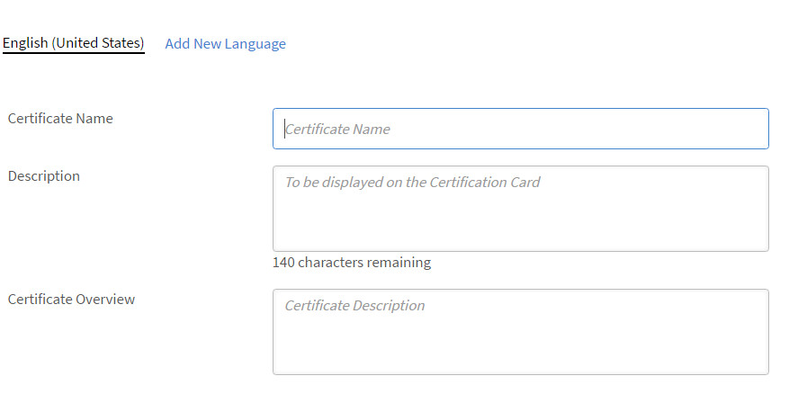

# Añadir objetos de aprendizaje en diferentes configuraciones regionales

Lea este tema para obtener información sobre cómo añadir cursos, certificaciones y planes de aprendizaje en diferentes idiomas.

Como autor, tiene la posibilidad de crear objetos de aprendizaje como cursos, certificaciones o planes de aprendizaje. Estos objetos de aprendizaje también se pueden crear en diferentes idiomas.

Learning Manager le permite crear objetos de aprendizaje en varios idiomas. Puede añadir el contenido o los metadatos en otros idiomas cuando crea el objeto de aprendizaje. También puede editar los detalles del objeto de aprendizaje en cualquier momento y ofrecerlo en otros idiomas.

Para añadir un nuevo idioma, haga clic en el curso, la certificación o el plan de aprendizaje para el cual desea añadir las nuevas configuraciones regionales. En la página Información básica, haga clic en Añadir nuevo idioma en la parte superior.

*Añadir un nuevo idioma*

En el cuadro de diálogo emergente, seleccione el idioma o los idiomas adicionales que desea ofrecer a los alumnos, y haga clic en Guardar.

*Seleccione un idioma*

Vuelva a publicar su curso para que los cambios surtan efecto.
