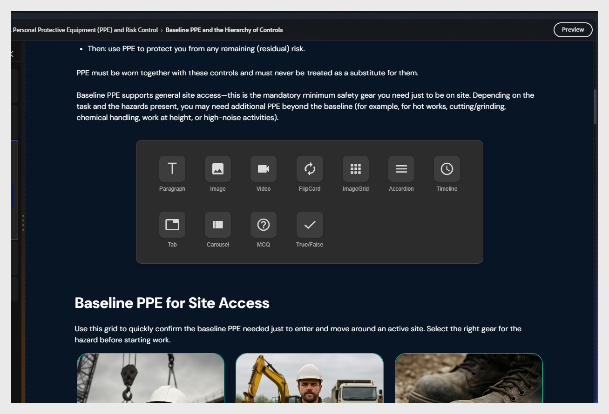
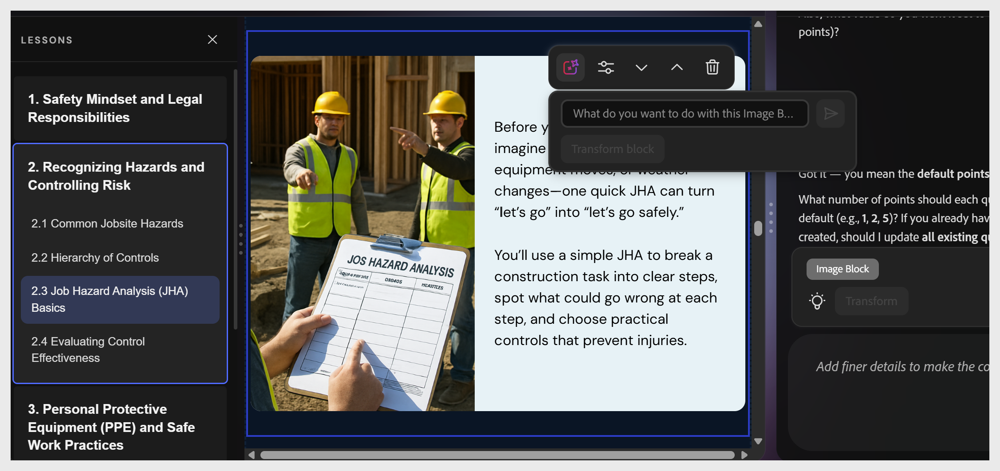

# Añadir un componente de contenido

Seleccione entre dos elementos existentes. Aparece el botón +. Selecciónelo para abrir el selector de componentes.

Componentes disponibles:

| **Componente** | **Usar para** |
|----------------|---------------------------------------------------|
| **Párrafo** | Texto del cuerpo y explicaciones |
| **Imagen** | Ilustraciones, capturas de pantalla, diagramas |
| **Vídeo** | Vídeo MP4 incrustado o vinculado |
| **Voltear tarjeta** | Término o pares de definiciones, revelar interacciones |
| **Cuadrícula de imágenes** | Varias imágenes en un diseño de cuadrícula |
| **Acordeón** | Secciones ampliables, procedimientos paso a paso |
| **Cronología** | Eventos secuenciales o pasos del proceso |
| **Tabulador** | Contenido paralelo - comparaciones, variantes regionales |
| **Carrusel** | Serie de imágenes o tarjetas de contenido que se pueden desplazar |
| **MCQ** | Comprobación de conocimientos en línea sin graduar |
| **Verdadero/Falso** | Comprobación en línea verdadera o falsa sin graduar |

>[!NOTE]
>
>Usa **Acordeón** para los procedimientos paso a paso en los que los alumnos se benefician de controlar su ritmo. Usar **Flip Card** para contenido de términos o definiciones.

## Mover bloques de contenido dentro de un tema

Puede reordenar bloques de contenido dentro de un tema mediante las opciones de edición de la barra de herramientas o la IA.

