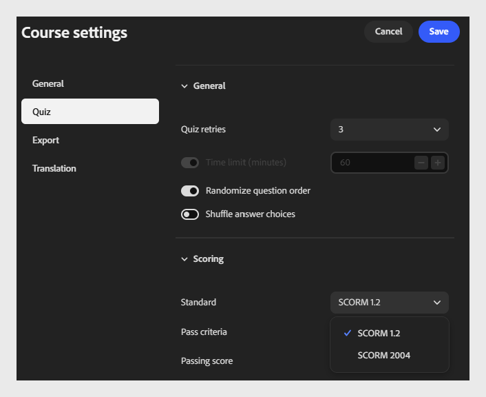

# Configurar opciones de prueba

Seleccione **Prueba** para configurar el comportamiento de la prueba y su puntuación.

Esta pestaña tiene dos secciones: **General** y **Puntuación**.

## Sección General

- **Reintentos de prueba**: Elija el número de intentos de un alumno para completar la prueba. Por ejemplo, seleccione **3** para permitir hasta 3 intentos.
  

- **Límite de tiempo (minutos)**: Seleccione el botón de alternancia para habilitar un límite de tiempo y, a continuación, introduzca la duración en minutos. Por ejemplo, introduzca **60** para que los alumnos tengan 60 minutos para completar la prueba.

- **Aleatorizar orden de preguntas**: Seleccione el botón de alternancia para mostrar las preguntas de cada alumno en un orden aleatorio.
  

- **Mezclar las opciones de respuesta:** Seleccione el conmutador para mezclar las opciones de respuesta para cada pregunta.
  

## Sección Puntuación

- **Estándar**:

Seleccione la versión de SCORM utilizada para informar de los resultados de las pruebas al LMS. Elija la versión que coincida con los requisitos de compatibilidad de su LMS.
Por ejemplo, seleccione **SCORM 1.2**.

>[!NOTE]
>
>Si no estás seguro de qué versión de SCORM elegir, consúltalo con tu administrador de LMS.

