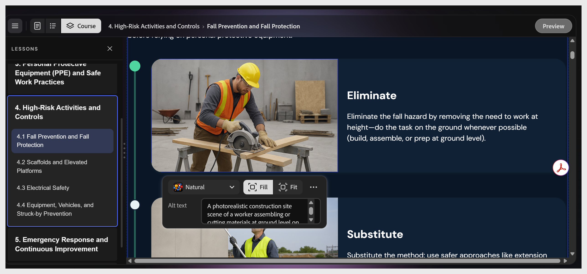

# Editar o añadir una imagen

Seleccione cualquier imagen para abrir la barra de herramientas de imágenes. Los controles incluyen:

- **Rellenar**, **Ajustar:** el tamaño de la imagen dentro de su marco

- Campo **Texto alternativo**: muestra la descripción de la imagen. 
  **Nota**: Este texto no se puede modificar. Se actualiza automáticamente según la imagen.

- Icono **Más opciones**: **ajusta** el brillo, la saturación y la transparencia de la imagen.

Para reemplazar la imagen, seleccione el icono **image** para cambiar la imagen. Carga tu propio archivo, busca en Adobe Stock o genera uno con IA.
