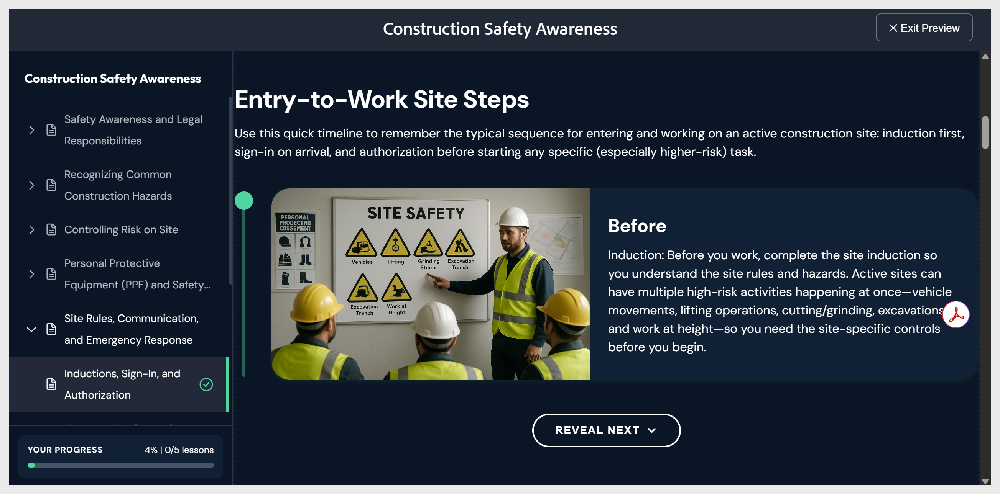

# Vista previa del curso

- Seleccione **Vista previa** en la barra de herramientas superior. El curso se muestra exactamente como lo verá un alumno, con el tema aplicado, los componentes interactivos y la prueba en el modo de respuesta.

- Navega usando **Siguiente** y **Anterior**, o selecciona cualquier tema en el panel de la lección de la izquierda. Seleccione **Salir de vista previa** en la esquina superior derecha para volver a la edición.
