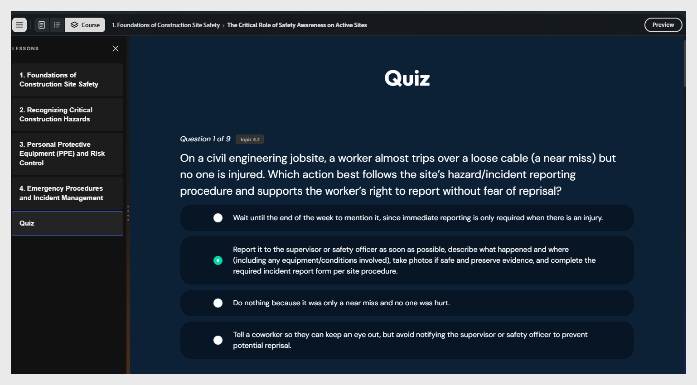

# Revisar y editar la prueba

Al final del curso aparece una prueba calificada. Cada pregunta se etiqueta con el tema que prueba.

>[!NOTE]
>
>Las comprobaciones de conocimientos incorporadas en las lecciones no se califican. Solo se califica la prueba de fin de lección.

Para editar una pregunta:

1. Seleccione el texto de la pregunta para editarlo y utilice las opciones de edición de texto para ajustar el estilo.
   

2. Seleccione el botón de opción junto a la opción que desea marcar como correcta.

3. También puede asignar una puntuación a la respuesta correcta.
   

4. Para eliminar una pregunta, seleccione **Quitar opción**.

5. Para volver a generar las preguntas, pregunte al asistente: &quot;Volver a generar el cuestionario para la Lección 1&quot;.
