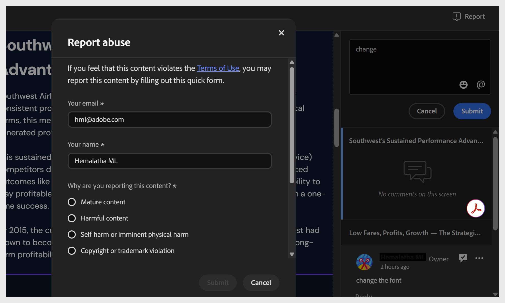

# Revisar y comentar un proyecto compartido

Cuando se comparte un proyecto para su revisión, puede acceder al curso como revisor a través del vínculo compartido por el autor.

1. Abra el vínculo de revisión compartido con usted.

2. En el panel **Comentarios** de la derecha, seleccione cualquier componente del curso que necesite cambios. El nombre del componente aparece en la parte superior del campo de comentarios, por lo que sus comentarios permanecen vinculados a la parte correcta del curso. Añade tu comentario debajo.

   

   En el panel **Comentarios**, puede:
   * Agregar, editar, eliminar, responder y resolver comentarios.
   * Ver comentarios de otros revisores.
   * Utilice **@** para mencionar al propietario del proyecto u otro revisor (solo si ha iniciado sesión con su Adobe ID).
   * Añade emojis en tus comentarios.
   * Ver todos los comentarios sobre el curso: de forma predeterminada, el panel Comentarios muestra los comentarios solo del componente del curso que se está viendo en ese momento. Active el botón deslizante Todos los comentarios de la pantalla para ver todos los comentarios de todo el proyecto, independientemente del componente o pantalla en el que se encuentre.

   

   * Filtrar comentarios por el estado **Revisores**, **Hora** y **Resuelto**.

   

3. Selecciona **Enviar** para publicar tu comentario o **Cancelar** para descartarlo.

## Informar de contenido ofensivo

Si encuentra contenido que infringe las [Condiciones de uso](https://www.adobe.com/legal/terms.html) de Adobe mientras revisa un curso de Compositor de contenido compartido, puede informar de ello.

Seleccione **Informe** en la parte superior derecha y rellene el formulario. También puede informar de un abuso por correo electrónico a [abuse@adobe.com](mailto:abuse@adobe.com). 

