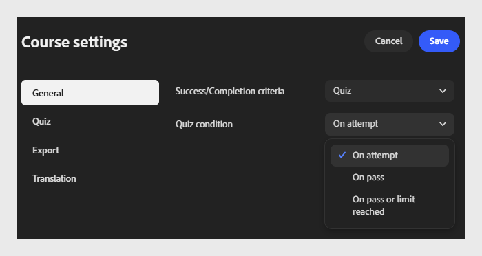

# Definir criterios de finalización y éxito

## Criterios de finalización

**Criterios de finalización**: Seleccione el menú desplegable y elija cuándo se marca el curso para completarse.

- **Inicio:** marca el curso como completado en cuanto un alumno lo abre, independientemente de lo mucho que vea.
  

- **Vista mínima %:** marca el curso completado una vez que un alumno ve el porcentaje especificado del contenido del curso.
  

- **Prueba: marca el curso como completado en función de la actividad de prueba del alumno. Seleccionar una condición de prueba:**

  - **En el intento:** marca como completado en cuanto el alumno intenta realizar la prueba, independientemente del resultado.

  - **En aprobado:** marcas completadas solo cuando el alumno aprueba la prueba.

  - **Al pasar o al límite alcanzado:** marca como completado cuando el alumno pasa o alcanza el número máximo de intentos permitido, lo que ocurra primero.
    

## Criterios de éxito

**Los criterios de éxito** determinan si un alumno se ha aprobado o no después de realizar el curso. A diferencia de los criterios de finalización, los criterios de éxito se basan en la puntuación.

>[!NOTE]
>
>Las opciones disponibles dependen de la versión de SCORM seleccionada en **Configuración de exportación**. Si selecciona **SCORM 1.2**, los criterios de finalización y éxito se combinan en una sola configuración. Si selecciona **SCORM 2004**, los criterios de finalización y éxito aparecen como configuraciones independientes, como se describe a continuación.*

- **Criterios de éxito**: Seleccione el menú desplegable y elija cómo mide el éxito el curso.

- **Inicio:** marca al alumno como aprobado simplemente iniciando el curso.
  

- **Vista mínima %**: marca al alumno como aprobado una vez que ve el porcentaje de contenido especificado. Por ejemplo, introduzca 80 para que los alumnos vean al menos el 80 % del curso.
  

- **Prueba:** marca al alumno como aprobado o suspendido en función de si su puntuación de prueba alcanza el umbral de puntuación de aprobado. Seleccione una condición de prueba:

  - **Al intentar: se marca como correcto en cuanto el alumno intenta realizar la prueba.**

  - **En pase: marca como correcto solo cuando el alumno aprueba la prueba.**

  - **Al pasar o al límite alcanzado: marca como correcto cuando el alumno supera o alcanza el máximo de intentos permitido.**

  

>[!NOTE]
>
>Un alumno puede completar un curso pero, aun así, suspenderlo, por ejemplo, si finaliza todo el contenido pero no obtiene la puntuación suficiente en la prueba. Los criterios de conclusión y éxito son independientes; establezca ambas cuidadosamente en función de cómo desee realizar el seguimiento del progreso y el rendimiento del alumno. Cuando seleccione Prueba para cualquiera de los criterios, configure los reintentos de prueba y apruebe la puntuación en la pestaña **Configuración de prueba**.

## Por qué los criterios de finalización y éxito son importantes para la creación de informes

- Los criterios de finalización controlan cuándo el estado de un alumno cambia a Completado en transcripciones de ALM, paneles de finalización y cualquier exportación de cumplimiento o auditoría extraída del LMS: miden el progreso, no el rendimiento.

- Los criterios de éxito controlan el valor de Aprobado/Suspenso registrado junto con el estado de finalización: el valor en el que confían la mayoría de los informes de cumplimiento y certificación.

- Si los criterios de finalización y éxito también se configuran en la biblioteca de contenido de **Adobe Learning Manager** para el mismo módulo, esa configuración tiene prioridad sobre la establecida en Content Composer. Decida con antelación qué producto debe tener estas reglas y evite establecer valores conflictivos en ambos lugares.

- Ajuste los criterios a lo que necesita probar: El porcentaje de inicio o de vista mínima es suficiente para el contenido de conocimiento, mientras que los criterios basados en pruebas proporcionan un registro defendible de que un alumno ha demostrado conocimiento, no solo de que ha abierto el curso.
