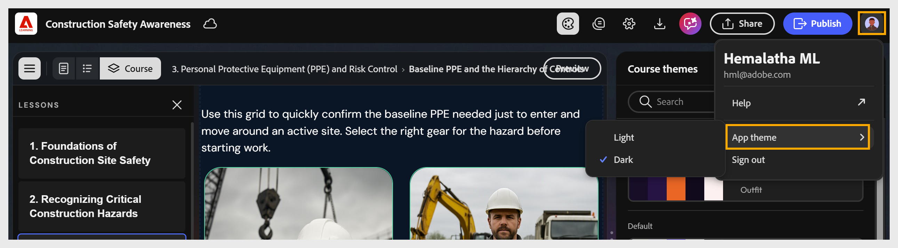

# Definir el modo claro u oscuro para el curso

<!--Select **light/dark** mode in the toolbar to toggle between modes. Content Composer updates the canvas to reflect the selected mode.-->

Seleccione [!UICONTROL menú Cuenta] > [!UICONTROL Aplicar tema] > modo claro u oscuro. Compositor de contenido actualiza el lienzo para reflejar el modo seleccionado.

