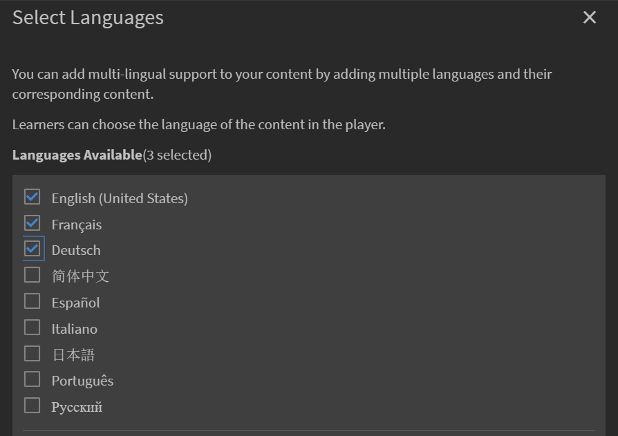

# Biblioteca de contenido

Obtenga información sobre cómo crear contenido para alinear con cursos como contenido de ritmo personalizado.

## Biblioteca de contenido {#contentlibrary}

El contenido es el elemento básico de un curso. Los autores crean una biblioteca de contenido que pueda alinearse con los cursos como contenido con ritmo personalizado. Los únicos que tienen acceso a esta biblioteca de contenido son los autores.

## Tipos de contenido admitidos {#supported}

Puede cargar contenido tanto estático como interactivo en la biblioteca.

En la tabla siguiente se muestra el tipo de archivos estáticos e interactivos que puede cargar en la biblioteca.

<table>
 <tbody>
  <tr>
   <td>
    
<b>Contenido interactivo</b>
</td>
   <td>
    
<b>Tipo de contenido</b>
</td>
   <td>
    
<b>Extensiones</b>
</td>
  </tr>
  <tr>
   <td>
    
 
</td>
   <td>
    

    <ul>
     <li>SCORM 1.2</li>
     <li>SCORM 2004</li>
     <li>AICC</li>
     <li>TinCan</li>
    </ul>
    

</td>
   <td>
    
zip
</td>
  </tr>
  <tr>
   <td>
    
<b>Contenido estático</b>
</td>
   <td>
    
<b>Tipo de contenido</b>
</td>
   <td>
    
<b>Extensiones</b>
</td>
  </tr>
  <tr>
   <td>
    
 
</td>
   <td>
    
Vídeo
</td>
   <td>
    
mp4, wmv, 3gp, 3g2, 3gp2, asf, avi, f4v h264, mpe, mpeg, mpg, mpg2, m4v, mov, wmv
</td>
  </tr>
  <tr>
   <td>
    
 
</td>
   <td>
    
Audio
</td>
   <td>
    
mp3, wav, aac, m4a, wma, vorbis, pcm, eac3, amr, ac3
</td>
  </tr>
  <tr>
   <td>
    
 
</td>
   <td>
    
PDF
</td>
   <td>
    
pdf
</td>
  </tr>
  <tr>
   <td>
    
 
</td>
   <td>
    
MS PowerPoint
</td>
   <td>
    
pptx, ppt
</td>
  </tr>
  <tr>
   <td>
    
 
</td>
   <td>
    
MS Word
</td>
   <td>
    
docx, doc
</td>
  </tr>
  <tr>
   <td>
    
 
</td>
   <td>
    
MS Excel
</td>
   <td>
    
xlsx, xls
</td>
  </tr>
 </tbody>
</table>

## Añadir nuevo contenido en la biblioteca {#addnewcontentinthelibrary}

Como se indica en la sección anterior, puede añadir contenido tanto estático como interactivo en la biblioteca.

## Añadir contenido estático {#addstaticcontent}

1. Haga clic en Biblioteca de contenido en el panel izquierdo tras iniciar sesión como autor; a continuación, haga clic en Añadir.

   O, si lo desea, haga clic en Crear contenido en la página Introducción.

1. En el campo Nombre, especifique un nombre para el contenido que desea cargar.
1. En el campo Descripción, escriba la descripción del contenido. Asegúrese de que la descripción sea significativa. El límite de caracteres es de 400.
1. Para cargar el contenido, haga clic en Añadir archivo de contenido y cargue el archivo de recursos. Al añadir contenido para varios idiomas, no puede combinar contenido estático e interactivo en un solo grupo. O bien todo el contenido en todas las configuraciones regionales debe ser estático, o bien todo el contenido debe ser interactivo.

   Si desea reemplazar el contenido, puede reemplazar un contenido estático con un contenido estático diferente. Lo mismo se aplica al contenido interactivo.

1. En el campo Duración, tiene la opción de introducir el tiempo que se espera que un alumno dedique al módulo. La duración se indica en minutos.

   El tiempo de aprendizaje empleado por el alumno se calcula en función de la duración especificada si el alumno ha marcado el curso como completado. Si el alumno consume el contenido en el reproductor, el tiempo que pasa en él se añade al tiempo dedicado al aprendizaje. Si el tiempo de contenido real es menor que la duración especificada, no ocurre nada, ya que el reproductor siempre respeta el tiempo de visualización del contenido.

1. En el campo Etiquetas de contenido, especifique las etiquetas para el contenido cargado, para que se pueda detectar.

   Un autor puede utilizar estas etiquetas para buscar el contenido al añadir el contenido al curso.

### Versiones {#versioning}

La biblioteca de contenido también mantiene las versiones del contenido cargado. Si realiza algún cambio en el contenido, por ejemplo, una presentación de PowerPoint, y vuelve a cargar el PPT en la biblioteca, el número de versión se incrementa en uno. Esto le ayuda a realizar un seguimiento de los cambios en el contenido.

## Añadir contenido interactivo {#addinteractivecontent}

1. Haga clic en Biblioteca de contenido en el panel izquierdo tras iniciar sesión como autor; a continuación, haga clic en Añadir.

   O, si lo desea, haga clic en Crear contenido en la página Introducción.

1. En el campo Nombre, especifique un nombre para el contenido que desea cargar.
1. En el campo Descripción, escriba la descripción del contenido. Asegúrese de que la descripción sea significativa. El límite de caracteres es de 245.
1. Para cargar el contenido, haga clic en Añadir archivo de contenido y cargue el archivo de recursos. Al añadir contenido para varios idiomas, no puede combinar contenido estático e interactivo en un solo grupo. O bien todo el contenido en todas las configuraciones regionales debe ser estático, o bien todo el contenido debe ser interactivo.

* [Tipos de archivo compatibles](content-library.md#supported)*

  El contenido interactivo puede ser un proyecto publicado de Captivate, SCORM o AICC. El archivo debe ser un archivo zip.

  También puede agregar contenido HTML generado desde Captivate, Presenter o Presenter Video Express.

[Tipos de archivo admitidos](content-library.md#supported)

1. Learning Manager admite subtítulos para contenido de vídeo cargado en esta aplicación. Ahora, los autores pueden cargar el archivo que contiene los subtítulos junto con el archivo de vídeo.

   A continuación, los alumnos podrán ver los subtítulos durante la reproducción del módulo de vídeo.

   El formato admitido es  [Pistas de texto de vídeo web (WebVTT)](https://www.w3.org/TR/webvtt1/).

   La compatibilidad con los subtítulos está disponible para el contenido de vídeo cargado en la biblioteca de contenido de Learning Manager.

   Como autor, cuando cargue contenido de vídeo o audio, también puede cargar el archivo .vtt que contiene los subtítulos.

   A continuación, los subtítulos aparecen en el reproductor Fluidic. Los subtítulos también son compatibles con [Estándares WCAG2.0](https://www.w3.org/TR/WCAG20/).

   Al añadir contenido de vídeo a la biblioteca, también puede añadir el archivo vtt, que **debe** ser un archivo válido.

   

   *Agregar un archivo webvtt*

   El archivo VTT cargado se corresponde con la versión existente del contenido. Por lo tanto, el archivo WebVTT cargado no se vincula a la versión anterior del contenido.

   Si está creando contenido en diferentes idiomas, puede cargar un archivo WebVTT diferente para cada idioma. Los alumnos podrán ver los subtítulos correspondientes al idioma seleccionado durante la reproducción.

   >[!NOTE]
   >
   >   Un archivo VTT admite un idioma. Para admitir varios idiomas, cargue varios archivos de vídeo para cada idioma del contenido y, a continuación, cargue el archivo VTT correspondiente para cada archivo de vídeo.

   Como autor, cada vez que cambie el contenido, el vídeo o el audio, Learning Manager le solicitará un nuevo archivo vtt.

   Después de añadir este contenido a un curso y previsualizarlo como alumno, puede ver los subtítulos en el vídeo.

   Active el botón CC del reproductor Fluidic para que se muestren o se oculten los subtítulos.

   La misma vista está presente en la **aplicación del alumno** y en la **Vista previa como alumno**.

   Cuando usted **agregar, actualizar o eliminar** en el archivo vtt, recibirá una notificación.
La compatibilidad con WebVTT no está disponible para:

   1. Anuncios de vídeo.
   1. Vídeo reproducido en el contenido de aprendizaje electrónico. Esta acción la controla el contenido.
   1. Vídeo cargado en Aprendizaje social.
   1. Vídeo creado en la aplicación Learning Manager para escritorio
   1. Contenido de vídeo creado mediante el proceso de migración.
   1. Reproducción de vídeo en una aplicación para dispositivos móviles en el modo sin conexión.

1. En el campo Duración, tiene la opción de introducir el tiempo que se espera que un alumno dedique al módulo. La duración se indica en minutos.
1. En el campo Etiquetas de contenido, especifique las etiquetas para el contenido cargado, para que se pueda detectar.

### Compatibilidad con catálogos compartidos

Si una cuenta de vendedor comparte un catálogo que contiene los cursos y estos contienen los módulos, el audio o el vídeo con los subtítulos, los cursos deben tener el mismo comportamiento en la cuenta del comprador.

La propagación de los módulos debe funcionar correctamente de la cuenta de vendedor a la del comprador. Esto puede incluir: editar/eliminar/añadir el archivo vtt en el módulo.

Una vez que haya subido el contenido, puede ver una notificación. Para ello, haga clic en el icono de campana ubicado en la esquina superior derecha de la página. Recibirá una notificación cada vez que modifique el contenido y lo vuelva a cargar. Si es la persona que realiza los cambios, solo usted obtendrá la notificación, no los demás autores.

## Cree una prueba

Cree evaluaciones en Adobe Learning Manager con la nueva herramienta de creación de pruebas de la página Biblioteca de contenido. Las evaluaciones creadas pasan a formar parte de la biblioteca de contenido y se pueden añadir a una carpeta &quot;pública&quot; para reutilizar el curso.

1. Seleccione Biblioteca de contenido en el panel izquierdo.
1. En la esquina superior derecha de la pantalla, seleccione **Agregar > Prueba**.
1. En la página Crear prueba, escriba el nombre y la descripción de la prueba.
1. En la sección Contenido de la prueba, seleccione **Añadir pregunta de prueba**.
1. En el cuadro de diálogo Pregunta de prueba, seleccione el tipo de pregunta. Existen tres tipos de preguntas:
   * Pregunta de opción múltiple
   * Verdadero o falso
   * Rellenar los espacios en blanco
1. Introduzca la pregunta y seleccione la respuesta correcta.
1. Establezca los puntos para la prueba.
1. Si desea que la pregunta se responda correctamente para aprobar la prueba, seleccione la casilla de verificación **Es obligatorio responder correctamente para aprobar la prueba**.
1. Seleccione **Guardar y cerrar**.
1. Introduzca los puntos para aprobar la prueba en el **Criterios de aprobación** campo.
1. Si desea que un alumno vea una respuesta correcta, active el botón deslizante **Mostrar respuestas correctas** a los alumnos después de la prueba.
1. Si desea que las preguntas y las respuestas aparezcan de forma aleatoria, active los conmutadores:
   * Ordenar las preguntas de forma aleatoria
   * Ordenar las opciones de respuesta de forma aleatoria
1. Especifique una carpeta para añadir la prueba y conseguir que esta esté disponible para todos los autores.
1. En la **Duración** , especifique el tiempo que el alumno debe dedicar a la prueba.
1. Especifique una etiqueta de la lista de etiquetas creadas.
1. Añada un logotipo y un fondo a la prueba.
1. En la esquina superior derecha de la página, seleccione **Publicar**.

La prueba se añade a la biblioteca de contenido. Como cualquier contenido de la biblioteca, puede retirar una prueba y, a continuación, eliminarla.

## Añadir a carpeta {#add-folder}

Después de que un administrador cree las carpetas de contenido, usted, como autor, puede cargar contenido en una de estas carpetas para que solo esté visible para usted o para un grupo seleccionado de autores de la cuenta. También puede hacer público el contenido a fin de que esté visible para todos los autores de la cuenta.

**Uso de ejemplo**

Por ejemplo, las agencias desean mantener un control total del contenido y alguien que pasa por alto el contenido debe tener acceso a todo el contenido. Al mismo tiempo, los creadores de contenido de las agencias deben tener acceso solo a su propio contenido y, en algunos casos, al contenido de otra persona.

La biblioteca de contenido con contenido existente (es decir, contenido cargado antes de configurar las carpetas de contenido) se define como **Carpeta pública**. Esta carpeta no se puede retirar ni eliminar. El contenido que forma parte de la carpeta pública está accesible para todos los tipos de autores. Una vez configuradas las carpetas de contenido, los autores estándar y personalizados deben seleccionar la carpeta en la que se debe colocar el contenido al cargar contenido nuevo.

>[!NOTE]
>
>Las carpetas públicas y privadas se excluyen mutuamente. Esto significa que el contenido **no** se asociarán a la carpeta pública y a la carpeta privada al mismo tiempo. Se puede asociar a una carpeta pública, **o** se puede asociar a una o varias carpetas privadas en cualquier momento.

Al añadir contenido, puede elegir la carpeta en la que se incluirá este.

*Añadir contenido a una carpeta*

Si elige **Público**, el contenido estará visible para todos los autores. Todo el contenido que existiera en la cuenta y que no forme parte de ninguna carpeta se incluirá en la carpeta pública de forma predeterminada.

Tenga en cuenta que las carpetas de contenido son simplemente compartimentos virtuales para vincular el contenido. En el caso de que un contenido se coloque en dos carpetas, significa que el archivo de contenido siempre es un único archivo pero está vinculado a varias carpetas. Por lo tanto, en caso de que el contenido lo actualice el autor-personalizado-1 que tiene acceso a la carpeta-personalizada-1, el mismo contenido actualizado también se reflejará en la carpeta-personalizada-2 a la que tiene acceso el autor-personalizado-2.

En la biblioteca de contenido, hay dos opciones para administrar las carpetas de contenido:

**Todas las carpetas**

Es una lista que muestra todas las carpetas creadas en la cuenta.

*Ver todas las carpetas*

**Todos los autores**

Es una lista que muestra los autores que han creado contenido y lo han cargado en la biblioteca.

*Ver todos los autores*

Esto está disponible **solo** cuando un administrador crea una carpeta nueva.

## Mover contenido a la carpeta {#movecontenttofolder}

Para mover el contenido de una carpeta pública a cualquier carpeta privada:

1. Seleccionar **Público** de la carpeta **Todas las carpetas** lista desplegable.

   

   *Ver todo el contenido cargado*

1. Elija el contenido que desea mover a una carpeta. A continuación, haga clic **[!UICONTROL Acciones]** > **[!UICONTROL Organizar contenido]** > **[!UICONTROL Mover contenido a la carpeta]**.

   

   *Mover el contenido seleccionado a la carpeta*

1. Elija la carpeta a la que desee mover el contenido. Haga clic en **[!UICONTROL Mover]**.

## Copiar contenido en la carpeta {#copycontenttofolder}

Copiar una carpeta significa que estaría agregando una etiqueta a la carpeta. La operación de copia no creará copias de contenido, sino que solo agregará una asociación con las carpetas especificadas.

*Copiar una carpeta*

## Desvincular carpeta {#unlinkfolder}

Desvincular significa quitar el contenido de la carpeta seleccionada.

El contenido se puede desvincular de una carpeta especificada **SOLO** si también está asociado a otras carpetas. Si el contenido que se va a desvincular solo está asociado a una carpeta, es recomendable utilizar la operación MOVER.

>[!NOTE]
>
>El menú Organizar, en Acciones, está desactivado inicialmente. Para utilizarlo, primero debe seleccionar una carpeta en la lista desplegable de carpetas.

*Desvincular una carpeta*

## Añadir contenido para diferentes idiomas {#addcontentfordifferentlanguages}

1. Para añadir el contenido para diferentes idiomas, haga clic en el **Añadir nuevo idioma** y elija los idiomas correspondientes. Gracias a esto, puede añadir soporte multilingüe para su contenido.

   

   *Añadir nuevo idioma a un contenido*

1. Repita el proceso de carga de contenido para los nuevos idiomas.
1. Si desea eliminar un idioma, haga clic en la pestaña Añadir nuevo idioma y borre la selección.

   Una vez que haya realizado los cambios, haga clic en Guardar. En la biblioteca, el nuevo contenido ahora está disponible para su uso.

## Establecer criterios de finalización {#setcompletioncriteria}

<table>
 <tbody>
  <tr>
   <td>
    
<b>Contenido estático</b>
</td>
   <td>
    
<b>Contenido interactivo</b>
</td>
  </tr>
  <tr>
   <td>
    
Solo puede establecer el criterio de <b>finalización</b> para el contenido de las opciones siguientes:

    <ul>
     <li>Al iniciar contenido</li>
     <li>Basado en porcentaje mínimo requerido</li>
    </ul></td>
   <td>
    
Puede establecer los criterios de <b>finalización</b> y <b>éxito</b> para el contenido de las opciones siguientes:

    <ul>
     <li>Al iniciar contenido</li>
     <li>Basado en porcentaje mínimo requerido</li>
     <li>Opciones de prueba superada o intentada</li>
    </ul>
    
<b>NOTA:</b> Solo se puede editar el contenido del HTML de Captivate, Presenter Video Express o Presenter.
</td>
  </tr>
 </tbody>
</table>

Después de agregar el contenido, puede modificar los criterios de finalización del contenido.

En Learning Manager, se otorgan insignias y aptitudes en función de los criterios de éxito y finalización. Si el alumno ha completado un curso, pero no lo ha superado con éxito, no recibe la insignia ni la aptitud correspondientes al objeto de aprendizaje.

Por ejemplo, si ha utilizado Adobe Captivate para crear su curso y configurado los parámetros de aprendizaje en el cuadro de diálogo Preferencias, la misma configuración se migra a Learning Manager en las opciones de Criterios de finalización.

En la sección Criterios de finalización, puede configurar las opciones que se mencionan a continuación:

**Al iniciar contenido:** Si activa esta opción, define los criterios de finalización para el contenido cuando un alumno abre el contenido.

**Basado en porcentaje mínimo requerido:** Defina un valor como porcentaje mínimo de consumo para el alumno. Por ejemplo, si establece un porcentaje de 50, el alumno puede consumir el 50 % del contenido y aún así cumplir los criterios de finalización.

**Prueba:** Elija uno de los criterios siguientes:

* **Prueba superada:** El estado solo se reporta como completado si el alumno supera la prueba.
* **Prueba intentada:** El estado se reporta como completado si los alumnos intentan realizar la prueba, al margen de si la superan o no.
* **Prueba superada o límite alcanzado:** El estado se reporta como completado si los alumnos superan la prueba o han realizado todos los intentos posibles. Por ejemplo, si el número de intentos establecidos en el curso es de dos, y:

   * Si los alumnos realizan el primer intento y aprueban, el estado se notifica como Completado y Aprobado.
   * Si los alumnos realizan el primer intento y fallan, el estado se notifica como Incompleto y Fallido , ya que el límite de intentos sigue sin alcanzarse.
   * Si los alumnos vuelven a realizar la prueba y suspenden, el estado se indica como Completado y Suspendido.
   * Si los alumnos vuelven a intentar la prueba y la aprueban, el estado se indica como Completado y Aprobado.

## Establecer criterios de éxito {#setsuccesscriteria}

Del mismo modo, puede definir los criterios de éxito para el curso. Un criterio de éxito indica que el rendimiento de un alumno es Aprobado o Suspendido. Si ha creado un curso en Captivate, puede establecer los criterios de éxito para el curso en el cuadro de diálogo Preferencias, como se muestra a continuación:

Por ejemplo, ha subido un módulo que tiene una prueba. Ha establecido los Criterios de finalización para ese módulo en Al iniciar contenido y los Criterios de éxito en Prueba superada.

Si el alumno ha iniciado el curso y ha fallado la prueba, el curso se marcará como Completado; sin embargo, los Criterios de éxito solo se cumplen cuando el alumno supera la prueba.

## Opciones de filtro de contenido {#contentfilteroptions}

### Ordenar por fecha {#sortaccordingtodate}

Organice el contenido de acuerdo con la fecha en que se modificó por última vez. Puede ordenar el contenido en orden ascendente o descendente.

*Ordenar contenido por fecha*

### Ordenar por uso {#sortaccordingtousage}

Organice el contenido en función de si se está utilizando en algún curso. En el menú desplegable Tipo, elija En uso o Sin usar.

*Ordenar contenido por uso*

## Buscar contenido {#searchforcontent}

En la Biblioteca de contenido, puede buscar contenido eligiendo su nombre o las etiquetas asociadas con él.

En la barra de búsqueda, escriba el nombre de un curso o una etiqueta, y podrá ver las recomendaciones.

<!---->

## Retirar contenido {#retirecontent}

Una vez que publica un contenido, no puede eliminarlo. Primero es necesario retirar el contenido. Cuando marca contenido como retirado, ya no está visible para los alumnos. El contenido también pasa a la sección Retirado. También puede pasar el contenido al estado publicado más tarde.

Para retirar contenido, siga estos pasos:

* En la Biblioteca de contenido, seleccione el contenido que desea retirar.
* Elija Acción > Retirar.

No afecta a contenidos que se utilicen en objetos de aprendizaje. Los alumnos pueden seguir accediendo al contenido.

## Volver a publicar contenido retirado {#republishretiredcontent}

Cuando retira contenido, puede volver a publicarlo y hacer que aparezca en la lista Publicado. Por ejemplo, si ha retirado la versión 1 de un contenido y desea reemplazarlo con la versión 2, puede mover version1.pptx, por ejemplo, a la lista Publicado y actualizar el archivo con version2.pptx. El nuevo archivo pasa a estar disponible para su uso en diversos cursos.

Para volver a publicar el contenido retirado:

1. Vaya a la pestaña **Retirado** y seleccione el contenido que desee volver a publicar.
1. Seleccionar **Acción** > **Volver a publicar**.

El contenido ahora aparece en la lista Publicado.

## Eliminar contenido {#deletecontent}

Después de haber retirado un contenido, puede eliminarlo.

* Vaya a la pestaña Retirado y seleccione el contenido que desea eliminar.
* Seleccione Acción > Eliminar.

Tenga en cuenta que los cursos que utilizan el contenido, que se eliminan de la biblioteca de contenido, seguirán utilizando el contenido.

## Preguntas más frecuentes {#frequentlyaskedquestions}

+++ ¿Cómo cargar contenido SCORM en Adobe Learning Manager?

Cree un curso de aprendizaje electrónico compatible con SCORM en cualquier herramienta, como Adobe Captivate, y publique el contenido como archivo zip. A continuación, en Learning Manager, cargue el archivo zip en el catálogo y establezca los criterios de finalización y éxito.
+++

+++¿Cómo cargo una nueva versión del mismo contenido en el Administrador de aprendizaje?

En Learning Manager, la biblioteca de contenido también mantiene las versiones del contenido cargado. Si realiza algún cambio en el contenido, por ejemplo, una presentación de PowerPoint, y vuelve a cargar la presentación en la biblioteca, el número de versión se incrementa en uno. Esto le ayuda a realizar un seguimiento de los cambios en el contenido. Se puede aplicar una nueva versión del contenido a todos los objetos de aprendizaje simultáneamente, o aplicar actualizaciones individuales para cada curso.
+++

+++Cómo editar los detalles de un curso en otro idioma?
Después de añadir uno o varios idiomas, como se describe en una sección anterior, haga clic en cada ficha de idioma y, a continuación, añada o edite la información del curso.

&lt;!----->
+++
