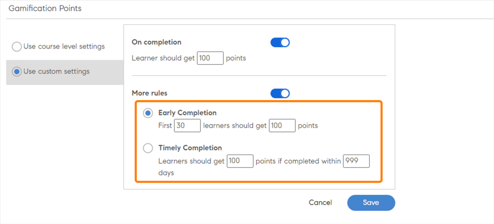
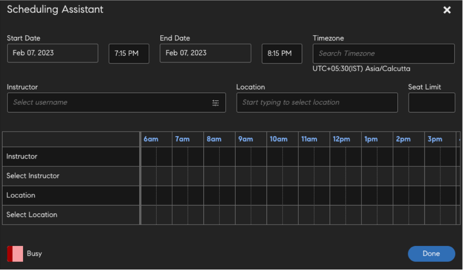
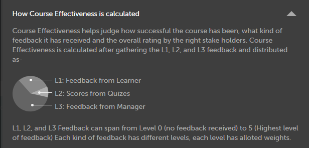

# Crear, modificar y publicar cursos

Lea este artículo para obtener información sobre cómo crear cursos, certificaciones y programas de aprendizaje en Learning Manager.

Los autores pueden crear objetos de aprendizaje como cursos, certificaciones y planes de aprendizaje. Los alumnos pueden consumir estos objetos de aprendizaje; por su parte, los administradores pueden realizar un seguimiento del progreso de los alumnos.

## Cursos en Learning Manager {#coursesincaptivateprime}

Adobe Learning Manager permite a los autores crear cursos mediante uno o más módulos relacionados con formación virtual, formación con ritmo personalizado, formación en clase y actividades. Los administradores pueden utilizar estos cursos para crear instancias de cursos, inscribir a alumnos, asignar insignias y habilitar comentarios de estos cursos. Mediante estos cursos, también pueden crear programas de aprendizaje, planes de aprendizaje y certificaciones.

Los autores pueden usar contenido de aprendizaje electrónico creado con cualquier herramienta de aprendizaje electrónico. Otros formatos de curso admitidos son archivos de vídeo, PDF, doc, docx, PPT y PPTX.

## Crear un curso: flujo de trabajo básico {#createacoursebasicworkflow}

Para crear un curso, siga los pasos a continuación:

1. Inicie sesión en Adobe Learning Manager como autor, ya que los autores son los únicos usuarios con derechos para crear cursos. A continuación, en la página Introducción, haga clic en **[!UICONTROL Crear cursos]**.
1. En la página **Vista previa del curso**, asigne un nombre al curso. A continuación, redacte una descripción breve de este curso, que se mostrará en la tarjeta del curso. La descripción tendrá 140 caracteres como máximo. Después, proporcione una descripción más detallada del curso, que se mostrará en la página Detalles del curso. La descripción tendrá 1500 caracteres como máximo.

   Como autor, puede ver la descripción de los módulos mientras añade el módulo a un curso.

1. Para que un curso esté disponible en otros idiomas, haga clic en Añadir nuevo idioma en la esquina superior izquierda de la página. Seleccione el idioma o los idiomas en los que desea que el curso esté disponible. Haga clic en **[!UICONTROL Guardar]**. Para obtener más información, consulte [Añadir contenido para diferentes idiomas](/help/migrated/authors/feature-summary/content-library.md).
1. **Modificar la configuración del curso**:

   1. En la página Configuración del curso, elija una aptitud para el curso. En la lista desplegable Aptitud, elija la aptitud requerida. A continuación, en la lista desplegable Nivel, elija el nivel requerido.
   1. Elija las aptitudes del curso, el nivel y defina los créditos de la aptitud. Si es necesario, añada más aptitudes.
   1. En la lista desplegable **Tipo de inscripción**, elija el tipo de inscripción.

   Estos son los tipos de inscripciones:

   * **Con nominación de responsable**: los responsables son los únicos que pueden nominar estos cursos. El alumno no puede inscribirse en este tipo de cursos.
   * **Aprobados por responsable**: los responsables aprueban estos cursos. Los alumnos pueden inscribirse en estos cursos, pero no se inscriben directamente en ellos sin la aprobación del responsable. Se envía una solicitud de notificación a los responsables cuando los alumnos se inscriben en estos tipos de cursos. Tras la aprobación del responsable, estos cursos figuran como inscritos para los alumnos.
   * **Inscripción automática**: los alumnos pueden inscribirse directamente en este tipo de cursos.

1. Para guardar los cambios, haga clic en **[!UICONTROL Guardar]**. Para publicar el curso, haz clic en **[!UICONTROL Publish]**.

## Crear un curso: flujo de trabajo avanzado {#createacourseadvancedworkflow}

1. Inicie sesión en Adobe Learning Manager como autor, ya que los autores son los únicos usuarios con derechos para crear cursos. A continuación, en la página Introducción, haga clic en **[!UICONTROL Crear cursos]**.
1. En la página **Vista previa del curso**, asigne un nombre al curso. A continuación, redacte una descripción breve de este curso, que se mostrará en la tarjeta del curso. La descripción tendrá 140 caracteres como máximo. Después, proporcione una descripción más detallada del curso, que se mostrará en la página Detalles del curso. La descripción tendrá 1500 caracteres como máximo.
1. Para que un curso esté disponible en otros idiomas, haga clic en Añadir nuevo idioma en la esquina superior izquierda de la página. Seleccione el idioma o los idiomas en los que desea que el curso esté disponible. Haga clic en **[!UICONTROL Guardar]**. Para obtener más información, consulte [Añadir contenido para diferentes idiomas](/help/migrated/authors/feature-summary/content-library.md).
1. **Modificar la configuración del curso**:

   1. En la página Configuración del curso, elija una aptitud para el curso. En la lista desplegable Aptitud, elija la aptitud requerida. A continuación, en la lista desplegable Nivel, elija el nivel requerido.
   1. Elija las aptitudes del curso, el nivel y defina los créditos de la aptitud. Si es necesario, añada más aptitudes.
   1. Añada las etiquetas de cumplimiento personalizadas al curso, si es necesario. Consulte [Agregar etiquetas de cumplimiento al curso/ruta de aprendizaje/certificación](/help/migrated/authors/feature-summary/courses.md#add-compliance-labels-to-courselearning-pathcertification).
   1. En la lista desplegable **Tipo de inscripción**, elija el tipo de inscripción.

   Estos son los tipos de inscripciones:

   * **Con nominación de responsable**: los responsables son los únicos que pueden nominar estos cursos. El alumno no puede inscribirse en este tipo de cursos.
   * **Aprobados por responsable**: los responsables aprueban estos cursos. Los alumnos pueden inscribirse en estos cursos, pero no se inscriben directamente en ellos sin la aprobación del responsable. Se envía una solicitud de notificación a los responsables cuando los alumnos se inscriben en estos tipos de cursos. Tras la aprobación del responsable, estos cursos figuran como inscritos para los alumnos.
   * **Inscripción automática**: los alumnos pueden inscribirse directamente en este tipo de cursos.

1. Elija si desea fijar un precio para el curso o hacerlo gratuito. Si desea que el curso sea de pago, elija la opción **[!UICONTROL De pago]** y especifique un precio. El precio aparecerá entonces en la tarjeta del curso y en la página Resumen del curso de un alumno.

   NOTA: Esto solo se activa cuando se configura el conector de Adobe Commerce.

1. Seleccione la casilla de verificación **Los alumnos pueden darse de baja** para que puedan darse de baja de su curso.

1. **Configuración de instancia**

   Si activa esta opción, los alumnos con el estado En curso pueden visitar otras instancias e inscribirse en ellas. Un alumno puede conservar el progreso de la instancia anterior.

   Después de publicar el curso, si vuelve a la página Configuración, la opción ya no se puede editar.

   Puede activar la opción para los siguientes tipos de curso:

   * Personalizado
   * Clase
   * Actividad
   * Mezclado

   Nota: Al duplicar un curso, si ha activado la opción Configuración de instancia en el curso de origen, la opción permanece desactivada en el curso de destino.

   **El conmutador de instancia no es compatible para**:

   * Cursos de pago
   * Cursos de tipo de inscripción con nominación de responsable.

   La configuración del conmutador de instancias no se propagará a las cuentas de igual a igual si se comparte a través del catálogo. La opción permanece desactivada en el curso de destino.

1. **Inscripciones múltiples**

   De este modo, puede inscribir alumnos en más de una instancia del curso en uno o varios períodos.

   Habilite el conmutador **Inscripción múltiple** para cambiar entre varias inscripciones de curso de un alumno. Si ha habilitado el Cambio de instancia, no es posible utilizar la opción de varias inscripciones.

1. Elija los requisitos previos de cursos que se deben completar antes de comenzar su curso. Haga clic en el campo Cursos y elija en la lista de cursos.
1. Habilite la casilla de verificación **Habilitar** **Requisitos previos** si los requisitos previos del curso deben ser obligatorios.
1. Añada palabras clave como etiquetas relacionadas con su curso. Estas etiquetas ayudan a los alumnos a encontrar su curso fácilmente durante la búsqueda. Todas estas etiquetas se añaden automáticamente según los módulos que hemos agregado. Si desea incorporar otras etiquetas a este curso, hágalo.
1. Añada palabras clave como etiquetas relacionadas con su curso. Estas etiquetas ayudan a los alumnos a encontrar su curso fácilmente durante la búsqueda. Todas estas etiquetas se añaden automáticamente según los módulos que hemos agregado. Si desea incorporar otras etiquetas a este curso, hágalo.
1. En el campo Retirar automáticamente , seleccione una fecha en la que se retira el curso. El administrador debe activar primero la opción Retirar automáticamente.
1. Para guardar los cambios, haga clic en **[!UICONTROL Guardar]**. Para publicar el curso, haz clic en **[!UICONTROL Publish]**.

### Añadir etiquetas de cumplimiento al curso/ruta de aprendizaje/certificación {#add-custom-compliance-label}

Para añadir etiquetas de cumplimiento a los cursos, siga estos pasos:

1. En la aplicación del autor, ve a **[!UICONTROL Cursos]**/**[!UICONTROL Rutas de aprendizaje]**/**[!UICONTROL Certificaciones]** y selecciona **[!UICONTROL Agregar]**.
1. Escriba el nombre y otros detalles, como la descripción o las aptitudes.
1. En el cuadro de texto **[!UICONTROL Cumplimiento personalizado]**, escriba y seleccione la etiqueta de cumplimiento.

   
   _Agregar cumplimiento personalizado_

   >[!IMPORTANT]
   >
   >Asegúrese de establecer una fecha límite para el curso cuando añada Cumplimiento personalizado.

   >[!NOTE]
   >
   >Un máximo de 50 cursos, rutas de aprendizaje o certificaciones puede tener el mismo valor para una etiqueta de tipo de conformidad personalizada.

1. Guarde y publique el curso/ruta de aprendizaje/certificación.
Ahora, el curso, la ruta de aprendizaje o la certificación se consideran un tipo de conformidad. Los administradores pueden añadir este curso al panel de cumplimiento y compartirlo con responsables para realizar un seguimiento del progreso

>[!NOTE]
>
>Los autores también pueden añadir las etiquetas de cumplimiento a un curso/ruta de aprendizaje/certificación existente editándolas.

## Puntos de interacción

Puede asignar puntos de interacción en los niveles de curso e instancia del curso. Con esta opción, puede conceder puntos a diferentes cursos o instancias. Se incentiva a los alumnos a realizar cursos específicos o a preferir una instancia de curso determinada sobre otras.

1. En el nivel de instancia del curso, seleccione **[!UICONTROL Puntos de interacción]**.


*Establecer puntos para interacción*

1. Seleccione **[!UICONTROL Editar]**.
1. Si selecciona Usar configuración de nivel de curso, se muestran las siguientes opciones:

   * **[!UICONTROL Al finalizar]**: seleccione este conmutador si desea que el alumno obtenga 100 puntos al completar un curso.
   * **Más reglas**

      * **[!UICONTROL Finalización anticipada]**: si selecciona esta opción, los 30 primeros alumnos recibirán 100 puntos al completar un curso.
      * **[!UICONTROL Finalización puntual]**: si selecciona esta opción, se conceden 100 puntos a los alumnos que completen un curso en un plazo de 999 días.

1. Si selecciona **[!UICONTROL Usar configuración personalizada]**, se muestran las siguientes opciones:

   * **[!UICONTROL Al finalizar]**: seleccione este conmutador si desea que el alumno obtenga 100 puntos al completar un curso.
   * **Más reglas**

      * **[!UICONTROL Finalización anticipada]**: si selecciona esta opción, puede determinar a cuántos alumnos se les concederán puntos específicos.
      * **[!UICONTROL Finalización puntual]**: si selecciona esta opción, puede determinar el número de puntos que se concederán a los alumnos que completen un curso en un periodo especificado.

   

   *Establecer finalización temprana y oportuna*

1. Seleccione **[!UICONTROL Guardar]**.

## Recursos de aprendizaje agregados

Un autor puede decidir si desea agregar los recursos de aprendizaje en el nivel de plan de aprendizaje o dejar que permanezcan en un nivel de curso individual.

Como autor, seleccione **[!UICONTROL Ruta de aprendizaje]** > **[!UICONTROL Configuración]**. Haga clic en **[!UICONTROL Editar]**.

En la sección **[!UICONTROL Resources]**, la casilla de verificación Mostrar recursos de curso constituyentes agregados en el nivel de ruta de aprendizaje, cuando esté habilitada, muestra si los recursos presentes en el nivel de curso se mostrarán en el nivel de ruta de aprendizaje.

>[!NOTE]
>
>En la página Configuración de una ruta de aprendizaje, un administrador también puede activar esta opción, que muestra los recursos presentes en el nivel del curso que se mostrarían en el nivel de ruta de aprendizaje.

## Asistente de programación

Gestiona conflictos en la reserva de los instructores y las clases. Si desea saber a qué hora y fecha está disponible un instructor antes de asignarlo al curso, utilice el Ayudante de programación.

Al crear un curso, para un curso de clase virtual o real, haga clic en Asistente de programación.


*Iniciar asistente de programación*

Se abrirá la ventana Asistente de Programación.



*Cuadro de diálogo Asistente de programación*

En el Asistente para programación, puede:

* Buscar instructores por sus nombres.
* Buscar instructores por sus aptitudes.

### Buscar instructores por sus nombres

En el campo Instructor, escriba el nombre del instructor o busque un nombre parcial de instructor. Aparecerá una lista de instructores, en la que podrá elegir uno.


*Buscar instructores*

Se pueden seleccionar varios instructores, pero solo se pueden asignar de uno en uno. La hora seleccionada se resaltará en la ventana de conflicto de tiempo. Junto al instructor, aparece un icono de cruz en el que puede hacer clic para quitarlo.


*Buscar varios instructores*

### Buscar instructores por aptitudes

Busque un instructor con una o varias aptitudes. La búsqueda utiliza el operador AND.

Las aptitudes se pueden buscar solo por nombre de aptitud parcial o completo, no por nivel de aptitud.

En el Asistente, introduzca el nombre del instructor, la ubicación y el límite de plazas.

Además, puede buscar la aptitud, que se mostraría después de hacer clic en el icono de filtro que aparece en el lado derecho del cuadro de búsqueda del instructor. La captura de pantalla siguiente muestra el botón.


*Buscar instructores por aptitudes*

### Filtro de grupo de usuarios

Seleccione el filtro en el campo Instructor. Existe un filtro de **[!UICONTROL Grupo de usuarios]** mediante el que un autor o un autor personalizado puede encontrar el instructor adecuado con los valores del grupo de usuarios.

Si se aplican ambos filtros, se muestra una lista de instructores que pertenecen al grupo de usuarios y que tienen las aptitudes seleccionadas.

Esto se aplica al Asistente de Programación en la página Cursos o Instancias.


*Filtrar por grupos de usuarios*

### Página Instancia

También puede acceder al Asistente de Programación desde la página Instancia, como se muestra a continuación.

El Asistente de programación también está disponible en la página Instancia para administradores y administradores/autores personalizados.


*Programar instructores desde la página Instancias*

### Buscar una ubicación

Puede buscar una ubicación especificando el nombre de la clase y el nombre de la región de ubicación en las páginas del módulo y del Ayudante de programación.

## Formato de texto enriquecido

Al crear un curso, un programa de aprendizaje, una certificación o una ayuda de trabajo, los autores pueden introducir diferentes tipos de contenido, como texto o imágenes, o aplicar diversas opciones de formato de texto.

Al crear un curso, puede ver el Editor de texto enriquecido en el campo Resumen del curso . Puede dar formato al contenido, agregar imágenes, agregar hipervínculos, etc.


*Iniciar el Editor de texto enriquecido*

Del mismo modo, puede utilizar el Editor de texto enriquecido para modificar la descripción al crear los siguientes elementos:

**Programa de aprendizaje**


*Usar el editor de texto enriquecido para un programa de aprendizaje*

**Certificación**


*Usar el editor de texto enriquecido para una certificación*

**Ayuda de trabajo**


*Usar el editor de texto enriquecido para una ayuda de trabajo*

Además, puede utilizar el Editor de texto enriquecido para otros idiomas.

## Compatibilidad con descripciones de texto enriquecido para la interfaz de usuario sin encabezado

### ¿Por qué se necesita una CSS?

El texto enriquecido se compone de formato HTML. Si se procesa el marcado tal y como está, el navegador aplica un estilo predeterminado. A menudo esto no se ajusta a las directrices de estilo de la empresa. Se requiere una CSS para cumplir las directrices.

### Estilo predeterminado

La hoja de estilos CSS adjunta contiene el estilo aplicado por Learning Manager. El estilo se ha modificado teniendo en cuenta la mayoría de los casos de uso. Descargue el archivo CSS adjunto e impórtelo a la aplicación web según sus convenciones y sistema de compilación. Las clases CSS definidas tienen un espacio entre nombres en la clase de editor de SQL y no interfieren con los estilos existentes.

### Personalización de estilos

Es posible que el estilo predeterminado no satisfaga las necesidades de todos. Las personalizaciones se pueden realizar mediante la modificación del CSS proporcionado. Todo el estilo se ajusta en el editor de SQL como selectores descendientes. Se utilizan las clases siguientes:

* Sangría: **li.ql-guión-$number**. $number varía de 1 a 9.
* tamaño: **ql-size-small**, **ql-size-large**, **ql-size-huge**

* alineación: **ql-align-center**, **ql-align-justify**, **ql-align-right**

* color: **ql-color-$color** $color = blanco, rojo, naranja, amarillo, verde, azul, púrpura
* fondo: **ql-bg-$color**. $color = negro, rojo, naranja, amarillo, verde, azul, púrpura
* Etiquetas HTML: p, ol, ul, pre, blockquote, h1, h2, h3, h4, h5, h6

[Archivo CSS que se va a utilizar para la personalización.](assets/ql-headless.css)

### CAMBIOS EN LA API PARA HABILITAR LA REPRESENTACIÓN DE DESCRIPCIONES GENERALES DE TEXTO ENRIQUECIDO

Cuando los clientes crean una interfaz sin encabezado, tienen que mostrar los objetos de aprendizaje en la interfaz de usuario personalizada que están desarrollando. Para ello, normalmente se utiliza la API [GET /learningObjects](https://learningmanagereu.adobe.com/docs/primeapi/v2/#!/learning_object/get_learningObjects) que se muestra. Ahora que Learning Manager admite la captura de &quot;texto enriquecido&quot; para el campo de información general, el modelo de datos de objetos de aprendizaje en las respuestas de la API también muestra lo mismo. Consulte el campo denominado &quot;richTextOverview&quot; en el fragmento del modelo en la respuesta de la API que aparece a continuación. Tenga en cuenta también que el campo expuesto anteriormente (&quot;descripción general&quot;) no cambia para la compatibilidad con versiones anteriores.

```
{ 
 "data": [ 
 { 
 "id": "string", 
 "type": "string", 
 "attributes": { 
 … 
 "localizedMetadata": [ 
 { 
 "description": "string", 
 "locale": "string", 
 "name": "string", 
 "overview": "string", 
 "richTextOverview": "string" 
 } 
 ], 
 … 
 }, 
 "relationships": { 
 … 
 } 
 } 
 } 
 ] 
} 
```

Los clientes que ya estén utilizando el campo de información general no se verán afectados en su interfaz sin encabezado solo verán texto sin formato como antes. Si los clientes desean aprovechar la descripción general de texto enriquecido, tendrán que crear descripciones con formato enriquecido para sus objetos de aprendizaje en la interfaz de usuario del autor y, después de eso, Learning Manager también empezará a devolver la descripción general del texto enriquecido, además del texto sin formato (como antes) en el modelo de respuesta de API.

Sin embargo, para representar este texto enriquecido en su interfaz de usuario, el cliente deberá incluir un CSS. Esto se explica en detalle en las secciones siguientes.

## Permitir varios intentos {#allowmultipleattempts}

Si el administrador ha activado varios intentos, un autor puede configurar varios intentos para un módulo de aprendizaje electrónico interactivo en un curso o un módulo.


*Configurar varios intentos para un módulo de aprendizaje electrónico interactivo*

<table>
 <tbody>
  <tr>
   <td>
    <p><b>Opción</b></p></td>
   <td>
    <p><b>Descripción</b></p></td>
  </tr>
  <tr>
   <td>
    <p>Definir intentos en</p></td>
   <td>
    <p>Puede definir el número de intentos para un módulo en infinito o indicar un límite definitivo.<span style="font-size: 0.8125rem;">La información de intentos se mostrará al alumno una vez que se active. El alumno puede optar por volver a intentar el módulo haciendo clic en el botón Reintentar.</span></p></td>
  </tr>
  <tr>
   <td>
    <p>Detener el nuevo intento una vez que el módulo se complete y apruebe</p></td>
   <td>
    <p>Para configurar cuándo se debe impedir que los alumnos seleccionen la opción de nuevo intento, marque la casilla de verificación Detener el nuevo intento una vez que el módulo se complete y apruebe. La opción Reintentar se eliminará de la vista del alumno una vez que complete el módulo correctamente.</p></td>
  </tr>
  <tr>
   <td>
    <p>Bloquear módulo entre intentos Formato 0:0:1: Días/Horas/Minutos</p></td>
   <td>
    <p>Puede bloquear módulos durante un intervalo de tiempo específico activando la casilla de verificación "<b>Bloquear módulo entre intentos: 0:0:1 Formato: Days/Hours/Minutes</b>". Cuando un módulo está bloqueado, el alumno no puede visitarlo hasta que haya transcurrido el tiempo de bloqueo proporcionado. </p>
    <p>Puede definir los criterios de finalización de un intento seleccionando las casillas de verificación '<b>Cierre del reproductor</b>' o '<b>Finalización</b>'.</p></td>
  </tr>
  <tr>
   <td>
    <p>Cierre del reproductor</p></td>
   <td>
    <p>Cada inicio de módulo se considera un intento nuevo si el criterio se ha seleccionado como '<b>Cierre del reproductor</b>'. Al cerrar el reproductor, el alumno recibirá información sobre los intentos y el bloqueo del módulo, y se le indicará que tome una decisión.</p></td>
  </tr>
  <tr>
   <td>
    <p>Finalización</p></td>
   <td>
    <p>Si el final de un intento se basa en el criterio de <b>finalización</b>, se calculará según los criterios de contenido correcto. Los alumnos no pueden volver a intentar el módulo hasta que el contenido envíe la información sobre finalización. Se facilitan al alumno datos sobre el intento y el bloqueo del módulo cuando finalice un intento.</p></td>
  </tr>
  <tr>
   <td>
    <p>Definir un límite de tiempo para completar el módulo</p></td>
   <td>
    <p>Los autores pueden establecer un límite de tiempo para completar un módulo activando la casilla de verificación "<b>Establecer límite de tiempo para completar el módulo</b>".</p>
    <p>Cada inicio de reproductor se considera un intento nuevo. Al iniciar, se proporciona al alumno información sobre la duración.</p>
    <p><b>Nota: </b><span style="font-size: 0.8125rem;">el intento finalizará automáticamente una vez que haya transcurrido el tiempo. Si se cierra el reproductor, el intento actual también se cerrará.</span></p></td>
  </tr>
  <tr>
   <td>
    <p>Varios intentos en los módulos</p></td>
   <td>
    <p>Si se selecciona un intento en los módulos en la lista desplegable Definir intento en, podrá configurar las opciones de cada módulo.</p></td>
  </tr>
 </tbody>
</table>

## Módulos del curso {#coursemodules}

### Añadir módulos {#addmodules}

Ahora es posible añadir los módulos de contenido, trabajo preliminar y prueba. Los módulos de **contenido** son los módulos principales que componen el curso. Los módulos de **trabajo previo** contienen información básica que ayuda al alumno a prepararse para el curso. No es obligatorio que los alumnos completen estos módulos. Los módulos de **prueba** permiten a los alumnos prescindir del contenido y realizar la prueba si ya han aprendido el contenido y desean efectuar la prueba para satisfacer el requisito de cumplimiento.

Para añadir un módulo de contenido, siga los pasos que se indican a continuación:

1. Haga clic en **[!UICONTROL Añadir módulos]**. Puede ver cuatro opciones para agregar módulos. La primera opción es para añadir módulos con ritmo personalizado. Estos módulos se pueden crear e incorporar a la biblioteca de módulos de Adobe Learning Manager. Esta segunda opción es para configurar la clase virtual. La tercera es para configurar un módulo de clase; la cuarta, para un módulo de actividad.

   

   *Agregar un módulo para un curso*

   **Módulo con ritmo personalizado:** en este modo, puede comenzar y terminar un curso al ritmo que mejor le convenga. Puede establecer su propia programación.

   Después de hacer clic en la opción, puede ver la lista de módulos con ritmo personalizado que ya se han agregado a su biblioteca de módulos. Puede desplazarse por la lista y seleccionar los que desea añadir; también puede buscar los módulos escribiendo el nombre del módulo en el campo de búsqueda o en las etiquetas de módulo.

   Tras haber seleccionado los módulos, haga clic en **[!UICONTROL Agregar]**. Esos módulos ahora se muestran en la sección Contenido.

   Los módulos también se pueden reorganizar. Arrastre cualquier módulo, muévalo arriba o abajo, y organice los módulos en una secuencia adecuada.

   **Módulo de clase virtual:** en este modo, los alumnos asisten a conferencias en línea que realiza un instructor experto. Indique el título, redacte una descripción y defina la duración de la sesión. También puede especificar la URL de la conferencia y los instructores que dirigen la sesión. Para guardar los cambios, haga clic en **[!UICONTROL Listo]**.

   

   *Agregar un módulo de clase virtual*

   Al crear un curso mediante el cuadro de diálogo de configuración de Clase virtual, defina la **Sistema de conferencia** a la conexión de equipos que haya creado. Seleccione si desea un organizador de reuniones para el evento.

   Si selecciona **Sí** para un organizador de reuniones, debe escribir el nombre del organizador. Escriba el nombre y seleccione el organizador.

   **Omisión del vestíbulo**

   * Si selecciona **Sí**, cualquier alumno puede unirse a la reunión.
   * Si selecciona **No**, se envía una solicitud al organizador para permitir o evitar que el alumno se una a la reunión.

   **Nota:** Un alumno debe estar disponible en Microsoft Teams. Sin embargo, el alumno puede unirse a Learning Manager como invitado.

   **Módulo de clase:** en este modo, los alumnos asisten en persona a conferencias que realiza un instructor experto. Indique el título, redacte una descripción y defina la duración de la sesión. También puede especificar la ubicación de la clase y los instructores que dirigen la sesión. Para guardar los cambios, haga clic en **[!UICONTROL Listo]**.

   

   *Agregar un módulo de clase*

   Al crear un curso, en el cuadro de diálogo Configuración de clase virtual, establezca el sistema de conferencia en la conexión de Microsofts Teams que haya creado. Seleccione si desea un organizador de reuniones para el evento.

   Si selecciona Sí para un organizador de reuniones, debe escribir el nombre del organizador. Escriba el nombre del organizador y seleccione el organizador.

   **Omisión del vestíbulo**

   * Si selecciona Sí, cualquier alumno puede unirse a la reunión.
   * Si selecciona No, se envía una solicitud al organizador para permitir o evitar que el alumno se una a la reunión.

   **Nota:** Si un alumno desea unirse a Microsofts Teams como invitado, debe escribir el correo electrónico. El correo electrónico debe estar incluido en Learning Manager.

   **Módulo de actividad:** en este modo, los alumnos deben completar un conjunto de actividades, como talleres, ejercicios, cuestionarios y otras actividades de aprendizaje. Indique el título, redacte una descripción y escriba la URL externa de referencia. Para guardar los cambios, haga clic en **[!UICONTROL Listo]**.

   

   *Agregar un módulo de actividad*

   Puede especificar la duración al añadir un módulo de actividad en un curso para el tipo de actividad Envío de archivos y módulos basados en xAPI.

1. Añada también módulos en los modos de trabajo previo y prueba.
1. Elija el tipo de secuencia de los módulos como Ordenado o Sin ordenar según su preferencia.

   Si elige **Ordenado**, los módulos aparecen en la misma secuencia en que se crearon. Si elige **Sin ordenar**, los módulos no aparecen en orden. Los alumnos pueden completar los módulos en cualquier orden.

1. En la lista desplegable Módulos obligatorios, elija la cantidad de módulos que el alumno debe realizar para completar el curso.
1. Añada una imagen de portada y la imagen del banner del curso. El administrador crea los catálogos. Para obtener más información, consulte [Catálogos](/help/migrated/administrators/feature-summary/catalogs.md).

   **Nota:** las dimensiones recomendadas son:

   * **Imagen de portada:** 300 x 300 px
   * **Imagen del banner:** 1600 x 140 px

1. En la esquina superior derecha de la página, haga clic en **[!UICONTROL Guardar]**.

#### Vínculo Agregar HTML en el módulo de actividad

Los autores pueden añadir vínculos de HTML en el módulo de actividad y establecer los criterios de finalización. Para añadir un enlace de HTML y definir un criterio de finalización, siga estos pasos:

1. En la aplicación del autor, seleccione **[!UICONTROL Crear cursos]** en la página principal.
1. Seleccione **[!UICONTROL Agregar]** en la pantalla **[!UICONTROL Catálogo de cursos]**
1. Escriba el nombre y la descripción del curso.
1. En la opción **[!UICONTROL Module]**, seleccione **[!UICONTROL Add Module]** > **[!UICONTROL Activity Module]**.
1. En el símbolo del sistema **[!UICONTROL Módulo de actividad]**, escriba el nombre y la descripción.
1. Seleccione **[!UICONTROL Type]** como **[!UICONTROL URL externa]**.
1. Seleccione cualquiera de las siguientes opciones de la opción **[!UICONTROL Criterios de finalización]**.
   * **[!UICONTROL Marcas de alumno completadas]**: el alumno tiene la opción de marcar el curso como completado en el reproductor Fluidic.
   * **[!UICONTROL Al iniciar contenido]**: El curso se marcará automáticamente como completado cuando el alumno lo inicie.

   
   _Criterios de finalización_

1. Seleccione **[!UICONTROL Agregar]** y publique el curso.

### Reemplazar los módulos en cursos publicados

Adobe Learning Manager proporciona a los autores herramientas para crear, editar y administrar cursos compuestos por varios módulos de contenido. Cuando sea necesario actualizar o mejorar el contenido del curso, los autores pueden reemplazar los módulos existentes sin interrumpir el progreso del alumno.

Para reemplazar los módulos:

1. Inicie sesión en Adobe Learning Manager como autor.
2. Seleccione **[!UICONTROL Cursos]** en el panel de navegación izquierdo.
3. Seleccione cualquier curso y, a continuación, seleccione **[!UICONTROL Editar]**.
4. Seleccione el módulo que desea cambiar.
5. Cambie el título y la descripción.
6. Seleccione el módulo mediante la opción **Content**.
   
7. Seleccione **[!UICONTROL Listo]**.
8. Seleccione **[!UICONTROL Volver a publicar]**.

Los alumnos mantendrán su progreso en otros módulos, pero deberán completar el nuevo módulo para finalizar el curso.

## Lista de comprobación {#create-checklist}

La evaluación es un aspecto importante de cualquier sistema de gestión de aprendizaje. Las evaluaciones en línea son una de las principales formas de evaluar la comprensión de un tema por parte del alumno. Pero a menudo, es necesario evaluar la comprensión de una persona mientras está en el trabajo observando que lleva a cabo las tareas necesarias.

Por ejemplo, la evaluación de los empleados de una tienda o los trabajadores de un almacén en relación con las tareas que se supone que deben realizar diariamente. Podría tratarse de los pasos llevados a cabo para reparar una máquina de café o de las etapas de envasado de un material. Los instructores pueden evaluar a los empleados en relación con estas tareas según una lista de comprobación y calificar su labor como Aprobado o Suspenso en la actividad de evaluación.

### Crear una lista de comprobación {#createachecklist}

Solo un autor puede crear una lista de comprobación. Una lista de comprobación es un tipo de módulo de actividad. Al configurar un módulo de actividad, usted, como autor, puede seleccionar una actividad como **Lista de comprobación**, como se muestra a continuación:


*Crear una lista de comprobación*

Una vez que haya seleccionado la opción **Lista de comprobación**, aparecerán algunas opciones adicionales.

**Tipo de lista de comprobación:** elija una opción, **Sí/No** o **1-5**. Si elige Sí/No, la lista de comprobación contendrá preguntas que solo se pueden responder con Sí o No. Si elige 1-5, puede ver una lista de comprobación de tipo Likert, donde puede calificar una respuesta en una escala de uno a cinco puntos.

**Criterios para aprobar:**

<table>
 <tbody>
  <tr>
   <td>
    <p>Si ha elegido <b>Sí/No</b>...</p></td>
   <td>
    <p>Si ha elegido <b>1-5</b>...</p></td>
  </tr>
  <tr>
   <td>
    <p>Establezca los criterios para aprobar como el número de respuestas definidas como Sí. Por ejemplo, si introduce 3, el alumno aprobará el curso si recibe al menos tres respuestas afirmativas (<b>Sí</b>) cuando lo evalúe un instructor.</p></td>
   <td>
    <p>Establezca los criterios para aprobar como un umbral de cualquier número entre 1 y 5. Por ejemplo, si introduce 2 y 4, el alumno aprobará el curso si obtiene al menos <b>dos </b>evaluaciones que tengan una puntuación mayor o igual que <b>cuatro</b>.</p></td>
  </tr>
 </tbody>
</table>

Elija el instructor o instructores que evaluarán al alumno.

Además, si tienes algo que comentar o una nota, puedes añadirla en el campo de texto **Nota para el instructor**.

Ahora, añada las preguntas de la lista de comprobación. Haga clic en **[!UICONTROL Añadir]**. Se pueden añadir hasta 150 preguntas.


*Agregar preguntas de lista de comprobación*

Para añadir más preguntas, haga clic en **[!UICONTROL Añadir más]**.

Guarde los cambios, añada el módulo y publique el curso.

### Añadir aptitudes {#addskills}

En esta página, indique los datos siguientes:

1. Elija las aptitudes del curso, el nivel y defina los créditos de la aptitud. Si es necesario, añada más aptitudes.

   

   *Agregar aptitudes para un curso*

1. Elija el tipo de inscripción. Estas son las opciones:

   * **Con nominación de responsable**: los responsables son los únicos que pueden nominar estos cursos. El alumno no puede inscribirse en este tipo de cursos.
   * **Aprobados por responsable**: los responsables aprueban estos cursos. Los alumnos pueden inscribirse en estos cursos, pero no se inscriben directamente en ellos sin la aprobación del responsable. Se envía una solicitud de notificación a los responsables cuando los alumnos se inscriben en estos tipos de cursos. Tras la aprobación del responsable, estos cursos figuran como inscritos para los alumnos.
   * **Inscripción automática**: los alumnos pueden inscribirse directamente en este tipo de cursos.

1. Seleccione la casilla de verificación **Los alumnos pueden darse de baja** para que puedan darse de baja de su curso.
1. Elija los requisitos previos de cursos que se deben completar antes de comenzar su curso. Haga clic en el campo Cursos y elija en la lista de cursos.

   

   *Agregar cursos de requisitos previos*

1. Active la casilla de verificación **Requisitos previos** si los requisitos previos del curso deben ser obligatorios.
1. Añada palabras clave como etiquetas relacionadas con su curso. Estas etiquetas ayudan a los alumnos a encontrar su curso fácilmente durante la búsqueda. Todas estas etiquetas se añaden automáticamente según los módulos que hemos agregado. Si desea incorporar otras etiquetas a este curso, hágalo.
1. Añada los perfiles de la audiencia de destino de este curso; para ello, haga clic en el área de texto y elija los perfiles de las sugerencias.
1. Añada archivos de recursos para el curso como material extra. Arrastre material como archivos de texto, vídeo o audio.
1. Ahora este curso estará disponible para los alumnos que tengan estos perfiles como curso recomendado. En esta sección también puede adjuntar recursos adicionales para los alumnos. Los alumnos podrán descargar estos archivos para tenerlos como referencia posteriormente. Cuando haya terminado todos los cambios, haga clic en **[!UICONTROL Guardar]** en la esquina superior derecha. De este modo, el curso se guarda como borrador. De forma predeterminada, el curso se guarda como borrador.

## Asignar instructores a módulos {#assigninstructorsformodules}

1. Después de crear módulos para el curso, puede asignar instructores a los módulos. En el tablero del autor, haga clic en **[!UICONTROL Catálogo de cursos]**.
1. Haga clic en el curso a cuyo módulo desea asignar instructores.
1. En la sección **Agregar módulos**, haga clic en el módulo al que desea asignar un instructor.
1. En el campo **Instructor**, especifique el nombre de usuario de la persona a la que desea asignar la función de instructor.

   

   *Asignar una función de instructor a un usuario*

1. Para volver a publicar el curso con las actualizaciones, haga clic en **[!UICONTROL Volver a publicar]**.

### Permitir a los instructores marcar como correcto

Adobe Learning Manager permite a los instructores marcar el estado de éxito de los alumnos en un módulo de clase o de clase virtual. Los autores pueden conceder permiso a los instructores para marcar el estado de éxito de los alumnos al crear módulos de clase o de clase virtual. Los instructores pueden marcar el éxito marcando a un alumno como Aprobado o Suspenso y asegurándose de que el progreso se actualice en consecuencia.

Para permitir que los instructores marquen el éxito del alumno:

1. Inicie sesión en Adobe Learning Manager como autor.
2. Seleccione **[!UICONTROL Crear cursos]** en la página principal.
3. Seleccione **[!UICONTROL Agregar]**.
4. Escriba los detalles necesarios y seleccione **[!UICONTROL Agregar módulos]**.
5. Seleccione **[!UICONTROL Módulo de clase virtual]** o **[!UICONTROL Módulo de clase]**.
6. Escriba los detalles necesarios y seleccione las fechas.
7. Seleccione la opción **[!UICONTROL Permitir al instructor marcar como correcto]**.

   
   _Pantalla Detalles de la sesión con la opción Permitir al instructor marcar como correcta resaltada para los módulos Clase o Clase virtual_

8. Seleccione **[!UICONTROL Listo]**.


## Lista de verificación de observaciones

Los responsables, además de los instructores, ahora pueden revisar un módulo de Lista de verificación. Los responsables de personal, así como los responsables no jerárquicos, como los responsables de tienda o los responsables de ubicación, pueden revisar y completar la lista de verificación.

Los autores del curso pueden añadir responsables de personal y responsables no jerárquicos (si procede) como revisores seleccionando estas opciones de función en la sección &quot;Revisores&quot; al configurar un módulo de lista de comprobación. Esto se puede hacer a nivel de instancia de curso.


*Agregar revisores en un módulo de actividad*

Al seleccionar la opción &quot;**[!UICONTROL +Responsables]**&quot;, el responsable de un alumno se habilitará automáticamente en la jerarquía de la organización para revisar la lista de comprobación. No es necesario buscar y agregar nombres de responsables individualmente.

Si el administrador de cuentas ha configurado funciones de administrador no jerárquicas (como administradores de ubicación o administradores de sitio) mediante la opción Campos activos, esas funciones de administrador estarán disponibles para que pueda seleccionarlas y habilitarlas para revisar la lista de comprobación.

No es necesario buscar y agregar nombres de responsables individualmente. Cuando los alumnos se inscriben en el curso de lista de comprobación, se envía automáticamente una notificación a los responsables/responsables de la tienda para que la revisen junto con el instructor seleccionado. Este flujo de trabajo facilita que los autores no mencionen los nombres de los responsables individuales.

En la captura de pantalla de ejemplo proporcionada anteriormente, al seleccionar la opción &quot;**[!UICONTROL +Administradores de tienda]**&quot;, el administrador no jerárquico se alineará automáticamente con el alumno para revisar la lista de comprobación. Tenga en cuenta que &quot;store&quot; aquí será reemplazado por el campo activo definido por el administrador.

Las actualizaciones del módulo de lista de verificación también incluyen notificaciones a los instructores y responsables cuando un alumno se inscribe en un curso que tiene un módulo de lista de verificación. El revisor recibirá una notificación en el centro de notificaciones de Learning Manager, así como en el tablero del instructor/responsable, de que debe realizarse una acción de lista de verificación.

<!---->

El revisor podrá ver información sobre todos los elementos de revisión de listas de comprobación pendientes en el menú Listas de verificación, así como en el menú Notificaciones, cuando inicie sesión como instructor/responsable.


*Aprobaciones de certificación*

Después de hacer clic en Revisar lista de comprobación, el revisor puede completar la evaluación.


*Revisar elementos de revisión de lista de comprobación pendientes*

Los informes se pueden descargar en listas de verificación, que incluyen información detallada sobre la evaluación del alumno, el nombre del revisor, la función y el correo electrónico.

El archivo csv del informe de lista de comprobación tiene los campos nuevos y actualizados:

* Nombre del revisor en lugar de Nombre del instructor
* Correo electrónico del revisor en lugar de Correo electrónico del instructor
* Función del revisor: los valores posibles son Responsable, Administrador de almacén/ubicación, Instructor

## Previsualizar un curso {#previewacourse}

Una vez que el curso se crea y se guarda como borrador, puede previsualizarlo como alumno y después publicarlo para que esté disponible en el catálogo de cursos.

Para previsualizar el curso, haga clic en **[!UICONTROL Vista previa como alumno]**.


*Obtener una vista previa de un curso como alumno*

Esta opción abre la página **Información general** del curso. En ella, puede ver los módulos, su orden y demás información relativa al curso.


*Ver módulos y otros detalles relacionados*

Para ver la experiencia que los alumnos pueden tener en relación con este curso, haga clic en cada módulo para reproducirlo. Esta acción reproduce el curso en el reproductor Fluidic.

## Publicar un curso {#publishacourse}

Tras previsualizar un curso como alumno, publíquelo para que los alumnos puedan consumirlo. El curso sigue estando en modo borrador.

Un ciclo de vida del curso típico tiene el siguiente aspecto:

* **Borrador**: cuando un autor termina de crear un curso y lo guarda. En este estado, el curso aún no está disponible para los alumnos.
* **Publicado**: cuando un autor termina de publicar un curso. En este estado, el curso está disponible para que los alumnos se inscriban. También puede editar un curso en este estado.
* **Retirado** : después de publicar un curso, un autor puede moverlo al estado Retirado si no desea que el curso aparezca en el catálogo de cursos para los alumnos.
* **Eliminado**: un curso en estado eliminado se elimina cuando se quita por completo de la aplicación de Adobe Learning Manager. Solo los autores pueden eliminar cursos cuando están en estado Borrador o Retirado .


*Flujo de trabajo de un ciclo de vida de curso*

Para publicar el curso que ha creado, haga clic en **[!UICONTROL Publicar]** en la esquina superior derecha de la página.


*Publish un curso*

En el mensaje de confirmación que aparece en pantalla, haga clic en **[!UICONTROL Aceptar]**.

El curso ya está disponible en el catálogo de cursos.

## Ver un curso {#viewacourse}

Puede ver una lista de todos los cursos disponibles como autor. Haga clic en Catálogo de cursos para ver todos los cursos en la cuenta de Learning Manager. Para ver todos los cursos de los cuales figura como autor en Learning Manager, haga clic en **[!UICONTROL Mis cursos]**.

En la tarjeta del curso, pase el ratón sobre las opciones y haga clic en **[!UICONTROL Ver curso]**.


*Ver un curso*

Se muestra la ventana de información del curso. El curso está en modo de solo lectura. Para modificar el curso, haga clic en **[!UICONTROL Editar]**.

## Retirar un curso {#retireacourse}

Los administradores pueden activar la opción de retirada para la cuenta de Adobe Learning Manager. Esta función permite a los administradores retirar un curso, por lo que no está disponible para nuevas inscripciones, mientras que los alumnos inscritos actualmente conservan el acceso.

Al retirar un curso, los alumnos lo ocultarán, incluso aunque estén inscritos o lo hayan completado. Si retira un curso, no puede inscribir nuevos alumnos en él. Los alumnos que ya están inscritos pueden realizar el curso.

Para activar la opción Retirar para la cuenta de Adobe Learning Manager:

1. Inicie sesión en Adobe Learning Manager como administrador.
2. Seleccione **[!UICONTROL Configuración]** y, a continuación, seleccione **[!UICONTROL General]**.
3. Seleccione cualquiera de las opciones de retirada de las siguientes:
   * Una vez retirados, los alumnos inscritos podrán ver y realizar acciones, pero los alumnos que aún no se hayan inscrito perderán su acceso.
   * Una vez retirados, los alumnos inscritos y los que aún no se han inscrito perderán su acceso.

Los administradores pueden retirar un curso de la página **[!UICONTROL Cursos]**.

Para retirar un curso, en la tarjeta del curso, pase el ratón sobre las opciones y haga clic en Retirar curso.


*Retirar un curso*

En el mensaje de confirmación que aparece en pantalla, haga clic en **[!UICONTROL Sí]**.

## Duplicar un curso {#duplicateacourse}

Puede crear una copia del curso y modificarlo. Si desea hacer una copia de seguridad de un curso, puede duplicarlo.

## Buscar cursos {#searchforcourses}

Adobe Learning Manager hace que sea más fácil encontrar los cursos de su elección. Puede buscar los cursos de las siguientes maneras:

**Campo de búsqueda**: haga clic en la barra de búsqueda en la esquina superior derecha de la página **Catálogo de cursos**. Escriba el nombre del curso o cualquier palabra clave asociada con los cursos. También puede buscar mediante etiquetas que se añaden durante la creación del curso. Las etiquetas permiten la búsqueda en el campo Buscar cursos, lo cual significa que las etiquetas se muestran en el campo de búsqueda mientras escribe.


*Buscar cursos*

**Filtrar lista de cursos**: puede filtrar los cursos por estado, por ejemplo todos los cursos, los cursos publicados, los que están en borrador y los retirados. Según su elección, puede ver la lista filtrada de cursos y seleccionar los cursos requeridos.

Como autor, también puede ordenar los cursos de cinco formas para encontrar mejor el curso. Haga clic en **[!UICONTROL Ordenar por]** y elija orden alfabético ascendente, orden alfabético descendente, fecha de creación del curso, fecha de actualización del curso y eficacia de los cursos.


*Filtrar lista de cursos*

## Inscribir alumnos en un curso {#enrolllearnersinacourse}

Para inscribir alumnos en los cursos o para permitir que los responsables nominen alumnos para los cursos, debe cambiar al modo de administrador, ya que solo los administradores tienen derecho a inscribir alumnos en los cursos.

Para cambiar al modo de administrador:

1. Haga clic en su foto de perfil y seleccione Administrador.
1. El modo de administrador, haga clic en **[!UICONTROL Cursos]** en el panel izquierdo. En esta página, puede ver todos los cursos creados por todos los autores en su cuenta de Learning Manager.
1. Para inscribir alumnos, pase el ratón sobre la tarjeta del curso y verá la opción **Inscribir alumnos**. Haga clic en esta opción.

   

   *Inscribir alumnos en un curso*

1. En la esquina superior derecha del cuadro de diálogo Inscribir alumnos, verá que la opción **Instancia predeterminada** está seleccionada. Tan pronto como un autor crea un curso, se crea una instancia predeterminada del curso.

   

   *Ver instancia predeterminada de un curso*

1. En el campo Incluir alumnos, empiece a escribir el nombre de un alumno y elija un alumno. También es posible añadir grupos de usuarios. Si desea inscribir a todos los alumnos en su cuenta de Learning Manager, empiece a escribir todos. También puede inscribir alumnos en un equipo.

   

   *Agregar alumnos a un curso*

1. Si desea excluir un alumno del curso, en el campo **Excluir alumnos**, escriba el nombre de dicho alumno.
1. Tras haber inscrito los alumnos, haga clic en **[!UICONTROL Continuar]**. En el cuadro de diálogo Inscribir alumnos, puede ver un resumen de la inscripción.

   

   *Ver resumen de inscripción de cursos*

1. Para inscribir todos los alumnos en un curso, haga clic en **[!UICONTROL Inscribir]**. Dichos alumnos ahora están inscritos en este curso correctamente. Los alumnos reciben una notificación para continuar y realizar el curso. Para inscribir más alumnos, repita el procedimiento de inscripción.

## Cambios en la página Instancia del curso para los módulos de clase virtual de Adobe Connect {#connect-vc}

Al recuperar un curso de Adobe Connect, puede crear dos tipos de salas:

* Dinámica
* Permanente

Una URL permanente siempre es fija. En el caso de los usuarios que no tienen Adobe Connect y una sala de reuniones propia, deben utilizar una sala de reuniones dinámica en tiempo de ejecución. Las personas pueden incorporarse a su reunión.


*Opciones de sala de reuniones dinámica*

Ya es posible cambiar la URL de la sala permanente en la página **Instancia del curso**.

<!--|  |  |
|---|---|-->

## Dar de baja a alumnos de un curso {#unenrolllearnersfromacourse}

Al crear un curso, el autor puede habilitar la opción **Los alumnos pueden darse de baja ellos mismos**, a fin de que los alumnos que realizan el curso puedan darse de baja de él.

Un administrador también puede dar de baja a los alumnos del curso.


*Dar de baja a alumnos de un curso*

Para obtener más información, consulte [Dar de baja a alumnos](/help/migrated/administrators/feature-summary/courses.md).

## Añadir módulos de curso para Captivate y Presenter {#addcoursemodulesforcaptivateandpresenter}

También puede publicar los módulos del curso en Learning Manager desde Adobe Captivate y Adobe Presenter mediante el menú Publicar.

1. En Captivate, haga clic en **[!UICONTROL Publish]** > **[!UICONTROL Publish a Learning Manager]**.
1. Proporcione el nombre del subdominio o el ID de correo electrónico; a continuación, haga clic en **[!UICONTROL Enviar]**. Si tiene varias cuentas, se le solicita que elija la cuenta.
1. Inicie sesión con las credenciales de Adobe. Si no tiene un Adobe ID, haga clic en **[!UICONTROL Crear cuenta]**. Tras la autorización, se le dirige a la página de publicación del módulo.
1. Proporcione toda la información básica sobre el módulo y haga clic en Publicar.

Puede ver el módulo publicado en la página de módulos de Learning Manager. Para obtener más información, consulte [Publicar proyecto en Adobe Learning Manager](https://helpx.adobe.com/captivate/classic/publish-project-to-captivate-prime.html).

## Eficacia del curso {#courseeffectiveness}

La puntuación de eficacia del curso ayuda a los autores a evaluar los cursos que no responden a las necesidades de los alumnos y los pueden modificar en consecuencia. La eficacia del curso se evalúa con el fin de comprender la utilidad de un curso para el alumno. Se trata de una combinación de resultados de los comentarios de los alumnos sobre el contenido del curso. Los resultados de las pruebas del curso de un alumno y los comentarios del responsable que evalúan a un alumno en función del aprendizaje del curso.

En **Mis cursos**, el autor puede ver la clasificación de la eficacia del curso en las vistas en miniatura del curso, tal y como se muestra en la siguiente captura de pantalla. Puede ver la clasificación de 100 para este curso.

<!---->

El valor de la clasificación de la eficacia del curso se genera a partir de los valores indicados por los comentarios de L1, L2 y L3. Para ver los detalles desglosados de cada comentario, haga clic en el valor de la eficacia del curso. Se abre un menú emergente como se muestra a continuación.


*Cálculo de la eficacia del curso*

En esta captura de pantalla de ejemplo, 1 de 1 usuarios ha recibido los tres tipos de comentarios, por lo tanto la puntuación es 100/100. En esta tabla, puede detectar los comentarios que faltan para mejorar la eficacia general. Haga clic en la flecha hacia abajo en la esquina inferior derecha del menú emergente para ver cómo se realizan los cálculos de la eficacia del curso.

<!---->

Según el gráfico circular que se muestra arriba, se le da más peso a los comentarios de L3 del responsable.

## Certificaciones y programas de aprendizaje {#certificationsandlearningprograms}

Como autor y administrador, puede crear certificaciones y programas de aprendizaje para alumnos desde la aplicación de autor. En la página de inicio, haga clic en Certificaciones o Programas de aprendizaje para crear los objetos de aprendizaje respectivos.

Para obtener información sobre cómo crear y administrar certificaciones y programas de aprendizaje, consulte [Certificaciones](/help/migrated/administrators/feature-summary/certifications.md) y [Programas de aprendizaje](/help/migrated/administrators/feature-summary/learning-programs.md).

## Cursos obligatorios para certificaciones externas {#mandatorycoursesforexternalcertification}

En versiones anteriores de Learning Manager, para obtener un certificado, no era obligatorio que el alumno en certificación externa completase el curso.

Ahora, los cursos se pueden definir como obligatorios en la ficha Programa mediante la opción **Definir los cursos requeridos como obligatorios para la finalización del certificado**.


*Establecer cursos obligatorios para completar un certificado*

Cuando los cursos se definen como obligatorios:

* En la página de envíos del responsable, los alumnos solo se enumeran después de que estos hayan completado los cursos.
* El alumno solo puede cargar un archivo después de completar el curso.

## Preguntas más frecuentes {#frequentlyaskedquestions}

+++¿Cómo eliminar Buscar nominación de responsable para un curso?

Efectúe los pasos siguientes:

1. Inicie sesión en Learning Manager como autor.
1. Abra el curso.
1. En el panel izquierdo, haz clic en **[!UICONTROL Configuración]** > **[!UICONTROL Editar]**.
1. En la lista desplegable **Tipo de inscripción**, cambie el tipo de inscripción de **Con nominación de responsable** a **Aprobados por responsable** o **Inscripción automática**.

1. Una vez que haya cambiado el tipo de inscripción, vuelva a publicar el curso.

+++

+++¿Cómo combinar cursos?

Puede combinar cursos a través de un programa de aprendizaje.

1. Inicie sesión como administrador en Learning Manager.
1. En el panel izquierdo, haga clic en **[!UICONTROL Programas de aprendizaje]**.
1. Para añadir un programa de aprendizaje, haga clic en **[!UICONTROL Agregar]**.
1. Indique los detalles del programa de aprendizaje. Para guardarlo, haga clic en **[!UICONTROL Guardar]**.
1. Una vez creado el programa de aprendizaje, haga clic en **[!UICONTROL Catálogo]**.
1. En una tarjeta de curso, haga clic en **[!UICONTROL Agregar]**, como se muestra a continuación. Repita el proceso para todos los cursos que desee añadir al programa de aprendizaje.


Una vez que haya añadido todos los cursos requeridos en el programa de aprendizaje, haga clic en **[!UICONTROL Publicar]**.

En un programa de aprendizaje, solo puede añadir cursos de inscripción automática, no cursos con nominación de responsable o aprobados por responsable. Es un comportamiento predeterminado en Learning Manager.

+++

+++¿Cómo asegurarse de que no todos los alumnos puedan ver todos los cursos?

Es factible mediante los catálogos. Un catálogo predeterminado contiene todos los cursos añadidos a Learning Manager de forma predeterminada.

Debe desactivar el catálogo predeterminado y crear catálogos personalizados.

1. Inicie sesión como administrador en Learning Manager.
1. En el panel izquierdo, haga clic en **[!UICONTROL Catálogos]**.
1. Cree un catálogo haciendo clic en **[!UICONTROL Crear]**. Indique los detalles y haga clic en **[!UICONTROL Guardar]**.

1. En las opciones de Catálogo recién creadas, puede seleccionar diferentes tipos de aprendizaje que puede añadir, por ejemplo, programa de aprendizaje, certificación o curso.
1. En la sección Programa de aprendizaje, haga clic en **[!UICONTROL Añadir contenido]**.
1. En el panel izquierdo, haga clic en **[!UICONTROL Compartir internamente]** o **[!UICONTROL Compartir externamente]**, en función de los destinatarios.

1. Para añadir un grupo de usuarios, haga clic en **[!UICONTROL Añadir grupos de usuarios]**.
1. En la página Catálogos, deshabilite el **D[!UICONTROL catálogo predeterminado]** y habilite el catálogo que ha creado.


+++

+++¿Cómo volver a inscribirse en un curso completado?

La finalización de un curso no se puede revertir. Un alumno **no puede volver a inscribirse** en un curso completado.

+++

+++¿De qué manera pueden ver el curso los alumnos incluso después de haberlo completado?

Un alumno puede ver un curso después de completarlo haciendo clic en el botón Regresar del curso.

Siga los pasos que se indican a continuación:

1. Inicie sesión como alumno.
1. Abra el curso que ha completado.
1. Haga clic en **[!UICONTROL Regresar]**.

+++

+++¿Cómo se añaden archivos de recursos al curso?

Al crear un curso, puede añadir a él archivos de vídeo, audio, PDF o texto que sean pertinentes para el curso a fin de que el alumno pueda acceder a material de formación adicional.


+++

+++¿Cómo se configuran varios intentos en el módulo?

**Requisito previo:** El administrador debe habilitar la opción **Varios intentos** en **Configuración > General** en la aplicación de administrador.

Como autor, en la página Resumen del curso, active la opción **Permitir varios intentos**.

Para obtener más información, consulte la [sección sobre varios intentos](courses.md#Allowmultipleattempts).

+++

+++¿Se puede descargar el contenido que se ha cargado en Adobe Learning Manager para modificarlo?

No, el contenido cargado en Learning Manager es un archivo zip publicado y no es el archivo de origen. Por lo tanto, incluso aunque se descargue el contenido, este no se puede editar en una herramienta de creación. Es necesario un archivo de origen para editar el contenido.

+++
