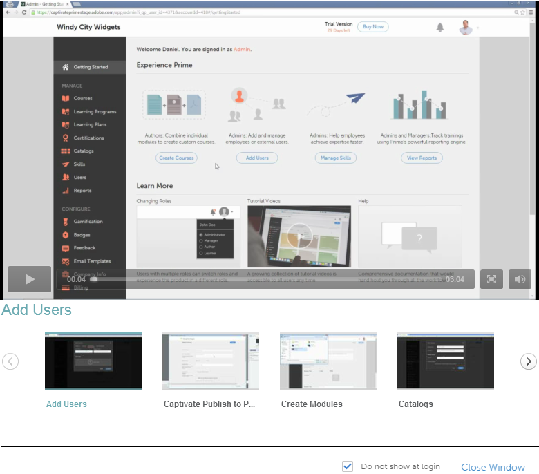

# Primeros pasos como autor

## Introducción a {#gettingstarted}

La página Introducción le ayuda a recorrer las funciones clave de la aplicación.

Después de iniciar sesión como autor, puede ver la ventana emergente con una lista de vídeos.

## Ver vídeos de muestra {#viewsamplevideos}

Examine los tutoriales de vídeo de ejemplo para comprender las funciones clave de su función como autor. Si no desea que esta ventana emergente aparezca durante el inicio de sesión, puede desactivarla haciendo clic en la opción &quot;No mostrar al iniciar sesión&quot; en la esquina inferior derecha de la ventana emergente.

Haga clic en Cerrar ventana para cerrar la ventana emergente.

## Página de introducción {#gettingstartedpage}

Desde la página Introducción, puede realizar las siguientes actividades:

* Crear módulos
* Crear cursos

También puede obtener más información sobre la aplicación Learning Manager viendo vídeos de tutoriales, contenido de ayuda y aprendiendo sobre las distintas funciones.

