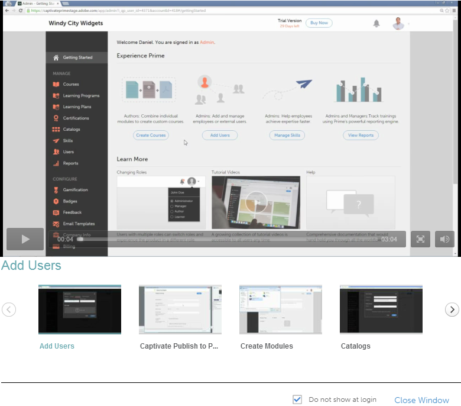
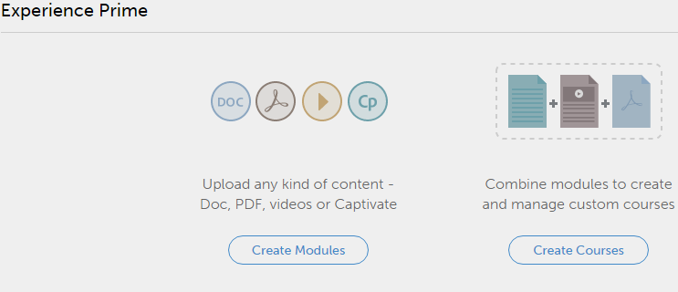

# Primeros pasos como autor

## Introducción {#gettingstarted}

La página Introducción le permite desplazarse por las funciones principales de la aplicación.

Después de iniciar sesión como autor, puede ver la ventana emergente con una lista de vídeos.

## Ver vídeos de muestra {#viewsamplevideos}

Examine los tutoriales de vídeo de muestra para comprender las funciones principales de su función como autor. Si no desea que esta ventana emergente aparezca durante el inicio de sesión, puede desactivarla haciendo clic en la opción &quot;No mostrar al iniciar sesión&quot; en la esquina inferior derecha de la ventana emergente.

Haga clic en Cerrar ventana para cerrar la ventana emergente.

## Página Introducción {#gettingstartedpage}

En la página Introducción, puede realizar las siguientes actividades:

* Crear módulos
* Crear cursos

También puede obtener más información sobre la aplicación Learning Manager al ver los tutoriales de vídeo y el contenido de ayuda y aprender sobre diferentes funciones.

