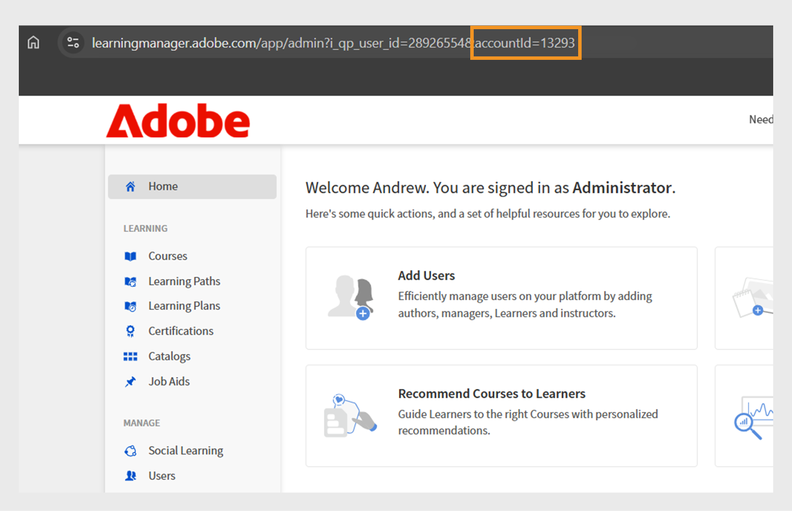

# Crear una cuenta de prueba en Adobe Learning Manager

Puede configurar fácilmente una cuenta de prueba de 30 días gratuita en Adobe Learning Manager para explorar funciones y probar flujos de trabajo de aprendizaje. Esta guía explica por dónde empezar, cómo registrarse y cómo encontrar los detalles de su cuenta una vez que esté configurado.

Para crear una cuenta de prueba:

1. Ve a [Adobe Learning Manager](https://business.adobe.com/products/learning-manager/adobe-learning-manager.html).
2. Seleccione **[!UICONTROL Prueba gratis de 30 días]**.

   

3. Seleccione **[!UICONTROL Crear una cuenta]** en la página de inicio de sesión.

   

4. Escriba su **[!UICONTROL dirección de correo electrónico]** y **[!UICONTROL contraseña]**.

   

5. Escriba los siguientes detalles y seleccione **[!UICONTROL Crear cuenta]**:
   * Nombre
   * Apellidos
   * Fecha de nacimiento

   

6. Escriba y complete el formulario con los detalles necesarios para configurar su cuenta de prueba.
7. Después de la configuración, busque el ID de su cuenta en la URL de su URL de Adobe Learning Manager.

   
