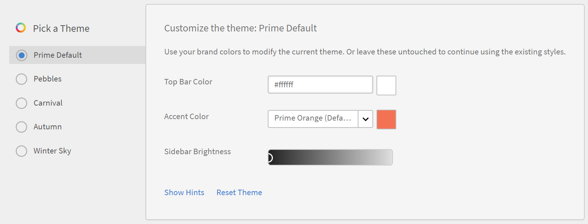
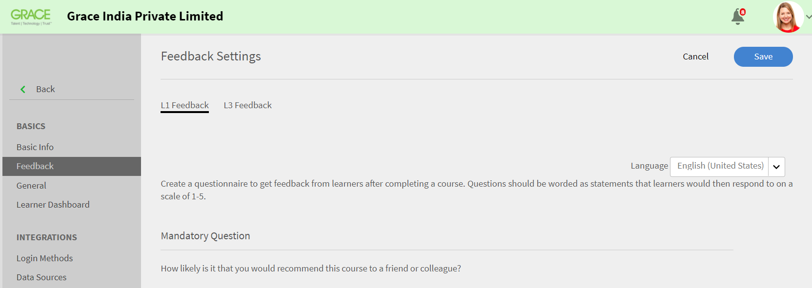
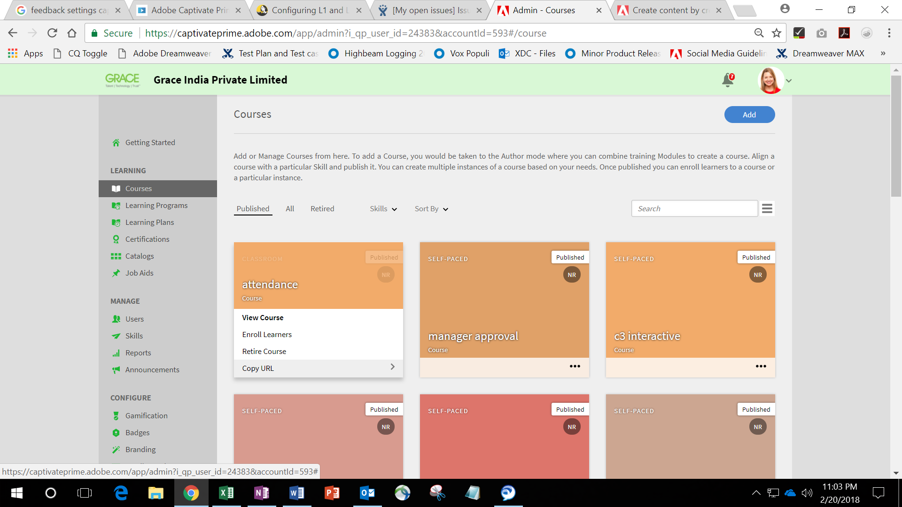

# Guía de implementación de Learning Manager

## Introducción {#introduction}

Learning Manager es un sistema de gestión de aprendizaje (LMS) que permite a los profesionales de la formación ofrecer materiales de aprendizaje atractivos y rastreables que pueden contribuir a las necesidades o objetivos de una organización. Learning Manager permite principalmente a los formadores o los responsables asignar cursos y otros objetos de aprendizaje (en un orden específico) a los alumnos. Esta herramienta también ofrece varias funciones potentes, como un reproductor Fluidic multiformato, interacción, insignias, tablero de alumno fácil de usar. Sin embargo, para aprovechar todas estas funciones, es esencial configurar y configurar primero Learning Manager.

Esta guía proporciona instrucciones paso a paso sobre cómo empezar a usar Learning Manager. Este documento también proporciona información detallada sobre la configuración y la configuración. Continúe leyendo para saber cómo empezar a trabajar con Learning Manager.

## ¿A quién está destinada esta guía? {#whoisthisguideintendedfor}

Como usuario de Learning Manager, puede desempeñar la función de administrador, autor, instructor, responsable o alumno. Esta guía está pensada para los usuarios que probablemente participen en la configuración de un LMS para una organización o un cliente:

* **Administrador de TI**: como administrador de TI, puedes activar o integrar Learning Manager en tu organización. Un administrador de TI también puede añadir uno o varios usuarios y puede desempeñar la función de administrador de integración o de administrador que integre Learning Manager con aplicaciones de terceros.
* **Autor**: como autor de Learning Manager, puede crear contenido de aprendizaje necesario para los requisitos de aprendizaje de una organización. Un autor participa en la creación del contenido básico que se carga en Learning Manager.

* **Administrador de Learning Manager**: un administrador de Learning Manager realiza las actividades de configuración relacionadas con la aplicación. En algunas empresas, un administrador de TI también puede desempeñar la función de administrador de Learning Manager.

## Primeros pasos con la implementación de Learning Manager {#getstartedwithcaptivateprimedeployment}

Después de adquirir Learning Manager, active su cuenta de Learning Manager mediante la clave de licencia que ha recibido. Continúe con las siguientes configuraciones, como se indica en el siguiente vídeo:

## Configurar el sitio en Learning Manager {#configureyoursiteincaptivateprime}

Antes de empezar a añadir e implementar objetos de aprendizaje en Learning Manager, hay algunas configuraciones clave que son necesarias. Comience configurando el sitio para que se adapte a su organización. La configuración del sitio consta de los pasos siguientes:

* Configuración de marca y logotipo para su organización
* Configuración de plantillas de correo electrónico
* Configuración de la configuración básica de la cuenta
* Configuración de la configuración de comentarios
* Configuración de la configuración del tablero del alumno

### Configuración de marca y logotipo {#setupbrandingandlogo}

Como administrador, puede configurar la marca y los temas para que coincidan con los requisitos de marca de su organización. Para definir la marca y los temas del sitio, haga lo siguiente:

### Configuración del logotipo y la pancarta: {#settingthelogoandbanner}

Utilice la configuración del logotipo y el banner para mostrar el logotipo de su empresa en Learning Manager. Configure las opciones de marca para definir el dominio de la empresa en la URL, mostrar el nombre de la organización y mostrar esquemas de colores que coincidan con la marca de la organización. Para configurar los ajustes de marca:

* Inicie sesión en su cuenta de Learning Manager como administrador.
* En el panel izquierdo, haga clic en **Marca**.
* En la página Marca, puede configurar las siguientes opciones haciendo clic en **Editar** en la opción que desea modificar:

   * **Nombre de la organización**: el valor que especifique aquí determinará el nombre que aparece en el banner de cada página del sitio.
   * **Subdominio**: este valor determina la dirección URL del sitio.
   * **Estilo del logotipo**: La imagen de este campo aparece como el logotipo en la esquina superior derecha de cada página. Aquí, puede elegir mostrar solo el logotipo o el nombre de su organización, o el logotipo y el nombre de la organización.

>[!NOTE]
>
>Solo puede configurar el nombre y el logotipo mediante la marca. No se puede cambiar la posición del logotipo ni de la imagen.

***Learning Manager admite los siguientes formatos de archivo para imágenes de logotipos: .png, .jpeg, .jpg, .gif, .bmp***

### Configuración de los temas del sitio {#settingthethemesforyoursite}

Learning Manager le permite cambiar el aspecto de su sitio mediante Temas. La aplicación proporciona los siguientes temas de color para elegir:

* Predeterm. de Prime
* Guijarros
* Carnaval
* Otoño
* Cielo invernal

Puede elegir uno de los esquemas de color que desee alinear con la marca de su empresa.

1. En el panel de navegación izquierdo de Learning Manager, haga clic en **[!UICONTROL Marca]**.
1. En la sección **Temas**, haga clic en **[!UICONTROL Editar]**. La aplicación le permite elegir un tema nuevo. Al seleccionar un tema, puede ver inmediatamente los esquemas de color que se utilizan para los elementos de la interfaz clave.

   

1. Además, puede editar el **color de barra superior**, el **color de énfasis** y el **brillo de barra lateral**.  Puede utilizar los colores de su propia marca para estos elementos clave de la interfaz.
1. Para restablecer los valores a la combinación de colores predeterminada para el tema, haga clic en **[!UICONTROL Restablecer tema]**. Los colores de los elementos clave de la interfaz de usuario se establecen en las opciones predeterminadas para el tema seleccionado.
1. Después de elegir el tema, haga clic en **[!UICONTROL Mostrar sugerencias]** para ver las etiquetas o sugerencias en la vista previa.

   

   Observe una proyección de diapositivas con varias imágenes en la sección **Temas**. Esta proyección de diapositivas le permite previsualizar instantáneamente el tema o la combinación de colores. Puede obtener una vista previa instantánea de las páginas seleccionadas, como la página de inicio, el tablero del alumno, etc.

1. Si desea obtener una vista previa de los cambios en un navegador, haga clic en **[!UICONTROL Vista previa dinámica]**. Aparecerá una ventana emergente de Vista previa de tema interactivo, donde podrá modificar la combinación de colores o continuar con las opciones predeterminadas. Para obtener una vista previa de las opciones en un navegador, haga clic en **[!UICONTROL Vista previa]** en esta ventana emergente.

   

1. Las opciones seleccionadas se aplican temporalmente al sitio. Si desea guardar el tema y los ajustes de color seleccionados, haga clic en **[!UICONTROL Aplicar]**.
1. Después de seleccionar y aplicar un tema, haga clic en **&#x200B;**&#x200B;[!UICONTROL Guardar]&#x200B;**&#x200B;** para guardar su elección.

## Configurar plantillas de correo electrónico {#configureemailtemplates}

Como administrador, el siguiente paso sería configurar las plantillas de correo electrónico para varios eventos. Puede habilitar, deshabilitar y modificar las plantillas de correo electrónico que se enviarán a los usuarios. Existen tres categorías principales de plantillas de correo electrónico:

* Plantillas generales de correo electrónico: Estos correos electrónicos se activan para eventos genéricos. Por ejemplo, una notificación de bienvenida cuando un usuario inicia sesión por primera vez.
* Plantillas de correo electrónico asociadas a un objeto de aprendizaje o una actividad: Estos correos electrónicos se envían a alumnos, autores o responsables siempre que haya una actividad de aprendizaje. Por ejemplo, los correos electrónicos que se activan después de la inscripción en el curso, la participación en la clase, la finalización del curso, etc.
* Recordatorios y actualizaciones: Estos correos electrónicos se activan cuando los usuarios necesitan actualizaciones o recordatorios para cualquier evento. Por ejemplo, un alumno que recibe un recordatorio de un curso próximo o un administrador que recibe una notificación por correo electrónico de un informe compartido.

Puede habilitar y configurar cualquiera de estas notificaciones por correo electrónico desde el panel Administrador. Para obtener más información sobre cómo configurar las plantillas de correo electrónico, siga estos pasos:

1. En el panel de navegación izquierdo, haga clic en **[!UICONTROL **&#x200B; Plantillas de correo electrónico &#x200B;**.]**
1. Haga clic en una de las siguientes pestañas:**[!UICONTROL ** General **/** Actividad de aprendizaje **/** Recordatorios y actualizaciones **.]** Como ejemplo, supongamos que hace clic en **[!UICONTROL **&#x200B; Actividad de aprendizaje &#x200B;**.]**
1. Haga clic en el botón de alternancia para cualquier actividad que desee activar un correo electrónico. En este ejemplo, supongamos que hace clic en **[!UICONTROL **&#x200B; Programa de aprendizaje - Inscrito por el administrador/responsable &#x200B;**.]**

   

   El sistema muestra el mensaje emergente &quot;Habilitado correctamente&quot;. Ahora, cada vez que un responsable o un administrador inscriben a un alumno en un curso, este recibe un correo electrónico de esta cuenta de Learning Manager.

1. Puede modificar la plantilla de correo electrónico predeterminada. Para ello, haga clic en el evento. En este ejemplo, haga clic en **[!UICONTROL programa de aprendizaje - Inscrito por administrador/responsable.]**
1. En el cuadro de diálogo emergente **[!UICONTROL Vista previa de plantilla]**, observe que hay dos pestañas: [!UICONTROL Alumno] y [!UICONTROL Responsable].

   

   Para cada una de estas fichas, haga clic en el cuerpo del correo electrónico para modificar el contenido. Para guardar los cambios en la plantilla de correo electrónico, haga clic en **[!UICONTROL Guardar]**.

   Ahora, cada vez que el responsable o el administrador inscriben a un alumno en un curso, éste y su responsable reciben una notificación por correo electrónico.

   ***Nota: las modificaciones solo se aplican a la plantilla de correo electrónico asociada al evento seleccionado.***

1. Tenga en cuenta que no se pudo modificar la URL de la cuenta ni la firma en la plantilla de correo electrónico. Para modificar la **[!UICONTROL URL de cuenta]** o **[!UICONTROL Firma]**, haga clic en la ficha **[!UICONTROL Configuración]**. En esta ficha, puede modificar el banner de correo electrónico, Firma de correo electrónico y la URL de la cuenta.

   El vínculo de URL de la cuenta se muestra en todos los mensajes de correo electrónico, justo antes de la firma. Introduzca la URL que desee y haga clic en **[!UICONTROL Guardar]**. Esta URL solo es visible para los usuarios internos.

   Para el banner de correo electrónico, puede cambiar el color del banner seleccionando **[!UICONTROL **&#x200B; Fondo del banner &#x200B;**.] **&#x200B; También puedes usar una imagen personalizada como banner seleccionando la opción &#x200B;** [!UICONTROL Imagen personalizada]&#x200B;**. Haga clic en &#x200B;** [!UICONTROL Guardar]** después de realizar los cambios.

   ***Nota: el tamaño de imagen personalizado del banner de correo electrónico debe ser de 1240 x 200 px. Se recortarán las imágenes que superen el tamaño recomendado.***

   ***Learning Manager solo admite tipos de archivo .jpg, .jpeg y .png para banners de correo electrónico.***

   

1. También puede activar Correos electrónicos opcionales del responsable. Si selecciona la casilla de verificación **[!UICONTROL Habilitar]**, cada vez que un informe directo reciba un correo electrónico de esta cuenta de Captivate Prime, el administrador también se incluirá en la lista de correo.

   ***Nota: la configuración de esta ficha es aplicable a todas las plantillas, globalmente.***

### Configurar plantillas de correo electrónico para un objeto de aprendizaje {#configureemailtemplatesforalearningobject}

Además de configurar plantillas de correo electrónico a nivel global, como administrador también puede configurar plantillas de correo electrónico para un objeto de aprendizaje específico. En este caso, los cambios que realice en la plantilla de correo electrónico solo se aplicarán a ese objeto de aprendizaje.

Esta opción también está disponible para los autores cuando los autores configuran un objeto de aprendizaje.

Para configurar las plantillas de correo electrónico de un objeto de aprendizaje:

1. Haga clic en el curso, programa de aprendizaje o certificación para el que desea configurar la plantilla de correo electrónico.
1. En el panel izquierdo, haga clic en **[!UICONTROL **&#x200B; Plantillas de correo electrónico &#x200B;**.] **&#x200B; El sistema muestra un cuadro de diálogo &#x200B;**&#x200B;**[!UICONTROL Previsualización de plantilla]**&#x200B;**.
1. Modifique el asunto o el cuerpo de la plantilla de correo electrónico y haga clic en **[!UICONTROL **Guardar**]**&#x200B;para aplicar los cambios.
1. Para cancelar los cambios, haga clic en **[!UICONTROL **&#x200B; Volver a original &#x200B;**.]**

### Restringir a los usuarios a recibir correos electrónicos {#restrictusersfromreceivingemails}

Como administrador, puede seleccionar quién recibirá y quién no los mensajes de correo electrónico de Learning Manager. Puedes hacerlo mediante la opción **&#x200B;**&#x200B;[!UICONTROL Usuario restringido]&#x200B;**&#x200B;** en la pestaña **&#x200B;**&#x200B;[!UICONTROL Configuración] **&#x200B; &#x200B;**&#x200B;1. Los usuarios pueden incorporarse a esta lista mediante su nombre, identificador de correo electrónico o identificador exclusivo de usuario. Los usuarios que aparecen bajo esta opción no podrán recibir ninguna comunicación por correo electrónico de Learning Manager.

## Configurar los ajustes de su cuenta {#configureyouraccountsettings}

Learning Manager le permite configurar algunas opciones de cuenta, como la configuración básica, la configuración de comentarios, la configuración general y la configuración del tablero del alumno. Los siguientes procedimientos indican cómo configurar cada una de estas opciones:

### Configurar opciones básicas {#configurebasicsettings}

1. En la página de inicio de Learning Manager, haga clic en **&#x200B;**&#x200B;[!UICONTROL Configuración]&#x200B;**&#x200B;**. De forma predeterminada, el sistema muestra la página Información básica, con los campos de idioma y ubicación predeterminados.
1. Haga clic en **&#x200B;**&#x200B;[!UICONTROL Cambiar]&#x200B;**&#x200B;** en la esquina superior derecha de la página para editar la información básica.
1. Configure las opciones siguientes:

   * **País**: Seleccione el país en este campo desplegable.
   * **Zona horaria**: Defina la zona horaria adecuada para su ubicación.
   * **Configuración regional**: Seleccione el idioma que desee. Si cambia el idioma en este campo, el cambio se aplicará a todos los usuarios que utilicen esta aplicación. Sin embargo, individualmente, cada usuario puede modificar el idioma de preferencia.
   * **El ejercicio económico comienza a partir de**: Seleccione el mes en el que se inicia el ejercicio para su organización.

   

## Configurar opciones de comentarios {#configurefeedbacksettings}

Learning Manager le permite recopilar comentarios de los alumnos sobre un curso. También es posible recopilar comentarios sobre los alumnos mediante Learning Manager. Para solicitar comentarios, primero debe configurar los tipos de comentarios de L1 y L3.

Los comentarios de L3 son los comentarios que proporciona un responsable sobre un alumno. Puede utilizar este tipo de comentarios para realizar un seguimiento del rendimiento de los alumnos a lo largo del tiempo. Los comentarios de L1 son los comentarios que un alumno proporciona sobre un curso. Este tipo de comentarios ayuda a un administrador a recopilar comentarios directos sobre un curso.

Como administrador, puede configurar los ajustes de comentarios de forma global. Para ello, siga este procedimiento:

1. En la página de inicio de Learning Manager, haga clic en **[!UICONTROL Configuración]**.
1. En el panel izquierdo, haga clic en **[!UICONTROL General]**.
1. Para configurar los comentarios de L1, haga clic en la pestaña **[!UICONTROL Comentarios de L1]**. Verá las opciones para configurar una pregunta obligatoria y varias preguntas opcionales. Estas son las preguntas que un alumno ve mientras proporciona comentarios después de completar un curso. Las preguntas se redactan como instrucciones para que los alumnos puedan seleccionar su respuesta en una escala del 1 al 5.

   La primera parte de los comentarios de L1 es una pregunta obligatoria sobre cómo puede un alumno recomendar este curso a un amigo o compañero.

   ***Nota: no puede editar ni modificar la pregunta obligatoria.***

   

1. Para configurar las otras preguntas para su cuestionario de comentarios, haga clic en las preguntas de los **&#x200B;**&#x200B;[!UICONTROL Cursos con ritmo personalizado]&#x200B;**&#x200B;** o **&#x200B;**&#x200B;[!UICONTROL Cursos de clase]&#x200B;**&#x200B;**. Al hacer clic en una pregunta, el sistema le permite editar las preguntas predeterminadas.

   

1. Puede activar o desactivar las preguntas predeterminadas o modificar por completo las preguntas predeterminadas para adaptarlas a sus necesidades. Por ejemplo, puede eliminar la pregunta predeterminada &quot;El asunto de la formación era relevante para mí&quot; y añadir reemplazar la pregunta por &quot;Consideré que la formación es útil y relevante&quot;.
1. Después de finalizar las preguntas para los alumnos, puede configurar la configuración del recordatorio. De forma predeterminada, existe un recordatorio en el que la aplicación envía recordatorios automáticos a los alumnos una vez completado correctamente un curso. Este recordatorio también está configurado para repetirse cada dos semanas hasta que el alumno responda. Puede modificar el recordatorio existente haciendo clic en él o añadir un nuevo recordatorio.

   

1. Configure la configuración del recordatorio completando las siguientes opciones:

   * **Cuándo enviar**: Especifique si desea enviar la solicitud de comentarios al finalizar el curso o después de finalizar el curso.
   * **Días después de la finalización**: Especifique el número de días después de los cuales desea enviar la solicitud de comentarios. Este campo solo está visible si se selecciona **&#x200B;**&#x200B;[!UICONTROL Después de finalizar el curso]&#x200B;**&#x200B;**.

   * **Periodicidad**: Especifique si desea enviar el recordatorio de comentarios todos los días, cada semana o cada mes. También puede especificar durante cuántas semanas desea que se envíe el recordatorio.

1. Haga clic en la marca de verificación para guardar los ajustes del recordatorio.
1. Una vez finalizada la configuración de los comentarios, haga clic en **[!UICONTROL **Guardar**]**&#x200B;en la esquina superior derecha de la página.

## Configurar comentarios de L3: {#configurel3feedback}

Los comentarios de L3 contienen las preguntas que se envían al responsable de un alumno después de que este complete un curso. Los comentarios de L3 permiten a un administrador realizar un seguimiento de los cambios en el comportamiento o la aptitud de un alumno a lo largo del tiempo. Para configurar este comentario, en la página Comentarios, haga clic en la ficha **&#x200B;**&#x200B;[!UICONTROL Comentarios de L3]&#x200B;**&#x200B;**. Verá una pregunta predeterminada. El gerente debe responder a esta pregunta usando una escala de calificación de cinco puntos.

De forma similar a Comentarios de L1, puede configurar los recordatorios de comentarios de L3. Puede modificar el recordatorio existente o añadir un nuevo recordatorio de comentarios.

Después de finalizar la pregunta de comentarios y la configuración del recordatorio, haga clic en **&#x200B;**&#x200B;[!UICONTROL Guardar]&#x200B;**&#x200B;** para aplicar la configuración.

## Configurar comentarios en el nivel de instancia {#configurefeedbackataninstancelevel}

El procedimiento anterior describía los pasos para configurar los ajustes de comentarios a nivel global. Es decir, la configuración se aplica a todos los cursos. Además de estas preguntas globales, como administrador o autor, puede configurar preguntas de comentarios de L1 y L3 adicionales a nivel de instancia.

Para configurar la configuración de comentarios en un nivel de instancia:

1. En la página de inicio de Learning Manager, haga clic en **[!UICONTROL Cursos]**.
1. Pase el ratón por encima del curso en el que desee configurar los ajustes de comentarios. Haga clic en [!UICONTROL **Ver curso**.]

   

1. En la página de detalles del curso, haga clic en **[!UICONTROL Valores predeterminados de instancia]** en la sección Configurar.
1. En la lista desplegable [!UICONTROL **Idioma**], seleccione el idioma en el que desea que se muestre el cuestionario de comentarios.
1. Active Comentarios de reacción de L1 si desea solicitar comentarios de los alumnos. Puede añadir hasta dos preguntas en esta sección. Los alumnos pueden proporcionar respuestas descriptivas a estas preguntas.
1. Seleccione la casilla de verificación **[!UICONTROL Convertir en obligatoria]** si desea hacer que una o ambas preguntas sean obligatorias.
1. Seleccione el **[!UICONTROL Mostrar cuestionario inmediatamente después de finalizar el curso]** si desea que los alumnos vean el cuestionario de comentarios inmediatamente después de completar el curso.

   

1. Para configurar los comentarios de cambio de comportamiento de L3 en un nivel de instancia, **&#x200B;**&#x200B;[!UICONTROL Habilite]&#x200B;**&#x200B;** los comentarios de L3. La aplicación muestra una pregunta predefinida obligatoria y una pregunta en blanco en la que puede escribir una pregunta de su elección.
1. Para la pregunta predefinida sobre la mejora del alumno después de realizar el curso, la respuesta se encuentra en el formato Escala Likert. Es decir, los gerentes deben elegir una opción en una escala de Totalmente de Acuerdo para Estar Totalmente en Desacuerdo.
1. Especifique la segunda pregunta para el responsable. Los responsables pueden proporcionar una respuesta descriptiva a esta pregunta.
1. Seleccione la casilla **&#x200B;**&#x200B;[!UICONTROL Convertir en obligatoria]&#x200B;**&#x200B;** si desea hacer obligatoria la segunda pregunta.

   

1. Opcionalmente, configure la configuración del recordatorio en el nivel de instancia. Si no establece aquí la configuración de recordatorio, se asignará automáticamente la configuración de recordatorio global.
1. Una vez que hayas terminado de responder a las preguntas sobre los comentarios y la configuración del recordatorio, haz clic en **[!UICONTROL **Guardar**]**&#x200B;para aplicar la configuración.

   ***Nota: la configuración de comentarios no se aplica a las certificaciones.***

## Configurar opciones generales {#configuregeneralsettings}

La configuración general de Learning Manager permite a los administradores configurar opciones genéricas que afectan a otras funciones de la aplicación. Por ejemplo, puede utilizar la configuración general para especificar si la eficacia del curso puede hacerse visible para los alumnos. Para configurar los ajustes generales:

1. En la página de inicio de Learning Manager, haga clic en **&#x200B;**&#x200B;[!UICONTROL Configuración]&#x200B;**&#x200B;**.
1. En el panel izquierdo, haga clic en **&#x200B;**&#x200B;[!UICONTROL General]&#x200B;**&#x200B;**.
1. En la página Configuración general, puede configurar las siguientes opciones:

   Para todas estas opciones, la función a la que afecta cada opción es variada. Si es necesario, podemos proporcionar enlaces cruzados a cada una de las funciones detalladas.

   * **Mostrar eficacia del curso**: Active esta opción si desea que los alumnos vean la eficacia de un curso en el título del curso.
   * **Opción de restablecimiento de módulo**: Active esta opción si desea dar a los alumnos la posibilidad de restablecer un módulo. Los alumnos pueden entonces restablecer sus módulos si no los han superado, o si han completado parcialmente un módulo y desean volver a empezar.
   * **Moderación del curso**: Active esta opción si desea que un administrador apruebe los cambios realizados en un curso antes de que los alumnos puedan verlos.
   * **Foro de debate**: Active esta opción si desea que los alumnos vean los paneles de discusión de los cursos y participen en ellos. Si habilita la casilla de verificación **Foro de debate**, los alumnos y los instructores pueden publicar comentarios para los cursos. Sin embargo, si la configuración del nivel del curso indica que esta función no está seleccionada, la configuración del nivel del curso prevalecerá sobre la del administrador.

   * **Opción Explorar Aptitudes**: Active esta opción si desea que los alumnos exploren aptitudes de igual a igual y liderazgo.
   * **ID de objetos de aprendizaje únicos**: Active esta opción si desea proporcionar a los autores la posibilidad de añadir ID exclusivos a los objetos de aprendizaje.
   * **Mostrar listado de catálogo**: Active esta opción si desea que los alumnos vean todos los catálogos disponibles. Esta opción ayuda a los alumnos a perfeccionar su lista de objetos de aprendizaje.

   

## Configurar el tablero del alumno {#configurelearnerdashboardsettings}

El tablero del alumno en Learning Manager permite a los alumnos ver sus cursos obligatorios y recomendados, además de sus logros, aptitudes y anuncios. Los administradores pueden decidir cómo debe aparecer este tablero del alumno configurando la configuración del tablero del alumno. Esta configuración permite a los administradores definir los widgets en la página del alumno. Esta configuración también especifica cómo y dónde se colocan los widgets en el tablero del alumno. Como administrador, puede obtener una vista previa del diseño del tablero del alumno antes de aplicar la configuración.

1. En la página de inicio de Learning Manager, haga clic en **[!UICONTROL Configuración]**.
1. En el panel de navegación izquierdo, haga clic en **[!UICONTROL **&#x200B; Tablero del alumno &#x200B;**.]**
1. Seleccione los widgets que desea activar. Si deselecciona un widget, este se eliminará inmediatamente de la previsualización. Los alumnos no pueden ver este widget en su tablero.
1. Haga clic en **&#x200B;**&#x200B;[!UICONTROL Guardar]&#x200B;**&#x200B;** para aplicar la configuración.

   

1. Para aplicar la configuración predeterminada, haga clic en **[!UICONTROL Restaurar valores predeterminados.]** En este caso, todos los widgets excepto **[!UICONTROL Anuncios fijos y]** de bienvenida están visibles.

   ***Incluso después de habilitar la configuración del tablero del alumno, los alumnos pueden modificar y desplazarse por los widgets en sus respectivos tableros.***

