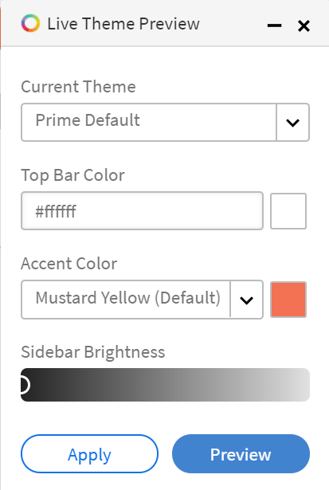
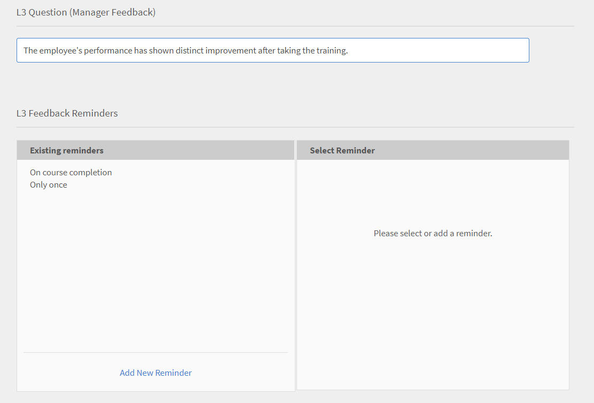

# Guía de implementación de Learning Manager

## Introducción {#introduction}

Learning Manager es un sistema de gestión de aprendizaje (LMS) que permite a los profesionales de la formación ofrecer materiales de aprendizaje atractivos y rastreables que pueden contribuir a las necesidades o objetivos de una organización. Learning Manager permite principalmente a los formadores o responsables asignar cursos y otros objetos de aprendizaje, en un orden específico, a los alumnos. Esta herramienta también ofrece varias funciones potentes, como un reproductor Fluidic multiformato, interacción lúdica, insignias y un panel de aprendizaje fácil de usar. Sin embargo, para aprovechar todas estas funciones, es esencial configurar y configurar primero Learning Manager.

Esta guía proporciona instrucciones paso a paso sobre cómo ponerse en marcha con Learning Manager. Este documento también proporciona información detallada sobre la configuración y la configuración. Siga leyendo para saber cómo empezar a usar Learning Manager.

## ¿A quién va dirigida esta guía? {#whoisthisguideintendedfor}

Como usuario de Learning Manager, puede llevar el sombrero de administrador, autor, instructor, responsable o alumno. Esta guía está destinada a los usuarios que es probable que participen en la configuración de un LMS para una organización o un cliente:

* **Administrador de TI** - Como administrador de TI, puede activar o integrar Learning Manager en su organización. Un administrador de TI también puede añadir uno o varios usuarios y puede desempeñar la función de administrador de integración o de administrador que integre Learning Manager con aplicaciones de terceros.
* **Autor** - Como autor de Learning Manager, puede crear contenido de aprendizaje necesario para los requisitos de aprendizaje de una organización. Un autor participa en la creación del contenido básico que se carga en Learning Manager.

* **Administrador de Learning Manager** - Un administrador de Learning Manager realiza las actividades de configuración y configuración relacionadas con la aplicación. En algunas empresas, un administrador de TI también puede desempeñar la función de administrador de Learning Manager.

## Primeros pasos con la implementación de Learning Manager {#getstartedwithcaptivateprimedeployment}

Después de adquirir Learning Manager, active su cuenta de Learning Manager con la clave de licencia que recibió. Continúe con las siguientes configuraciones, como se indica en el siguiente gráfico:

## Configurar el sitio en Learning Manager {#configureyoursiteincaptivateprime}

Antes de empezar a añadir e implementar objetos de aprendizaje en Learning Manager, se requieren algunas configuraciones clave. Para empezar, configura tu sitio para que se adapte a tu organización. La configuración del sitio consta de los siguientes pasos:

* Configuración de la marca y el logotipo para su organización
* Configuración de plantillas de correo electrónico
* Configuración de la configuración básica de cuenta
* Configuración de los comentarios
* Configuración del tablero del alumno

### Configurar marca y logotipo {#setupbrandingandlogo}

Como administrador, puede configurar la marca y los temas para que coincidan con los requisitos de marca de su organización. Para definir la marca y los temas de su sitio, haga lo siguiente:

### Configuración del logotipo y el banner: {#settingthelogoandbanner}

Utilice la configuración del logotipo y el banner para mostrar el logotipo de su empresa en Learning Manager. Configure las opciones de marca para definir el dominio de la empresa en la URL, mostrar el nombre de la organización y mostrar esquemas de colores que coincidan con la marca de la organización. Para configurar las opciones de personalización de marca:

* Inicie sesión en su cuenta de Learning Manager como administrador.
* En el panel izquierdo, haga clic en **Branding**.
* En la página Marca, puede configurar las siguientes opciones haciendo clic en **Editar** frente a la opción que desea modificar:

   * **Nombre de la organización** : El valor que especifique aquí determinará el nombre que aparece en el banner de cada página del sitio.
   * **Subdominio**: Este valor determina la dirección URL del sitio.
   * **Estilo de logotipo**: la imagen de este campo aparece como el logotipo en la esquina superior derecha de cada página. Aquí, puede elegir mostrar solo el logotipo o el nombre de su organización, o el logotipo y el nombre de la organización.

>[!NOTE]
>
>Solo puede configurar el nombre y el logotipo mediante la marca. No se puede cambiar la posición del logotipo ni de la imagen.

***Learning Manager admite los siguientes formatos de archivo para imágenes de logotipos: .png, .jpeg, .jpg, .gif, .bmp***

### Configuración de los temas del sitio {#settingthethemesforyoursite}

Learning Manager le permite cambiar la apariencia de su sitio mediante Temas. La aplicación proporciona los siguientes temas de color para que los elija:

* Valor predeterminado de Prime
* Guijarros
* Carnaval
* Otoño
* Cielo de invierno

Puede elegir uno de los esquemas de color para alinearlo con la marca corporativa.

1. En el panel de navegación izquierdo de Learning Manager, haga clic en **[!UICONTROL Branding]**.
1. En la **Temas** , haga clic en **[!UICONTROL Editar]**. La aplicación le permite elegir un nuevo tema. Al seleccionar un tema, puede ver inmediatamente las combinaciones de colores que se utilizan para los elementos clave de la interfaz.

   

1. Además, puede editar el **Color de barra superior**, **Color de énfasis** y el **Brillo de barra lateral**.  Puede utilizar los colores de su propia marca para estos elementos clave de la interfaz.
1. Para restablecer los valores a la combinación de colores predeterminada del tema, haga clic en **[!UICONTROL Restablecer tema]**. Los colores de los elementos clave de la interfaz de usuario se establecen en las opciones predeterminadas del tema elegido.
1. Después de elegir el tema, haga clic en **[!UICONTROL Mostrar sugerencias]** para ver las etiquetas o sugerencias en la vista previa.

   

   Observe una proyección de diapositivas con varias imágenes en la **Temas** sección. Esta proyección de diapositivas le permite previsualizar instantáneamente el tema o la combinación de colores. Puede obtener una vista previa instantánea de las páginas seleccionadas, como la página de inicio, el panel del alumno, etc.

1. Si desea obtener una vista previa de los cambios en un navegador, haga clic en **[!UICONTROL Previsualización dinámica]**. Aparece una ventana emergente de previsualización de tema en vivo, donde puede modificar la combinación de colores o continuar con las opciones predeterminadas. Para obtener una vista previa de las opciones en un navegador, haga clic en **[!UICONTROL Vista previa]** en esta ventana emergente.

   

1. Las opciones elegidas se aplican temporalmente al sitio. Si desea guardar el tema seleccionado y la configuración de color, haga clic en **[!UICONTROL Aplicar]**.
1. Después de seleccionar y aplicar un tema, haga clic en ****[!UICONTROL Guardar]**** para guardar su elección.

## Configurar plantillas de correo electrónico {#configureemailtemplates}

Como administrador, el siguiente paso sería configurar plantillas de correo electrónico para diversos eventos. Puede habilitar, deshabilitar y modificar las plantillas de correo electrónico que se van a enviar a los usuarios. Existen tres categorías principales de plantillas de correo electrónico:

* Plantillas generales de correo electrónico: estos correos electrónicos se activan para eventos genéricos. Por ejemplo, una notificación de bienvenida cuando un usuario inicia sesión por primera vez.
* Plantillas de correo electrónico asociadas a un objeto o actividad de aprendizaje: estos mensajes de correo electrónico se envían a los alumnos, autores o responsables siempre que hay una actividad de aprendizaje. Por ejemplo, los mensajes de correo electrónico que se activan después de la inscripción en el curso, la participación en clase, la finalización del curso, etc.
* Recordatorios y actualizaciones: estos correos electrónicos se activan cuando los usuarios necesitan actualizaciones o recordatorios para cualquier evento. Por ejemplo, un alumno que recibe un recordatorio de un curso próximo o un administrador que recibe una notificación por correo electrónico de un informe compartido.

Puede activar y configurar cualquiera de estas notificaciones por correo electrónico desde el panel del administrador. Para aprender a configurar plantillas de correo electrónico, realice los siguientes pasos:

1. En el panel de navegación izquierdo, haga clic en **[!UICONTROL ** Plantillas de correo electrónico **.]**
1. Haga clic en una de las siguientes pestañas:**[!UICONTROL ** General **/** Actividad de aprendizaje **/** Recordatorios y actualizaciones **.]** Por ejemplo, supongamos que hace clic **[!UICONTROL ** Actividad de aprendizaje **.]**
1. Haga clic en el botón de alternancia para cualquier actividad que desee activar un correo electrónico. En este ejemplo, supongamos que hace clic en **[!UICONTROL ** Programa de aprendizaje: inscrito por administrador/responsable **.]**

   

   El sistema muestra el mensaje emergente &quot;Habilitado correctamente&quot;. Ahora, cada vez que un responsable o un administrador inscribe a un alumno en un curso, este recibe un correo electrónico de esta cuenta de Learning Manager.

1. Puede modificar la plantilla de correo electrónico predeterminada. Para ello, haga clic en el evento. En este ejemplo, haga clic en **[!UICONTROL Programa de aprendizaje: inscrito por el administrador o responsable.]**
1. En la **[!UICONTROL Vista previa de plantilla]** cuadro de diálogo emergente, observe que hay dos fichas: [!UICONTROL Alumno] y [!UICONTROL Responsable].

   

   Para cada una de estas pestañas, haga clic en el cuerpo del correo electrónico para modificar el contenido. Para guardar los cambios en la plantilla de correo electrónico, haga clic en **[!UICONTROL Guardar]**.

   Ahora, cada vez que el responsable o el administrador inscriben a un alumno en un curso, tanto este como su responsable reciben una notificación por correo electrónico.

   ***Nota: Las modificaciones solo se aplican a la plantilla de correo electrónico asociada al evento seleccionado.***

1. Tenga en cuenta que no pudo modificar la URL de la cuenta o la firma en la plantilla de correo electrónico. Para modificar el **[!UICONTROL URL de cuenta]** o **[!UICONTROL Firma]**, haga clic en el **[!UICONTROL Configuración]** . En esta pestaña, puede modificar el banner de correo electrónico, la firma de correo electrónico y la URL de la cuenta.

   El vínculo de URL de la cuenta se muestra en todos los correos electrónicos, justo antes de la firma. Introduzca su URL preferida y haga clic en **[!UICONTROL Guardar]**. Esta dirección URL solo es visible para los usuarios internos.

   Para el banner de correo electrónico, puede cambiar el color del banner seleccionando  **[!UICONTROL ** Fondo del banner **.]** También puede utilizar una imagen personalizada como banner seleccionando la **[!UICONTROL Imagen personalizada]** opción. Haga clic en  **[!UICONTROL Guardar]** después de realizar los cambios.

   ***Nota: El tamaño de imagen personalizado para el banner de correo electrónico debe ser de 1240 x 200 px. Las imágenes que superen el tamaño recomendado se recortan.***

   ***Learning Manager solo admite los tipos de archivo .jpg, .jpeg y .png para banners de correo electrónico.***

   

1. También puede activar los correos electrónicos de responsable opcionales. Si selecciona la **[!UICONTROL Habilitar]** , cada vez que un informe directo recibe un correo electrónico de esta cuenta de Captivate Prime, el responsable también se incluye en la lista de correo.

   ***Nota: La configuración de esta pestaña se aplica a todas las plantillas de forma global.***

### Configurar plantillas de correo electrónico para un objeto de aprendizaje {#configureemailtemplatesforalearningobject}

Además de definir plantillas de correo electrónico a nivel global, como administrador también puede configurar plantillas de correo electrónico para un objeto de aprendizaje específico. En este caso, cualquier cambio que realice en la plantilla de correo electrónico solo se aplica a ese objeto de aprendizaje.

Esta opción también está disponible para los autores cuando estos configuran un objeto de aprendizaje.

Para configurar plantillas de correo electrónico para un objeto de aprendizaje:

1. Haga clic en el curso, programa de aprendizaje o certificación para el que desee configurar la plantilla de correo electrónico.
1. En el panel izquierdo, haga clic en **[!UICONTROL ** Plantillas de correo electrónico **.]** El sistema muestra un ****[!UICONTROL Vista previa de plantilla]**** del cuadro de diálogo emergente.
1. Modifique el asunto o el cuerpo de la plantilla de correo electrónico y haga clic en **[!UICONTROL **Guardar**]** para aplicar los cambios.
1. Para cancelar los cambios, haga clic en **[!UICONTROL ** Volver al original **.]**

### Restringir a los usuarios la recepción de correos electrónicos {#restrictusersfromreceivingemails}

Como administrador, puede seleccionar quién recibirá correos electrónicos de Learning Manager y quién no. Para ello, puede utilizar la ****[!UICONTROL Usuario restringido]**** opción bajo el ****[!UICONTROL Configuración]** **tab. Los usuarios se pueden añadir a esta lista mediante su nombre, ID de correo electrónico o ID de usuario único. Los usuarios que aparezcan en esta opción no podrán recibir ninguna comunicación por correo electrónico de Learning Manager.

## Configurar la cuenta {#configureyouraccountsettings}

Learning Manager le permite configurar algunos ajustes de la cuenta, como los ajustes básicos, los ajustes de comentarios, la configuración general y la configuración del tablero del alumno. Los siguientes procedimientos indican cómo configurar cada una de estas opciones:

### Configurar opciones básicas {#configurebasicsettings}

1. En la página de inicio de Learning Manager, haga clic en ****[!UICONTROL Configuración]****. De forma predeterminada, el sistema muestra la página Información básica, con los campos de idioma y ubicación predeterminados.
1. Haga clic en ****[!UICONTROL Cambiar]**** en la esquina superior derecha de la página para editar la información básica.
1. Configure las siguientes opciones:

   * **País**: seleccione el país en este campo desplegable.
   * **Zona horaria**: establezca la zona horaria adecuada para su ubicación.
   * **Configuración regional**: seleccione el idioma de su elección. Si cambia el idioma en este campo, el cambio se aplicará a todos los usuarios que utilicen esta aplicación. Sin embargo, individualmente, cada usuario puede modificar el idioma de preferencia.
   * **El ejercicio financiero comienza a partir de**: seleccione el mes en el que comienza el ejercicio financiero para su organización.

   

## Configurar los comentarios {#configurefeedbacksettings}

Learning Manager permite recopilar comentarios de alumnos sobre un curso. También es posible recopilar comentarios sobre los alumnos con Learning Manager. Para solicitar comentarios, primero debe configurar los tipos de comentarios de L1 y L3.

Los comentarios de L3 son los comentarios que un responsable proporciona sobre un alumno. Puede utilizar este tipo de comentarios para realizar un seguimiento del rendimiento de los alumnos a lo largo del tiempo. Los comentarios de L1 son los comentarios que proporciona un alumno sobre un curso. Este tipo de comentarios ayuda a un administrador a recopilar comentarios directos sobre un curso.

Como administrador, puede configurar las opciones de comentarios de forma global. Para ello, siga este procedimiento:

1. En la página de inicio de Learning Manager, haga clic en **[!UICONTROL Configuración]**.
1. En el panel izquierdo, haga clic en **[!UICONTROL General]**.
1. Para configurar los comentarios de L1, haga clic en **[!UICONTROL Comentarios de L1]** . Verá las opciones para configurar una pregunta obligatoria y varias preguntas opcionales. Estas son las preguntas que ve un alumno cuando proporciona comentarios después de completar un curso. Las preguntas se redactan como instrucciones para que los alumnos puedan seleccionar su respuesta en una escala del 1 al 5.

   La primera parte de los comentarios de L1 es una pregunta obligatoria sobre cómo puede un alumno recomendar este curso a un amigo o compañero.

   ***Nota: No puede editar ni modificar la pregunta obligatoria.***

   

1. Para configurar las demás preguntas del cuestionario de comentarios, haga clic en las preguntas del ****[!UICONTROL Cursos con ritmo personalizado]****, o ****[!UICONTROL Cursos de clase]****. Al hacer clic en una pregunta, el sistema le permite editar las preguntas predeterminadas.

   

1. Puede activar o desactivar las preguntas predeterminadas, o bien modificar completamente las preguntas predeterminadas para adaptarlas a sus necesidades. Por ejemplo, puede eliminar la pregunta predeterminada &quot;El asunto de la formación era relevante para mí&quot; y añadir reemplazar la pregunta por &quot;Consideré que la formación es útil y relevante&quot;.
1. Después de finalizar las preguntas para los alumnos, puede configurar los ajustes del recordatorio. De forma predeterminada, existe un recordatorio en el que la aplicación envía recordatorios automáticos a los alumnos cuando finaliza correctamente un curso. Este recordatorio también está configurado para repetirse cada dos semanas hasta que el alumno responda. Puede modificar el recordatorio existente haciendo clic en él o agregar un nuevo recordatorio.

   

1. Configure la configuración del recordatorio completando las siguientes opciones:

   * **Cuándo enviar**: Especifique si desea enviar la solicitud de comentarios al finalizar el curso o después de completarlo.
   * **Días después de la finalización**: Especifique el número de días tras los que desea enviar la solicitud de comentarios. Este campo solo está visible si se selecciona ****[!UICONTROL Después de finalizar el curso]****.

   * **Periodicidad**: especifique si desea enviar el recordatorio de comentarios todos los días, todas las semanas o todos los meses. También puede especificar el número de semanas que desea que se envíe el recordatorio.

1. Haga clic en la marca de verificación para guardar la configuración del recordatorio.
1. Una vez finalizada la configuración de los comentarios, haga clic en **[!UICONTROL **Guardar**]** en la esquina superior derecha de la página.

## Configurar comentarios de L3: {#configurel3feedback}

Los comentarios de L3 contienen las preguntas que se envían al responsable de un alumno después de que este complete un curso. Los comentarios de L3 permiten a un administrador realizar un seguimiento de los cambios en el comportamiento o la aptitud de un alumno a lo largo del tiempo. Para configurar estos comentarios, en la página Comentarios, haga clic en el botón ****[!UICONTROL Comentarios de L3]**** . Verá una pregunta predeterminada. El gerente debe responder a esta pregunta usando una escala de calificación de cinco puntos.

De forma similar a los comentarios de L1, puede configurar los recordatorios para los comentarios de L3. Puede modificar el recordatorio existente o agregar un nuevo recordatorio de comentarios.

Cuando haya terminado la pregunta de comentarios y la configuración del recordatorio, haga clic en ****[!UICONTROL Guardar]**** para aplicar la configuración.

## Configurar comentarios a nivel de instancia {#configurefeedbackataninstancelevel}

En el procedimiento anterior se describían los pasos necesarios para configurar los ajustes de comentarios a nivel global. Es decir, la configuración se aplica a todos los cursos. Además de estas preguntas globales, como administrador o autor, puede configurar preguntas de comentarios de L1 y L3 adicionales en el nivel de instancia.

Para configurar los ajustes de comentarios en un nivel de instancia:

1. En la página de inicio de Learning Manager, haga clic en **[!UICONTROL Cursos]**.
1. Pase el ratón sobre el curso en el que desea configurar los ajustes de comentarios. Haga clic en [!UICONTROL **Ver curso**.]

   

1. En la página de detalles del curso, haga clic en **[!UICONTROL Valores predeterminados de instancia]** en la sección Configurar.
1. En la [!UICONTROL **Idioma**] , seleccione el idioma en el que desea que se muestre el cuestionario de comentarios.
1. Active los comentarios de reacción de L1 si desea solicitar comentarios de los alumnos. Puede añadir hasta dos preguntas en esta sección. Los alumnos pueden proporcionar respuestas descriptivas a estas preguntas.
1. Seleccione la **[!UICONTROL Convertir en obligatorio]** casilla de verificación si desea que una o ambas preguntas sean obligatorias.
1. Seleccione la **[!UICONTROL Mostrar el cuestionario inmediatamente después de completar el curso]** si desea que los alumnos vean el cuestionario de comentarios inmediatamente después de completar el curso.

   

1. Para configurar los comentarios sobre cambios de comportamiento en L3 en un nivel de instancia, ****[!UICONTROL Habilitar]**** los comentarios de L3. La aplicación muestra una pregunta predefinida y obligatoria y una pregunta en blanco en la que puede especificar la pregunta que desee.
1. Para la pregunta predefinida sobre la mejora del alumno después de realizar el curso, la respuesta se encuentra en el formato Escala Likert. Es decir, los administradores deben elegir una opción en una escala de Totalmente de acuerdo en Totalmente en desacuerdo.
1. Especifique la segunda pregunta para el responsable. Los responsables pueden proporcionar una respuesta descriptiva a esta pregunta.
1. Seleccione la ****[!UICONTROL Convertir en obligatorio]**** casilla de verificación si desea que la segunda pregunta sea obligatoria.

   

1. Si lo desea, puede configurar los ajustes de recordatorio en el nivel de instancia. Si no establece la configuración de recordatorio aquí, la configuración de recordatorio global se asigna automáticamente.
1. Una vez que haya terminado las preguntas de comentarios y la configuración del recordatorio, haga clic en **[!UICONTROL **Guardar**]** para aplicar la configuración.

   ***Nota: La configuración de comentarios no es aplicable a las certificaciones.***

## Configurar opciones generales {#configuregeneralsettings}

La configuración general de Learning Manager permite a los administradores configurar opciones genéricas que afectan a otras funciones de la aplicación. Por ejemplo, puede utilizar la configuración general para especificar si la eficacia del curso se puede hacer visible para los alumnos. Para configurar las opciones generales:

1. En la página de inicio de Learning Manager, haga clic en ****[!UICONTROL Configuración]****.
1. En el panel izquierdo, haga clic en ****[!UICONTROL General]****.
1. En la página Configuración general, puede configurar las siguientes opciones:

   Para todas estas opciones, la función a la que afecta cada opción varía. Podemos proporcionar enlaces cruzados a cada una de las características detalladas si es necesario.

   * **Mostrar eficacia del curso**: Active esta opción si desea que los alumnos vean la eficacia de un curso en el título del curso.
   * **Opción de reinicio del módulo**: Active esta opción si desea dar a los alumnos la capacidad de restablecer un módulo. Los alumnos pueden restablecer sus módulos si han fallado o si han completado parcialmente el módulo y desean volver a empezar.
   * **Moderación del curso**: Active esta opción si desea que los cambios de un curso los apruebe un administrador antes de que los alumnos puedan verlos.
   * **Panel de debates**: Active esta opción si desea que los alumnos vean y participen en los paneles de debates de los cursos. Si habilita la **Panel de debates** , los alumnos y los instructores pueden publicar comentarios para los cursos. Sin embargo, si la configuración del nivel del curso indica que esta función no está seleccionada, la configuración del nivel del curso tiene prioridad sobre la configuración del administrador.

   * **Opción Explorar Aptitudes**: Active esta opción si desea que los alumnos exploren las aptitudes de liderazgo y de compañeros.
   * **ID únicos de objetos de aprendizaje**: Active esta opción si desea permitir a los autores añadir ID exclusivos a los objetos de aprendizaje.
   * **Mostrar listado de catálogos**: Active esta opción si desea que los alumnos vean todos los catálogos disponibles. Esta opción ayuda a los alumnos a perfeccionar la lista de objetos de aprendizaje.

   

## Configurar el tablero del alumno {#configurelearnerdashboardsettings}

El tablero del alumno en Learning Manager permite a los alumnos ver sus cursos obligatorios y recomendados, además de sus logros, aptitudes y anuncios. Los administradores pueden decidir cómo debe aparecer este tablero del alumno configurando la configuración del tablero del alumno. Esta configuración permite a los administradores configurar los widgets en la página del alumno. Esta configuración también especifica cómo y dónde se colocan los widgets en el tablero del alumno. Como administrador, puede obtener una vista previa del diseño del tablero del alumno antes de aplicar la configuración.

1. En la página de inicio de Learning Manager, haga clic en **[!UICONTROL Configuración]**.
1. En el panel de navegación izquierdo, haga clic en **[!UICONTROL ** Panel del alumno **.]**
1. Seleccione los widgets que desee activar. Si deselecciona un widget, este se elimina inmediatamente de la vista previa. Los alumnos no pueden ver este widget en su tablero.
1. Haga clic en ****[!UICONTROL Guardar]**** para aplicar la configuración.

   

1. Para aplicar la configuración predeterminada, haga clic en **[!UICONTROL Restaurar valores predeterminados.]** En este caso, todos los widgets excepto **[!UICONTROL Anuncios de bienvenida y pegajosos]** son visibles.

   ***Incluso después de activar la configuración del tablero del alumno, los alumnos pueden modificar y desplazarse por los widgets en sus respectivos tableros.***

