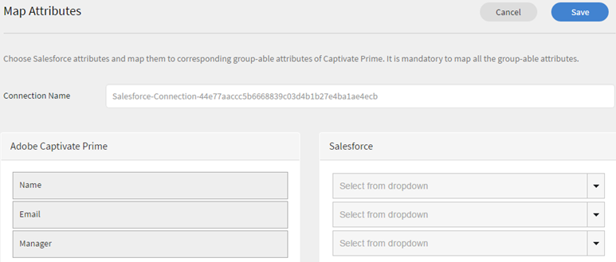
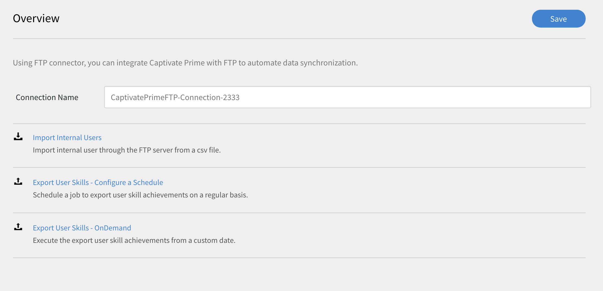
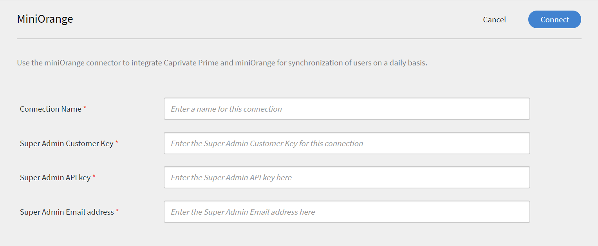

# Conectores de Learning Manager

Obtenga más información sobre cómo integrar Salesforce con Learning Manager mediante conectores, cómo integrar FTP con Learning Manager y cargar CSV automáticamente mediante el conector de FTP.

Las empresas tienen otras aplicaciones y sistemas que pueden necesitar integrarse con Learning Manager. Los conectores son utilidades que ayudan a realizar integraciones basadas en datos, como importar datos en Learning Manager desde sistemas externos o exportar datos a sistemas externos desde Learning Manager. En la versión de julio de 2016, los conectores solo tienen la capacidad de importar usuarios en bloque para Learning Manager desde sistemas externos.

Learning Manager proporciona conectores de Salesforce y FTP. Con el conector de Salesforce, los administradores de integración de una organización pueden integrar su aplicación de Salesforce con Learning Manager. Como integrador, también puede utilizar el conector de FTP para importar automáticamente un conjunto de usuarios en su aplicación empresarial.

Learning Manager también proporciona los conectores de Lynda, getAbstract y Harvard Management System, que permiten a los alumnos acceder a cursos de Lynda.com, getAbstract y Harvard ManageMentor y consumirlos.

Siga leyendo para saber cómo configurar y utilizar cada uno de estos conectores en Learning Manager.

## Conector de Salesforce {#sfconnector}

El conector de Salesforce conecta las cuentas de Learning Manager y Salesforce para automatizar la sincronización de datos. Las funciones del conector de Salesforce son las siguientes:

### Asignación de atributos

El administrador de integración puede elegir columnas de Salesforce y asignarlas a los atributos agrupables del administrador de aprendizaje correspondiente. Este es un esfuerzo único. Una vez completada la asignación, se utilizará la misma en las posteriores importaciones de usuarios. Se puede volver a configurar si el administrador desea tener una asignación diferente para importar usuarios.

### Importación automatizada de usuarios

El proceso de importación de usuarios permite al administrador de Learning Manager obtener detalles de los empleados de Salesforce e importarlos automáticamente en Learning Manager. Esta automatización evita el esfuerzo manual que supone crear un archivo CSV y cargarlo en Learning Manager.

### Programación automática

El uso de la función de programación automática junto con la función de importación automatizada de usuarios puede ser eficaz. El administrador de Learning Manager puede configurar la programación de acuerdo con las necesidades de la organización. Los usuarios de la aplicación Learning Manager pueden estar actualizados según la programación. La sincronización se puede realizar a diario en la aplicación Learning Manager.

### Filtrar usuarios

El administrador de Learning Manager puede aplicar filtros a los usuarios antes de importarlos. Por ejemplo, el administrador de Learning Manager puede elegir importar todos los usuarios de la jerarquía bajo uno o varios responsables específicos.

## Configurar el conector de Salesforce {#configuresalesforceconnector}

Obtenga información sobre el proceso de integrar Learning Manager con Salesforce.

### Requisitos previos {#prerequisites}

Asegúrese de tener la URL de la organización de Salesforce. Por ejemplo, si el nombre de su organización es **myorg**, la URL de Salesforce podría ser [https://myorg.salesforce.com](https://myorg.salesforce.com/). Es la única entrada necesaria para conectar la cuenta de Salesforce con Learning Manager.

Asegúrese también de que dispone de las credenciales adecuadas para iniciar sesión en la cuenta.

## Crear una conexión {#createaconnection}

1. En la página de inicio de Learning Manager, pase el ratón sobre la tarjeta/miniatura de Salesforce. Aparece un menú. Haga clic en **[!UICONTROL Connect]** en el menú.

   

1. Aparece un cuadro de diálogo que le solicita que introduzca la URL de la organización. Haga clic en **[!UICONTROL Connect]** después de proporcionar la dirección URL.
1. Tras una conexión correcta, aparece la página de información general.

## Asignación de atributos {#mapattributes}

Una vez establecida correctamente la conexión, puede asignar columnas de Salesforce a los atributos correspondientes de Learning Manager. Este paso es obligatorio.

1. En la página de asignaciones, en el lado izquierdo se muestran las columnas de Learning Manager y en el derecho, las de Salesforce. Seleccione el nombre de columna adecuado que corresponda al nombre de columna del administrador de aprendizaje.

   

   Los datos de columna de Learning Manager que se muestran a la izquierda se obtienen de los campos activos. La **gerente** Este campo debe asignarse necesariamente a un campo de tipo de dirección de correo electrónico. Asignar todas las columnas es obligatorio antes de poder usar el conector.

1. Haga clic en **[!UICONTROL Guardar]** después de completar la asignación.
1. El conector ya está listo para su uso. La cuenta que se ha configurado ahora aparece como un origen de datos dentro de la aplicación del administrador para que el administrador programe la importación o la sincronización a petición.

## Uso del conector de Salesforce {#usingsalesforceconnector}

El conector de Salesforce se conecta a Salesforce.com para buscar los usuarios según su configuración y añadirlos a Learning Manager.

## Conector FTP de Learning Manager {#ftpconnector}

Con el conector de FTP, puede integrar Learning Manager con sistemas externos arbitrarios para automatizar la sincronización de datos. Se espera que los sistemas externos puedan exportar datos en formato CSV y colocarlos en la carpeta adecuada de la cuenta FTP de Learning Manager. Las funciones del conector de FTP son las siguientes:

También puede utilizar el conector de Box para la migración de datos, la importación de usuarios y la exportación de datos. Para obtener más información, consulte [Conector de Box.](third-party-connectors.md#main-pars_header_302653946)

## Importación de datos {#dataimport}

El proceso de importación de usuarios permite al administrador de Learning Manager obtener detalles de los empleados del servicio FTP de Learning Manager e importarlos automáticamente en Learning Manager. Con esta función, puede integrar varios sistemas colocando el archivo CSV generado por esos sistemas en las carpetas adecuadas de las cuentas FTP. Learning Manager selecciona los archivos CSV, los combina e importa los datos según la programación. Consulte Programación para obtener más información.

**Asignación de atributos**

El administrador de integración puede elegir las columnas de CSV y asignarlas a los atributos agrupables de Learning Manager. Esta asignación es una tarea que se realiza una sola vez. Una vez realizada la asignación, se utilizará la misma en las posteriores importaciones de usuarios. La asignación se puede volver a configurar si el administrador desea tener una asignación diferente para importar usuarios.

## Exportar datos {#exportdata}

La Exportación de datos permite a los usuarios exportar aptitudes de usuarios a una ubicación de FTP para integrarlas con cualquier sistema de terceros.

## Programación {#scheduling}

El administrador puede configurar tareas de programación según los requisitos de la organización, y los usuarios de la aplicación Learning Manager se actualizan según la programación. Del mismo modo, el administrador de integración puede programar la exportación de aptitudes de forma oportuna para que se integre en un sistema externo. La sincronización se puede realizar a diario en la aplicación Learning Manager.

## Configurar el conector FTP de Learning Manager {#configurecaptivateprimeftpconnector}

Obtenga información sobre el proceso de integrar Learning Manager con el conector de FTP.

### Crear una conexión {#Createaconnection-1}

1. En la página de inicio de Learning Manager, pase el ratón sobre la tarjeta/miniatura FTP. Aparece un menú. Haga clic en **[!UICONTROL Connect]** en el menú.

   

1. Aparece un cuadro de diálogo que le solicita que introduzca el ID de correo electrónico. Indique el ID de correo electrónico de la persona responsable de administrar la cuenta de FTP de Learning Manager para la organización. Haga clic en **[!UICONTROL Connect]** después de indicar el ID de correo electrónico.
1. Learning Manager le envía un correo electrónico solicitando al usuario que restablezca la contraseña antes de acceder al FTP por primera vez. El usuario debe restablecer la contraseña y utilizarla para acceder a la cuenta de FTP de Learning Manager.

   Solo se puede crear una cuenta FTP de Learning Manager para una cuenta de Learning Manager determinada.

   En la página de información general, puede especificar el nombre de conexión de su integración. Elija la acción que desea realizar entre las siguientes opciones:

   * Importar usuarios internos
   * Exportar aptitudes de usuarios: configurar una programación
   * Exportar aptitudes de usuarios: a petición

   

## Importar

+++Usuario interno

La opción Importar usuario interno le permite programar la generación del informe de importación de usuarios automáticamente. Los informes generados se le envían como archivos .CSV.

+++

+++Asignar atributos

Una vez establecida correctamente la conexión, puede asignar las columnas de archivos CSV que se colocarán en la carpeta FTP a los atributos correspondientes de Learning Manager. Este paso es obligatorio.

1. En la página Asignar atributos, en el lado izquierdo, se muestran las columnas esperadas de Learning Manager, mientras que en el derecho, se muestran los nombres de las columnas de CSV. Inicialmente, en el lado derecho, puede ver un cuadro de selección vacío. Importe cualquier archivo .csv de plantilla haciendo clic **Elegir archivo**.
1. El paso anterior rellena la lista desplegable de selección del lado derecho con todos los nombres de columna de CSV. Seleccione el nombre de columna adecuado que corresponda al nombre de columna del administrador de aprendizaje.

   *El campo de responsable debe asignarse necesariamente a un campo de tipo de dirección de correo electrónico. Asignar todas las columnas es obligatorio antes de poder usar el conector.*

1. Haga clic en **[!UICONTROL Guardar]** después de completar la asignación.

   El conector ya está listo para su uso. La cuenta que acaba de configurar aparecerá ahora como un origen de datos dentro de la aplicación del administrador para que el administrador programe la importación o la sincronización a petición.

+++

+++Uso del conector FTP de Learning Manager

1. Los archivos CSV de sistemas externos deben colocarse en la ruta siguiente:

   `code $OPERATION$/$OBJECT_TYPE$/$SUB_OBJECT_TYPE$/data.csv`

   **Nota:** En la versión de julio de 2016, solo se permite la importación de usuarios. Por lo tanto, para utilizar el conector de FTP, debe asegurarse de que los archivos CSV se coloquen en la carpeta siguiente:

   `code Home/import/user/internal/*.csv`

1. El conector de FTP toma todas las filas de los archivos CSV, por lo que es importante que la fila correspondiente a un usuario en un archivo CSV no aparezca en ningún otro archivo CSV.
1. Todos los archivos CSV deben contener las columnas especificadas en la asignación.
1. Todos los archivos CSV necesarios deben estar presentes en la carpeta antes de que comience el proceso.

Al importar usuarios a Learning Manager, el administrador también necesita saber cómo se administran los usuarios en Learning Manager. Consulte la [Ayuda de User Management](../integration-admin/feature-summary/migration-manual.md#usermanagement) para obtener más información.

+++

## Exportar

+++Aptitudes

Existen dos opciones para exportar informes de aptitudes de usuarios.

**[!UICONTROL Aptitudes del usuario: a petición]**: Puede especificar la fecha de inicio y exportar el informe utilizando la opción. El informe se extraerá desde la fecha introducida hasta el presente.

**[!UICONTROL Aptitudes del usuario: Configurar]**: esta opción le permite programar la extracción del informe. Seleccione la casilla de verificación Habilitar programación y especifique la fecha y la hora de inicio. También puede especificar el intervalo en el que desea que se genere y se envíe el informe.

+++

Para abrir la carpeta Export donde se colocarán los archivos exportados en la ubicación del FTP, abra el vínculo a la carpeta de FTP que se proporciona en la página Aptitudes del usuario, como se muestra a continuación.

Los archivos exportados automáticamente estarán presentes en la ubicación **Inicio/exportación/&#42;FTP_location&#42;**

Los archivos exportados automáticamente estarán disponibles con el título, **skill_achievements_&#42;datar de &#42;_para_&#42;fecha de&#42;.csv**

## Conector de Lynda {#lyndaconnector}

El conector de Lynda lo pueden utilizar los clientes empresariales de Lynda.com que desean que sus alumnos descubran y consuman cursos de Lynda desde Learning Manager. El conector se puede configurar para obtener cursos de Lynda.com periódicamente con su clave de API. Una vez creado un curso en Learning Manager, los usuarios pueden buscarlo y consumirlo. A continuación, se puede realizar un seguimiento del progreso del alumno en Learning Manager.

### Configurar el conector de Lynda {#configurethelyndaconnector}

1. En el tablero del administrador integrado, haga clic en Lynda.

   Verá el mosaico con tres opciones: Introducción, Conectar y Administrar conexiones.

1. Si va a configurar el conector de Lynda por primera vez, haga clic en Conectar.

   Debe configurar la cuenta FTP de Exavault antes de configurar este conector.

1. En la página de conexión, especifique un nombre para el conector. Introduzca la clave Appkey y la clave secreta para su conexión.

   Debe ponerse en contacto con su proveedor para obtener la clave Appkey y la clave secreta.

1. Haga clic en Guardar.

   La configuración se guarda y se agrega la conexión de Lynda para su cuenta. Ahora puede hacer clic en Administrar conexiones en la página Inicio y editar su configuración en cualquier momento.

1. Si ya tiene una conexión establecida, haga clic en Administrar conexiones para ver todas las conexiones.

   La función de migración debe estar habilitada para su cuenta antes de configurar este conector.

1. Haga clic en la conexión que desee editar.
1. En el panel izquierdo, haga clic en Configurar. Realice una de las acciones siguientes:

   * Vea o edite los detalles de su cuenta y la programación de sincronización desde esta ventana. Debe seleccionar la casilla de verificación Habilitar conexión si desea habilitar esta cuenta.
   * Haga clic en Editar y edite sus credenciales. Haga clic en Restaurar para deshacer las actualizaciones de este campo.
   * Haga clic en Habilitar programación para programar la sincronización. Puede especificar la fecha y la hora de inicio y, a continuación, la frecuencia de la programación de sincronización en días. Por ejemplo, habilite la sincronización cada 3 días.

   Haga clic en Guardar para guardar los cambios.

   

1. En el panel izquierdo, haga clic en Ejecución a petición. Esta opción le permite importar fuentes de usuario y otros datos relevantes de Lynda. Introduzca la fecha de inicio de la ejecución a petición y haga clic en Ejecutar para ejecutar la sincronización. Se importan todos los datos desde la fecha de inicio hasta el presente.

   * Puede hacer clic en Deshabilitar acceso a Learning Manager durante la ejecución, donde la aplicación tendrá un tiempo de inactividad durante la sincronización.
   * Si hace clic en Habilitar acceso a Learning Manager durante la ejecución, no se producirá ninguna interrupción en el servicio durante la sincronización.

   

1. También puede hacer clic en Estado de ejecución en el panel izquierdo en cualquier momento para ver el resumen de todas las ejecuciones de este conector, en orden cronológico. Puede ver la fecha de inicio y la duración de la sincronización, el tipo de sincronización (si se trata de sincronización a petición) y el estado de la sincronización (si la sincronización está en curso o se ha completado).

   Al eliminar y volver a crear una conexión, vuelven a aparecer las ejecuciones anteriores del conector. Puede ver todas las ejecuciones antes de eliminar la conexión.

   Sólo puede volver a ejecutar la última sincronización.

   

## conector de getAbstract {#getabstractconnector}

El conector de getAbstract lo pueden utilizar los clientes empresariales de getAbstract.com, que desean que sus alumnos descubran y consuman resúmenes de getAbstract. El conector se puede configurar para obtener datos de uso periódicamente, en función de los registros de finalización de alumnos que se creen en Learning Manager. Siga leyendo para saber cómo configurar este conector en Learning Manager.

### Configurar el conector de getAbstract {#configurethegetabstractconnector}

1. En el tablero del administrador integrado, haga clic en getAbstract.

   En el mosaico, verá tres opciones: Introducción, Conectar y Administrar conexiones.

1. Si va a configurar el conector de getAbstract por primera vez, haga clic en Conectar.

   Debe configurar la cuenta FTP de Exavault antes de configurar este conector.

   Asegúrese de compartir estas credenciales de FTP con su proveedor de contenido para acceder a las fuentes.

1. Escriba un nombre para la conexión en el campo Nombre de conexión.

   Introduzca las claves adecuadas en los campos ID de cliente y Secreto de cliente. Es posible que deba ponerse en contacto con su proveedor para obtener las claves adecuadas para este conector.

   Las claves son necesarias para obtener los metadatos del curso para los cursos consumidos por el cliente.

1. Si ya tiene una conexión establecida, en la página de inicio, haga clic en getAbstract > Administrar conexiones para ver y editar la configuración existente.

   La función de migración debe estar habilitada para su cuenta antes de configurar este conector.

1. Haga clic en la conexión cuya configuración desee ver o editar.

   

1. En el panel izquierdo, haga clic en Configurar. Realice una de las acciones siguientes:

   * Vea o edite los detalles de su cuenta y la programación de sincronización desde esta ventana. Debe seleccionar la casilla de verificación Habilitar conexión si desea habilitar esta cuenta.
   * Haga clic en Editar y edite sus credenciales. Haga clic en Restaurar para deshacer las actualizaciones de este campo.
   * Haga clic en Habilitar programación para programar la sincronización. Puede especificar la fecha y la hora de inicio y, a continuación, la frecuencia de la programación de sincronización en días. Por ejemplo, habilite la sincronización cada 3 días.

1. Haga clic en Guardar.

   La configuración se guarda y se agrega la conexión getAbstract para la cuenta.

1. En el panel izquierdo, haga clic en Ejecución a petición. Esta opción le permite importar fuentes de usuario y otros datos relevantes de getAbstract. Introduzca la fecha de inicio de la ejecución a petición y haga clic en Ejecutar para ejecutar la sincronización. Se importan todos los datos desde la fecha de inicio hasta el presente.

   * Puede hacer clic en Deshabilitar acceso a Learning Manager durante la ejecución, donde la aplicación tendrá un tiempo de inactividad durante la sincronización.
   * Si hace clic en Habilitar acceso a Learning Manager durante la ejecución, no se producirá ninguna interrupción en el servicio durante la sincronización.

1. También puede hacer clic en Estado de ejecución en el panel izquierdo en cualquier momento para ver el resumen de todas las ejecuciones de este conector, en orden cronológico. Puede ver la fecha de inicio y la duración de la sincronización, el tipo de sincronización (si se trata de sincronización a petición) y el estado de la sincronización (si la sincronización está en curso o se ha completado).

   Al eliminar y volver a crear una conexión, vuelven a aparecer las ejecuciones anteriores del conector. Puede ver todas las ejecuciones antes de eliminar la conexión.

   Sólo puede volver a ejecutar la última sincronización.

   Para que funcione cualquier tipo de sincronización, debe asegurarse de que la fuente de usuario esté presente en la carpeta FTP de getAbstract para las fechas especificadas en la sincronización.

   Consulte la siguiente hoja de Excel, que es un archivo de fuente de usuario de muestra de getAbstract. El nombre del archivo debe tener el formato:** report_export_yyyy_MM_dd_HHmmss.xlsx** o **report_export_yyyy_MM_dd.xlsx**.
   [getAbstract user feed sample excel sheet](assets/report-export-20170401175342.xlsx)

## Conector de Harvard ManageMentor {#hmmconnector}

El conector de Harvard ManageMentor lo pueden utilizar los clientes empresariales de Harvard ManageMentor, que desean que sus alumnos descubran y consuman cursos de Harvard ManageMentor. El conector ayuda a crear cursos en Learning Manager y se puede configurar para obtener datos del progreso del alumno periódicamente. Para configurar este conector, realice el siguiente procedimiento:

### Configurar el conector de Harvard ManagerMentor {#configuretheharvardmanagermentorconnector}

1. En el tablero de administración integrada, haga clic en Harvard ManageMentor.

   En el mosaico, verá tres opciones: Introducción, Conectar y Administrar conexiones.

1. Si va a configurar el conector de Harvard ManageMentor por primera vez, haga clic en Conectar.

   También debe configurar la cuenta FTP de Exavault antes de configurar este conector.

   Asegúrese de compartir estas credenciales de FTP con su proveedor de contenido para acceder a las fuentes.

1. En el campo Nombre de la conexión, escriba un nombre para la conexión. Haga clic en Conectar para guardar esta conexión.
1. Si ya tiene una conexión establecida, en la página de inicio, haga clic en Harvard ManageMentor > Administrar conexiones. Haga clic en la conexión que desee editar para editar la configuración existente.

   La función de migración debe estar habilitada para su cuenta antes de configurar este conector.

   

1. En el panel izquierdo, haga clic en Configurar. Realice una de las acciones siguientes:

   * Vea o edite los detalles de su cuenta y la programación de sincronización desde esta ventana. Debe seleccionar la casilla de verificación Habilitar conexión si desea habilitar esta cuenta.
   * Haga clic en Habilitar programación para programar la sincronización. Puede especificar la fecha y la hora de inicio y, a continuación, la frecuencia de la programación de sincronización en días. Por ejemplo, habilite la sincronización cada 3 días.

1. En el panel izquierdo, haga clic en Ejecución a petición. Esta opción le permite importar fuentes de usuario y otros datos relevantes de Harvard ManageMentor. Introduzca la fecha de inicio de la ejecución a petición y haga clic en Ejecutar para ejecutar la sincronización. Todos los datos desde la fecha de inicio hasta el presente se importan para esta conexión.

   * Puede hacer clic en Deshabilitar acceso a Learning Manager durante la ejecución, donde la aplicación tendrá un tiempo de inactividad durante la sincronización.
   * Si hace clic en Habilitar acceso a Learning Manager durante la ejecución, no se producirá ninguna interrupción en el servicio durante la sincronización.

   Si desea automatizar la sincronización cada pocos días, especifique el número de días en el campo Repetir número de días. La sincronización garantiza que su cuenta esté actualizada con la última versión de los resúmenes y resúmenes de Harvard ManageMentor.

1. También puede hacer clic en Estado de ejecución en el panel izquierdo en cualquier momento para ver el resumen de todas las ejecuciones de este conector, en orden cronológico. Puede ver la fecha de inicio y la duración de la sincronización, el tipo de sincronización (si se trata de sincronización a petición) y el estado de la sincronización (si la sincronización está en curso o se ha completado).

   Al eliminar y volver a crear una conexión, vuelven a aparecer las ejecuciones anteriores del conector. Puede ver todas las ejecuciones antes de eliminar la conexión.

   Sólo puede volver a ejecutar la última sincronización.

   Para que la sincronización sea correcta, debe asegurarse de que al menos uno de los siguientes archivos esté presente en la carpeta FTP de Harvard ManageMentor:

   hmm12_metadata.xlsx: Este archivo proporciona los metadatos del curso para el conector de Harvard ManageMentor. Asegúrese de seguir la convención de nomenclatura al cargar el archivo.

   client_hmm12_20150125.xlsx: esta es la fuente de usuario para el conector de Harvard ManageMentor. La convención de nomenclatura de archivos que debe seguir es **client_hmm12_yyyyMMdd.xlsx.**

   Consulte los dos ejemplos siguientes de fuente de usuario y de fuente de curso para este conector:
   [Archivo de metadatos del curso para el conector de Harvard ManageMentor](assets/hmm12-metadata.xlsx) [Fuente de usuario del conector de Harvard ManageMentor](assets/client-hmm12-20170304.xlsx)

## Conector de Workday {#workdayconnector}

Con el conector de Workday, puede integrar Learning Manager con el inquilino de Workday para automatizar la sincronización de datos.

### Importar

#### Asignación de atributos

El administrador de integración puede elegir columnas de Workday y asignarlas a los atributos agrupables de Learning Manager correspondientes. Este es un esfuerzo único. Una vez completada la asignación, se utilizará la misma en las posteriores importaciones de usuarios. Se puede volver a configurar si el administrador desea tener una asignación diferente para importar usuarios.

#### Importación automatizada de usuarios

El proceso de importación de usuarios permite a Learning Manager Administrator obtener detalles de los empleados de Workday e importarlos automáticamente en Learning Manager.

#### Filtrar usuarios

El administrador de Learning Manager puede aplicar filtros a los usuarios antes de importarlos. Por ejemplo, el administrador de Learning Manager puede elegir importar todos los usuarios de la jerarquía bajo uno o varios responsables específicos.

## Exportar

La opción Exportación de aptitudes de usuario permite a los usuarios exportar aptitudes de usuario a Workday automáticamente.

Las aptitudes de varias cuentas de Learning Manager no se pueden exportar simultáneamente con la misma cuenta de Workday.

## Programación {#Scheduling-1}

El administrador puede configurar tareas de programación según los requisitos de la organización, y los usuarios de la aplicación Learning Manager se actualizan según la programación. Del mismo modo, el administrador de integración puede programar la exportación de aptitudes de forma oportuna para que se integre en un sistema externo. La sincronización se puede realizar a diario en la aplicación Learning Manager.

## Configurar el conector de Workday {#configureworkdayconnector}

**Requisito**: solicite al administrador de Workday de su organización que cree un usuario del sistema de integración (ISU) con los permisos definidos en el documento ISU_Permissions. Descargue una copia del vínculo siguiente.
[Descargue una copia de la seguridad de usuario del sistema de integración (ISU).](assets/isu-permissions-v1.pdf) Obtenga información sobre el proceso de integrar Learning Manager con el conector de Workday.

1. En la página de inicio de Learning Manager, pase el ratón sobre el icono de Workday. Aparece un menú. Haga clic en **[!UICONTROL Connect]** en el menú.

   

1. Aparece un cuadro de diálogo que le solicita que introduzca las credenciales de la nueva conexión. A continuación se indican los campos que debe introducir antes de establecer la conexión.

   * Nombre de conexión: proporcione un nombre de conexión según sus preferencias.
   * URL de host: el administrador de integración puede obtener los detalles de la URL de host del administrador de Workday correspondiente.
   * Inquilino: el inquilino es interno de su empresa. El administrador de Workday le proporcionará los detalles del inquilino.
   * Nombre de usuario y contraseña: el administrador de Workday crea un usuario del sistema integrado (ISU) con los privilegios de seguridad necesarios y lo comparte con el administrador de integración.

   Nota: Learning Manager utiliza la versión 28.1 de la API de Workday.

   

1. Haga clic en Conectar después de introducir información en todos los campos relevantes.

   También puede sincronizar varias conexiones de Workday con su cuenta de Learning Manager.

En la página de información general, puede especificar el nombre de conexión de su integración. Elija la acción que desea realizar entre las siguientes opciones:

* Importar usuarios internos
* Exportar aptitudes de usuarios: configurar una programación
* Exportar aptitudes de usuarios: a petición

## Importar

### Asignación de atributos {#MapAttributes-1}

Puede utilizar el conector de Workday para integrar Learning Manager y Workday para automatizar la sincronización de datos. Puede importar todos los usuarios activos de Workday a Learning Manager. Los usuarios se pueden importar desde diversas fuentes de datos, como FTP y Salesforce.

Los atributos de usuario de Learning Manager y Workday deben asignarse antes de importar usuarios. En la página Información general, utilice la opción Usuarios internos de Importar para proporcionar los atributos de la asignación.

Introduzca las credenciales de Adobe Learning Manager en la columna Adobe Learning Manager. Utilice los menús desplegables para seleccionar las credenciales correctas para las columnas en Workday.

Actualmente, Learning Manager admite la importación de 44 atributos de usuario de Workday. Agregue atributos adicionales mediante los campos activos en el Administrador de aprendizaje.

Workday tiene cuatro niveles de jerarquía, mientras que Learning Manager tiene dos. Los cuatro niveles de Workday son categoría de perfil de aptitud, perfil de aptitud, categoría de elemento de aptitud y elemento de aptitud. El nombre de la aptitud y el nivel de Learning Manager se asignarán en Workday en el elemento de aptitud.

+++Lista de atributos de Workday compatibles

wd:User_ID\
wd:Worker_ID\
wd:Personal_Data.wd:Name_Data.wd:Preferred_Name_Data.wd:Name_Detail_Data.@wd:Formatted_Name\
wd:Personal_Data.wd:Name_Data.wd:Legal_Name_Data.wd:Name_Detail_Data.@wd:Formatted_Name\
wd:Personal_Data.wd:Name_Data.wd:Legal_Name_Data.wd:Name_Detail_Data.wd:Prefix_Data.wd:Title_Descriptor\
wd:Personal_Data.wd:Name_Data.wd:Preferred_Name_Data.wd:Name_Detail_Data.wd:Prefix_Data.wd:Title_Descriptor\
wd:Personal_Data.wd:Name_Data.wd:Preferred_Name_Data.wd:Name_Detail_Data.wd:First_Name\
wd:Personal_Data.wd:Name_Data.wd:Preferred_Name_Data.wd:Name_Detail_Data.wd:Last_Name\
wd:Personal_Data.wd:Name_Data.wd:Legal_Name_Data.wd:Name_Detail_Data.wd:First_Name\
wd:Personal_Data.wd:Name_Data.wd:Legal_Name_Data.wd:Name_Detail_Data.wd:Last_Name\
wd:Personal_Data.wd:Contact_Data.wd:Address_Data.0.@wd:Formatted_Address\
wd:Personal_Data.wd:Contact_Data.wd:Address_Data.0.wd:Postal_Code\
wd:Personal_Data.wd:Contact_Data.wd:Address_Data.0.wd:Country_Region_Descriptor\
wd:Personal_Data.wd:Contact_Data.wd:Phone_Data.0.@wd:Formatted_Phone\
wd:Personal_Data.wd:Contact_Data.wd:Phone_Data.0.wd:Country_ISO_Code\
wd:Personal_Data.wd:Contact_Data.wd:Phone_Data.0.wd:International_Phone_Code\
wd:Personal_Data.wd:Contact_Data.wd:Phone_Data.0.wd:Phone_Number\
wd:Personal_Data.wd:Primary_Nationality_Reference.wd:ID.1.$\
wd:Personal_Data.wd:Gender_Reference.wd:ID.1.$\
wd:Personal_Data.wd:Identification_Data.wd:National_ID.0.wd:National_ID_Data.wd:ID\
wd:Personal_Data.wd:Identification_Data.wd:Custom_ID.0.wd:Custom_ID_Data.wd:ID\
wd:User_Account_Data.wd:Default_Display_Language_Reference.wd:ID.1.$\
wd:Role_Data.wd:Organization_Role_Data.wd:Organization_Role.0.wd:Organization_Role_Reference.wd:ID.1.$\
wd:Employment_Data.wd:Worker_Job_Data.0.wd:Position_Data.wd:Position_Title\
wd:Employment_Data.wd:Worker_Job_Data.0.wd:Position_Data.wd:Business_Title\
wd:Employment_Data.wd:Worker_Job_Data.0.wd:Position_Data.wd:Business_Site_Summary_Data.wd:Name\
wd:Employment_Data.wd:Worker_Job_Data.0.wd:Position_Data.wd:Business_Site_Summary_Data.wd:Address_Data.@wd:Formatted_Address\
wd:Employment_Data.wd:Worker_Job_Data.0.wd:Position_Data.wd:Job_Classification_Summary_Data.0.wd:Job_Classification_Reference.wd:ID.1.$\
wd:Employment_Data.wd:Worker_Job_Data.0.wd:Position_Data.wd:Job_Classification_Summary_Data.0.wd:Job_Group_Reference.wd:ID.1.$\
wd:Employment_Data.wd:Worker_Job_Data.0.wd:Position_Data.wd:Work_Space__Reference.wd:ID.1.$\
wd:Employment_Data.wd:Worker_Status_Data.wd:Active\
wd:Employment_Data.wd:Worker_Status_Data.wd:Active_Status_Date\
wd:Employment_Data.wd:Worker_Status_Data.wd:Hire_Date\
wd:Employment_Data.wd:Worker_Status_Data.wd:Original_Hire_Date\
wd:Employment_Data.wd:Worker_Status_Data.wd:Retirado\
wd:Employment_Data.wd:Worker_Status_Data.wd:Retirement_Date\
wd:Employment_Data.wd:Worker_Status_Data.wd:Terminated\
wd:Employment_Data.wd:Worker_Status_Data.wd:Termination_Date\
wd:Employment_Data.wd:Worker_Status_Data.wd:Termination_Last_Day_of_Work\
wd:Organization_Data.wd:Worker_Organization_Data.0.wd:Organization_Data.wd:Organization_Code\
wd:Organization_Data.wd:Worker_Organization_Data.0.wd:Organization_Data.wd:Organization_Name\
wd:Organization_Data.wd:Worker_Organization_Data.0.wd:Organization_Data.wd:Organization_Type_Reference.wd:ID.1.$\
wd:Organization_Data.wd:Worker_Organization_Data.0.wd:Organization_Data.wd:Organization_Subtype_Reference.wd:ID.1.$\
wd:Qualification_Data.wd:Education.0.wd:School_Name\
wd:Qualification_Data.wd:External_Job_History.0.wd:Job_History_Data.wd:Job_Title\
wd:Qualification_Data.wd:External_Job_History.0.wd:Job_History_Data.wd:Company\
wd:Management_Chain_Data.wd:Worker_Supervisory_Management_Chain_Data.wd:Management_Chain_Data.0.wd:Manager.Employee_ID

+++

## Exportar

Puede exportar todas las aptitudes obtenidas por un usuario desde Learning Manager a Workday. Tenga en cuenta que solo se exportan todas las aptitudes de usuario activas y que Learning Manager no exporta aptitudes retiradas. También puede conectar varias cuentas de Learning Manager al mismo conector de Workday. Si los nombres de las aptitudes son los mismos en dos cuentas de Learning Manager, se asignan a la misma aptitud en Workday. Se recomienda actualizar los nombres de aptitudes en todas las cuentas de Learning Manager antes de actualizar la aptitud en Workday en caso de que dos cuentas de Learning Manager utilicen la misma cuenta de Workday.

+++Aptitudes del usuario: Configurar

Esta opción le permite programar la extracción del informe. Asegúrese de que la casilla de verificación Habilitar exportación de aptitudes de usuario con esta conexión esté activada. Seleccione la casilla de verificación Habilitar programación y especifique la fecha y la hora de inicio. También puede especificar el intervalo en el que desea que se genere y se envíe el informe. Seleccione la casilla de verificación Habilitar programación e introduzca la fecha de inicio, la hora y la repetición después de &#39;n&#39; días. Una vez hecho esto, haga clic en Guardar.

+++

+++Aptitudes del usuario: a petición

Puede especificar la fecha de inicio y exportar el informe mediante esta opción. El informe se extraerá desde la fecha indicada hasta el presente. Introduzca la fecha a partir de la cual desea comenzar a generar el informe y haga clic en Ejecutar.

+++

+++Aptitudes del usuario: estado de ejecución

Aquí puede ver el resumen de todas las tareas y obtener su informe de estado. puede descargar informes de errores haciendo clic en el vínculo informe de errores.

+++

## conector miniOrange {#miniorangeconnector}

Con el conector de miniOrange, puede integrar Learning Manager con el inquilino de miniOrange para automatizar la sincronización de datos.

### Importar

#### Asignación de atributos

El administrador de integración puede elegir atributos de miniOrange y asignarlos a los atributos agrupables de Learning Manager correspondientes. Este es un esfuerzo único. Una vez completada la asignación, se utilizará la misma en las posteriores importaciones de usuarios. Se puede volver a configurar si el administrador desea tener una asignación diferente para importar usuarios.

#### Importación automatizada de usuarios

El proceso de importación de usuarios permite al administrador de Learning Manager obtener detalles de los empleados de miniOrange e importarlos automáticamente en Learning Manager.

#### Filtrar usuarios

El administrador de Learning Manager puede aplicar filtros a los usuarios antes de importarlos. Por ejemplo, el administrador de Learning Manager puede elegir importar todos los usuarios de la jerarquía bajo uno o varios responsables específicos.

Para configurar el conector de miniOrange, póngase en contacto con el equipo CSM de Learning Manager.

## Configurar el conector de miniOrange {#configureminiorangeconnector}

1. En la página de inicio de Learning Manager, pase el ratón sobre la tarjeta/miniatura miniOrange. Aparece un menú. Haga clic en  **[!UICONTROL Connect]** en el menú.

   

1. Haga clic en Conectar para establecer una nueva conexión. Aparece la página del conector de miniOrange. Introduzca los detalles de la cuenta que desea asignar.

   

1. Si desea importar el usuario de miniOrange directamente como usuario interno de Learning Manager, utilice el **[!UICONTROL Importar usuarios internos]** opción.

   

1. En la página de asignación, en el lado izquierdo se muestran las columnas de Learning Manager y en el derecho se muestran las columnas de miniOrnage. Seleccione el nombre de columna adecuado que corresponda al nombre de columna del administrador de aprendizaje.

   

1. Para ver y editar el origen de datos, como administrador, haga clic en **[!UICONTROL Configuración > Origen de datos]**.

   Se enumerará la fuente establecida de miniOrange. Si necesita editar el filtro, haga clic en **[!UICONTROL Editar]**.

   

1. Recibirá una notificación al finalizar la importación. Para ver o editar el registro de importación, haga clic en **[!UICONTROL Usuarios > Importar registro.]**

### Eliminar una conexión {#deleteaconnection}

Siga estos pasos para eliminar una conexión miniOrange establecida.

## Conector de BlueJeans {#bluejeansconnector}

Ahora puede integrar Learning Manager con el conector de BlueJeans y utilizar BlueJeans para alojar clases. BlueJeans le permite iniciar llamadas de audio y videoconferencia, chats de vídeo y seminarios web.

Siga estos pasos para configurar y usar el conector.

1. En la página de inicio de Learning Manager, pase el ratón sobre la tarjeta/miniatura de BlueJeans. Aparece un menú. Haga clic en  **[!UICONTROL Connect]** del menú.

   

1. Se abre la página del conector de BlueJeans. Introduzca los detalles de la cuenta en los campos respectivos para integrar Learning Manager y BlueJeans para la sincronización de la fuente de usuario. Puede obtener los detalles del administrador de su cuenta de BlueJeans.

   

   Como alumno, al habilitar el conector, use el mismo ID de correo electrónico utilizado para su cuenta de Learning Manager para habilitar las fuentes de usuario en Learning Manager.

1. Una vez establecida la conexión, como autor, cree un curso de clase virtual con BlueJeans como sistema de conferencia.

   

1. Los administradores, responsables y alumnos pueden inscribir alumnos en el curso creado. Al inscribirse, el alumno recibe un correo electrónico. El alumno puede iniciar sesión en su cuenta de Learning Manager para ver los detalles del programa y realizar el curso.
1. Cuando se completa el curso, se envía el informe de finalización a Learning Manager. El administrador puede ver el informe de finalización para comprobar la asistencia y la puntuación de los alumnos.

   

## Conector de Box {#boxconnector}

Con el conector de BOX, puede integrar Learning Manager con sistemas externos arbitrarios para automatizar la sincronización de datos. Se espera que los sistemas externos puedan exportar datos en formato CSV y colocarlos en la carpeta adecuada de la cuenta de Box de Learning Manager. Las capacidades del conector de Box son las siguientes:

También puede utilizar el conector de FTP para la migración de datos, la importación de usuarios y la exportación de datos. Para obtener más información, [Conector FTP de Learning Manager.](third-party-connectors.md#main-pars_header_1427405935)

## Importación de datos {#DataImport-1}

El proceso de importación de usuarios permite al administrador de Learning Manager obtener detalles de los empleados desde el servicio de caja de Learning Manager e importarlos automáticamente en Learning Manager. Con esta función, puede integrar varios sistemas colocando el archivo .csv generado por esos sistemas en las carpetas adecuadas de las cuentas de Box. Learning Manager selecciona los archivos CSV, los combina e importa los datos según la programación. Consulte Programación para obtener más información.

**Asignación de atributos**

El administrador de integración puede elegir las columnas de CSV y asignarlas a los atributos agrupables de Learning Manager. Esta asignación es una tarea que se realiza una sola vez. Una vez realizada la asignación, se utilizará la misma en las posteriores importaciones de usuarios. La asignación se puede volver a configurar si el administrador desea tener una asignación diferente para importar usuarios.

## Exportación de datos {#dataexport}

La Exportación de datos permite a los usuarios exportar aptitudes de usuarios a una ubicación de Box para integrarlas con cualquier sistema de terceros.

## Programar informes {#schedulereports}

El administrador puede configurar tareas de programación según los requisitos de la organización, y los usuarios de la aplicación Learning Manager se actualizan según la programación. Del mismo modo, el administrador de integración puede programar la exportación de aptitudes de forma oportuna para que se integre en un sistema externo. La sincronización se puede realizar a diario en la aplicación Learning Manager.

## Configurar el conector de Box {#configureboxconnector}

Obtenga información sobre el proceso de integrar Learning Manager con el conector de Box.

1. En la página de inicio de Learning Manager, pase el ratón sobre la tarjeta/miniatura de Box. Aparece un menú. Haga clic en el elemento Conectar del menú.

   

1. Aparece un cuadro de diálogo que le solicita que introduzca el ID de correo electrónico. Indique el ID de correo electrónico de la persona responsable de administrar la cuenta de Learning Manager Box para la organización. Haga clic en Conectar después de indicar el ID de correo electrónico.

1. Learning Manager le envía un correo electrónico solicitando al usuario que restablezca la contraseña antes de acceder a Box por primera vez. El usuario debe restablecer la contraseña y utilizarla para acceder a la cuenta de Box de Learning Manager.

   Solo se puede crear una cuenta de Learning Manager Box para una cuenta de Learning Manager determinada.

   En la página de información general, puede especificar el nombre de conexión de su integración. Elija la acción que desea realizar entre las siguientes opciones:

   * Importar usuarios internos
   * Exportar aptitudes de usuarios: configurar una programación
   * Exportar aptitudes de usuarios: a petición

## Importar

+++Usuario interno

La opción Importar usuario interno le permite programar la generación del informe de importación de usuarios automáticamente. Los informes generados se le envían como archivos .CSV.

+++

+++Asignar atributos

Una vez establecida correctamente una conexión, puede asignar las columnas de archivos CSV que se colocarán en la carpeta de Box a los atributos correspondientes de Learning Manager. Este paso es obligatorio.

1. En la página Asignar atributos, en el lado izquierdo, se muestran las columnas esperadas de Learning Manager, mientras que en el derecho, se muestran los nombres de las columnas de CSV. Inicialmente, en el lado derecho, puede ver un cuadro de selección vacío. Importe cualquier archivo .csv de plantilla haciendo clic en Elegir archivo.

1. El paso anterior rellena la lista desplegable de selección del lado derecho con todos los nombres de columna de CSV. Seleccione el nombre de columna adecuado que corresponda al nombre de columna del administrador de aprendizaje.

   *El campo de responsable debe asignarse necesariamente a un campo de tipo de dirección de correo electrónico. Asignar todas las columnas es obligatorio antes de poder usar el conector.*

1. Tras completar la asignación, haga clic en Guardar .

   El conector ya está listo para su uso. La cuenta que acaba de configurar aparecerá ahora como un origen de datos dentro de la aplicación del administrador para que el administrador programe la importación o la sincronización a petición.

+++

+++Uso del conector de Learning Manager Box

1. Los archivos CSV de sistemas externos deben colocarse en la ruta siguiente:

   `code $OPERATION$/$OBJECT_TYPE$/$SUB_OBJECT_TYPE$/data.csv`

   **Nota:** En la versión de julio de 2016, solo se permite la importación de usuarios. Por lo tanto, para utilizar el conector de Box, debe asegurarse de que los archivos CSV se coloquen en la carpeta siguiente:\
   `code Home/import/user/internal/*.csv`

1. El conector de Box toma todas las filas de los archivos CSV, por lo que es importante que la fila correspondiente a un usuario en un archivo CSV no aparezca en ningún otro archivo CSV.
1. Todos los archivos CSV deben contener las columnas especificadas en la asignación.
1. Todos los archivos CSV necesarios deben estar presentes en la carpeta antes de que comience el proceso.

Al importar usuarios a Learning Manager, el administrador también necesita saber cómo se administran los usuarios en Learning Manager. Consulte la [Ayuda de User Management](../integration-admin/feature-summary/migration-manual.md#usermanagement) para obtener más información.

+++

## Exportar

+++Aptitudes

Existen dos opciones para exportar informes de aptitudes de usuarios.

Aptitudes del usuario: A petición: puede especificar la fecha de inicio y exportar el informe mediante esta opción. El informe se extraerá desde la fecha de entrada hasta el presente

**[!UICONTROL Aptitudes del usuario: Configurar]**: esta opción le permite programar la extracción del informe. Seleccione la casilla de verificación Habilitar programación y especifique la fecha y la hora de inicio. También puede especificar el intervalo en el que desea que se genere y se envíe el informe.

+++

Para abrir la carpeta Export donde se colocarán los archivos exportados en la ubicación de Box, abra el vínculo a la carpeta de Box que se proporciona en la página Aptitudes del usuario, como se muestra a continuación.

Los archivos exportados automáticamente estarán presentes en la ubicación **Inicio/exportación/&#42;Ubicación_Cuadro&#42;**

Los archivos exportados automáticamente estarán disponibles con el título, **skill_achievements_&#42;datar de &#42;_para_&#42;fecha de&#42;.csv**

El cliente debe administrar los permisos de acceso y el contenido de la carpeta de Box compartida por el equipo de Learning Manager.  Tenga en cuenta también que el contenido de la carpeta se almacenará físicamente en la región de Frankfurt.

## Conector de LinkedInLearning {#linkedinlearningconnector}

El conector de LinkedInLearning lo pueden utilizar los clientes empresariales de LinkedIn.com que deseen que sus alumnos descubran y consuman cursos desde Learning Manager. El conector se puede configurar para obtener cursos periódicamente con su clave de API. Una vez creado un curso en Learning Manager, los usuarios pueden buscarlo y consumirlo. A continuación, se puede realizar un seguimiento del progreso del alumno en Learning Manager.

### Configurar el conector de LinkedIn {#configurelinkedinconnector}

1. En el tablero del administrador integrado, haga clic en LinkedInLearning.

   Verá el mosaico con tres opciones: Introducción, Conectar y Administrar conexiones.

1. Si va a configurar el conector de LinkedInLearning por primera vez, haga clic en Conectar.

   Debe configurar la cuenta FTP de Exavault antes de configurar este conector.

1. En la página de conexión, especifique un nombre para el conector. Introduzca la clave Appkey y la clave secreta para su conexión.

   Debe ponerse en contacto con su proveedor para obtener Appkey y la clave secreta .

1. Haga clic en Guardar.

   La configuración se guarda y se agrega la conexión de LinkedInLearning para su cuenta. Ahora puede hacer clic en Administrar conexiones en la página Inicio y editar su configuración en cualquier momento.

1. Si ya tiene una conexión establecida, haga clic en Administrar conexiones para ver todas las conexiones.

   La función de migración debe estar habilitada para su cuenta antes de configurar este conector.

1. Haga clic en la conexión que desee editar.
1. En el panel izquierdo, haga clic en Configurar. Realice una de las acciones siguientes:

   * Vea o edite los detalles de su cuenta y la programación de sincronización desde esta ventana. Debe seleccionar la casilla de verificación Habilitar conexión si desea habilitar esta cuenta.
   * Haga clic en Editar y edite sus credenciales. Haga clic en Restaurar para deshacer las actualizaciones de este campo.
   * Haga clic en Habilitar programación para programar la sincronización. Puede especificar la fecha y la hora de inicio y, a continuación, la frecuencia de la programación de sincronización en días. Por ejemplo, habilite la sincronización cada 3 días.

   Haga clic en Guardar para guardar los cambios.

1. En el panel izquierdo, haga clic en Ejecución a petición. Esta opción le permite importar fuentes de usuario y otros datos relevantes de LinkedIn. Introduzca la fecha de inicio de la ejecución a petición y haga clic en Ejecutar para ejecutar la sincronización. Se importan todos los datos desde la fecha de inicio hasta el presente.

   * Puede hacer clic en Deshabilitar acceso a Learning Manager durante la ejecución, donde la aplicación tendrá un tiempo de inactividad durante la sincronización.
   * Si hace clic en Habilitar acceso a Learning Manager durante la ejecución, no se producirá ninguna interrupción en el servicio durante la sincronización.

1. También puede hacer clic en Estado de ejecución en el panel izquierdo en cualquier momento para ver el resumen de todas las ejecuciones de este conector, en orden cronológico. Puede ver la fecha de inicio y la duración de la sincronización, el tipo de sincronización (si se trata de sincronización a petición) y el estado de la sincronización (si la sincronización está en curso o se ha completado).

   Al eliminar y volver a crear una conexión, vuelven a aparecer las ejecuciones anteriores del conector. Puede ver todas las ejecuciones antes de eliminar la conexión.

   Sólo puede volver a ejecutar la última sincronización.

