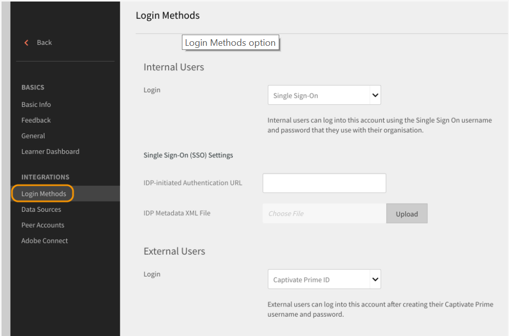
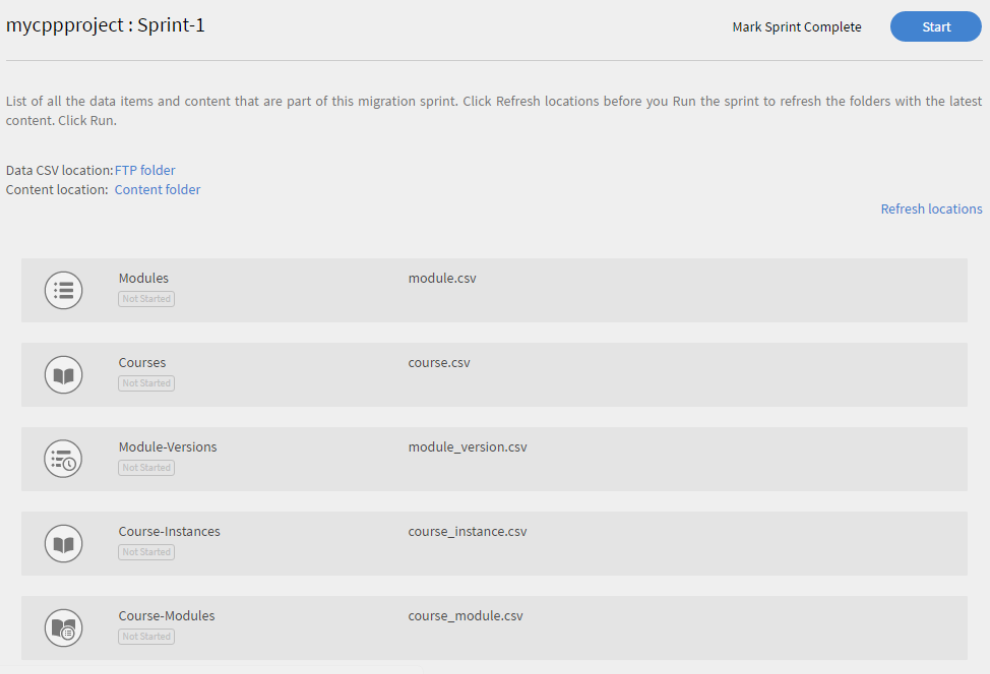

# Guía de implementación de Learning Manager: sección 2

## Configuración técnica {#technicalsetup}

La configuración técnica de su cuenta de Learning Manager la necesitan principalmente los usuarios empresariales. En este documento se explica la configuración del inicio de sesión único para su organización y la integración de Learning Manager con conectores de terceros.

### Configurar el inicio de sesión único {#configuresinglesignon}

Como administrador del sistema en el Admin Console, una de sus primeras tareas es definir y configurar un sistema de identidades con el que se autenticarán los usuarios finales. A medida que su organización adquiera licencias de Learning Manager, deberá aprovisionar dichas licencias a los usuarios finales. Para ello, necesitará una forma de autenticar a estos usuarios. Realice el siguiente procedimiento para configurar el inicio de sesión único para sus usuarios.

1. En la página de inicio de Learning Manager, haga clic en **[!UICONTROL ** Configuración **>** Métodos de inicio de sesión **.]**

   

1. En función del tipo de usuario, seleccione **[!UICONTROL ** Usuarios internos **o** Usuarios externos **.]**

1. Desde el **[!UICONTROL **Inicio de sesión**]**campo desplegable, seleccione **[!UICONTROL ** Inicio de sesión único **.]**

   

1. Para configurar el Inicio de sesión único, haga clic en **[!UICONTROL ** Cambiar **.]**

   

1. En el campo ****[!UICONTROL URL de autenticación iniciada por IDP]****, introduzca la dirección URL de autenticación proporcionada por su proveedor de servicios.

   

1. Haga clic en **[!UICONTROL **Cargar **]**junto a la**[!UICONTROL  **Archivo XML de metadatos de IDP **]******y cargue el archivo XML.
1. Haga clic en **[!UICONTROL ** Guardar **.]**
1. La autenticación SSO se ha configurado correctamente para su cuenta. En principio, debe poder iniciar sesión en su cuenta de Learning Manager mediante SSO.

   ***El SSO que configure en Learning Manager debe admitir SAML 2.0.***

## Migración de datos de usuario {#migrationofuserdata}

Como administrador, cuando su empresa adquiere Learning Manager, uno de los pasos cruciales que debe realizar es la migración. Es fundamental que mueva el contenido de formación y los datos de usuario existentes a Learning Manager. El siguiente flujo de trabajo de migración le ayuda a aprovechar las ventajas del LMS moderno e intuitivo sin perder ninguno de los datos heredados de su organización.

Learning Manager le permite migrar desde su LMS existente mediante un asistente paso a paso en sprints iterativos. Puede obtener una visibilidad completa del estado de cada sprint para garantizar que los alumnos experimenten un tiempo de inactividad cero al migrar los datos heredados a Adobe Learning Manager.

Para realizar el flujo de trabajo de migración, necesita los privilegios de administrador de integración. Como administrador, puede asumir la función de administrador de integración o asignar esta función a otro usuario.

**Podemos tomar la ayuda de Shaleen para crear una imagen.**

1. Requisito previo
1. Evaluación del contenido existente y los datos de los usuarios
1. Exportar y asignar los datos del LMS existente
1. Configurar carpetas FTP y BOX para la migración
1. Transferir alumnos a Learning Manager
1. Transferir contenido de aprendizaje a Learning Manager
1. Transferir los datos restantes a Learning Manager

### Requisito previo {#prerequisite}

Antes de iniciar el proceso de migración, debe realizar el siguiente requisito previo:

* Extracción de datos y contenido del LMS original y transformación de los datos a los formatos de archivo definidos por Learning Manager.
* Importación de usuarios mediante conectores FTP y BOX. El administrador de integración debe asegurarse de que los conectores estén configurados antes del proceso de migración.

***Se recomienda que los administradores prueben el proceso de migración en una cuenta de prueba antes de migrar los datos y el contenido al entorno de producción de Learning Manager. ***

### Evaluación y exportación de datos {#evaluatingandexportingdata}

El administrador de integración debe examinar primero los datos disponibles en el LMS actual. Como administrador de integración, solo puede migrar los siguientes objetos de aprendizaje:

* Módulo
* Curso
* Versión del módulo
* Instancia del curso
* Módulo del curso
* Aptitudes
* Nivel de aptitud
* Curso de aptitudes
* Certificación
* Curso de certificación
* Confirmación de certificación
* Programa de aprendizaje
* Curso del programa de aprendizaje
* Instancia del programa de aprendizaje
* Instancia del curso del programa de aprendizaje
* Inscripciones
* Inscripción de certificación
* Inscripción en el programa de aprendizaje
* Calificaciones del curso del usuario

Después de evaluar los datos existentes, debe asignarlos con las especificaciones de CSV estándar en Learning Manager. Descargue el siguiente archivo de muestra ***csv-specifications.zip*** que contiene siete hojas de Excel necesarias para esta migración. Estas hojas de Excel contienen especificaciones con descripciones para que pueda comprender cómo asignar los datos existentes a los campos de los archivos .csv.

<!--
<Download link to the zip file>
-->

Asegúrese de que cada archivo .csv contiene los datos de cada campo en el formato prescrito:

<table> 
 <tbody> 
  <tr> 
   <th width="7%" valign="top">
<strong>Ap. soc.</strong>
</th> 
   <th width="29%" valign="top">
<strong>Nombre de hoja de Excel</strong>
</th> 
   <th width="31%" valign="top">
<strong>Descripción del contenido</strong>
</th> 
   <th width="31%" valign="top">
<strong>Notas</strong>
</th> 
  </tr> 
  <tr> 
   <td>
1
</td> 
   <td>
module.xlsx
</td> 
   <td>
Metadatos para module.csv
</td> 
   <td>
 
</td> 
  </tr> 
  <tr> 
   <td>
2
</td> 
   <td>
course.xlsx
</td> 
   <td>
Metadatos para course.csv
</td> 
   <td>
Mencione un nombre de autor para un curso determinado, ya que a veces, si hay varios nombres de autor, no se muestran correctamente en la aplicación después de la migración. 
</td> 
  </tr> 
  <tr> 
   <td>
3
</td> 
   <td>
module_version.xlsx 
</td> 
   <td>
Metadatos para module_version.csv
</td> 
   <td>
Proporcione la ruta URL de la carpeta de la cuenta de Box donde cargó el contenido. 
</td> 
  </tr> 
  <tr> 
   <td>
4
</td> 
   <td>
course_instance.xlsx
</td> 
   <td>
Metadatos para course_instance.csv 
</td> 
   <td> </td> 
  </tr> 
  <tr> 
   <td>
5
</td> 
   <td>
course_module.xlsx
</td> 
   <td>
Metadatos para course_module.csv
</td> 
   <td> </td> 
  </tr> 
  <tr> 
   <td>
6
</td> 
   <td>
skill.xlsx
</td> 
   <td>
Metadatos para skill.csv
</td> 
   <td> </td> 
  </tr> 
  <tr> 
   <td>
7
</td> 
   <td>
skill_level.xlsx
</td> 
   <td>
Metadatos para skill_level.csv
</td> 
   <td> </td> 
  </tr> 
  <tr> 
   <td>
8
</td> 
   <td>
skill_course.xlsx
</td> 
   <td>
Metadatos para skill_course.csv
</td> 
   <td> </td> 
  </tr> 
  <tr> 
   <td>
9
</td> 
   <td>
Certification.xlsx
</td> 
   <td>
Metadatos para Certification.csv
</td> 
   <td> </td> 
  </tr> 
  <tr> 
   <td>
10
</td> 
   <td>
certification_course.xlsx
</td> 
   <td>
Metadatos para certification_course.csv
</td> 
   <td> </td> 
  </tr> 
  <tr> 
   <td>
11
</td> 
   <td>
certification_commit.xlsx
</td> 
   <td>
Metadatos para certification_commit.csv
</td> 
   <td> </td> 
  </tr> 
  <tr> 
   <td>
12
</td> 
   <td>
learning_program.xlsx
</td> 
   <td>
Metadatos para learning_program.csv
</td> 
   <td> </td> 
  </tr> 
  <tr> 
   <td>
13
</td> 
   <td>
learning_program_course.xls 
</td> 
   <td>
Metadatos para learning_program_course.csv 
</td> 
   <td> </td> 
  </tr> 
  <tr> 
   <td>
14
</td> 
   <td>
learning_program_instance.xlsx 
</td> 
   <td>
Metadatos para learning_program_instance.csv
</td> 
   <td> </td> 
  </tr> 
  <tr> 
   <td>
15
</td> 
   <td>
learning_program_instance_course_instance.xlsx 
</td> 
   <td>
Metadatos para learning_program_instance_course_instance.csv
</td> 
   <td> </td> 
  </tr> 
  <tr> 
   <td>
16
</td> 
   <td>
enrollments.xlsx
</td> 
   <td>
Metadatos para enrollments.csv
</td> 
   <td> </td> 
  </tr> 
  <tr> 
   <td>
17
</td> 
   <td>
certification_enrollment.xlsx
</td> 
   <td>
Metadatos para certification_enrollment.csv
</td> 
   <td> </td> 
  </tr> 
  <tr> 
   <td>
18
</td> 
   <td>
learning_program_enrollment.xlsx
</td> 
   <td>
Metadatos para learning_program_enrollment.csv
</td> 
   <td> </td> 
  </tr> 
  <tr> 
   <td>
19
</td> 
   <td>
User_course_grade.xlsx
</td> 
   <td>
Metadatos para User_course_grade.csv
</td> 
   <td>
Proporcione los datos necesarios de registros de alumnos en el archivo .csv aunque no sean obligatorios. Sin esta información, aunque el archivo .csv se procese para la migración, es posible que la aplicación Learning Manager no refleje ningún dato. 
</td> 
  </tr> 
 </tbody> 
</table>

***Learning Manager solo admite valores de fecha y hora en formato UTF 8 y de 32 bits. Es posible que aparezcan errores durante la migración si especifica una fecha en los archivos CSV con una fecha fuera del intervalo, como 2038-07-17T08:53:21.000Z o 1980-04-17T08:13:25.322Z.***

### Dependencias al importar datos a archivos csv {#dependencieswhileimportingdatatocsvfiles}

Al importar los datos existentes al formato csv estándar, tenga en cuenta las siguientes dependencias:

* module_version.csv depende de module.csv
* course_instance.csv depende de course.csv
* course_module.csv depende de course.csv, module.csv y module_version.csv
* course_instance.csv depende de course.csv
* enrollment.csv depende de course.csv
* user_course_grade.csv depende de course.csv y module.csv
* skill_course.csv depende de course.csv
* skill_level.csv depende de skill.csv
* learning_program_instance.csv depende de learning_program y learning_program_course.csv
* learning_program_course.csv depende de learning_program.csv
* learning_program_enrollment.csv depende de learning_program y learning_program_instance.csv
* learning_program_instance_course_instance.csv depende de learning_program.csv, learning_program_instance.csv y course_instance.csv
* certification_course.csv depende de certification.csv y course.csv
* certification_commit.csv depende de certification.csv y certification_course.csv
* certification_enrollment.csv depende de certification.csv, certification_course.csv y certification_enrollment.csv

Después de exportar los datos, guarde los archivos .csv en el equipo local. Los archivos ya están listos para su colocación en las carpetas FTP o BOX.

## Configurar carpetas FTP y BOX para la migración {#setupftpandboxfoldersforthemigration}

Antes de planificar e iniciar la migración real de todo el contenido, debe configurar primero las carpetas FTP y BOX. Necesita estas carpetas para colocar los archivos .csv en estas carpetas. Una vez que el contenido heredado, en forma de archivos .csv, esté disponible en las carpetas FTP y BOX, Learning Manager podrá utilizar los datos.

### Configuración de una cuenta de FTP {#setupanftpaccount}

En la página de inicio del administrador de integración, haga clic en **[!UICONTROL ** Solicitar carpeta CSV FTP **.]** En el cuadro de diálogo emergente que aparece, introduzca su ID de correo electrónico. Vaya al asistente en línea para crear la cuenta de FTP de Exavault. En cuanto cree su cuenta, podrá ver el proyecto de migración y las carpetas del proyecto de sprint en el FTP de Exavault.

Vea una instantánea de ejemplo de los archivos de proyecto y la carpeta de ExaVault como se muestra aquí:

Cuando se configura correctamente la carpeta FTP, el sistema muestra el mensaje &quot;Se ha completado la configuración de la carpeta FTP&quot;.

## Configuración de una cuenta BOX {#setupaboxaccount}

Para crear una cuenta BOX y configurar una carpeta BOX, siga estos pasos:

En la página de inicio del administrador de integración, seleccione Migración.

En la sección Configuración, haga clic en Solicitar una carpeta de Box.

En el campo ****[!UICONTROL Introduzca Correo electrónico]****, introduzca el ID de correo electrónico en el que desea recibir las instrucciones de inicio de sesión para conectarse a Box.

Haga clic en **[!UICONTROL ** Connect **.]**

Recibirá un correo de Box con un vínculo a la carpeta compartida. Si no tiene ninguna cuenta de Box, haga clic en Registrar y cree una. Las instrucciones de inicio de sesión se envían al ID de correo electrónico del administrador de la integración.

Después de guardar la conexión, la página de migración muestra el mensaje: &quot;Se ha completado la configuración de la carpeta de Box&quot;.

## Migración del contenido a Learning Manager {#migratingthecontenttocaptivateprime}

Antes de comenzar la migración, es importante tener en cuenta lo siguiente:

* Solo puede haber un proyecto de migración activo en una cuenta en cualquier momento dado. Dentro de un proyecto, solo puede haber un sprint activo en cualquier momento dado.
* No puede deshacer una ejecución que ya está en proceso. Sin embargo, puede usar la opción de eliminación que hay dentro de cada función de Learning Manager para deshacer cualquier migración de datos o contenido.

Tan pronto como se inicia el proyecto de migración, el proyecto pasa al estado &quot;En proceso de migración&quot;. En este estado, ningún otro usuario distinto del administrador de integración puede iniciar sesión en Learning Manager.

Cargar contenido de formación en las carpetas de contenido:

En la página de inicio del administrador de integración, haga clic en **[!UICONTROL Migración.]**

En la página de inicio de migración, el sistema muestra los proyectos de migración que ya se han creado en su organización.

Haga clic en **[!UICONTROL **Nuevo**]** en la esquina superior derecha de la página, para crear un proyecto de migración.

***Si aún no ha creado una carpeta FTP, se le pedirá que cree una cuenta de Exavault para la carpeta FTP. Este es el paso obligatorio antes de comenzar a crear un proyecto de migración. ***

En la página ****[!UICONTROL Crear un nuevo proyecto de migración]****, especifique el nombre del proyecto.

Especifique una etiqueta para el proyecto, el catálogo del curso y una descripción para el proyecto de migración. Los elementos de datos de migración se identifican utilizando la etiqueta de proyecto de migración. Si no tiene ningún catálogo de cursos específico, elija el catálogo predeterminado en la lista desplegable, todos los cursos que migre con un proyecto de migración se incluirán en el catálogo que elija en esta etapa. Si no elige ningún catálogo, todos los cursos migrados serán parte del catálogo predeterminado.

Haga clic en **[!UICONTROL Crear.]**

En la página Configuración de sprint, cree un sprint para su proyecto de migración. Un sprint, en el proceso de migración de Learning Manager, define un conjunto de elementos de migración que ha elegido migrar desde el LMS existente.

Especifique un nombre para el sprint y una descripción para el sprint.

Seleccione la ****[!UICONTROL Casilla de verificación Se han agregado o modificado usuarios desde la última ejecución]****, para sincronizar la lista de usuarios con la aplicación de Learning Manager. Si está migrando contenido y datos a la aplicación Learning Manager, puede que no sea necesario. Sin embargo, si transcurre un tiempo entre la migración de sprints anterior y la última, se recomienda sincronizar la lista de usuarios. Este paso permite que la base de datos de Learning Manager esté sincronizada con los usuarios del LMS.

***Se recomienda el paso Sincronización cuando se migran enrollment.csv y user_course_grade.csv. Este paso permite que la base de datos de Learning Manager esté sincronizada con la base de datos de migración y garantiza que todos los usuarios cuyos registros se vayan a migrar en el sprint estén disponibles en la base de datos de migración.***

Haga clic en **[!UICONTROL ** Siguiente **.]**

Haga clic en **[!UICONTROL **Inicio**]** para iniciar la migración del sprint con los datos y el contenido cargados. Haga clic en ****[!UICONTROL Actualizar]**** antes de iniciar la ejecución del sprint, sincroniza las carpetas de FTP y contenido con Learning Manager.

Puede hacer clic en ****[!UICONTROL Detener]**** en cualquier momento durante el proceso de migración del sprint para anular la migración del sprint.

El sistema muestra el estado de migración respecto a cada elemento de datos y contenido del sprint. Compruebe la cantidad de elementos correctos y fallidos como parte de la ejecución del sprint de migración.

Si está cargando contenido del módulo, asegúrese de que la ruta de la carpeta de contenido se proporciona en el archivo *module_version.csv *file. Si olvida este paso, puede recibir errores durante la migración. Por ejemplo, si está cargando contenido de un módulo con ritmo personalizado, como vídeos, debe especificar la ruta relativa de la URL de Box en el archivo *module_version.csv *file.

A continuación se proporciona una captura de pantalla de ejemplo del proceso de migración para su referencia. Como se muestra en la captura, puede ver el número de registros procesados para cada elemento de datos de migración, junto con el estado de elementos correctos y fallidos. Haga clic en Descargar registros de errores para los elementos fallidos a fin de descargar y ver los registros de errores. Puede solucionar los errores en CSV y cargarlos de nuevo en FTP.

Para ver la lista de todos los sprints de un proyecto de migración, haga clic en **[!UICONTROL **Sprint**]** en el panel de navegación izquierdo. Puede ver una lista de todos los sprints, la cantidad de ejecuciones que ejecutó para cada sprint, la fecha de inicio, la duración y el estado de finalización, tal como se muestra en la captura de pantalla de ejemplo a continuación.

Para ver la lista de todos los sprints de un proyecto de migración, haga clic en **[!UICONTROL **Sprint**]** en el panel de navegación izquierdo. Puede ver una lista de todos los sprints, la cantidad de ejecuciones que ejecutó para cada sprint, la fecha de inicio, la duración y el estado de finalización, tal como se muestra en la captura de pantalla de ejemplo a continuación.

Para ver la lista de todos los sprints de un proyecto de migración, haga clic en **[!UICONTROL **Sprint**]** en el panel de navegación izquierdo. Puede ver una lista de todos los sprints, la cantidad de ejecuciones que ejecutó para cada sprint, la fecha de inicio, la duración y el estado de finalización, tal como se muestra en la captura de pantalla de ejemplo a continuación.

***Antes de marcar el proyecto de migración como completado, asegúrese de que todos los sprints del proyecto se hayan completado. Una vez que haya marcado el proyecto de migración como completado, no podrá volver atrás, crear sprints en dicho proyecto. No puede realizar ninguna modificación en ese proyecto. Solo puede crear otro proyecto de migración y agregarle sprints.***

Después de migrar los datos de aprendizaje y el contenido del LMS heredado de su organización, compruebe si los datos y el contenido se importan correctamente. Puede verificarlo iniciando sesión como administrador y verificando la disponibilidad de los datos y el contenido de los módulos y cursos importados

Para obtener recursos útiles sobre migración, consulte:

* Solución de problemas de migración
* Preguntas más frecuentes sobre la carga de CSV

