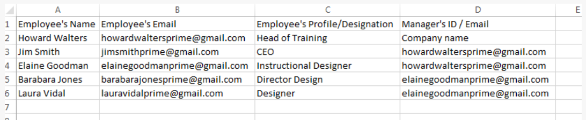
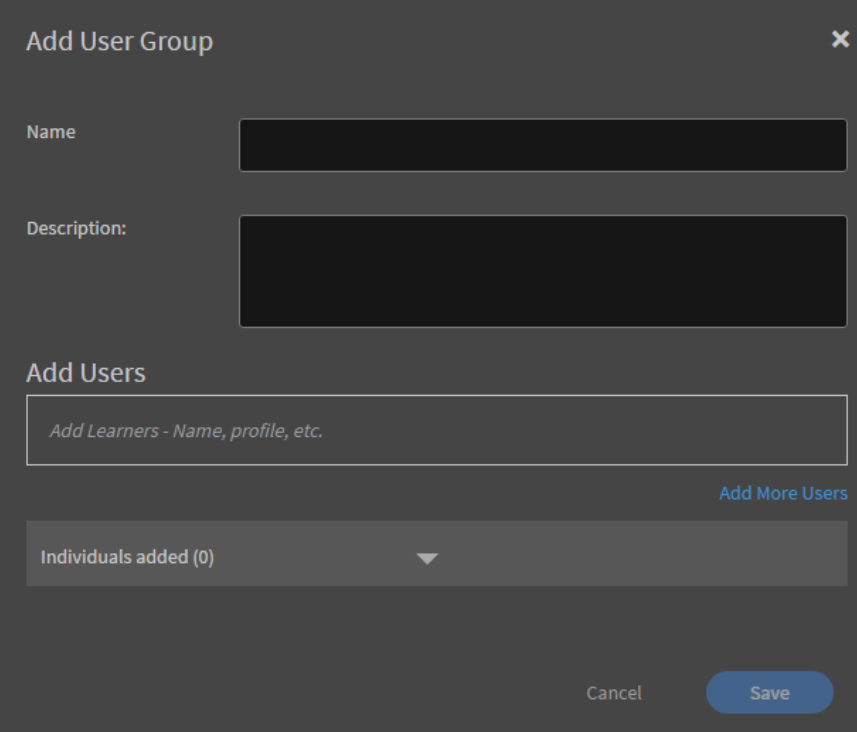

# Configurar usuarios en Learning Manager

## Usuarios internos y externos {#internalandexternalusers}

En cualquier sistema de gestión de aprendizaje, incluido Learning Manager, la administración de usuarios es un aspecto importante. Learning Manager permite clasificar usuarios como internos y externos. Los usuarios internos son aquellos que pertenecen a una organización o un grupo específicos. Por lo general, los usuarios de una empresa son usuarios internos. Estos usuarios tienen objetos de aprendizaje específicos con plazos concretos, asignados por sus responsables o el administrador.

Por el contrario, los usuarios externos suelen ser usuarios temporales de una cuenta específica de Learning Manager. Estos usuarios pueden acceder a objetos de aprendizaje específicos haciendo clic en un vínculo externo temporal que reciben por correo electrónico. Los perfiles de usuario externos suelen tener una fecha de vencimiento. Por ejemplo, una organización que realiza certificaciones para Java puede hacer que cualquier usuario que inicie sesión temporalmente complete los cursos pertinentes y, a continuación, intente obtener la certificación. Por lo general, los cursos de formación en aula y los cursos destinados a usuarios externos también tienen una capacidad limitada.

Siga leyendo para saber cómo añadir usuarios internos y externos en Learning Manager.

## Configurar usuarios externos {#setupexternalusers}

Como administrador, es posible que desee añadir usuarios externos, como empleados de organizaciones asociadas, a su cuenta de Learning Manager. Para añadir usuarios externos:

1. En la página de inicio de sesión **[!UICONTROL **Administrador**]*, haga clic en **[!UICONTROL **Usuarios**]** en el panel de navegación izquierdo.
1. En la página **[!UICONTROL **Usuarios**]**haga clic en **[!UICONTROL **Externo**]**en el panel de navegación izquierdo. El sistema muestra la página Usuarios externos con una lista de usuarios externos (si procede).
1. Haga clic en **[!UICONTROL **Agregar**]** en la esquina superior derecha de la página.

   

1. En el cuadro de diálogo emergente **[!UICONTROL **Añadir usuario**]**es, los siguientes campos son obligatorios:

   * **[!UICONTROL **Nombre de perfil**:]**Especifique el nombre del perfil externo que está creando.
   * **[!UICONTROL ** Correo electrónico del administrador **:]** Especifique la dirección de correo electrónico del administrador del usuario externo.
   * **[!UICONTROL ** Puestos asignados **:]** Especifique el número de alumnos que pueden inscribirse en el curso.
   * **[!UICONTROL ** Caducidad **:]** Especifique la fecha de caducidad después de la cual un usuario externo no puede registrar ni consumir el curso.

1. Haga clic en **[!UICONTROL ** Configuración avanzada **.]**
1. Si lo desea, defina las siguientes opciones al crear un perfil externo:

   * **[!UICONTROL ** Agregar imagen **:]** Arrastre y suelte la imagen que desee. Esta imagen se muestra en la página del alumno para los usuarios.
   * **[!UICONTROL ** Requisito de inicio de sesión **:]** Especifique el número de días en los que el usuario debe iniciar sesión. Si el usuario externo supera este periodo de inicio de sesión, el alumno no podrá acceder al objeto de aprendizaje ni utilizarlo.
   * **[!UICONTROL ** Dominios permitidos **:]** Especifique los dominios separados por una coma. Solo los usuarios con los dominios especificados pueden registrarse en la cuenta.
   * **[!UICONTROL ** Se requiere verificación por correo electrónico **:]** Active esta casilla de verificación si desea enviar un correo electrónico de verificación a los usuarios

1. Haga clic en **[!UICONTROL Guardar]**.

   

   Se muestra un cuadro de diálogo emergente con la dirección URL. Puede copiar esta dirección URL y enviarla a los usuarios externos. De forma predeterminada, se envía al usuario un mensaje de correo electrónico con esta dirección URL.

1. A medida que añada perfiles externos, estos se mostrarán en la **[!UICONTROL ** página Usuarios externos **(** Administrador **>** Usuarios **>** Usuarios externos **).]** El límite de licencias, la fecha de caducidad y los requisitos de inicio de sesión también se muestran para estos usuarios.
1. Puede editar la configuración de un usuario externo en cualquier momento. Para ello, haga clic en el nombre de usuario. Aparece el cuadro de diálogo **[!UICONTROL Editar inscripción externa]**. Modifique la configuración y haga clic en **[!UICONTROL ** Guardar **.]**
1. También puede volver a enviar el mensaje de correo electrónico de bienvenida o copiar la URL en cualquier momento. Para ello, haga clic en los iconos de correo electrónico/copiar URL situados junto al perfil externo.

   

## Pausar el perfil de usuario externo {#pausetheexternaluserprofile}

Después de añadir un grupo de usuarios externos a Learning Manager, también puede pausar el proceso de registro de usuarios externos. Al pausar, el proceso de registro de usuarios externos se bloquea. Sin embargo, este proceso solo funciona cuando los usuarios aún no se han registrado aceptando la invitación.

Para pausar los grupos de usuarios externos, haga clic en **[!UICONTROL **Acciones**]** en la esquina superior derecha de la página y elija **[!UICONTROL Pausar]**.

## Reanudar un perfil de usuario externo {#resumeexternaluserprofile}

En cualquier momento, puede revocar el bloqueo (pausa) seleccionando la opción Reanudar. Haga clic en **[!UICONTROL **Acciones**]**en la esquina superior derecha de la página y elija **[!UICONTROL Reanudar]**.

**[!UICONTROL Estados de usuario externo]**

En Learning Manager, los siguientes estados son aplicables a los usuarios externos:

* **Estado inactivo**: en este estado, el registro de usuarios externos ha caducado. Los administradores establecen la fecha de caducidad de los usuarios externos al incorporarlos mediante el flujo de trabajo Añadir usuario.
* **Estado activo**: en este estado, los usuarios externos pueden registrarse en la aplicación de Learning Manager e iniciar sesión en la aplicación.
* **Pausa**: en este estado, el proceso de registro está bloqueado para usuarios externos. Sin embargo, los usuarios que ya existen pueden seguir iniciando sesión.

## Configurar usuarios internos {#setupinternalusers}

Como administrador, es posible que desee configurar usuarios para su empresa u organización. Estos usuarios también se denominan usuarios internos. Los usuarios internos pueden iniciar sesión en la aplicación mediante el inicio de sesión único o mediante Adobe ID. Estos usuarios pueden acceder a los objetos de aprendizaje y utilizarlos según sus necesidades. Existen tres formas posibles de configurar los usuarios internos de una organización:

* Adición de usuarios de forma masiva mediante un archivo CSV
* Adición de usuarios mediante el registro automático
* Adición de un único usuario interno

## Adición de usuarios mediante un archivo CSV {#addingusersusingacsvfile}

Puede elegir este método para añadir usuarios internos si su número es elevado. Al utilizar un archivo CSV para añadir usuarios por primera vez, debe asignar el contenido de los datos del archivo a las etiquetas de la aplicación. Posteriormente, cuando añada nuevos usuarios o actualice los datos de estos, se conservará la misma asignación. Para añadir usuarios internos de forma masiva:

1. En la página **[!UICONTROL Inicio del administrador]**, haga clic en **[!UICONTROL **Usuarios**]**en el panel de navegación izquierdo.
1. Haga clic en **[!UICONTROL ** Agregar **>** Cargar un archivo CSV **.]**
1. En el cuadro de diálogo emergente, haga clic en **[!UICONTROL ** Importar **.]**
1. Vaya a la ubicación en la que haya guardado el archivo CSV. Haga clic en **[!UICONTROL Abrir]**.
1. Importe el archivo CSV y asigne su contenido con las etiquetas de la aplicación. Este paso solo se aplica al cargar el archivo CSV por primera vez.
1. Haga clic en **[!UICONTROL **Guardar**]**para guardar la asignación.
1. Haga clic en **[!UICONTROL **Agregar**]**para cargar el archivo CSV que ya está asignado a los datos de la aplicación.

### Consideraciones al crear el archivo CSV para la carga: {#considerationswhencreatingthecsvfileforupload}

Al crear el archivo CSV para cargar usuarios internos, a continuación se indican algunos de los campos obligatorios para los que debe introducir datos: Nombre del empleado, Correo electrónico del empleado, Perfil o designación del empleado y Jerarquía del responsable.

El nombre y el correo electrónico de cada empleado se pueden asignar directamente a los datos de la aplicación. Tenga en cuenta que debe indicar una dirección de correo electrónico en el archivo CSV como la del responsable. Puede definir el ID de responsable al crear el archivo CSV o especificar el ID de correo electrónico que corresponda al ID de responsable al cargar este archivo.

***Antes de agregar un ID como ID de responsable de empleado, asegúrese de que el responsable se agregue como empleado en el archivo CSV.***

***Asegúrese de que no haya espacios adicionales entre las entradas para cargar correctamente el archivo CSV.***

Vea una captura de pantalla de ejemplo de un archivo CSV aquí:

Para descargar un archivo CSV de muestra, descargue `<give link to zip file>`.

<!--Zip file reference, no source file-->

### Configuración del usuario raíz {#settinguprootuser}

Automatización de la importación masiva de usuarios.

## Adición de usuarios mediante el registro automático {#addingusersthroughselfregistration}

Además de añadir usuarios internos de forma masiva, también puede añadir usuarios mediante el registro automático. Puede usar el registro automático para permitir que los empleados se registren como alumnos en la cuenta de Learning Manager. Al crear un perfil de registro automático, se crea una dirección URL exclusiva. Comparta esta dirección URL con el empleado para permitirle registrarse en Learning Manager.

1. En la **[!UICONTROL página de inicio del administrador]**, haga clic en **[!UICONTROL Usuarios]** en el panel de navegación izquierdo.
1. Haga clic en **[!UICONTROL ** Agregar **>** Registro automático **.]**

   

1. En el cuadro emergente **[!UICONTROL Añadir usuario]**, especifique el nombre del empleado en el campo **[!UICONTROL Nombre de perfil]**.
1. En el campo **[!UICONTROL Nombre del responsable]**, escriba el nombre del responsable del empleado.
1. Si lo desea, puede añadir la imagen de perfil del empleado mediante el campo **[!UICONTROL Añadir imagen]**.
1. Haga clic en **[!UICONTROL Guardar]**.

   

   El sistema muestra otro cuadro de diálogo emergente con el mensaje de que el perfil se ha creado correctamente. En este cuadro de diálogo, también se genera una dirección URL exclusiva.

1. Comparta esta dirección URL con el empleado para permitir que este se registre como alumno.

   

## Añadir usuarios individuales en Learning Manager {#addsingleusersincaptivateprime}

La adición de usuarios individuales es el tercer método con el que puede añadir usuarios internos a su cuenta. Este es el procedimiento ideal cuando se desea añadir unos pocos usuarios. Para añadir un único usuario:

1. En la **[!UICONTROL página de inicio del administrador]**, haga clic en **[!UICONTROL Usuarios]** en el panel de navegación izquierdo.
1. Haga clic en **[!UICONTROL ** Agregar **>** Usuario único **.]**

1. En el cuadro de diálogo emergente Añadir usuario, especifique los siguientes detalles de los usuarios:

   * **[!UICONTROL Nombre]** **[!UICONTROL :]** Especifique el nombre del empleado o usuario interno. Este campo es obligatorio.

   * **[!UICONTROL Correo electrónico]** **[!UICONTROL :]** Especifique el Id. de correo electrónico del empleado. Este campo es obligatorio.

   * **[!UICONTROL Perfil]** **[!UICONTROL :]** Especifique la designación o el cargo del empleado.

   * **[!UICONTROL ** Nombre del administrador **:]** Especifique el nombre del administrador. Para poder especificarlo aquí, el responsable debe estar ya incluido en la base de datos.
   * **[!UICONTROL ** DOJ **:]** Especifique la fecha de unión del empleado.
   * **[!UICONTROL **Ubicación**:]**Especifique la ubicación del empleado. Por ejemplo, si su organización se encuentra en varias ubicaciones geográficas, especifique el lugar donde se encuentra el empleado.

   

1. Haga clic en **[!UICONTROL Añadir]**.
1. El sistema muestra un mensaje que indica que el usuario se ha añadido correctamente. El usuario recibe un vínculo de verificación en el ID de correo electrónico especificado. El usuario puede hacer clic en este vínculo para activar su cuenta y comenzar a acceder a Learning Manager.

   

## Administración de grupos de usuarios en Learning Manager {#managingusergroupsincaptivateprime}

El grupo de usuarios no es más que un conjunto de usuarios pertenecientes a una categoría definida. Como administrador, puede utilizar grupos de usuarios para seleccionar alumnos rápidamente en función de sus atributos. Además, puede asignar rápidamente logotipos o catálogos al grupo de usuarios y generar informes personalizados sobre su progreso.

Hay dos tipos de grupos de usuarios en Learning Manager: Personalizados y Generados automáticamente. Al añadir alumnos a su cuenta, se crean automáticamente algunos grupos predeterminados en función de las funciones y propiedades de los usuarios de su cuenta. Estos grupos son los que se generan automáticamente. Por ejemplo, un grupo con todos los alumnos o todos los autores.

***No se puede editar el nombre y la descripción de los grupos generados automáticamente.***

Para ver los grupos de usuarios generados automáticamente en Learning Manager, en el panel izquierdo, haga clic en **[!UICONTROL Generado automáticamente]**. La aplicación muestra una lista de todos los grupos de usuarios generados automáticamente disponibles para su cuenta.

También puede crear grupos personalizados con una lista seleccionada de usuarios en Learning Manager. Los grupos personalizados permiten especificar un nombre, una descripción y los atributos del grupo de usuarios. Los grupos personalizados creados en Learning Manager son de naturaleza dinámica. Es decir, si se agregan nuevos usuarios con atributos similares, se agregan automáticamente a estos grupos de usuarios.

## Crear grupos de usuarios personalizados {#createcustomusergroups}

1. En la página de inicio del administrador de Learning Manager, haga clic en **[!UICONTROL Usuarios]**.
1. En la página Grupos de usuarios personalizados, haga clic en **[!UICONTROL **Agregar**]** en la esquina superior derecha de la página.

   El sistema muestra el cuadro de diálogo **[!UICONTROL Añadir grupo de usuarios]**.

   

1. Especifique el nombre y la descripción del grupo de usuarios. Por ejemplo, Dev-Users, que incluye usuarios del equipo de desarrollo de productos.
1. Agregue usuarios al grupo de usuarios personalizado especificando el nombre de usuario o el perfil del usuario en el campo **[!UICONTROL ** Agregar usuarios **.]**
1. Para agregar más usuarios al grupo personalizado, haga clic en **[!UICONTROL ** Agregar más usuarios **.]**
1. Después de agregar todos los usuarios, haga clic en **[!UICONTROL Guardar]**para guardar el grupo de usuarios personalizado.

