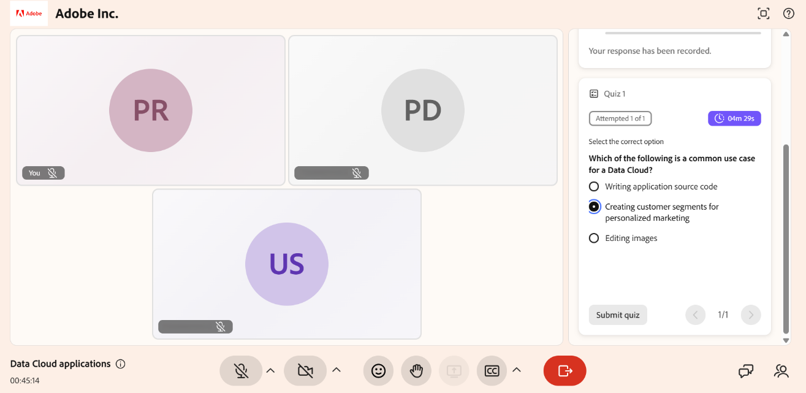
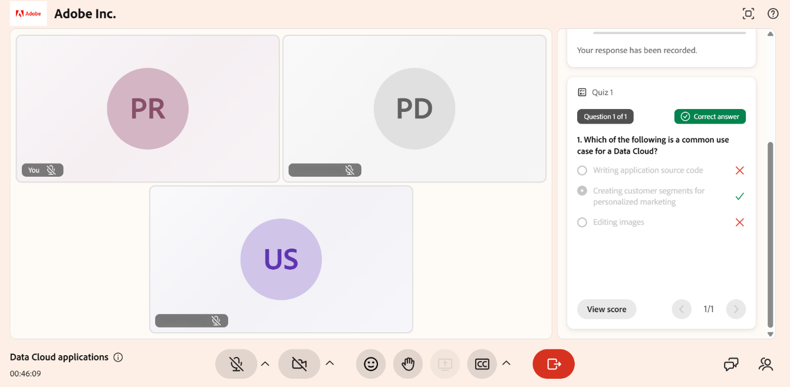

# Intentar una prueba

Los cuestionarios te ayudan a evaluar tu comprensión del contenido de la sesión. Cuando un instructor inicia una prueba, aparece en la interfaz de la sesión, donde puede responder preguntas y enviar las respuestas.

Las respuestas se guardan automáticamente a medida que avanza por la prueba. Si el instructor establece un límite de tiempo, un temporizador muestra el tiempo restante. Después de enviar la prueba, es posible que pueda ver su puntuación y revisar las respuestas correctas e incorrectas, según la configuración del anfitrión.

En este artículo se explica cómo realizar una prueba, enviar las respuestas y revisar los resultados.

## Hacer el cuestionario

Puede comenzar la prueba inmediatamente y responder a las preguntas mientras la sesión está en curso.

Para intentar una prueba:

1. Seleccione **Realizar prueba** cuando aparezca la prueba.

1. Selecciona tu respuesta.

1. Seleccione **Enviar**. Sus respuestas se envían para su evaluación.

Si se establece un límite de tiempo, el tiempo restante se muestra mientras intenta realizar la prueba. Puede pasar de una pregunta a otra según sea necesario antes de enviarla.

Pantalla 
*La interfaz de la ficha Prueba muestra las instrucciones antes de iniciar la prueba.*

## Revisar el intento de prueba

Después de enviarlo, puede revisar un resumen de su intento. El resumen muestra el número de preguntas que ha intentado responder y el estado de finalización de la prueba.

Si el instructor lo habilita, también puede revisar las respuestas después del envío. Esto le permite ver su puntuación, las respuestas seleccionadas e identificar las respuestas correctas e incorrectas.

*Seleccione Ver puntuación para ver las respuestas correctas e incorrectas.*
