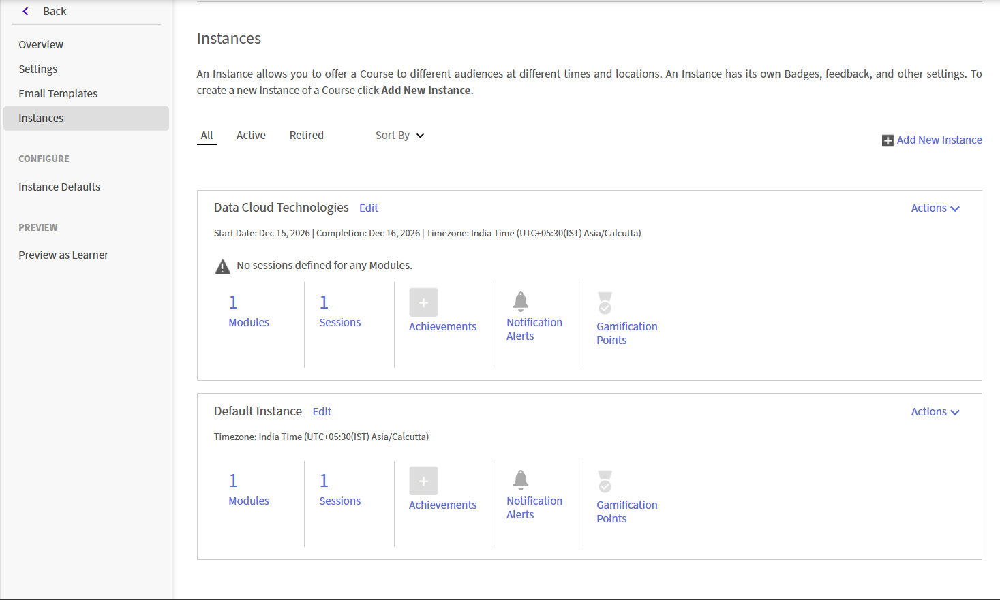

# Crear una sesión de Live Hub

Use Live Hub para impartir formación en directo con instructor en un curso de Adobe Learning Manager. Puede combinar sesiones de Live Hub con contenido con ritmo personalizado para crear una experiencia de aprendizaje mixta.

Cuando añada un módulo de clase virtual a un curso, seleccione la herramienta de formación virtual que alojará la sesión en directo. Puedes elegir **Live Hub**, la solución integrada de formación virtual con tecnología de IA de Adobe, o usar un proveedor externo como **Adobe Connect**.

>[!NOTE]
>
> Live Hub aparece como una opción de Live Virtual Training Tool solo si el administrador lo ha activado en la configuración de Live Hub. Si no está habilitado, utilice en su lugar un proveedor externo como Adobe Connect. Vea [Habilitar Live Hub](../administrators/feature-summary/enable-live-hub.md) para obtener más información.

Al crear un curso de Live Hub, puede:

* Añada una o más sesiones de Live Hub a un curso.

* Seleccione Instructores manualmente o utilice las recomendaciones de instructores asistidos por IA.

* Configure el curso con una única instancia predeterminada o cree varias instancias para diferentes programaciones o audiencias.

En este artículo se explica cómo crear un curso de Live Hub, asignar instructores y configurar instancias del curso.

## Crear un curso de Live Hub

Se crea automáticamente una instancia predeterminada al añadir un módulo de clase virtual. Esto resulta útil cuando se desea distribuir una sesión única o una programación estándar para todos los alumnos.

Para crear un curso de Live Hub:

1. Inicie sesión en Adobe Learning Manager como autor.

1. Seleccione **Crear cursos**.

1. En la página **Catálogo de cursos**, seleccione **Agregar** y, a continuación, introduzca los siguientes detalles:

   1. Nombre del curso

   1. Breve descripción

   
   *Escriba el nombre del curso y una breve descripción antes de agregar módulos al curso.*

1. Seleccione **Contenido** > **Agregar módulos** en la sección **Módulos**.   Aparece la ventana emergente **Seleccionar tipo de módulo**.

1. Selecciona **Clase virtual** e introduce los detalles del curso, como el título, la descripción, la zona horaria, la fecha de inicio y finalización, y la hora de inicio y finalización.

1. Seleccione **Centro de actividades** en **Herramientas de formación virtual en vivo**.

   
   *Seleccione Live Hub para habilitar las recomendaciones de instructores con tecnología de inteligencia artificial para la sesión.*

1. Añada instructores mediante una de las siguientes opciones:

   1. Escriba los nombres de los instructores en el campo **Instructores**.

   1. Seleccione **Buscar instructores usando IA** para ver los instructores recomendados por IA. Consulte [Añadir instructores mediante el buscador de instructores](#add-instructors-using-instructor-finder) para obtener más información.

1. Seleccione **Agregar** > **Guardar**.

1. Seleccione las aptitudes requeridas en la sección **Aptitudes del curso**.

1. Seleccione **Nivel de aptitud** y, a continuación, revise o actualice **Créditos máximos**.

   
   *Asigne una aptitud y un nivel de aptitud para definir los créditos que obtienen los alumnos al completar el curso.*

1. Seleccione **Guardar** > **Publish**. El curso se crea correctamente en Adobe Learning Manager.

## Crear una instancia de curso

Un administrador puede crear una o más instancias de un curso para ofrecerlo a diferentes audiencias, programaciones o ubicaciones. Cada instancia tiene sus propios detalles de la sesión, por lo que puede asignar diferentes instructores, recomendaciones del buscador de instructores y intervalos a cada instancia del mismo curso.

Para crear una instancia de curso:

1. Inicie sesión en Adobe Learning Manager como autor.

1. Abra el curso y, a continuación, seleccione **Instancias** en el panel izquierdo.

   Página 
   *La instancia predeterminada se crea automáticamente al agregar un módulo de clase virtual.*

1. Seleccione **Agregar nueva instancia**.

1. Escriba el **Nombre de instancia**, la **Fecha de inicio** y la **Fecha límite de finalización**. Seleccione **Mostrar más opciones** para configurar opciones adicionales.

   
   *Especifique un nombre de instancia, una fecha de inicio y una fecha límite de finalización para crear una nueva instancia de curso.*

1. Seleccione **Guardar**.   La nueva instancia se agrega a la lista **Instancias**.

   
   *La nueva instancia aparece junto a la instancia predeterminada en la lista Instancias.*

1. Seleccione el número en **Sesiones** para ver los **Detalles de la sesión**.

   Icono De Edición De Detalles De Sesión 
   *Los detalles de la sesión muestran qué campos de tiempo, instructor y ubicación aún deben configurarse.*

1. Seleccione el icono de editar (lápiz) situado junto a los detalles de la sesión para abrir el panel de configuración de la sesión.

   
   *Configurar la programación, el instructor y la ubicación para una instancia de sesión específica.*

1. En el campo **Instructores**, escribe los nombres manualmente o selecciona **Buscar instructores usando IA** para instructores recomendados por IA. Consulte [Añadir instructores mediante el buscador de instructores](#add-instructors-using-instructor-finder) para obtener más información.

1. Indique los detalles de **Ubicación** y, a continuación, seleccione **Guardar**. La sesión se actualiza con los detalles de intervalos, instructor y ubicación configurados.

## Añadir instructores mediante el buscador de instructores

En lugar de buscar y añadir instructores manualmente, usa **Instructor Finder** para recibir recomendaciones de instructores basadas en IA para la sesión. El buscador de instructores busca instructores en función de los detalles del curso y las aptitudes requeridas, al tiempo que tiene en cuenta el calendario de vacaciones de la organización, la disponibilidad del instructor y la utilización del instructor para sugerir a los instructores más adecuados. Vea [Agregar y administrar instructores](./instructor-management.md) para obtener más información.

>[!NOTE]
>
> El Buscador de instructores solo aparece si el administrador ha activado el Ayudante del Buscador de instructores en la configuración de Live Hub. Vea [Habilitar Live Hub](../administrators/feature-summary/enable-live-hub.md) para obtener más información.

Para añadir instructores mediante el buscador de instructores:

1. Vaya a la sección **Instructores** en el módulo **Clase virtual**.

1. Seleccione **Buscar instructores usando IA**.   El panel **AI Assistant** se abre en el lado derecho.

   
   *Use el panel Asistente de inteligencia artificial para obtener recomendaciones del instructor y de la franja horaria según los detalles de la sesión.*

1. Revise la lista de instructores recomendados. El buscador de instructores recomienda instructores en función de los requisitos de sesión y las aptitudes del curso. Recommendations también tiene en cuenta la disponibilidad del instructor, su utilización y el calendario de vacaciones de su organización. Vea **Administración de instructores** para obtener más información.

1. Desplácese hasta el instructor que desee asignar y, a continuación, seleccione **Agregar**.   El instructor seleccionado se agrega al campo **Instructores** como una etiqueta.

## Inscribir alumnos en el curso

Los alumnos pueden inscribirse en un curso de Live Hub de las dos formas siguientes:

1. Un **administrador** inscribe alumnos en el curso según los requisitos de la organización. Vea [Crear instancias de curso y rutas de aprendizaje](https://experienceleague.adobe.com/en/docs/learning-manager/using/admin/courses) para obtener más información.

1. Los alumnos pueden inscribirse directamente en el curso desde la página **Catálogo**. Si el curso está configurado para la inscripción automática, los alumnos se inscriben inmediatamente y pueden acceder al curso desde **My Learnings**. Vea [Mis aprendizajes](https://experienceleague.adobe.com/en/docs/learning-manager/using/learner/courses) para obtener más información.

Después de inscribirse, los alumnos se añaden al curso y reciben una notificación en su cuenta de Adobe Learning Manager. Según la configuración de notificaciones por correo electrónico de la cuenta, los alumnos también pueden recibir una invitación para unirse al curso por correo electrónico.

## Personalizar la marca de la sala Live Hub

Los administradores pueden personalizar el aspecto de las salas de Live Hub para adaptarlo a la marca de su organización. Usa la configuración de **Temas** en Adobe Learning Manager para aplicar colores de marca, logotipos y estilos visuales en las sesiones de Live Hub.

La construcción de marca personalizada ayuda a crear una experiencia de aprendizaje coherente y garantiza que las sesiones de formación en vivo reflejen la identidad de su organización.

Para obtener más información sobre la configuración de temas, consulte el artículo [Temas de color](../administrators/feature-summary/themes.md#color-themes).
