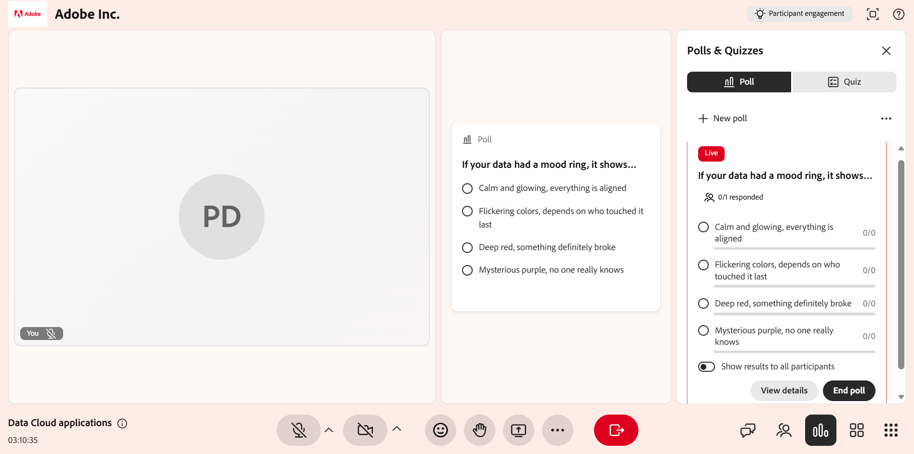
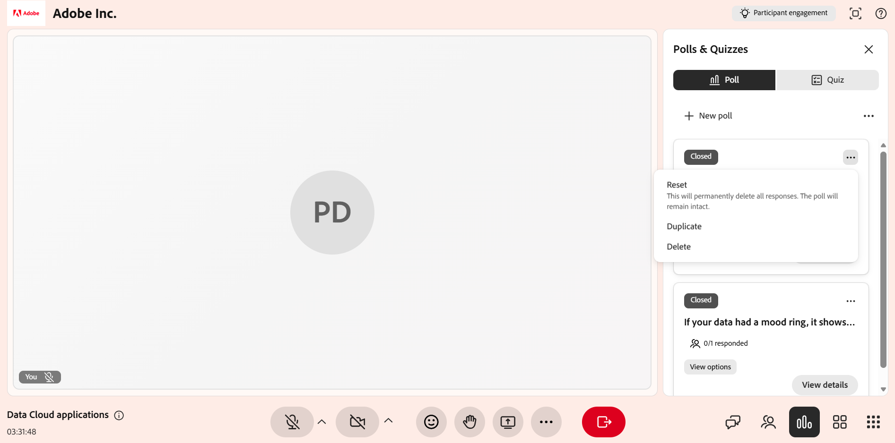

# Crear e iniciar una encuesta

Utilice las encuestas para que sus sesiones de Live Hub sean más interactivas y atractivas. Desde el panel **Encuestas y cuestionarios**, puedes crear encuestas manualmente seleccionando tipos de preguntas como de opción múltiple o respuesta corta, o generarlas usando IA con las opciones **Icebreaker** y **Comprobación de conocimientos**.

Durante una sesión en directo, puede iniciar y cerrar encuestas, supervisar las respuestas en tiempo real, revisar las respuestas de los participantes y elegir si desea compartir los resultados con los alumnos. Este artículo explica cómo crear, administrar y compartir encuestas durante una sesión de Live Hub.

## Crear una encuesta manualmente

Cree encuestas para formular preguntas y recopilar respuestas de los alumnos durante una sesión en directo. Puedes crear encuestas por adelantado o sobre la marcha para comprobar la comprensión, recopilar comentarios y fomentar la participación.

Para crear un sondeo manualmente:

1. Seleccione  en la barra de control.

1. Selecciona la pestaña **Encuesta** y luego **Crea tu propia**.

   
   *Selecciona Crear tu propio proyecto en la pestaña Encuesta para crear una encuesta manualmente.*

1. En la pestaña **Encuesta**, seleccione uno de los siguientes tipos de preguntas en el menú desplegable:

   1. Opción múltiple

   1. Respuesta corta

1. Configurar el sondeo en función del tipo de pregunta seleccionado:

   1. **Opción múltiple**: Introduzca cada opción de respuesta en una línea independiente. De forma predeterminada, hay tres campos de opciones disponibles. Puede hacer lo siguiente:

      1. Para agregar más opciones, seleccione **Agregar opción**.

      1. Para permitir varias selecciones, habilite **Varias respuestas correctas**.

   1. **Respuesta corta**: No se requieren opciones de respuesta. Los alumnos introducen las respuestas en un campo de texto.

1. Seleccione **Guardar**.

## Creación de una encuesta con IA

Puedes usar opciones asistidas por IA en el panel **Encuestas y cuestionarios** para generar preguntas de encuesta sin crearlas manualmente. Hay dos tipos de sondeo de inteligencia artificial disponibles:

* **Encuesta de infractores**: Genera preguntas introductorias o de conversación para fomentar la participación al comienzo de una sesión o al reanudarla después de una pausa.

* **Encuesta de comprobación de conocimientos**: Genera preguntas de comprobación de conocimientos para ayudar a los instructores a comprender cómo siguen el tema los alumnos y ajustar su enfoque si es necesario.

### Crear una encuesta de Icebreaker

Cree una encuesta de rompehielos para atraer a los alumnos al principio de una sesión. Las encuestas de iniciación ayudan a los instructores a comprender las preferencias, expectativas o conocimientos previos de los alumnos, y a fomentar la participación en las primeras fases de la sesión.

Para crear un sondeo de Icebreaker:

1. Seleccione  en la barra de control.

1. Seleccione la pestaña **Encuesta** y luego **Encuesta de infrarrojos**.

1. Revise las opciones de pregunta y respuesta generadas y modifíquelas si es necesario. Puede hacer lo siguiente:

   * Edite la pregunta.

   * Actualizar o quitar las opciones de respuesta existentes.

   * Cambie el tipo de pregunta a **Respuesta corta**.

   * Seleccione **Agregar opción** para incluir opciones adicionales.

   * Habilite **Varias respuestas correctas** en el caso de preguntas de opción múltiple.

   
   *Generar y personalizar una encuesta Icebreaker con IA en la ficha Encuesta.*

1. (Opcional) Seleccione **Regenerar encuesta** para generar una nueva pregunta.

1. (Opcional) Utilice las opciones de miniaturas hacia arriba o hacia abajo para proporcionar comentarios sobre el contenido generado.

1. Seleccione **Guardar**.

### Crear una encuesta de comprobación de conocimientos

Cree una encuesta de comprobación de conocimientos para evaluar la comprensión del alumno durante una sesión y la comprensión de un tema por parte de los alumnos. Estas encuestas ayudan a los instructores a identificar lagunas de conocimiento, validar conceptos clave y ajustar el ritmo o el enfoque de la sesión en función de las respuestas de los alumnos.

Para crear una encuesta de comprobación de conocimientos:

1. Seleccione  en la barra de control.

1. Seleccione la pestaña **Encuesta** y luego **Comprobación de conocimientos**.

1. Revise las opciones de pregunta y respuesta generadas y modifíquelas si es necesario. Puede modificar lo siguiente:

   * Edite la pregunta.

   * Actualizar o quitar las opciones de respuesta existentes.

   * Cambie el tipo de pregunta.

   * Seleccione **Agregar opción** para incluir opciones adicionales.

   * Habilitar **Tiene varias respuestas** en caso de preguntas de opción múltiple.

   Encuesta de 
   *Generar y personalizar una encuesta de comprobación de conocimientos con IA en la ficha Encuesta.*

1. (Opcional) Seleccione **Regenerar encuesta** para reemplazar la pregunta actual por una nueva.

1. (Opcional) Utilice las opciones de miniaturas hacia arriba o hacia abajo para proporcionar comentarios sobre el contenido generado.

1. Seleccione **Guardar**.

## Iniciar una encuesta

Una vez creada y guardada una encuesta, aparece en el panel **Encuestas y cuestionarios**, en la pestaña **Encuestas**. Puede acceder a las encuestas guardadas en cualquier momento durante la sesión y abrirlas para suscitar el interés de los alumnos y recopilar respuestas en tiempo real.

Para iniciar una encuesta:

1. Seleccione  en la barra de control.

1. Seleccione la ficha **Encuesta**.

1. Seleccione una encuesta guardada de la lista.

1. Seleccione **Iniciar encuesta**.

>[!NOTE]
>
> El sondeo se hace visible para los alumnos y los instructores pueden ver los resultados del sondeo en tiempo real. Los alumnos pueden actualizar sus respuestas mientras la encuesta permanece activa.

*Seleccione Iniciar encuesta para comenzar a recopilar respuestas durante la sesión.*

## Compartir los resultados de la encuesta con los participantes

Puede compartir los resultados de las encuestas con los participantes en cualquier momento durante la sesión. Seleccione **Compartir resultados con todos los participantes** para que los resultados sean visibles en tiempo real. Cuando se comparten los resultados, la encuesta muestra una etiqueta **Results live** que indica que los alumnos pueden ver los resultados de la encuesta.

*Seleccione Compartir resultados con todos los participantes para mostrar los resultados de la encuesta en tiempo real.*

## Cerrar una encuesta

Cuando ya no desee que los participantes respondan, puede cerrar la encuesta.

Para cerrar una encuesta:

1. Seleccione  en la barra de control.

1. Vaya a la encuesta activa en la pestaña **Encuesta**.

1. Seleccione **Finalizar encuesta**.

*Seleccione Finalizar encuesta para dejar de recopilar respuestas y cerrar la encuesta.*

Una vez finalizada la encuesta, aparece el estado **Cerrado** encima de la pregunta de la encuesta.

## Ver resultados de la encuesta

Como instructor, puede ver los resultados de las encuestas durante una sesión. Estos resultados se actualizan en tiempo real cuando los alumnos envían o actualizan sus respuestas. De forma predeterminada, la vista de encuesta muestra la distribución general de las respuestas de cada opción.

Para ver respuestas detalladas:

1. Abra la pestaña **Encuesta**.

1. Seleccione el sondeo activo o cerrado.

1. Seleccione **Ver respuestas**.

Se abre una ventana emergente que muestra los nombres de los participantes, sus respuestas seleccionadas y varias entradas para preguntas que permiten varias respuestas.

*Ver nombres de participantes y sus respuestas seleccionadas en la ventana Respuestas de encuesta.*

Los alumnos pueden ver los resultados de las encuestas en tiempo real a medida que se envían o actualizan las respuestas.

## Administrar una encuesta cerrada

Después de cerrar una encuesta, puede administrarla desde el menú de opciones (los tres puntos) de la encuesta. Estas opciones le permiten reutilizar el sondeo, crear una copia o quitarla de la sesión.

Para administrar un sondeo cerrado:

1. En , seleccione la pestaña **Encuesta**.

1. Vaya a la encuesta cerrada y seleccione las opciones (**...**) del menú.

   
   *Usar el menú de opciones para restablecer, duplicar o eliminar una encuesta cerrada.*

1. Seleccione una de las opciones siguientes:

| **Opción** | **Descripción** |
|----|----|
| **Restablecer** | Elimina permanentemente todas las respuestas a la encuesta, manteniendo intacta la propia encuesta. Utilice esta opción para volver a realizar la misma encuesta y recopilar un nuevo conjunto de respuestas. |
| **Duplicar** | Crea una copia del sondeo, incluidas sus opciones de pregunta y respuesta, para que pueda reutilizarlo o ajustarlo sin tener que volver a crearlo desde cero. |
| **Eliminar** | Elimina permanentemente el sondeo y todas sus respuestas de la sesión. Esta acción no se puede deshacer. |

>[!NOTE]
>Si encuentra un error al duplicar, eliminar o restablecer una encuesta, consulte la [Guía de solución de problemas de Live Hub](../kb/troubleshooting-guide-for-live-hub.md#poll-tab-issues) para obtener una lista de mensajes de error comunes y cómo resolverlos.
