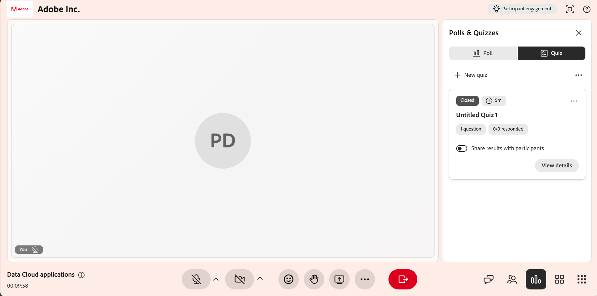

# Crear y administrar una prueba

Como instructor, la función Prueba le permite medir el grado en el que los alumnos han comprendido un tema durante una sesión de Live Hub. A diferencia de una encuesta rápida de una sola pregunta, una prueba te permite crear una evaluación estructurada de varias preguntas con preguntas de opción múltiple y respuesta múltiple, puntuación y ajustes como límites de tiempo y pregunta aleatoria u orden de opciones.

En este artículo se describen todas las acciones de prueba disponibles para los instructores, desde crear una prueba hasta compartir sus resultados.

## Cree una prueba

Puede crear una prueba para evaluar la comprensión del alumno durante una sesión. Los cuestionarios pueden incluir diferentes tipos de preguntas y respaldar la puntuación para realizar un seguimiento del rendimiento. Si no hay pruebas disponibles, puedes crear una nueva prueba desde la pestaña **Prueba**.

Para crear una prueba:

1. Seleccione la pestaña **Prueba** en el panel **Encuestas y cuestionarios**.

   
   *Selecciona la pestaña Prueba del panel de encuestas y cuestionarios.*

1. Seleccione **Crear nueva prueba**. Se abre una nueva prueba denominada **Prueba sin título 1**.

1. En el campo de pregunta, introduzca su pregunta.

1. Introduzca las opciones de respuesta en los campos de opción. De forma predeterminada, se proporcionan tres opciones. Puede realizar lo siguiente:

   1. Seleccione **+ Agregar opción** para agregar otra opción.

   1. Seleccione **X** junto a una opción para quitarla.

   1. Arrastre el controlador junto a una opción para reordenarla.

1. Marque la respuesta correcta:

   1. Para definir una única respuesta correcta, seleccione el botón de opción junto a la opción correcta.

   1. Para permitir más de una respuesta correcta, habilite el botón de alternancia **Varias respuestas correctas** y, a continuación, seleccione el botón de opción para cada opción correcta.

1. Para agregar preguntas adicionales, seleccione **+ Agregar pregunta**.

   
   *La interfaz de la ficha Prueba muestra la opción para crear una prueba.*

1. Seleccione **Listo**.

1. Seleccione **Guardar**. El cuestionario ya está disponible para iniciarse.

## Establecer un límite de tiempo para la prueba

Puede establecer un límite de tiempo opcional para que los alumnos completen la prueba en una duración fija. El límite de tiempo se establece a partir del temporizador en la parte superior de la prueba.

Para establecer un límite de tiempo:

1. Seleccione el icono Temporizador en la parte superior de la prueba.

1. Habilite **Establecer límite de tiempo**.

1. Establezca la duración en minutos.

*La interfaz de la pestaña Prueba muestra la opción de establecer el límite de tiempo de prueba.*

## Editar una prueba

Actualice las preguntas, modifique las opciones de respuesta o cambie el orden de las preguntas antes de iniciar la prueba. Una vez iniciada la prueba, no se puede editar.

Para editar una prueba:

1. Seleccione la pestaña **Prueba**.

1. Vaya a la prueba que desea editar.

1. Seleccione el icono de edición (lápiz).

1. Realice cualquiera de las siguientes acciones:

   1. Edite el texto de la pregunta.

   1. Actualizar o quitar opciones de respuesta.

   1. Seleccione las respuestas correctas.

   1. Agregue una nueva pregunta usando **Agregar pregunta**.

   1. Elimine una pregunta si ya no es necesaria.

   
   *La interfaz de la ficha Prueba muestra la opción de editar una prueba.*

1. Seleccione **Guardar** para aplicar los cambios.

## Iniciar una prueba

Después de crear y guardar una prueba, aparece en la pestaña **Prueba** con una etiqueta **Nueva**. El inicio hace que el cuestionario sea visible para los alumnos y les permite intentar responder a las preguntas en tiempo real.

Para iniciar una prueba:

1. Seleccione la pestaña **Prueba**.

1. En la lista de pruebas guardadas, seleccione **Iniciar prueba**.

Cuando lanzas un cuestionario, aparece en el panel **Encuestas y cuestionarios** para que los alumnos lo respondan. Si se establece un límite de tiempo, también puede ampliar la duración de la prueba seleccionando **+1 min** durante la prueba en vivo.

*La interfaz de la pestaña Prueba muestra la prueba iniciada para los participantes.*

>[!NOTE]
>Si se produce un error al crear o iniciar una prueba, consulte la [Guía de solución de problemas de Live Hub](../kb/troubleshooting-guide-for-live-hub.md#quiz-tab-issues) para obtener una lista de los mensajes de error más comunes y cómo resolverlos.

## Ver resultados de pruebas

Ver los resultados de las pruebas durante y después de una sesión para supervisar el rendimiento y la participación del alumno. Los resultados se actualizan en tiempo real a medida que los alumnos intentan completar la prueba.

Para ver los resultados de las pruebas:

1. En , seleccione la pestaña **Prueba**.

1. Desplácese a la prueba activa o completada.

1. Seleccione **Ver resultados**.

*La interfaz de la pestaña Prueba muestra la opción Ver detalles para acceder y ver los resultados de la prueba.*

El panel **Prueba** muestra los resultados con los siguientes detalles:

* Perfiles de alumnos

* Número de preguntas intentadas

* Puntuaciones

* Tiempo necesario para completar el cuestionario

## Ver respuestas detalladas de un participante

Seleccione un participante individual de la lista de resultados para ver respuestas detalladas. Puede ver cómo el alumno responde a cada pregunta.

Ventana emergente *Respuestas de prueba que muestra los resultados detallados de un alumno.*

## Cerrar una prueba

Utilice esta opción para finalizar una prueba activa cuando los alumnos hayan completado sus respuestas o cuando desee detener los envíos.

Para cerrar una prueba:

1. Seleccione **Cerrar prueba**. La prueba se detiene inmediatamente para todos los alumnos.

1. El estado de la prueba se actualiza a **Cerrado**.

*La interfaz de la pestaña Prueba muestra el estado de Prueba cerrada.*

## Compartir los resultados de las pruebas con participantes

Puede compartir los resultados de la prueba con los participantes una vez finalizada o cerrada la prueba. Para que todos puedan ver los resultados, habilite el botón deslizante **Compartir resultados con participantes**.

Cuando se habilita el uso compartido de resultados, la prueba se etiqueta con una etiqueta **Results live**. Esto significa que los resultados se muestran a los alumnos.

*Habilitar Compartir resultados con participantes para compartir los resultados con los alumnos.*

## Administrar una prueba

Puede administrar una prueba guardada o cerrada desde sus opciones (**...**) en el panel **Encuestas y cuestionarios**. Estas opciones le permiten borrar respuestas, reutilizar la prueba o eliminarla de la sesión.

Para administrar una prueba:

1. En , seleccione la pestaña **Prueba**.

1. Vaya a la prueba y seleccione las opciones (**...**) del menú.

   Menú 
   *La interfaz de la ficha Prueba muestra la opción para restablecer, duplicar y eliminar una prueba.*

1. Seleccione una de las opciones siguientes:

| **Opción** | **Descripción** |
|----|----|
| **Restablecer** | Elimina de forma permanente todas las respuestas a la prueba, manteniendo intacta la prueba. Utilice esta opción para volver a ejecutar la misma prueba y recopilar un nuevo conjunto de respuestas. |
| **Duplicar** | Crea una copia de la prueba, incluidas sus preguntas y opciones de respuesta, para que pueda reutilizarla o ajustarla sin tener que volver a crearla desde cero. |
| **Eliminar** | Elimina la prueba y todas sus respuestas de la sesión de forma permanente. Esta acción no se puede deshacer. |
