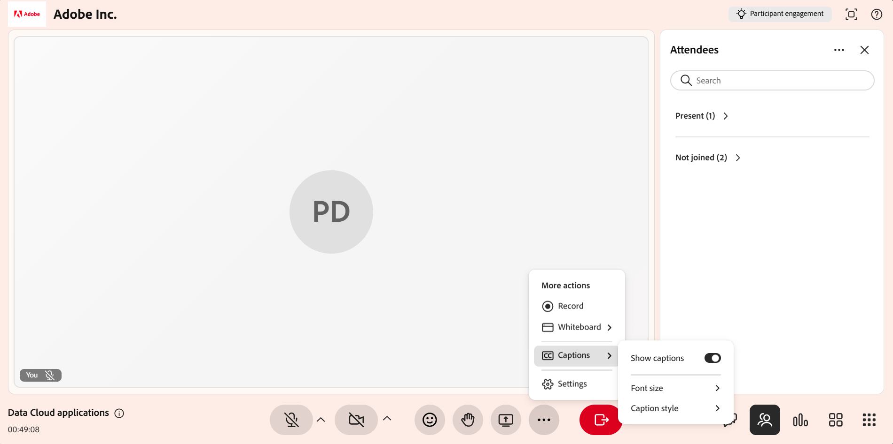
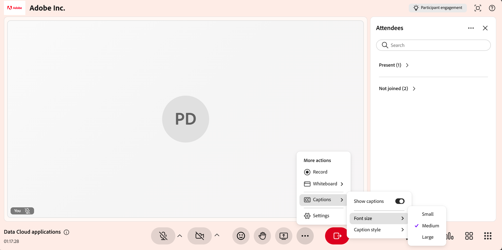

# Administrar subtítulos opcionales como instructor

Los subtítulos opcionales muestran el contenido hablado como texto en pantalla, lo que facilita el seguimiento de una sesión de Live Hub, por ejemplo, mientras realiza la presentación, responde a preguntas de los participantes o trabaja en un entorno ruidoso. Como instructor, puede administrar sus propios subtítulos opcionales desde la sala **Más acciones** del menú.

En este artículo se explica cómo mostrar, personalizar y ocultar subtítulos opcionales durante una sesión de Live Hub.

## Visualización de subtítulos opcionales

Mostrar subtítulos opcionales durante una sesión de Live Hub para ver la transcripción en tiempo real del contenido hablado.

Para activar los subtítulos opcionales:

1. Seleccione **Más opciones ( ⋯)** en la barra de control.

1. Seleccione **Subtítulos**.

1. Habilite **Mostrar subtítulos**. Los subtítulos opcionales se muestran en la parte inferior de la interfaz.

    *Habilitar Mostrar subtítulos para mostrar los subtítulos opcionales en la sesión.*

## Cambio del aspecto de los subtítulos opcionales

Puede personalizar el aspecto de los subtítulos opcionales durante una sesión para mejorar la legibilidad en función de sus necesidades de visualización.

Para cambiar el aspecto de los subtítulos:

1. Seleccione **Más opciones ( ⋯)**.

1. Seleccione **Subtítulos**.

1. Seleccione una de las opciones siguientes:

   1. **Tamaño de fuente**: Seleccione un tamaño para el texto de los subtítulos opcionales. Las opciones disponibles son **Pequeño**, **Medio** y **Grande**.

   1. **Estilo de título**: Seleccione una combinación de colores. Las combinaciones disponibles son **Negro sobre Blanco**, **Amarillo sobre Negro**, **Blanco sobre Negro**, **Oscuro sobre Amarillo** y **Amarillo sobre Azul**.

   
   *Seleccione el tamaño de fuente para cambiar el tamaño del texto que se muestra en los subtítulos.*
