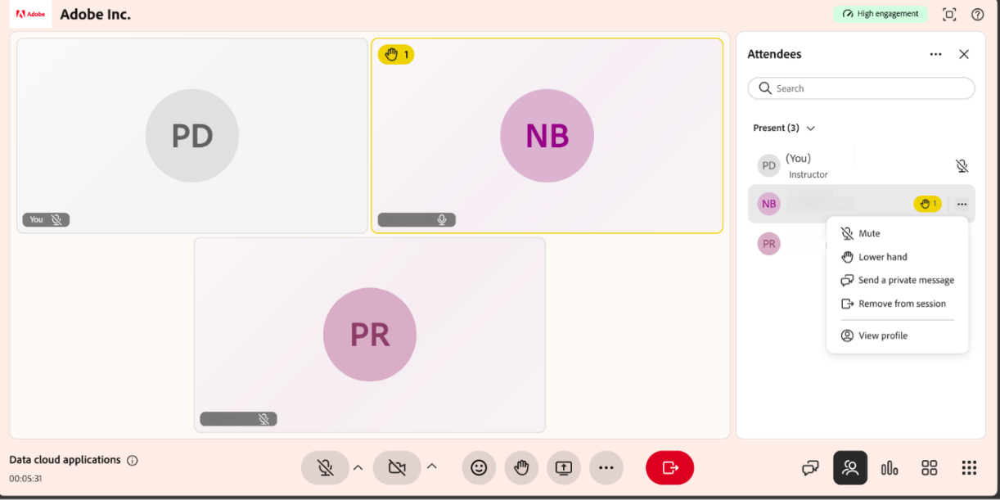

# Administrar el panel de asistentes

Utilice el panel **Asistentes** para ver y administrar participantes en una sesión de Live Hub. El panel muestra una lista en tiempo real de asistentes, incluidos los alumnos que se han unido a la sesión y los que se han inscrito pero aún no se han unido. También muestra la función y el estado de interacción de cada asistente.

Como instructor, puede utilizar el panel Asistentes para administrar la participación de los alumnos, configurar los permisos de los asistentes y moderar las interacciones durante la sesión. Puede realizar acciones como silenciar los micrófonos, bajar las manos levantadas, enviar mensajes privados y quitar alumnos de la sesión.

En este artículo se explica cómo acceder al panel Asistentes y gestionar a los alumnos durante una sesión de Live Hub.

## Ver el panel de asistentes

El panel **Asistentes** muestra a todos los asistentes a la sesión. Para abrirlo, seleccione  en la barra de control. El panel enumera automáticamente todos los alumnos y las actualizaciones a medida que los participantes se unen o abandonan.

*Interfaz de Live Hub que muestra el panel de asistentes.*

Las siguientes opciones están disponibles en el panel:

| **Opción** | **Descripción** |
|----|----|
| **Buscar** | Escriba en el campo **Buscar** para buscar un participante. La lista se filtra a medida que escribe. |
| **Presentar** | Muestra los alumnos que se encuentran actualmente en la sesión, junto con sus funciones (p. ej., instructor) y el estado del micrófono. El número entre paréntesis indica cuántos están presentes. |
| **No unido** | Muestra los alumnos inscritos en la sesión que aún no se han unido. Seleccione la flecha para expandir la lista. |

## Ajustes del panel Asistentes

Para administrar las preferencias de asistentes:

1. Seleccione **Más opciones ( ⋯)** en el panel **Asistentes**.

1. Puede realizar las siguientes acciones disponibles:

   1. **Bajar todas las manos**: Baje todas las manos levantadas para los participantes.

   1. **Silenciar a todos los participantes**: Silencie los micrófonos de todos los participantes.

   1. **Desactivar la cámara para todos los participantes**: Apague las cámaras de todos los participantes.

## Organizar alumnos durante la sesión

El panel **Asistentes** te permite administrar alumnos individuales durante la sesión. Puede moderar las interacciones y realizar acciones rápidas para un alumno específico cuando sea necesario, como silenciar el micrófono, bajar la mano levantada, enviar un mensaje privado o ver su perfil, lo que le ayudará a mantener un entorno de aprendizaje organizado.

Para actualizar los permisos de alumno:

1. Desplácese hasta el alumno en el panel **Asistentes**.

1. Seleccione el icono **Más opciones ( ⋯)** situado junto al nombre del alumno.

   Menú 
   *Menú Más opciones que muestra las acciones del alumno en el panel Asistentes.*

1. Seleccione una de las siguientes acciones:

| **Acción** | **Descripción** |
|----|----|
| **Silenciar** | Desactiva el micrófono del alumno. |
| **Mano inferior** | Elimina el indicador de mano en relieve del alumno. |
| **Enviar un mensaje privado** | Abre una conversación privada con el alumno. |
| **Quitar de la sesión** | Elimina al alumno de la sesión. |
| **Ver perfil** | Muestra la información del perfil del alumno. |
