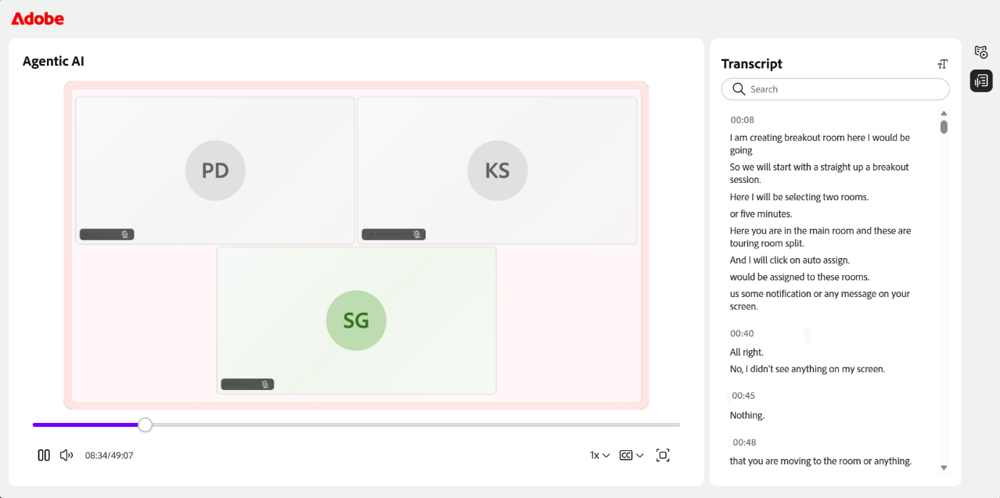

# Grabar una sesión

Como instructor, tiene control total sobre cómo se captura, se perfecciona y se comparte una sesión. Puede iniciar una grabación durante una sesión en directo, administrarla mientras se ejecuta y revisar los temas, el resumen y la transcripción generados automáticamente una vez que finalice la sesión.

Además de capturar la sesión, puede editar la grabación para eliminar secciones innecesarias, habilitar subtítulos opcionales y transcripciones. Las siguientes secciones describen cada una de estas acciones en detalle.

>[!NOTE]
>
>Al grabar una sesión, solo se incluye en la grabación la sesión principal. La grabación se detiene automáticamente cuando los participantes se mueven a las salas de grupo de trabajo y se reanuda cuando todos vuelven a la sesión principal. Como resultado, no se registran las actividades de la sala de grupo de trabajo.

## Grabar una sesión

1. Vaya al menú **Más acciones**.

1. Seleccione **Iniciar grabación**.   Aparece una ventana emergente de confirmación que indica que &quot;**La sesión se está grabando**&quot;.

   
   *Seleccione Grabar en el menú Más acciones para comenzar a capturar la sesión.*

## Detener, pausar y reanudar la grabación

Al grabar una sesión, aparece un indicador de grabación en la esquina superior de la clase virtual. Puede iniciar, detener y reanudar la grabación.

### Detener grabación

1. Seleccione el indicador de grabación.   Se abre una ventana emergente con acciones de grabación.

   
   *Durante la grabación, use las opciones de Grabación en curso para pausar o detener la sesión.*

1. Seleccione **Detener grabación**.   Aparece un mensaje de confirmación que indica que la sesión ya no se está grabando.

### Pausar grabación

Para pausar la grabación:

1. Seleccione el indicador de grabación.

1. Seleccione **Pausar grabación**.   Aparecerá un mensaje de confirmación que muestra **Grabación y transcripción en pausa**.

### Reanudar grabación

Una vez que haya pausado la grabación, aparecerá la opción reanudar la grabación. Seleccione **Reanudar grabación** para continuar con la grabación en pausa.

*Cuando está en pausa, las opciones de grabación en pausa le permiten reanudar o detener la grabación.*

## Acceder a una grabación

Las sesiones grabadas están disponibles en la página **Información general de la sesión** de cada sesión. Desde aquí, puede reproducir una grabación o abrirla en modo de edición para ajustar la cronología y la transcripción.

Para acceder a una grabación:

1. Vaya al curso correspondiente y abra la sesión.

1. Desplácese hasta la sección **Live Hub** en la página **Introducción a la sesión**.

1. En la tarjeta **Ver grabación**, realice una de las siguientes acciones:

   * Seleccione **Ver grabación** para abrir la grabación en modo de reproducción.

   * Seleccione **Editar** para abrir la grabación en modo de edición.

   Opción de edición de grabación de 
   *La tarjeta de grabación Ver en la sección Centro activo, donde se reproduce o edita una grabación.*

## Reproducir una grabación

Si selecciona Ver grabación , se abre la grabación en el reproductor de grabación. El reproductor muestra el vídeo de la sesión, las miniaturas de los participantes y la transcripción.

Para reproducir una grabación:

1. Vaya a la página **Resumen de sesión**.

1. Seleccione **Ver grabación** en la sección **Live Hub**.   La grabación se abre en modo de reproducción.

   
   *El reproductor de grabación está en modo de reproducción, lo que muestra el vídeo de la sesión y el panel Transcripción.*

1. Utilice los siguientes controles de reproducción para ajustar la experiencia de visualización:

| **Control** | **Descripción** |
|----|----|
| Reproducir o Pausar | Inicia o pausa la reproducción. |
| Volumen | Ajusta el nivel de audio. |
| Barra de progreso | Arrastre para desplazarse a un punto específico de la grabación. El tiempo transcurrido y total se muestra junto a los controles. |
| Velocidad de reproducción | Ralentiza o acelera la reproducción. Las opciones disponibles son **0,25x**, **0,5x**, **0,75x**, **1x**, **1,25x**, **1,5x** y **2x**. |
| CC (subtítulos opcionales) | Activa o desactiva los subtítulos opcionales durante la reproducción. Seleccione la flecha junto al botón CC para personalizar los subtítulos. Elige un tamaño de fuente entre **Pequeño**, **Medio** o **Grande** y un estilo de leyenda entre **Blanco sobre blanco**, **Amarillo sobre negro**, **Blanco sobre negro**, **Oscuro sobre amarillo** o **Amarillo sobre azul**. |
| Pantalla completa | Expande el reproductor de grabación. |

## Generar temas en la grabación

Los temas dividen automáticamente las grabaciones en secciones significativas en función del flujo de la discusión de la sesión. Ayudan a organizar grabaciones más largas y a mejorar la navegación. También puede buscar un tema mediante palabras clave para desplazarse rápidamente a la sección correspondiente de la grabación.

## Ver temas de la grabación

Una vez que se generan los temas, puede examinarlos y navegar por ellos. Los temas se marcan como **Generados con IA**. Revise el contenido, ya que las respuestas generadas por IA deben verificarse dos veces.

Para ver y navegar por los temas:

1. En el panel **Temas**, examine la lista de temas o use el cuadro **Buscar** para encontrar un tema usando palabras clave.

1. Seleccione un tema para expandirlo y ver su resumen, detalles y duración total.

1. Seleccione **Reproducir tema**.   La grabación comienza a reproducirse desde la sección de temas seleccionada.

   
   *El panel Temas, donde los temas generados por IA le ayudan a navegar por la grabación.*

## Ver transcripción

La transcripción proporciona una versión de texto con marca de tiempo de la sesión que puede leer junto con la grabación. Cada entrada incluye el nombre del orador y la hora en que se pronunció el texto.

Para ver la transcripción:

1. Seleccione el icono **Transcripción** en el panel que se alterna en el lado derecho del reproductor.   Se abre el panel **Transcripción** y se muestra la transcripción con marca de tiempo.

1. (Opcional) Utilice el cuadro **Buscar** para buscar palabras o frases específicas en la transcripción.

Para desplazarse a una parte específica de la grabación, seleccione una entrada de transcripción. La grabación salta a la marca de tiempo correspondiente y comienza a reproducirse desde ese punto.

*El panel Transcripción, donde cada entrada se vincula a su punto en la grabación.*

### Cambiar el tamaño del texto de la transcripción

Puede ajustar el tamaño del texto de la transcripción para que sea más fácil de leer.

Para cambiar el tamaño del texto:

1. En el panel **Transcripción**, seleccione el icono **tamaño de texto** junto al encabezado **Transcripción**.

1. Seleccione un tamaño de texto de la lista. Los tamaños disponibles son 12, 14, 16, 18, 20, 24, 30 y 36. El tamaño predeterminado es 14. El texto de la transcripción se actualiza al tamaño seleccionado.

   Opción de tamaño de texto de transcripción 
   *Elija un tamaño de texto de transcripción para facilitar la lectura de las entradas.*

## Editar una grabación

La edición de una grabación en Live Hub le permite perfeccionar el contenido antes de compartirlo con los alumnos. Puede recortar la cronología para eliminar las secciones innecesarias y mejorar la claridad. Las ediciones no cambian la grabación original hasta que no se guardan.

Para editar una grabación:

1. Vaya a **Información general de la sesión** > **Centro interactivo** > **Ver grabación** y seleccione **Editar**.   La grabación se abre en modo de edición.

1. (Opcional) Para cambiar el nombre de la grabación, seleccione el icono **editar (lápiz)** situado junto al título de la grabación e introduzca un nuevo nombre.

1. Seleccione **Editar línea de tiempo** en la parte inferior del reproductor de grabación.   Aparece una barra de progreso arrastrable en la cronología de grabación.

1. Coloque el marcador en la barra de progreso para seleccionar el segmento que desea quitar.

1. Arrastre el marcador o utilice las teclas de flecha izquierda y derecha para moverlo con precisión. Una miniatura de vista previa y una marca de tiempo le ayudan a encontrar el punto exacto.

   Marcador de línea de tiempo de grabación 
   *Coloque el marcador para seleccionar el segmento de línea de tiempo que desea quitar.*

1. Seleccione **Cortar selección**. Se eliminará la sección seleccionada de la grabación.

1. (Opcional) Use **Deshacer** o **Rehacer** para revertir o volver a aplicar una acción, o bien seleccione **Cancelar** para descartar la selección actual.

1. Seleccione **Guardar ediciones**.   Los cambios se aplican a la grabación.

   
   *Una vez cortada una selección, las ediciones de Guardar se activan para que pueda aplicar el cambio.*

También puede editar una grabación desde el **panel de sesiones**. Consulte [Componentes del panel de sesión](../getting-started-with-live-hub/components-of-the-session-dashboard.md#recordings) para obtener más información.

## Regenerar temas

Al editar la cronología de la grabación, los temas existentes ya no coinciden con la grabación actualizada. Puede volver a generar los temas para mantenerlos sincronizados con la nueva línea de tiempo.

Para regenerar temas:

1. Seleccione el icono **Topics** en el panel que se muestra a la derecha del reproductor.   Aparecerá el panel Temas.

1. Seleccione **Regenerar**.   Aparece el mensaje **Generando temas** mientras se identifican los temas. La identificación de los temas puede tardar algún tiempo.

   
   *Después de editar la línea de tiempo, use el símbolo del sistema para volver a generar los temas sincronizados con la grabación.*

## Volver al original

Si desea descartar todas las ediciones y restaurar la grabación a su estado original, utilice la opción Volver al original .

Para volver a la grabación original:

1. Seleccione el icono **Volver al original** en la parte superior del reproductor.   Aparece una ventana emergente de confirmación de **Volver al original**.

   
   *La ventana emergente de confirmación advierte de que no se puede deshacer la vuelta al original.*

1. Seleccione **Revertir**. Esto deshace todos los cambios realizados en la grabación y la transcripción. Se trata de una acción irreversible que no puede deshacerse.

1. (Opcional) Seleccione **Cancelar** si no desea revertir la operación.

## Descargar una grabación

Puede descargar una grabación para acceder a ella sin conexión o compartirla fuera de la plataforma.

La descarga de una grabación se gestiona desde el panel de la sesión. Consulte [Componentes del panel de sesión](./components-of-the-session-dashboard.md) para obtener más información.
