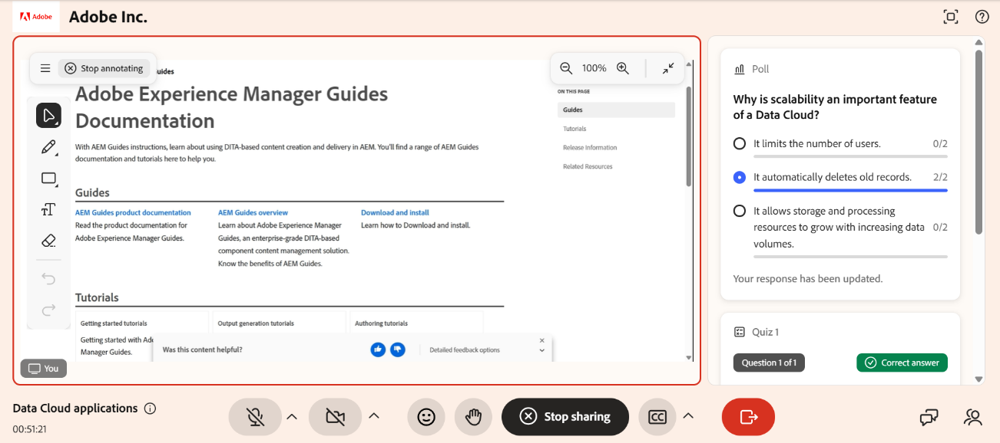

# Compartir la pantalla como alumno

Como alumno, el uso compartido de pantalla le permite seguir lo que otros presentan y, cuando el instructor lo permite, compartir su propia pantalla durante una sesión de Live Hub. El contenido compartido aparece en el escenario principal y se actualiza en tiempo real, por lo que puedes ver una demostración, ver una pizarra o participar en una actividad mientras sucede.

En esta guía se explica cómo ver contenido compartido y compartir la pantalla como alumno.

## Compartir la pantalla

Solo puede compartir la pantalla durante una sesión si un instructor ha activado el uso compartido de la pantalla.

Para compartir la pantalla:

1. Seleccione  en la barra de control. Se abre una ventana emergente.

1. Seleccione una de las siguientes acciones:

   1. **Ficha de Chrome**: Compartir una pestaña del navegador.

   1. **Ventana**: Compartir una aplicación específica.

   1. **Pantalla completa**: Comparte tu pantalla completa.

1. (Opcional) Habilite **Compartir también audio de pestaña** para incluir audio de la pestaña compartida.

1. Seleccione el contenido que desea compartir.

1. Seleccione **Compartir**. El contenido seleccionado se muestra a todos los alumnos.

   Vista de uso compartido de pantalla de 
   *Interfaz de Live Hub que muestra la pantalla compartida por el alumno.*

## Uso de herramientas de anotación

Mientras comparte la pantalla, puede realizar anotaciones en ella para resaltar información o explicar el contenido a otros usuarios de la sesión. Para realizar anotaciones, seleccione el icono de anotación (lápiz) situado en la esquina superior derecha de la pantalla compartida. Vea [Usar herramientas de anotación](../getting-started-with-live-hub/share-your-screen-as-an-instructor.md#use-annotation-tools) para obtener más información.
