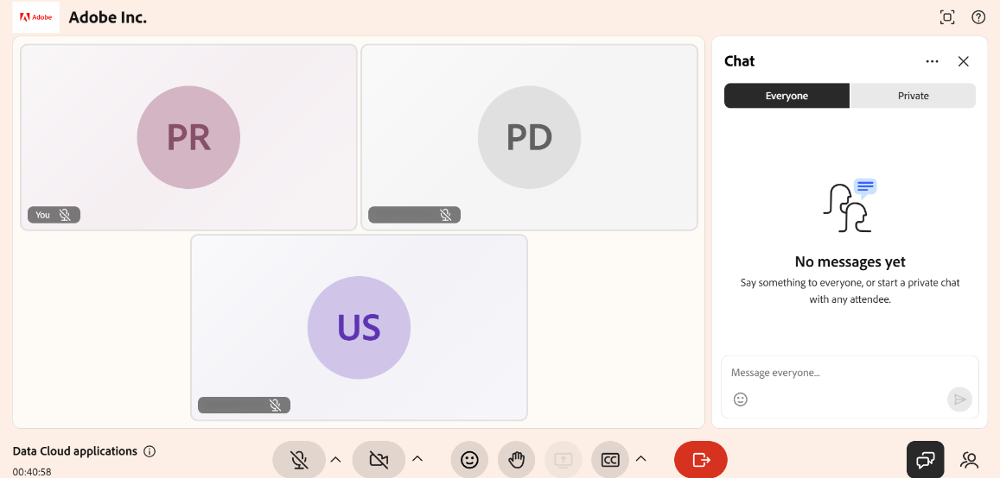
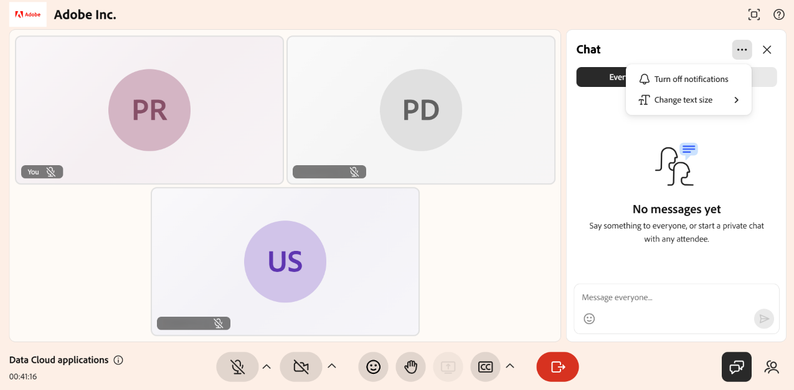

# Utilizar el panel de chat como alumno

Utilice el panel Chat para participar en conversaciones durante una sesión de Live Hub. Puede enviar mensajes a todos los participantes, hacer preguntas y administrar sus mensajes de chat. Si el instructor ha activado la mensajería privada, también puede chatear directamente con otros participantes. En este artículo se describen las funciones de chat disponibles para los alumnos.

## Acceder al panel Chat

Como alumno, puede utilizar el panel Chat para participar en debates, hacer preguntas y conectarse con otras personas durante una sesión.

Siga estos pasos para acceder al panel Chat:

1. Únete a la sesión de Live Hub.

1. Seleccione  en la barra de control. El panel Chat se abre con la pestaña **Todos** de forma predeterminada, lo que te permite unirte o seguir la conversación en curso.

1. Seleccione una de las siguientes pestañas:

   1. Todos

   1. Privado

   
   *Panel de chat que muestra las pestañas Todos y Privado para la comunicación.*

1. Escribe tu mensaje y selecciona **Enviar**.

## Personalización del panel Chat

Puede personalizar el panel Chat para gestionar las notificaciones y mejorar la legibilidad de los mensajes durante una sesión de Live Hub.

Para personalizar el panel Chat:

1. Abra el panel **Chat**.

1. Seleccione **Más opciones ( ⋯)** en la esquina superior derecha del panel Chat.

1. Seleccione una de las opciones siguientes:

   1. **Desactivar notificaciones**: Deshabilite las notificaciones de chat para la sesión actual.

   1. **Cambiar tamaño del texto**: Aumente o disminuya el tamaño de los mensajes de chat para facilitar su lectura.

   
   *Configuración del panel de chat que muestra opciones para desactivar las notificaciones y ajustar el tamaño del texto de los mensajes de chat.*

## Administrar los mensajes de chat

Puede interactuar con los mensajes para mantener las conversaciones organizadas y actualizadas. Responde a los mensajes, reacciona con emojis, edita los mensajes después de enviarlos o elimínalos cuando ya no sean necesarios.

Para administrar un mensaje en el chat:

1. Pase el ratón sobre el mensaje para ver las acciones disponibles.

1. Seleccione la acción necesaria.

| **Acción** | **Descripción** |
|----|----|
| **React** | Añada una reacción emoji para reconocer o responder a un mensaje sin enviar un nuevo mensaje de chat. |
| **Responder** | Responder a un mensaje específico. La respuesta incluye una referencia al mensaje original para un mejor contexto. |
| **Editar** | Actualizar un mensaje después de enviarlo. El mensaje editado reemplaza el mensaje original del chat. |
| **Eliminar** | Elimine el mensaje del chat. Aparece la etiqueta &quot;Mensaje eliminado&quot; para mantener el flujo de la conversación. |

## Enviar mensajes privados

La pestaña **Privado** te permite comunicarte directamente con otros participantes durante una sesión sin compartir mensajes en el chat público.

Para iniciar una conversación privada:

1. Seleccione la pestaña **Privado**.

1. Seleccione un participante de la lista.

   
   *La pestaña Privado muestra una conversación individual entre un alumno y otro participante.*

1. Escribe tu mensaje y selecciona **Enviar**.

Se abre una conversación privada con el participante seleccionado. Los mensajes solo son visibles para usted y para ese participante.

>[!NOTE]
>
> La disponibilidad del chat privado depende de la configuración de la sesión. Si el instructor desactiva el chat privado, no podrá iniciar ni participar en conversaciones privadas.
