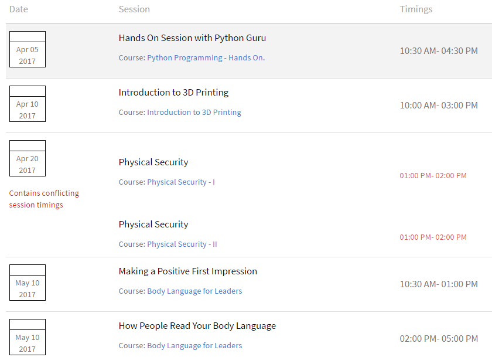
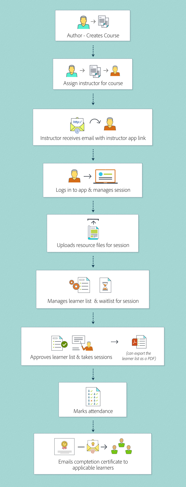

# Primeros pasos como instructor en Learning Manager

Lea este artículo para obtener información sobre los primeros pasos que realiza un instructor en Learning Manager.

## Iniciar sesión como instructor {#loginasaninstructor}

Cuando un autor le agrega como instructor de un módulo en un curso, usted recibe un correo electrónico en su correo electrónico registrado. El correo electrónico contiene un vínculo a la aplicación del instructor. Haga clic en el vínculo para ir a la página de inicio de sesión de Learning Manager.

1. Inicie sesión en Learning Manager.

   La pantalla muestra la página principal de la aplicación del instructor. Puede ver los detalles de sus sesiones futuras.

   

   *Ver la página principal de la aplicación del instructor*

Los administradores también pueden añadir un usuario como autor a un módulo al agregar datos de sesión para una instancia de curso.

## Administración de módulos como instructor {#managingmodulesasaninstructor}

Consulte la imagen siguiente para obtener información sobre el flujo de trabajo para instructores en Learning Manager:

*Flujo de trabajo de un instructor*
