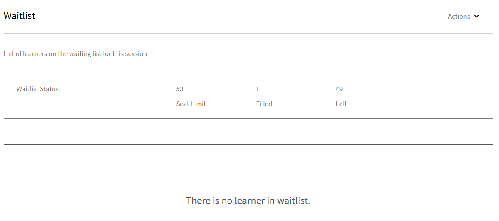

# Administrar a los alumnos de la sesión

Lea este artículo para obtener información sobre cómo administrar a los asistentes, enviar correos electrónicos relacionados con el curso y recordatorios de las sesiones.

## Ver sesiones o módulos con revisiones pendientes {#pending}

Como instructor, puede ver las sesiones o los módulos que tienen revisiones pendientes.

En la página Sesiones/Módulos, puede ver una columna **Revisiones pendientes** que muestra el número de revisiones pendientes de la sesión/actividad correspondiente.

## Administrar la lista de espera de la sesión {#managewaitlistforyoursession}

A medida que los alumnos se inscriben en el módulo, en la página Lista de espera puede ver el estado más actual de la inscripción y de la lista de espera.

1. En la aplicación del instructor, seleccione Sesiones futuras > Lista de espera en el panel de navegación izquierdo.

   Puede ver los valores del límite de puestos, la cantidad de puestos rellenados y de puestos libres. En una tabla figuran los alumnos que están en lista de espera. Si está en blanco, significa que no hay ninguna lista de espera.

   
   *Ver alumnos en lista de espera*

1. En la tabla Lista de espera, seleccione a los alumnos que quiera confirmar.
1. Seleccione Acciones > Confirmar alumnos.

   Los alumnos que haya confirmado se incorporan a la lista de alumnos confirmados.

Los instructores tienen la capacidad de dar de baja de las sesiones a los alumnos. Esto también les da de baja de los correspondientes aprendizajes. Seleccione la ficha **[!UICONTROL Lista de espera]**. Con la casilla de verificación, seleccione los alumnos a los que dar de baja. Para cancelar la inscripción, seleccione **[!UICONTROL Acciones]** > **[!UICONTROL Dar de baja a los alumnos]**.

*Dar de baja a los alumnos*

### Informe de lista de espera

El nuevo **[!UICONTROL informe de lista de espera]** de Adobe Learning Manager permite a los instructores descargar la lista de alumnos en lista de espera para todas las instancias de un curso. Los instructores pueden acceder a este informe desde la sección **[!UICONTROL Lista de espera]** de la página **[!UICONTROL Descripción general de la sesión]**.

Siguiendo las columnas disponibles en el informe de lista de espera:

* Nombre del curso
* Nombre de la instancia
* ID de instancia
* Estado de la instancia
* Nombre de usuario
* Correo electrónico
* ID exclusivo de usuario
* Fecha de inscripción (zona horaria UTC)
* Estado
* Número de lista de espera
* Límite de lista de espera
* Límite de puestos

Para descargar el informe desde la sección Instructor :

1. Inicie sesión como **[!UICONTROL Instructor]**.
2. Seleccione cualquier sesión de la página principal.
3. Seleccione la opción **[!UICONTROL Lista de espera]** en la página **[!UICONTROL Introducción a la sesión]**.
4. Selecciona **[!UICONTROL Acciones]** > **[!UICONTROL Informe de exportación]** para descargar el informe de **[!UICONTROL lista de espera]**.

## Marcar la asistencia de la sesión {#markattendanceforyoursession}

En la página Alumnos, puede ver la cantidad de alumnos confirmados que asisten a la sesión, sus nombres, el estado de asistencia y demás datos.

1. En el panel de navegación izquierdo, haga clic en Sesiones futuras > Alumnos.
1. En la lista de asistentes, seleccione a uno o más alumnos, y efectúe una de las acciones siguientes:

   * Para marcar la asistencia, haga clic en Acciones > Marcar asistencia. Cuando el estado se marca como Ha asistido, no se puede cambiar.
   * Para marcar la no asistencia, haga clic en Acciones > No ha asistido.
   * Para eliminar un alumno por cancelación u otros motivos, haga clic en Acciones > Eliminar alumnos.

   Un alumno no puede completar un módulo a menos que su estado de asistencia sea Ha asistido.

   
   *Marcar la asistencia del alumno*

## Enviar correos electrónicos a alumnos {#sendemailstolearners}

Puede enviar correos electrónicos a uno o a todos los asistentes a la sesión. La función de envío de correo electrónico es muy útil para confirmar la asistencia de alumnos o para enviar comunicados relativos a la sesión. También se puede activar la función enviar correo electrónico a todos para enviar la asignación y material de la sesión, o comunicados a todos los alumnos.

Para enviar correos electrónicos a los alumnos, en la página Alumnos de la aplicación del instructor, efectúe una de las acciones siguientes:

* Para enviar correos electrónicos a determinados asistentes, seleccione el asistente y haga clic en Acciones > Enviar correo electrónico a los seleccionados.
* Para enviar correos electrónicos a fin de enviar material del curso o una asignación, haga clic en Acciones > Enviar correo electrónico a todos.

## Exportar lista de alumnos {#exportinglearnerslist}

Como instructor, puede marcar fácilmente la asistencia de todos sus alumnos exportando la lista de asistentes en formato pdf. Para exportar la lista de asistentes, vaya al alumno en el panel izquierdo. Haga clic en Acciones > Exportar lista de alumnos (PDF).

Tras confirmar la lista de asistentes a la sesión, puede exportarla como archivo PDF. Este PDF fácil de imprimir muestra a los alumnos en forma de tabla. Luego puede marcar la asistencia o proporcionar puntuaciones, así como crear notas para los alumnos, todo ello en el mismo PDF.

Observe el código QR en la esquina superior derecha de este PDF. Esta funcionalidad permite a los alumnos individuales escanear el código mediante la aplicación Learning Manager para dispositivos móviles para que marquen su asistencia.

*Analizar el código QR para marcar la asistencia*

## Aprobar o rechazar envíos {#approveorrejectsubmissions}

Si los alumnos han cargado documentos como asignaciones, informes o evaluaciones para la sesión, los documentos figuran en la página de envíos. Puede utilizar los materiales para calificar al alumno, así como para aprobar o rechazar el envío.

1. En el panel izquierdo, haga clic en Sesiones futuras o Sesiones pasadas, según el horario de la sesión.
1. Haga clic en el curso cuyos envíos desea ver.

   En el panel izquierdo, haga clic en Envíos.

1. Puede ver los envíos de los alumnos relativos a la sesión que ha seleccionado. Seleccione el envío que quiere aprobar o rechazar; a continuación, haga clic en Aprobar o Rechazar.

   Según la acción elegida, el estado del envío pasa a ser Aprobado o Rechazado.

## Configurar recordatorios de la sesión {#configureremindersforyoursession}

1. En el panel izquierdo, haga clic en Sesiones futuras.
1. Haga clic en el curso para el cual desea definir el recordatorio. En el panel izquierdo, haga clic en Recordatorios.
1. En el mosaico Seleccionar recordatorio, haga clic en Establecer recordatorio.

   
   *Configurar recordatorios para tu sesión*

1. Realice lo siguiente:

   * En el cuadro de diálogo de configuración de recordatorios, defina la opción relativa al momento de enviar el recordatorio a los alumnos: antes del plazo, según el plazo o después del plazo.
   * En el campo de días antes del plazo, indique el número de días antes del plazo que desea enviar el recordatorio a los alumnos.
   * Establezca la periodicidad del recordatorio.

   
   *Ver configuración de recordatorio*

1. Elija una de las opciones siguientes:

   * Haga clic en la marca de verificación para guardar el recordatorio.
   * Haga clic en la cruz para cancelar el recordatorio.

   Un recordatorio automatizado del curso se envía a todos los alumnos en la fecha establecida en la configuración del recordatorio.

   Si ya ha definido recordatorios de las sesiones, aparecen en los mosaicos de recordatorios existentes. Asimismo, puede añadir recordatorios a los ya creados.

   Para eliminar un recordatorio, haga clic en él. En el menú emergente, haga clic en el icono de eliminar (icono de papelera) para suprimir el recordatorio.
