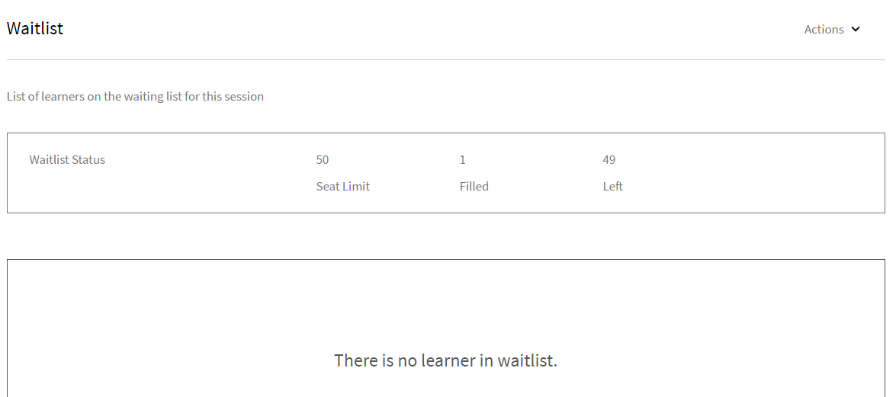
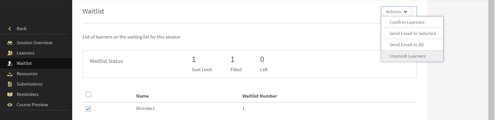
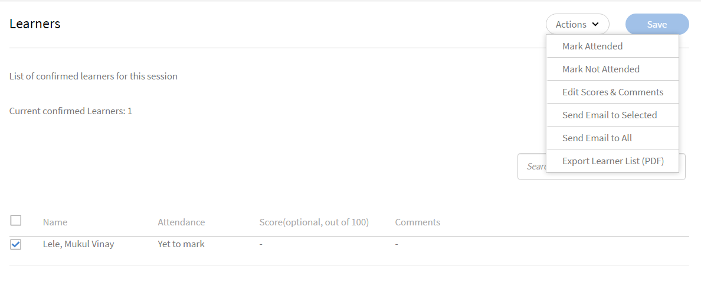
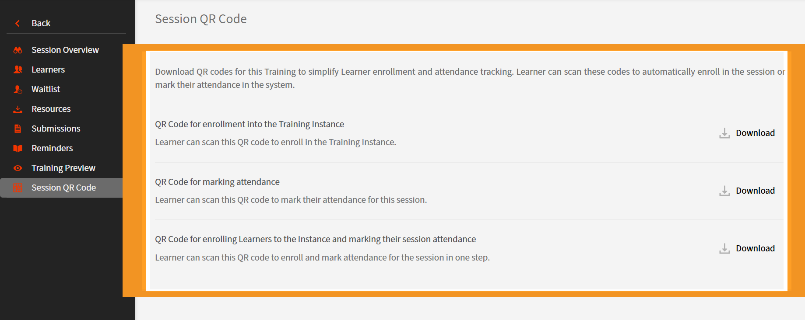
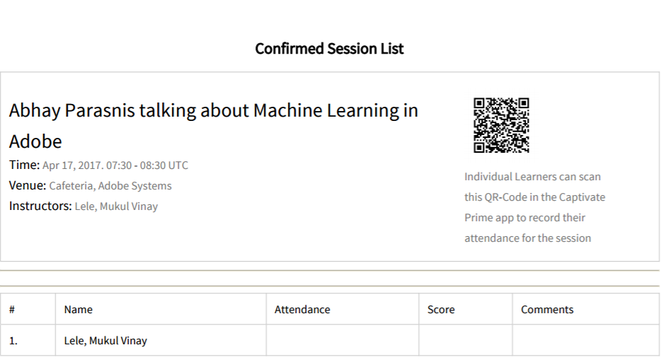
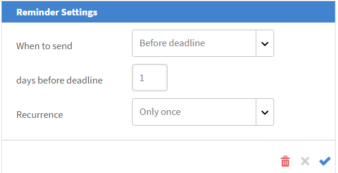

# Administrar a los alumnos de la sesión

Lea este artículo para obtener información sobre cómo administrar a los asistentes, enviar correos electrónicos relacionados con el curso y recordatorios de las sesiones.

## Ver sesiones o módulos con revisiones pendientes {#pending}

Como instructor, puede ver las sesiones o los módulos que tienen revisiones pendientes.

En la página Sesiones/Módulos, se muestra la columna **Revisiones pendientes**; en ella, se indica la cantidad de revisiones pendientes de la sesión/actividad correspondiente.

## Administrar la lista de espera de la sesión {#managewaitlistforyoursession}

A medida que los alumnos se inscriben en el módulo, en la página Lista de espera puede ver el estado más actual de la inscripción y de la lista de espera.

1. En la aplicación del instructor, seleccione Sesiones futuras > Lista de espera en el panel de navegación izquierdo.

   Puede ver los valores del límite de puestos, la cantidad de puestos rellenados y de puestos libres. En una tabla figuran los alumnos que están en lista de espera. Si está en blanco, significa que no hay ninguna lista de espera.

   
   *Ver alumnos en lista de espera*

1. En la tabla Lista de espera, seleccione a los alumnos que quiera confirmar.
1. Seleccione Acciones > Confirmar alumnos.

   Los alumnos que haya confirmado se incorporan a la lista de alumnos confirmados.

Los instructores tienen la capacidad de dar de baja de las sesiones a los alumnos. Esto también les da de baja de los correspondientes aprendizajes. Seleccione la ficha **[!UICONTROL Lista de espera]**. Con la casilla de verificación, seleccione los alumnos a los que dar de baja. Para cancelar la inscripción, seleccione **[!UICONTROL Acciones]** > **[!UICONTROL Dar de baja a los alumnos]**.

*Dar de baja a los alumnos*

### Informe de lista de espera

El nuevo **[!UICONTROL informe de lista de espera]** de Adobe Learning Manager permite a los instructores descargar la lista de alumnos en lista de espera para todas las instancias de un curso. Los instructores pueden acceder a este informe desde la sección **[!UICONTROL Lista de espera]** de la página **[!UICONTROL Descripción general de la sesión]**.

Siguiendo las columnas disponibles en el informe de lista de espera:

* Nombre del curso
* Nombre de instancia
* ID de instancia
* Estado de la instancia
* Nombre de usuario
* Correo electrónico
* ID exclusivo de usuario
* Fecha de inscripción (zona horaria UTC)
* Estado
* Número de lista de espera
* Límite de lista de espera
* Límite de puestos

Para descargar el informe desde la sección Instructor :

1. Inicie sesión como **[!UICONTROL Instructor]**.
2. Seleccione cualquier sesión de la página principal.
3. Seleccione la opción **[!UICONTROL Lista de espera]** en la página **[!UICONTROL Introducción a la sesión]**.
4. Selecciona **[!UICONTROL Acciones]** > **[!UICONTROL Informe de exportación]** para descargar el informe de **[!UICONTROL lista de espera]**.

## Marcar la asistencia de la sesión {#markattendanceforyoursession}

En la página Alumnos, puede ver la cantidad de alumnos confirmados que asisten a la sesión, sus nombres, el estado de asistencia y demás datos.

1. En el panel de navegación izquierdo, haga clic en Sesiones futuras > Alumnos.
1. En la lista de asistentes, seleccione a uno o más alumnos, y efectúe una de las acciones siguientes:

   * Para marcar la asistencia, haga clic en Acciones > Marcar asistencia. Cuando el estado se marca como Ha asistido, no se puede cambiar.
   * Para marcar la no asistencia, haga clic en Acciones > No ha asistido.
   * Para eliminar un alumno por cancelación u otros motivos, haga clic en Acciones > Eliminar alumnos.

   Un alumno no puede completar un módulo a menos que su estado de asistencia sea Ha asistido.

   
   *Marcar la asistencia del alumno*

### Descargar códigos QR de inscripción y asistencia de alumnos

Los instructores pueden descargar códigos QR para sus sesiones asignadas, de modo que los alumnos puedan inscribirse en una instancia del curso y marcar la asistencia o la finalización mediante el análisis del código QR.

Esto permite a los instructores administrar la participación en la sesión de forma independiente, sin necesidad de asistencia del administrador.

Los siguientes pasos son adecuados para ambos:

* Sesiones de clase física
* Sesiones de clase en línea

Para una sesión de clase física, como instructor, debe generar el código QR correcto y pegarlo en la clase (o pasarlo) donde asisten los alumnos a la sesión para que puedan escanear el código QR y marcar su inscripción o asistencia, o ambas cosas, en función del código QR.

Para una sesión de clase en línea, como instructor, puede enviar el código QR generado por correo, un sistema de mensajería o cualquier otro medio para que los alumnos puedan escanear el código QR y marcar su inscripción o asistencia, o ambas cosas, en función del código QR.

#### Descargar códigos QR para una sesión

1. Inicie sesión en Adobe Learning Manager con la función **Instructor**.
2. Vaya al **tablero del instructor**.
3. Abra la **instancia del curso** correspondiente.
4. Seleccione la ficha **Sesiones**.
5. Elija una sesión que tenga asignada.
6. Seleccione **Código QR de sesión**.
   

Puede descargar los siguientes códigos QR:

* **Código QR de inscripción**: permite a los alumnos inscribirse en la instancia del curso
* **Código QR de asistencia**: marca la asistencia a la sesión
* **Inscripción + código QR de asistencia**: inscribe a los alumnos y marca la asistencia en una sola digitalización

El código QR se descarga como PDF y puede compartirse digitalmente o mostrarse durante la sesión.

#### Qué sucede cuando los alumnos analizan el código QR

* Los alumnos escanean el código QR con un dispositivo móvil.
* Adobe Learning Manager valida la sesión y el alumno.
* Según el tipo de código QR:
   * Los alumnos se inscriben en la instancia del curso, o
   * Se registra la asistencia y la finalización del período de sesiones

Todas las actualizaciones se reflejan automáticamente en los registros, transcripciones e informes de los alumnos.

#### Notas

* Los códigos QR solo están disponibles para los instructores asignados a la sesión.
* Se seguirán aplicando las reglas de inscripción, asistencia y finalización configuradas para el curso y la sesión.
* El progreso del alumno y los flujos de trabajo de informes existentes no cambian.

#### Casos de uso

* Las organizaciones que ejecutan grandes volúmenes de sesiones in situ (por ejemplo, formación sobre productos para profesionales) pueden permitir a los instructores imprimir códigos QR específicos de la sesión que inscriben y marcan la asistencia con una digitalización.

* En la formación en venta, fabricación y atención sanitaria, en la que los alumnos suelen unirse a las sesiones directamente desde la planta o sin preinscripción, se puede colocar un código QR de &quot;Inscripción + Asistencia&quot; en la puerta. Esto permite a los alumnos realizar autoservicio de inscripción y asistencia a través de sus teléfonos.

* Los eventos de formación para socios o clientes permiten que el formador in situ se adapte fácilmente a los cambios en la sala, sesiones adicionales o asistentes adicionales sin necesidad de consultar al administrador para obtener nuevos códigos QR.

### Invitaciones de calendario

* Cuando un alumno o instructor se inscribe en una sesión de clase o de clase virtual, Learning Manager envía una invitación de calendario (archivo ICS).
* La invitación de calendario incluye:
   * Fecha y hora de la sesión
   * Detalles de sesión
   * **Vínculo para unirse a la sesión directa** en la descripción del calendario

Los participantes pueden abrir el evento del calendario y unirse a la sesión directamente desde su calendario.

#### Unirse a una sesión desde Gmail

1. Abra **Google Calendar**.
2. Seleccione el evento de sesión.
3. En los detalles del evento, haga clic en **vínculo de unión a sesión**.
4. La sesión se abre directamente en Adobe Learning Manager o en la herramienta de clase virtual configurada.

No es necesario abrir el correo electrónico original para acceder al vínculo de la sesión.

#### Unirse a una sesión de otros clientes del calendario

El vínculo de la sesión se incluye en el cuerpo del evento del calendario y se puede acceder a él desde:

* Microsoft Outlook
* Calendario de Apple
* Otras aplicaciones de calendario que admiten archivos ICS

#### Notas

* Learning Manager genera automáticamente las invitaciones de calendario.
* La información de zona horaria de la invitación del calendario se ajusta en función de la zona horaria seleccionada por el alumno.
* Esta mejora se aplica a las invitaciones de calendario recién generadas.
* Los administradores o instructores no necesitan ninguna configuración adicional.

## Marcar como correcto para los alumnos

Los instructores pueden marcar el estado de éxito de cada alumno como Aprobado o Suspenso directamente desde la página Alumnos. Esta función permite a los instructores registrar con precisión el resultado de las sesiones de clase o de clase virtual en función del rendimiento del alumno.

Para marcar el éxito para los alumnos:

1. Inicie sesión en Adobe Learning Manager como instructor.
2. Seleccione **[!UICONTROL Próximas sesiones]** en el panel de navegación izquierdo.
3. Seleccione **[!UICONTROL Alumnos]**.
4. Seleccione a los alumnos y, a continuación, seleccione **[!UICONTROL Acciones]**.
5. Seleccione cualquiera de las siguientes opciones para marcar el éxito de los alumnos seleccionados:

   * **[!UICONTROL Marcar como aprobado y aprobado]**: los alumnos marcados como aprobado han completado correctamente el módulo.
   * **[!UICONTROL Marcar como asistido y suspenso]**: los alumnos marcados como suspensos han completado el módulo, pero no lo han superado.

   
   _Página de alumnos que muestra el menú Acciones con las opciones Marcar como asistido y Aprobado y Marcar como asistido y Suspenso resaltadas para registrar los resultados de los alumnos_

6. Seleccione **[!UICONTROL Sí]** en el mensaje de confirmación.

## Enviar correos electrónicos a alumnos {#sendemailstolearners}

Puede enviar correos electrónicos a uno o a todos los asistentes a la sesión. La función de envío de correo electrónico es muy útil para confirmar la asistencia de alumnos o para enviar comunicados relativos a la sesión. También se puede activar la función enviar correo electrónico a todos para enviar la asignación y material de la sesión, o comunicados a todos los alumnos.

Para enviar correos electrónicos a los alumnos, en la página Alumnos de la aplicación del instructor, efectúe una de las acciones siguientes:

* Para enviar correos electrónicos a determinados asistentes, seleccione el asistente y haga clic en Acciones > Enviar correo electrónico a los seleccionados.
* Para enviar correos electrónicos a fin de enviar material del curso o una asignación, haga clic en Acciones > Enviar correo electrónico a todos.

## Capturar respuestas de invitación

Los instructores pueden capturar las respuestas de invitación de los alumnos solo cuando el administrador de ACAP ha habilitado la opción **[!UICONTROL Invitar respuesta]**. Para habilitar esta característica, los administradores deben ponerse en contacto con el equipo de soporte técnico en [learningmanagersupport@adobe.com](mailto:learningmanagersupport@adobe.com).

Una vez hecho esto, puede ver las respuestas de la invitación en la sección **[!UICONTROL Alumnos]**. Ve a cualquier sesión, selecciona **[!UICONTROL Alumnos]** y selecciona la respuesta a la invitación en el menú desplegable.

## Exportar lista de alumnos {#exportinglearnerslist}

Como instructor, puede marcar fácilmente la asistencia de todos sus alumnos exportando la lista de asistentes en formato pdf. Para exportar la lista de asistentes, vaya al alumno en el panel izquierdo. Haga clic en Acciones > Exportar lista de alumnos (PDF).

Tras confirmar la lista de asistentes a la sesión, puede exportarla como archivo PDF. Este PDF fácil de imprimir muestra a los alumnos en forma de tabla. Luego puede marcar la asistencia o proporcionar puntuaciones, así como crear notas para los alumnos, todo ello en el mismo PDF.

Observe el código QR en la esquina superior derecha de este PDF. Esta funcionalidad permite a los alumnos individuales escanear el código mediante la aplicación Learning Manager para dispositivos móviles para que marquen su asistencia.

*Analizar el código QR para marcar la asistencia*

## Aprobar o rechazar envíos {#approveorrejectsubmissions}

Si los alumnos han cargado documentos como asignaciones, informes o evaluaciones para la sesión, los documentos figuran en la página de envíos. Puede utilizar los materiales para calificar al alumno, así como para aprobar o rechazar el envío.

1. En el panel izquierdo, haga clic en Sesiones futuras o Sesiones pasadas, según el horario de la sesión.
1. Haga clic en el curso cuyos envíos desea ver.

   En el panel izquierdo, haga clic en Envíos.

1. Puede ver los envíos de los alumnos relativos a la sesión que ha seleccionado. Seleccione el envío que quiere aprobar o rechazar; a continuación, haga clic en Aprobar o Rechazar.

   Según la acción elegida, el estado del envío pasa a ser Aprobado o Rechazado.

## Configurar recordatorios de la sesión {#configureremindersforyoursession}

1. En el panel izquierdo, haga clic en Sesiones futuras.
1. Haga clic en el curso para el cual desea definir el recordatorio. En el panel izquierdo, haga clic en Recordatorios.
1. En el mosaico Seleccionar recordatorio, haga clic en Establecer recordatorio.

   
   *Configurar recordatorios para tu sesión*

1. Realice lo siguiente:

   * En el cuadro de diálogo de configuración de recordatorios, defina la opción relativa al momento de enviar el recordatorio a los alumnos: antes del plazo, según el plazo o después del plazo.
   * En el campo de días antes del plazo, indique el número de días antes del plazo que desea enviar el recordatorio a los alumnos.
   * Establezca la periodicidad del recordatorio.

   
   *Ver configuración de recordatorio*

1. Elija una de las opciones siguientes:

   * Haga clic en la marca de verificación para guardar el recordatorio.
   * Haga clic en la cruz para cancelar el recordatorio.

   Un recordatorio automatizado del curso se envía a todos los alumnos en la fecha establecida en la configuración del recordatorio.

   Si ya ha definido recordatorios de las sesiones, aparecen en los mosaicos de recordatorios existentes. Asimismo, puede añadir recordatorios a los ya creados.

   Para eliminar un recordatorio, haga clic en él. En el menú emergente, haga clic en el icono de eliminar (icono de papelera) para suprimir el recordatorio.
