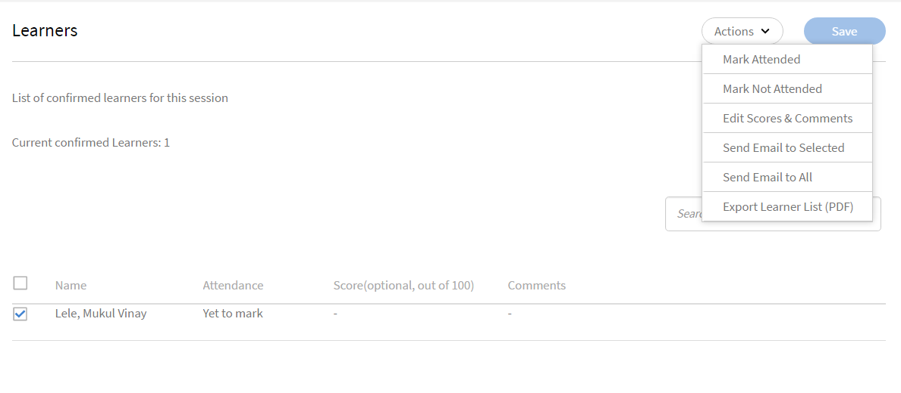

# Administrar a los alumnos de la sesión

Lea este artículo para obtener información sobre cómo administrar a los asistentes, enviar correos electrónicos relacionados con el curso y recordatorios de las sesiones.

## Ver sesiones o módulos con revisiones pendientes {#pending}

Como instructor, puede ver las sesiones o los módulos con revisiones pendientes.

En la página Sesiones/Módulos, puede ver una columna **Revisiones pendientes** que muestra el número de revisiones pendientes para la sesión/actividad correspondiente.

## Administrar la lista de espera de la sesión {#managewaitlistforyoursession}

A medida que los alumnos se registran en el módulo, puede ver el estado más reciente de la inscripción y la lista de espera en la página Lista de espera .

1. En la aplicación del instructor, seleccione Sesiones futuras > Lista de espera en el panel de navegación izquierdo.

   Puede ver el Límite de puestos, el número de puestos actualmente ocupados y el número de puestos vacantes. Una tabla también muestra los alumnos que se han puesto en lista de espera. Está en blanco si no hay colas en la lista de espera.

   
   *Ver alumnos en lista de espera*

1. En la tabla Lista de espera, seleccione el alumno o los alumnos que desea confirmar.
1. Seleccione Acciones > Confirmar alumnos.

   Los alumnos que ha confirmado se añaden a la lista Alumnos confirmados.

Los instructores pueden dar de baja a los alumnos de las sesiones. Esto también les da de baja de los aprendizajes correspondientes. Seleccionar **[!UICONTROL Lista de espera]** . Seleccione los alumnos que desea dar de baja con la casilla de verificación. Para darse de baja, seleccione **[!UICONTROL Acciones]** > **[!UICONTROL Dar de baja alumnos]**.

*Dar de baja a los alumnos*

## Marcar la asistencia a la sesión {#markattendanceforyoursession}

Puede ver el número de alumnos confirmados que asisten a la sesión, sus nombres, el estado de asistencia de los alumnos y otros detalles en la página Alumnos.

1. En el panel de navegación izquierdo, haga clic en Sesiones futuras > Alumnos.
1. Seleccione el alumno o los alumnos de la lista de asistentes y realice una de las siguientes acciones:

   * Para marcar la asistencia, haga clic en Acciones > Marcar asistencia. Una vez marcado el estado como Asistido, no se puede cambiar.
   * Para marcar la no asistencia, haga clic en Acciones > No asistido.
   * Para eliminar un alumno por cancelación u otros motivos, haga clic en Acciones > Eliminar alumnos.

   Un alumno no puede completar un módulo hasta que el estado de asistencia sea Asistencia.

   
   *Marcar la asistencia del alumno*

## Enviar correos electrónicos a los alumnos {#sendemailstolearners}

Puede enviar correos electrónicos a determinados o a todos los asistentes a la sesión. La función Enviar correo electrónico es muy útil si desea confirmar la asistencia de los alumnos o si desea enviar comunicaciones relacionadas con la sesión. También puede utilizar la opción Enviar correo electrónico a todos para enviar por correo electrónico la tarea y el material de la sesión, o para enviar una comunicación general a todos los alumnos.

Para enviar correos electrónicos a los alumnos, en la página Alumnos de la aplicación del instructor, realice una de las siguientes acciones:

* Para enviar correos electrónicos a asistentes específicos, seleccione el asistente y haga clic en Acciones > Enviar correo electrónico a los seleccionados.
* Para enviar correos electrónicos a todos los asistentes para enviar un material del curso o una tarea, haga clic en Acciones > Enviar correo electrónico a todos.

## Exportar lista de alumnos {#exportinglearnerslist}

Como instructor, puede marcar fácilmente la asistencia de todos los alumnos exportando la lista de asistentes en formato PDF. Para exportar la lista de asistentes, vaya al alumno en el panel izquierdo. Haga clic en Acciones > Exportar lista de alumnos (PDF).

Una vez confirmada la lista de asistentes para la sesión, puede exportar la lista como PDF. Este PDF fácil de imprimir muestra a los alumnos en forma de tabla. A continuación, puede marcar la asistencia o proporcionar puntuaciones y crear o proporcionar notas para el alumno, todo ello en el mismo PDF.

Observe un código QR en la esquina superior derecha de este PDF. Esta funcionalidad permite que los alumnos individuales escaneen el código mediante la aplicación móvil de Learning Manager para que los alumnos marquen su asistencia.

*Escanea el código QR para marcar la asistencia*

## Aprobar o rechazar envíos {#approveorrejectsubmissions}

Si los alumnos han cargado documentos como asignaciones, informes o evaluaciones para la sesión, puede ver los documentos en la página Envíos . Puede utilizar los materiales para clasificar al alumno y aprobar o rechazar el envío.

1. En el panel izquierdo, haga clic en Sesiones futuras o Sesiones pasadas, según la programación de la sesión.
1. Haga clic en el curso para el que desee ver los envíos.

   En el panel izquierdo, haga clic en Envíos.

1. Puede ver los envíos de los alumnos de la sesión seleccionada. Seleccione el envío que desea aprobar o rechazar y haga clic en Aprobar o Rechazar.

   El estado del envío cambia a Aprobado o Rechazado, según la acción realizada.

## Configurar recordatorios para la sesión {#configureremindersforyoursession}

1. En el panel izquierdo, haga clic en Sesiones futuras.
1. Haga clic en el curso para el que desee establecer el recordatorio. En el panel izquierdo, haga clic en Recordatorios.
1. En el mosaico Seleccionar recordatorio, haga clic en Establecer recordatorio.

   
   *Configurar recordatorios para la sesión*

1. Realice lo siguiente:

   * En el cuadro de diálogo Configuración de recordatorio, defina la opción en cuándo enviar el recordatorio a los alumnos: Antes de la fecha límite, En la fecha límite o Después de la fecha límite.
   * En el campo Días antes de la fecha límite , establezca el número de días antes de la fecha límite en los que desea enviar el recordatorio a los alumnos.
   * Establezca la periodicidad del recordatorio.

   
   *Ver configuración de recordatorio*

1. Realice una de las acciones siguientes:

   * Haga clic en la marca de verificación para guardar el recordatorio.
   * Haga clic en la cruz para cancelar el recordatorio.

   Se envía un recordatorio automatizado del curso a todos los alumnos en la fecha establecida que haya indicado en la configuración del recordatorio.

   Si ya ha configurado recordatorios para sus sesiones, puede verlos en los mosaicos Recordatorio existente. Además, también puede añadir recordatorios adicionales a los recordatorios existentes.

   Para eliminar un recordatorio existente, haga clic en él. En la ventana emergente que aparece, haga clic en el icono Eliminar (icono Papelera) para eliminar el recordatorio.
