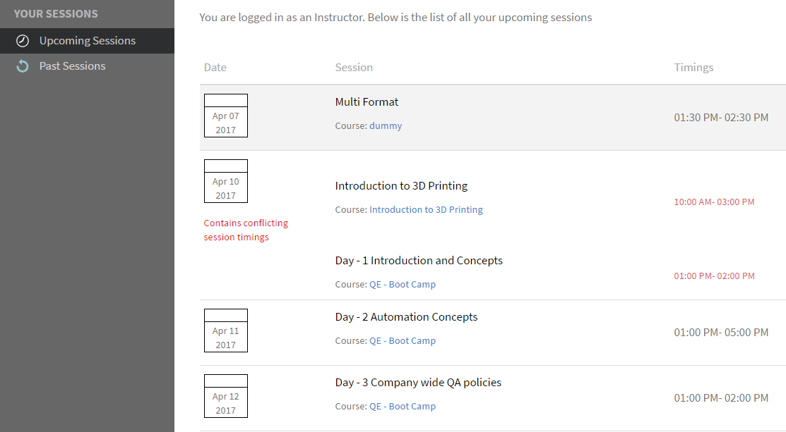
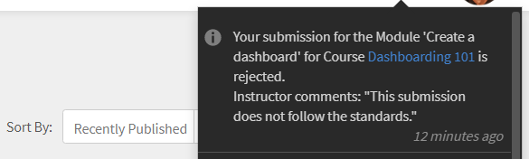

# Módulos

Lea este artículo para aprender a administrar módulos como instructor en Learning Manager.

## Ver resumen de la sesión {#viewsessionoverview}

1. En el panel izquierdo, haga clic en Sesiones futuras.
1. En la lista de las próximas sesiones, seleccione la sesión cuyos detalles desea ver.

   La aplicación muestra la descripción general de la sesión con detalles como el nombre de la sesión, el lugar, los horarios, el límite de inscripción, el límite de la lista de espera, etcétera.

   
   *Ver próximas sesiones*

## Configurar detalles de la sesión {#configuresessiondetails}

1. En el panel izquierdo, haga clic en Sesiones futuras.
1. Seleccione la sesión que desea actualizar.
1. Haga clic en Editar en la esquina superior derecha.

   
   *Configurar detalles de la sesión*

1. En la página de resumen de la sesión de la sesión, puede editar los horarios de la sesión, la fecha, el lugar, etcétera. También puede editar o añadir los siguientes detalles de la sesión:

   * Especifique el valor de Límite de inscripción a fin de establecer la cantidad máxima de alumnos permitidos para la sesión.
   * Especifique el valor de Límite de lista de espera a fin de establecer la cantidad máxima de alumnos permitidos en lista de espera para la sesión.
   * En el campo Permitir envíos, seleccione Sí para que los alumnos puedan enviar asignaciones. Si selecciona No, los alumnos no pueden cargar envíos de asignaciones para la sesión.

   
   *Editar los detalles de la sesión*

1. Haga clic en Guardar.

   En esta página no se puede editar el campo Instructor.

## Cargar archivos de recursos para la sesión {#uploadresourcefilesforyoursession}

Como instructor, puede cargar archivos de recursos como archivos de asignación, presentaciones para los módulos o archivos de actividades para el módulo. Use el menú Recursos para añadir archivos de recursos al módulo o la sesión.

1. En la aplicación de instructor, haga clic en Sesiones futuras > Recursos.

   Puede ver la página Recursos, que ya tiene un vínculo a los recursos que los autores pueden haber cargado para el curso asociado a su módulo. Además, los instructores pueden cargar archivos de recursos para módulos.

1. Haga clic en Añadir.

   
   *Agregar un recurso para la sesión*

1. Acceda a la ubicación pertinente del archivo en el equipo. Seleccione el archivo y haga clic en Abrir.
1. Después de cargar el archivo, puede ver el archivo junto con la fecha en que se añadió.

   Los alumnos que se han inscrito en este módulo pueden ver sus archivos una vez que se cargan, en la sección Recursos de Cursos.

   Para eliminar un archivo de recursos, seleccione el archivo o los archivos que desea eliminar. Haga clic en Acciones > Eliminar archivo de la página Recursos.

## Envío de archivos para módulos de actividad {#filesubmissionforactivitymodules}

El módulo de actividad admite el flujo de trabajo de envío de archivos. Como autor, cree un módulo de actividad y seleccione la  **[!UICONTROL Envío de archivos]** opción. De este modo, los alumnos pueden enviar un archivo.

Los instructores pueden aprobar o rechazar estos archivos. El módulo se completa solo después de que el instructor apruebe el envío.

 
*Aprobar o rechazar archivos*

## Módulo Lista de comprobación de evaluación {#evaluate-checklist-module}

Una vez que el alumno realiza el curso, el instructor ve el módulo de lista de comprobación en la página Envíos/Listas de comprobación del **Módulos** sección. Esta página contiene todos los módulos de lista de comprobación de actividades, junto con los módulos de envío de actividades, para los que deben realizarse revisiones. Para cada módulo, se muestra el número de alumnos que se deben evaluar.

En la página siguiente, puede ver módulos de tipo **Envío** y **Lista de comprobación**. Para este ejemplo, utilizaremos el módulo Lista de comprobación.

*Ver lista de módulos*

Haga clic en el módulo Lista de comprobación. En la **Lista de comprobación** , verá lo siguiente:

* El nombre del módulo.
* El nombre del curso.
* La instancia a la que pertenece el curso.
* Los criterios para aprobar establecidos por el autor.
* El número de preguntas de la lista de comprobación.

*Ver la página de lista de comprobación*

Para evaluar a un alumno, haga clic en **[!UICONTROL Evaluar]** en el **[!UICONTROL Lista de comprobación]** columna. También puede ver que la revisión presenta el estado **Pendiente**.

Evalúe al alumno y haga clic en **[!UICONTROL Enviar]**. Como instructor, debe responder a todas las preguntas de evaluación.

*Lista de comprobación para evaluación*

En función de los criterios para aprobar, el estado será Suspendido o Aprobado.

Una vez evaluada, una lista de comprobación no se puede volver a evaluar.

Un instructor también puede ver las respuestas enviadas por otros instructores del módulo.

Puede exportar a los alumnos como un archivo .csv en función del filtro de búsqueda aplicado.

Una vez que el instructor evalúe el curso mediante la lista de comprobación, el alumno verá el estado del módulo como **Pass** y estado del curso como **Completado**, o el estado del módulo como **Fracasar** y el estado del curso como **Completado**.

## Comentarios del instructor para rechazar una actividad {#rejection-comments}

Un alumno puede ver el comentario de un instructor en la notificación enviada para el rechazo. A continuación, el alumno puede realizar de nuevo el envío proporcionando más información en forma de comentarios.

Este es el flujo de trabajo:

1. Un autor crea un curso con un módulo de actividad, asigna un instructor y, a continuación, publica el curso.

1. Un alumno consume el curso y, después de completarlo, envía una prueba de finalización.

   
   *Enviar prueba de finalización*

1. El instructor selecciona el módulo de actividad que se le ha asignado. En la página Envíos del módulo, el instructor hace clic en **Editar**. A continuación, puede introducir comentarios para indicar el rechazo y activar la opción Mostrar comentario para que el alumno pueda ver el comentario en la notificación.

   
   *Escribir comentarios de finalización*

1. El instructor puede hacer clic **Rechazar**. El estado del envío cambia a **Marcado para rechazo**.

   
   *Rechazar un envío*

1. Después del envío, el estado cambia a **Rechazado**.

   
   *Ver estado de rechazo*

1. El alumno ve ahora una notificación que indica que se ha rechazado su envío. Los comentarios del instructor también aparecen en la notificación.

   
   *Recibir notificación de rechazo*

Para adaptarse a los cambios, Adobe ha actualizado la plantilla de correo electrónico de **Envío rechazado**.

## Añadir puntuaciones y comentarios a módulos de actividad {#addscoresandcommentsforactivitymodules}

Si desea añadir puntuaciones y comentarios a módulos de actividad que se han enviado, siga los pasos que se indican a continuación:

1. En el panel izquierdo, haga clic en **[!UICONTROL Alumno]**.

   
   *Seleccionar un alumno*

1. En la página Alumno, haga clic en **[!UICONTROL Acciones]** > **[!UICONTROL Editar puntuaciones y comentarios]**.

   
   *Añadir comentarios*

   El campo de entrada de puntuaciones y comentarios no estará disponible para los alumnos que no hayan completado el curso.

   
   *Editar puntuaciones y comentarios*

1. Haga clic en **[!UICONTROL Guardar]**.
