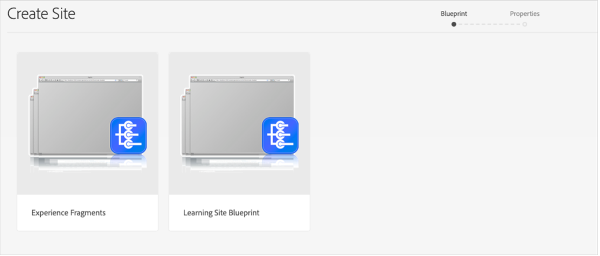

# Integrar Adobe Learning Manager con AEM

Adobe Learning Manager (ALM) se integra con los sitios de Adobe Experience Manager (AEM). Esto le permite crear su propio sitio web e interfaces móviles interactivas para Adobe Learning Manager con un esfuerzo de codificación mínimo. Con esta integración, puede crear experiencias de aprendizaje personalizadas para los usuarios.

Para crear esta experiencia, ALM proporciona un paquete de sitios de referencia de Adobe Learning Manager (paquete de sitios de referencia de ALM) para AEM Sites en forma de archivo ZIP que puede instalar en la instancia de AEM Sites.

El paquete incluye plantillas de página web y componentes de sitio web de AEM Sites, junto con widgets incrustables, como, por ejemplo, catálogos de aprendizaje, calendarios, etc.

Después de instalar el paquete de sitios de referencia de ALM, puede comenzar a crear un sitio web para Adobe Learning Manager que puede alojar en la instancia de AEM Sites. Los usuarios pueden arrastrar y soltar los componentes en el sitio web.

>[!IMPORTANT]
>
>Los paquetes de Adobe Learning Manager (ALM) para AEM Sites proporcionan un bloque de código de inicio rápido para la implementación. Este paquete está diseñado para implementaciones descentralizadas. Tras la implementación del código base proporcionado, el mantenimiento continuo y el desarrollo posterior serán responsabilidad de la parte implementadora, como es la práctica estándar con las aplicaciones descentralizadas basadas en Adobe Learning Manager.

## Instalar paquete de sitios de referencia de ALM

### Requisitos previos

* Licencias para AEM Sites y Adobe Commerce
* AEM local 6.5 o Adobe Experience Manager - Cloud Service
* Adobe Commerce 2.4.3

Después de proteger el entorno de AEM Sites, debe instalar el paquete de sitios de referencia de ALM. Este paquete incluye componentes de sitios web y páginas web de AEM que ayudan a crear la plataforma de aprendizaje.

El paquete del sitio de referencia está alojado en el [**repositorio GitHub**](https://github.com/adobe/adobe-learning-manager-reference-site/releases).

Para obtener más información, consulte el archivo README (Léame).

## Descargar el paquete de contenido {#downloadthecontentpackage}

El instalador se envía como un paquete de contenido de AEM. [***Descargar el paquete***](https://github.com/adobe/adobe-learning-manager-reference-site).

El paquete de contenido está disponible como archivo zip y es compatible con AEM 6.4 y AEM 6.5.

## Instalar el componente de Learning Manager {#installcaptivateprimecomponent}

Instale el paquete de contenido de Learning Manager mediante el Administrador de paquetes de AEM:

>[!NOTE]
>
>Para obtener información sobre la instalación de paquetes, consulte [***Cómo trabajar con paquetes***](https://experienceleague.adobe.com/docs/experience-manager-65/administering/contentmanagement/package-manager.html?lang=es#how-to-work-with-packages).

1. Como autor de AEM, abra el Administrador de paquetes de AEM.
1. Haga clic en el botón **[!UICONTROL Cargar paquete]**.
1. Haga clic en **[!UICONTROL Examinar]** y cargue el paquete de contenido.
1. Haga clic en **[!UICONTROL Cargar]**.
1. Después de cargar el paquete, instálelo. Para ello, selecciónelo y haga clic en **[!UICONTROL Instalar]**.

   

   *Instalar el paquete de contenido*

## Crear una aplicación en [!DNL Adobe Learning Manager]

Después de instalar el paquete de sitios de AEM, debe configurar una aplicación de ALM para conectar el portal de aprendizaje con el sitio de AEM.

Este escenario es aplicable cuando se usa AEM con [!DNL Adobe Learning Manager].

Siga los pasos indicados a continuación:

1. Como administrador de integración, haga clic en **[!UICONTROL Aplicaciones]**.
1. Para crear una nueva aplicación, en la esquina superior derecha de la página, haga clic en **[!UICONTROL Registrar]**.
1. En la pantalla Registrar una nueva aplicación, introduzca la siguiente información:

   1. Nombre de la aplicación: el nombre de la aplicación que está creando.
   1. URL: la dirección URL de su organización.
   1. Dominios de redirección: los dominios de alojamiento del sitio web de AEM. También puede especificar caracteres comodín.
   1. Descripción: la descripción de la aplicación.
   1. Ámbitos: seleccione las opciones de acceso de lectura y escritura para la función de alumno.
   1. ¿Solo para esta cuenta?: seleccione Sí a fin de utilizar la aplicación para la cuenta de ALM existente.

1. Después de realizar los cambios, haga clic en Guardar.

Anote las credenciales de la aplicación que aparecen en la pantalla.


*Credenciales de aplicación*

Para aprobar la aplicación, haga clic en **[!UICONTROL Aprobar]**.

## Obtener tokens

1. En la ficha Recursos para desarrolladores, haga clic en **[!UICONTROL Tokens de acceso para pruebas y desarrollo]**.

   

   *Seleccionar tokens de acceso para pruebas y desarrollo*

1. Introduzca los siguientes datos:

   
   *Escriba los detalles del token*

   1. Obtener el código OAuth: introduzca el ID de cliente de la sección anterior y cambie el ámbito. Haga clic en Enviar para obtener el código Oauth.
   1. Obtener token de actualización: introduzca el ID y el secreto de cliente de la sección anterior. Introduzca también el código OAuth obtenido en el paso anterior. Haga clic en Enviar.
   1. Obtener token de acceso: introduzca el ID y el secreto de cliente de la sección anterior. Introduzca también el token de actualización obtenido en el paso anterior. Haga clic en Enviar.
   1. Obtener detalles del token de acceso: introduzca el token de acceso obtenido en el paso anterior. Haga clic en Enviar.

1. Puede obtener los detalles de la respuesta JSON que se muestra a continuación. La respuesta consta del token de acceso, el token de actualización, la función de usuario, el ID de cuenta, el ID de usuario y el tiempo de caducidad. Anote el token de actualización, ya que volverá a utilizarlo.

## Configurar la cuenta de ALM en AEM

1. Inicie la instancia de AEM.
1. Haga clic en Configuración > Cloud Service.
1. Haga clic en Configuración de Adobe Learning Manager.

   
   *Seleccionar configuración de Adobe Learning Manager*

1. Haga clic en Crear > Carpeta de configuración. Asigne un nombre a la carpeta.

   
   *Crear configuración*

1. En el proyecto de aprendizaje, seleccione la configuración que ha creado.

1. Introduzca los detalles de la configuración.

   
   *Crear carpeta de configuración*

   1. Modo Adobe Learning Manager: elija cómo desea que los alumnos que han iniciado sesión y los que no lo han hecho puedan disfrutar de la experiencia de aprendizaje.
   1. URL de Adobe Learning Manager: introduzca la dirección URL de la instancia de ALM en la que se alojan los servicios de aprendizaje.
   1. ID de cuenta: ID de la cuenta de ALM.
   1. ID de cliente, secreto de cliente y token de actualización de autor: introduzca las credenciales que obtuvo al crear la aplicación en ALM.
   1. Personalización del widget: para obtener más información, vea [Integrar con AEM](/help/migrated/integrate-aem-learning-manager.md) `.`

1. Guarde y cierre la configuración.

### AEM + Adobe Learning Manager (usuarios que han iniciado sesión o que no)

Adobe Learning Manager le permite ahora mostrar su producto y cursos de formación a sus clientes y socios actuales y potenciales sin necesidad de crear una cuenta o iniciar sesión. Esta función le ayudará a impulsar la adopción del producto y la formación ofreciendo a los alumnos una vista previa rápida y sencilla de los cursos de formación, lo que ayuda a destacar y promocionar las características del producto. Por lo tanto, puede mostrar sus productos y ofertas, sobre todo, a clientes y socios potenciales, lo que aumentará el conocimiento de los productos. La facilidad de acceso y una mayor disponibilidad aumentan el interés, lo que ayuda a impulsar las inscripciones en cursos de formación y la adopción del aprendizaje.

Con este flujo de trabajo, un alumno puede previsualizar un curso, acceder la información de formación o buscar un curso sin necesidad de iniciar sesión en Adobe Learning Manager. Este flujo de trabajo no es aplicable a la interfaz nativa de Learning Manager (aplicable SOLO para AEM Sites y otras interfaces descentralizadas).

**Configurar y habilitar el conector de la plataforma de aprendizaje**

En esta sección, se destacan los pasos necesarios para configurar y activar el siguiente conector:

**Acceso a datos de formación**

Este conector permite que la interfaz de usuario descentralizada basada en AEM Sites u otra personalizada recupere y procese información de formación para los alumnos y realice una búsqueda perfecta de información de formación antes o después de que el alumno inicie sesión.

Este conector solo es necesario si utiliza interfaces basadas en AEM Sites u otras interfaces descentralizadas.

El conector exporta los metadatos de formación a un almacén de datos y una solución de recuperación, así como a un sistema de activación de búsqueda. Por lo tanto, puede configurar la interfaz de usuario descentralizada basada en AEM Sites u otra personalizada para utilizar estos dos servicios con el fin de recuperar datos de formación, procesar páginas web y proporcionar a los alumnos una función de búsqueda de formación optimizada. Por ejemplo, una interfaz basada en AEM Sites que no tenga iniciada una sesión puede utilizar los metadatos exportados para ayudar al alumno a buscar y examinar páginas que muestren información de formación o acceder a ellas.

Active este conector para crear y procesar páginas web basadas en AEM Sites y ofrecer experiencias personalizadas a los alumnos antes y después de iniciar sesión. Active este conector para crear y procesar páginas web basadas en AEM Sites y ofrecer experiencias personalizadas a los alumnos antes y después de iniciar sesión.

* URL base de Adobe Learning Manager cdn : introduzca la dirección URL base de la ruta del servicio de CDN de recuperación de datos desde la página de conexión de Training Data Access.
* Token de actualización de administrador : introduzca el token de actualización que determinó en la sección anterior.
* URL base de metadatos de formación : introduzca la dirección URL base de la ruta del servicio de activación de búsqueda y recuperación de datos de búsqueda desde la página de conexión Acceso a datos de formación.
* URL de registro de Adobe Learning Manager: introduzca la URL de registro automático generada por el administrador de integración para la cuenta, que utilizan los alumnos para inscribirse en cursos de formación.

### AEM + Adobe Learning Manager + Adobe Commerce (usuarios que han iniciado sesión o que no)

Adobe Learning Manager ahora proporciona soluciones que le ayudan a integrar perfectamente la plataforma de aprendizaje con Adobe Commerce. Esta versión le permitirá conectar fácilmente las interfaces nativas basadas en sitios de AEM u otras interfaces de Learning Manager descentralizadas a Adobe Commerce. Esta integración le permite desarrollar las funciones de comercio electrónico en la plataforma de aprendizaje. Ahora puede ofrecer formación de pago a sus clientes y socios comerciales, así como permitir compras de formación fácilmente en interfaces de Learning Manager nativas y no nativas. Un alumno también puede previsualizar un curso, acceder la información de formación o buscar un curso sin necesidad de iniciar sesión en Adobe Learning Manager.

Un usuario puede utilizar la aplicación ya AEM y aprobarla, en lugar de crear una.

* URL base de cdn de Adobe Learning Manager : introduzca la dirección URL base de la ruta del servicio de CDN de recuperación de datos desde la página de conexión de Adobe Commerce.
* URL de Adobe Commerce : introduzca la dirección URL de la instancia de Adobe Commerce que está utilizando.
* Ruta del proxy de GraphQL: los componentes de Learning Manager del cliente acceden directamente al terminal de Adobe Commerce GraphQL y, por lo tanto, puede producirse un error de CORS. Para evitar este error, todas las llamadas deben servirse desde el mismo terminal que AEM o a través de un proxy que agregue encabezados CORS.
* Nombre de la tienda de Adobe Commerce : introduzca el nombre de la tienda de Adobe Commerce que determinó en la sección anterior.
* Duración del token de cliente de Adobe Commerce (en segundos) : introduzca la duración del token de cliente, que indica el período predeterminado para una sesión de inicio de sesión.
* Token de actualización de administrador : introduzca el token de actualización que determinó en la sección anterior.

## Personalizar páginas web

Personalice sus páginas web utilizando el sitio de referencias de AEM y los widgets disponibles.

1. Inicie la instancia de AEM.
1. Haga clic en Sitios y abra la página de configuración.
1. Haga clic en **[!UICONTROL Sitio de aprendizaje]** > **[!UICONTROL Maestros de idioma]** > **[!UICONTROL Inglés]**. Todas las páginas web del proyecto se incluyen en la carpeta.

   
   *Ver todas las páginas web*

1. Seleccione cualquier plantilla y haga clic en **[!UICONTROL Editar]**.

1. En la página, haga clic en el botón de configuración del componente y cambie las propiedades del componente.

   
   *Botón Seleccionar configuración*

1. Obtenga una vista previa de los cambios o puede publicar la página.

## Crear páginas web

Además de las plantillas que puede utilizar que proporciona el paquete de sitios de referencia, también puede crear páginas web basadas en las plantillas de AEM.

1. En la página de AEM principal, haga clic en Crear > Página.

1. Elija la plantilla que desea personalizar. Haga clic en Siguiente.

1. Especifique las propiedades de la página.

   
   *Propiedades de página*

1. Para crear la página, haz clic en **[!UICONTROL Crear]**.

1. Seleccione la nueva página y haga clic en **[!UICONTROL Editar]**.

1. Inserte un componente en la página, por ejemplo, **Contenido de aprendizaje**.

   
   *Filtrar por sitio*

1. Elija los filtros de catálogo necesarios que se mostrarán en la página.

## Crear un sitio a partir de un modelo

El paquete del sitio de referencia de ALM proporciona un &quot;Plan del sitio de aprendizaje&quot;, que le permite crear un sitio web para su plataforma de aprendizaje. Los modelos de AEM le permiten crear páginas web directamente a partir de componentes de AEM Sites. No es necesario utilizar una plantilla.

1. En la página de inicio AEM, haga clic en **[!UICONTROL Sitios]**.

1. Haga clic en **[!UICONTROL Crear]** > **[!UICONTROL Sitio]**.

1. Haga clic en Plan del sitio de aprendizaje.

   

   *Crear sitio a partir del plano*

1. Haga clic en Siguiente.

1. En la página de propiedades, introduzca los metadatos de la página. Haga clic en Crear.

   
   *Seleccionar modelo de sitio de aprendizaje*

1. Haga clic en el hipervínculo Inicio para desplazarse a la página principal del sitio que ha creado. En esta página, puede personalizar los widgets y los componentes de catálogo.

## Codificar el sitio web

Además de utilizar las plantillas integradas y crear el sitio web desde cero mediante los componentes WYSIWYG, también puede escribir el código y crear el sitio.

El código se encuentra en el [repositorio de GitHub del sitio de referencia](https://github.com/adobe/adobe-learning-manager-reference-site) para que pueda empezar.

Las partes principales de la plantilla son:

* core: Paquete de Java que contiene todas las funciones principales, como servicios OSGi, listeners o planificadores, así como código Java relacionado con componentes, como servlets o filtros de solicitud.
* ui.apps: contiene las partes /apps (y /etc) del proyecto, es decir, clientes, bibliotecas, componentes y plantillas de JS&amp;CSS.
* ui.content: contiene contenido de ejemplo que utiliza los componentes de ui.apps
* ui.frontend: contiene componentes React.

Todo el código se encuentra en el repositorio para que pueda empezar a trabajar.

## Importar y añadir componentes de Learning Manager a una plantilla o una página web existentes

La instalación del paquete de sitios de referencia de AEM añade los componentes de Learning Manager a la instancia de AEM Sites. De forma predeterminada, puede añadir estos componentes al sitio de aprendizaje del proyecto web (sitio web) que proporcionamos listo para su uso. Estos componentes también están disponibles en el sitio web que cree a partir del modelo del sitio de aprendizaje.

Sin embargo, si desea utilizar estos componentes de Learning Manager recién añadidos a su proyecto o sitio web existentes, debe importarlos mediante el siguiente procedimiento.

1. Instale el paquete del sitio de referencia de ALM.

1. Abra el proyecto web y vaya al archivo HTML (de la plantilla o la página web en las que desea añadir los componentes de Learning Manager).
1. Unirse a una reunión

   Abra el archivo HTML y añada los siguientes fragmentos de código al componente de página para que el código se ejecute antes de que se procesen los componentes de aprendizaje presentes en la página.

   *`<sly data-sly-use.configModel="com.adobe.learning.core.models.GlobalConfigurationModel"/>`*
   *`<meta name="cp-config" content="${configModel.config}" />`*

   El código anterior añade la configuración asignada en la etiqueta meta de la página, lo que es necesario para que se procesen los componentes de aprendizaje. Para obtener más información, consulte el [sitio de referencia de Adobe Learning Manager](https://github.com/adobe/adobe-learning-manager-reference-site/blob/master/ui.apps/src/main/content/jcr_root/apps/learning/components/page/customheaderlibs.html).

1. Asegúrese de haber asignado la configuración al proyecto web.
1. Abra la plantilla de AEM Sites donde desee importar los componentes de Learning Manager.
1. En el editor de páginas de plantilla, vaya al contenedor Componentes permitidos y seleccione **Política**.
1. En la página de políticas, vaya a Propiedades > Componentes permitidos y seleccione los siguientes componentes &quot;Aprendizaje - Contenido&quot;, &quot;Aprendizaje - Formulario&quot; y &quot;Aprendizaje - Estructura&quot;

El siguiente procedimiento permite que la plantilla cumpla las dependencias de bibliotecas de clientes de los componentes de Learning Manager importados.

Las páginas web que incluyen estos componentes deben cargar estas bibliotecas para procesar y utilizar correctamente los componentes.

1. En el editor de páginas de plantilla, haga clic en Información de página y, a continuación, en Política de página.
1. En la página de políticas, desplácese a Propiedades > Bibliotecas de clientes y añada estas a la página de plantilla:

   1. learning.site
   1. learning.ui
   1. learning.commerce

Después de guardar esta plantilla, puede añadir los componentes de Learning Manager en todas las páginas web derivadas de esta plantilla.

## Configurar el widget en AEM {#configurethewidgetinaem}

Para la configuración de widgets, el autor AEM solo necesita el token de actualización proporcionado por el administrador de integración de Learning Manager.

También puede establecer varias configuraciones de cuenta en varias páginas.

1. Haga clic en **[!UICONTROL Herramientas]** > **[!UICONTROL Cloud Service]** > **[!UICONTROL Configuración del widget de Learning Manager]**.
1. Haga clic en **[!UICONTROL Crear]**.
1. Introduzca el token de actualización aquí. Configure los demás ajustes.
1. El nombre de host debe cambiarse a &quot;learningmanagereu&quot; para las regiones de la UE.
1. Guarde y cierre la configuración.
1. Seleccione una configuración y publíquela.

## Autor de AEM {#aemauthor}

El autor de AEM debe añadir primero el componente de AEM.

A continuación, el autor de AEM podrá arrastrar y soltar el componente Adobe Learning Manager y configurarlo según corresponda.

El componente Learning Manager requiere que la configuración creada en el paso anterior se asigne a la página.  El autor puede asignar la configuración editando las propiedades de la página en **[!UICONTROL Configuración avanzada]** > **[!UICONTROL Configuración]** > **[!UICONTROL Configuración de la nube]** y proporcionar la ruta de la configuración. De este modo, el autor puede crear configuraciones para varias cuentas de Learning Manager y asignar cada una a una página de sitios diferente. Si una configuración no está asignada a la página, el componente leerá la configuración de Página principal de forma recursiva hasta que encuentre una.

## El alumno {#learner}

El alumno puede realizar los cursos desde la página.

Para poder acceder al widget de Learning Manager, el alumno debe haber iniciado sesión AEM usuario. Además, la propiedad **email** debe estar presente en el nodo &quot;/profile&quot; del nodo rep:User del alumno. Este correo electrónico debe ser exactamente igual al que aparece en la cuenta de Learning Manager.

El alumno puede realizar los cursos desde la página.

También se guarda el progreso del curso.

Se proporcionan los siguientes widgets:

1. Interacción
1. Calendario de aprendizaje
1. Widget social
1. Widget Catálogo
1. Mi aprendizaje
1. Recomendación en función del aprendizaje de los compañeros
1. Recomendaciones del administrador
1. Recomendación en función de los intereses del alumno

Si no hay recomendaciones, el widget aparecerá en blanco.

## Compatibilidad con Skyline

Skyline es la versión en la nube de AEM. Primero debe instalar Skyline desde el administrador de paquetes. Para utilizar el componente Skyline en AEM, debe haber un usuario en la cuenta de Learning Manager. En otras palabras, la dirección de correo electrónico del usuario debe existir en la cuenta.

### Implementar Skyline

Los pasos para configurar Skyline se indican en el [repositorio de GitHub](https://github.com/adobe/captivate-prime-aem-components).

## Widget Mi aprendizaje

El widget **[!UICONTROL Mi aprendizaje]** te permite mostrar formación de un catálogo específico o de un conjunto de catálogos a un usuario.

En la sección **[!UICONTROL Propiedades]** de las propiedades de la página, seleccione **[!UICONTROL Catálogo]** entre las opciones que aparecen en la lista.

<!---->

Las opciones de catálogo contienen las siguientes opciones:

* **[!UICONTROL ID de catálogo]:** ID de catálogo separados por comas para los que se debe mostrar el curso de formación.
* **[!UICONTROL Orden]:** Tipo de orden del curso de formación. Las opciones son: nombre, fecha, fechaCreado, fechaInscrito, etc.
* **[!UICONTROL Estado del alumno]:** Devuelve todos los cursos de formación que utilizan los siguientes filtros: enrolled, started, completed y not enrolled. Los resultados de la búsqueda no se mostrarán si la opción de ordenación es dateEnrolled, dueDate o dateEnrolled.
* **[!UICONTROL Nombre de la aptitud]:** Aptitud utilizada para filtrar los cursos de formación exactos.
* **[!UICONTROL Nombre de etiqueta]:** Etiqueta utilizada para filtrar resultados exactos.

Estos son algunos componentes adicionales que puede personalizar:

**[!UICONTROL Tipos de objetos de aprendizaje]:** Filtra según el tipo del objeto de aprendizaje. Los tipos admitidos son: curso, certificación, ayuda de trabajo y programa de aprendizaje.

En AEM, el título de una tarjeta de una tira estará vacío inicialmente. En propiedades, escriba el nombre del título en widgets.html.

**Personalización**

Puede personalizar la apariencia del diseño mediante widgets.html. Puede cambiar el aspecto de las tarjetas que aparecen y personalizar el tema.

En la sección **[!UICONTROL Configuración general]**, puede elegir los colores principales y secundarios de las tarjetas y especificar las propiedades para personalizar el tema.

```
{ 
 "globalCssText":"@import url('https://fonts.googleapis.com/css2?family=Grandstander:ital,wght@0,100;0,200;0,300;0,400;0,500;0,600;0,700;0,800;0,900;1,100;1,200;1,300;1,400;1,500;1,600;1,700;1,800;1,900&family=Montserrat:ital,wght@0,100;0,200;0,300;0,400;0,500;0,600;0,700;0,800;0,900;1,100;1,200;1,300;1,400;1,500;1,600;1,700;1,800;1,900&display=swap');", 
 "fontNames":"Grandstander", 
 "cardLayout":{ 
 "cardLayoutName":"compact", 
 "cardPrimaryColor":"#376BA4", 
 "cardSecondaryColor":"#F98EB0", 
 "startedStateTextColor":"#ffffff", 
 "continueStateTextColor":"#ffffff", 
 "revisitStateTextColor":"#ffffff", 
 "startedStateColor":"#a0a0a0", 
 "continueStateColor":"#f9a122", 
 "revisitedStateColor":"#7fbc64", 
 "textPrimaryColor":"#ffffff", 
 "textSecondaryColor":"#d93f3f", 
 "navIconColor":"#a0a0a0" 
 } 
}
```

### Configurar los widgets Mis cursos guardados en AEM sitios

El widget Mis cursos guardados permite a los alumnos ver sus cursos marcados o guardados directamente en las páginas de aprendizaje, lo que proporciona un acceso sencillo a los cursos que desean volver a visitar o completar más tarde.

Para configurar el widget Mis cursos guardados en AEM sitios:

1. Inicie los sitios de AEM.
2. Abra la página en modo **[!UICONTROL Editar]**.
3. Ve al **[!UICONTROL Explorador de componentes]** y añade el widget **[!UICONTROL Mi aprendizaje]** a la página.
4. Seleccione el componente y, a continuación, seleccione **[!UICONTROL Configurar]**.
5. Seleccione **[!UICONTROL Mis cursos guardados]** en el menú desplegable de **[!UICONTROL Propiedades]**.
6. Seleccione **[!UICONTROL Listo]** y luego actualice la página en modo **[!UICONTROL Vista previa]** o **[!UICONTROL Publish]**.

Los alumnos pueden ver sus cursos guardados en la tira **[!UICONTROL Guardados por mí]** en la página de inicio del alumno. Al seleccionar la tira **[!UICONTROL Guardados por mí]**, los alumnos pasan a la página del catálogo y se muestra el número exacto de cursos marcados.

Cuando se aplica otro filtro en el catálogo, solo se muestran los resultados que coinciden con ese filtro. Los elementos marcados no se incluyen automáticamente.

### Ignorar inscripción de objetos de aprendizaje de orden superior

Si la casilla de verificación **Ignorar inscripción en objeto de aprendizaje de orden superior** está activada y un usuario está inscrito directamente en un programa de aprendizaje o certificación, los cursos de esa certificación o programa de aprendizaje se mostrarán para el usuario en los widgets.

Si la casilla de verificación está desactivada, los cursos presentes en el programa de aprendizaje o la certificación en los que el usuario no se ha inscrito directamente no aparecerán.


*Seleccione la casilla Ignorar Inscripción de Objeto de Pedido Superior.

A continuación, la configuración se aplica al widget.

### Seguridad

Se añaden el ID y el secreto de cliente. Además, se oculta el token de actualización. Después de que un usuario cree toda la configuración, si el usuario vuelve a abrir la configuración para editarla o si otro usuario abre esta configuración, se enmascarará el token de actualización.
