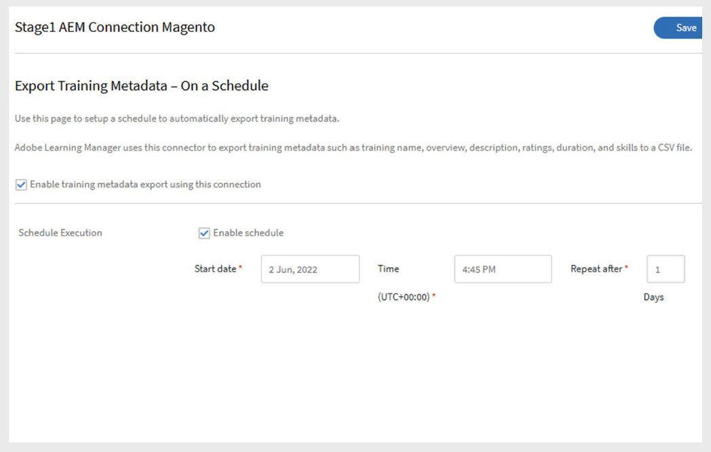

# Conector de Adobe Commerce en Adobe Learning Manager

## Conector de Adobe Commerce

>[!NOTE]
>
>Esta función solo está disponible si Adobe Learning Manager se vende como **complemento** en Adobe Experience Manager. El conector también se puede habilitar para **cuentas de prueba**.

Adobe Learning Manager se integra con Adobe Commerce, una solución de comercio electrónico ampliable y escalable que te permite ofrecer experiencias comerciales multicanal para clientes B2B y B2C. Utiliza el conector de Adobe Commerce para conectar Adobe Learning Manager con Adobe Commerce y habilitar así la formación de pago y las funciones de comercio electrónico en tu plataforma de aprendizaje.

Cuando el conector está activado, Learning Manager envía datos de formación a Adobe Commerce para que los alumnos puedan adquirir cursos, rutas de aprendizaje o certificaciones. El conector también recopila información de compra para validar las transacciones y conceder a los alumnos acceso a su formación.

## Requisitos previos

Antes de configurar el conector de Adobe Commerce, asegúrese de lo siguiente:

- Habilita [RabbitMQ](https://experienceleague.adobe.com/es/docs/commerce-cloud-service/start/overview) o cualquier otro agente de mensajería.
- Habilite [trabajos CRON](https://experienceleague.adobe.com/es/docs/commerce-cloud-service/start/overview#cron_consumers_runner).

Para activarlos, edite los siguientes archivos:

- .magento.app.yaml
- .magento/services.yaml
- .magento.env.yaml

Otros requisitos de configuración:

- Use un módulo personalizado para anular el límite de opciones. Este paso es opcional, pero se recomienda para conjuntos de datos grandes.
- Habilite todas las **API asincrónicas**. Los conjuntos de datos de formación grandes se exportan de forma asincrónica. Cuando Learning Manager llama a las API de Adobe Commerce, las solicitudes las pone en cola y las procesa un consumidor que crea productos en el lado del comercio. El procesamiento asíncrono debe estar habilitado porque no está disponible de forma predeterminada en Adobe Commerce.
- Agrega un **vínculo de devolución** a Learning Manager en la página de pago correcto de Adobe Commerce.
   - Use esta [URL de retorno](https://learningmanager.adobe.com/app/learner#/postPayment):
- Cambiar **indización** de **Al guardar** a **Programado**. Consulte la [Base de conocimiento](https://experienceleague.adobe.com/es/support?support-tab=home#home) para obtener más información.
- Aplique las **revisiones** necesarias. Consulte la [documentación de aplicación de revisiones](https://experienceleague.adobe.com/es/docs/commerce-cloud-service/start/overview) para obtener instrucciones.
- Configure **Fastly** para Adobe Commerce en la infraestructura de nube (almacenamiento provisional y producción). Consulte [Configurar Fastly](https://devdocs.magento.com/cloud/cdn/configure-fastly.html) para obtener más información.

## Configurar el conector

Para configurar Adobe Commerce Connector:

1. Inicie sesión en Adobe Learning Manager como administrador de integración.
2. Pase el ratón sobre el icono del conector **Adobe Commerce** y seleccione **Connect**.

   
   _Seleccione Conectar para configurar el conector de Adobe Commerce_

3. Escriba los siguientes datos:

   - Nombre de conexión
   - Acceder al token
   - URL de Adobe Commerce
   - Código de tienda
4. Seleccione el Tipo de interfaz de las siguientes opciones:

   - Native Learning Manager
   - Personalizado con AEM Sites

   
   _Escriba los detalles necesarios para la configuración de Adobe Commerce_

5. Seleccione **Conectar**.

## Establecer precios para formación

Una vez activada la conexión:

- Los autores pueden establecer precios para cursos, rutas de aprendizaje o certificaciones.
- Después de la publicación, los alumnos pueden adquirir formación a través de Adobe Learning Manager o de un sitio de AEM personalizado.

## Flujo de compras

### Adobe Learning Manager nativo

- Los alumnos inician sesión en Adobe Learning Manager para comprar un curso, una ruta de aprendizaje o un certificado.
- Cuando los alumnos hacen clic en Comprar ahora, se les redirige a Adobe Commerce para completar el pago.
- Después del pago, se solicita a los alumnos que regresen a Adobe Learning Manager para comenzar la formación.
- Los alumnos deben iniciar sesión por separado en Adobe Commerce para completar la compra.
- Los alumnos reciben correos electrónicos de confirmación de compra de Learning Manager y Adobe Commerce. Los correos electrónicos de Adobe Commerce se pueden activar o desactivar según sea necesario.

### AEM Sites personalizado

Al utilizar sitios de AEM personalizados:

- Los alumnos pueden examinar y comprar cursos a través del sitio de AEM.
- El sitio AEM utiliza metadatos sincronizados de Adobe Learning Manager para la búsqueda y la visualización.
- Tanto los usuarios que hayan iniciado sesión como los invitados pueden examinar. Sin embargo, solo los usuarios que hayan iniciado sesión pueden comprar.
- Después de iniciar sesión, los alumnos pueden añadir cursos a su carro, previsualizar los detalles y completar la compra.

## Exportar cursos a Adobe Commerce

### Programar exportación

Para programar la exportación:

1. Seleccione **Exportar metadatos de formación** y, a continuación, seleccione **Configurar programación**.
2. Seleccione **Habilitar exportación de metadatos de formación con esta conexión**.
3. Seleccione **Habilitar programación** y establezca la **fecha de inicio**, **hora** e **intervalo**.

   
   _Habilitar la exportación programada_

4. Seleccione **Guardar**.

### Exportación a petición

Después de que los autores hayan establecido los precios de la formación, el administrador de integración debe exportar los datos de formación:

1. Seleccione **Exportar metadatos de formación** y, a continuación, seleccione **Bajo demanda**.
2. Seleccione el intervalo de fechas.
3. Seleccione **Ejecutar** para exportar.

   
   _Crear exportación a petición_

4. Tras el éxito, los cursos y las rutas de aprendizaje con precio se trasladan a Adobe Commerce para su compra.
