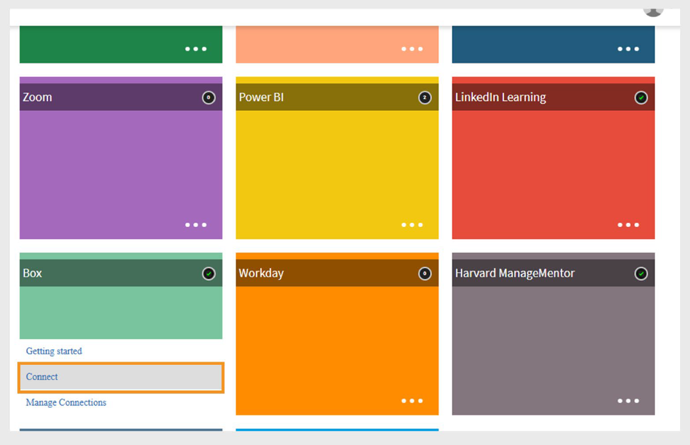

# Conector de Box en Adobe Learning Manager

## Introducción

El **conector de Box** en Adobe Learning Manager permite una integración perfecta con sistemas externos automatizando la importación y exportación de datos de aprendizaje y usuarios a través de archivos CSV. Los sistemas externos pueden colocar archivos CSV en carpetas designadas de la cuenta de Box administrada por Adobe Learning Manager, donde se procesan automáticamente según una programación definida.

Con este conector, los administradores pueden:

- Importa usuarios internos desde archivos CSV.
- Exporte datos de aptitudes de usuarios y transcripciones de alumnos a sistemas externos.
- Importe declaraciones de actividad de xAPI de sistemas de terceros compatibles.

El conector admite la asignación de atributos, la sincronización programada y la ejecución a petición, lo que ayuda a las organizaciones a mantener actualizados los datos de usuario y aprendizaje en todas las plataformas.

## Configurar el conector de Box

Para configurar el conector de Box en Adobe Learning Manager:

1. Inicie sesión en Adobe Learning Manager como administrador de integración.
2. Pase el ratón sobre el mosaico **Box**.
3. Seleccione **Conectar**.

   
   _Seleccionar Conectar para configurar el conector de BoxSeleccionar Conectar para configurar el conector de Box_

4. Escriba la dirección de correo electrónico de la persona que administrará la cuenta de Adobe Learning Manager Box para su organización.
5. Seleccione **Conectar**.

### Activar la cuenta

1. Adobe Learning Manager envía un vínculo de restablecimiento de contraseña al ID de correo electrónico proporcionado.
2. El usuario debe restablecer la contraseña antes de acceder a la cuenta de Box por primera vez.

>[!NOTE]
>
>Solo se puede configurar una cuenta de Box por cuenta de Adobe Learning Manager.

En la página **Información general**, seleccione una de las siguientes acciones:

- **Importar uso interno**
- **Importar informe de actividad de xAPI**
- **Exportar aptitudes de usuarios**
- **Exportar transcripciones de alumnos**
- **Exportar informe de actividad de xAPI**

Una vez conectado, Box Connector estará listo para sincronizar datos entre Adobe Learning Manager y sus sistemas externos.

## Importar usuarios internos

La función de importación de usuarios permite la sincronización automática de los datos de los empleados de los sistemas de RR. HH. y otras fuentes externas en Adobe Learning Manager.

### Asignación de atributos

La asignación de atributos crea la conexión entre los datos externos y la estructura de datos compatible de Adobe Learning Manager, lo que garantiza que los datos se coloquen en los campos correctos. Este paso es obligatorio.

Para asignar atributos:

1. Seleccione **Usuarios internos** en la página del conector de Box.
2. Seleccione **Asignación de columnas**.
3. En la página **Asignar atributos**:
   - El lado izquierdo muestra los campos obligatorios en Adobe Learning Manager.
   - El lado derecho muestra los nombres de las columnas del CSV. Inicialmente, este lado contiene listas desplegables vacías.
   - Seleccione **Elegir CSV** para cargar un archivo CSV de muestra. Esto rellena el menú desplegable del lado derecho con los nombres de columna del archivo CSV. Consulte [este artículo](https://experienceleague.adobe.com/es/docs/learning-manager/using/integration/migration-manual#csv) para obtener archivos CSV de muestra.
   - Asigne cada campo de Adobe Learning Manager a la columna CSV correspondiente.

   
   _Interfaz de asignación de atributos que muestra campos de Adobe Learning Manager a la izquierda y listas desplegables de columnas de CSV a la derecha_

4. Seleccione **Guardar** para completar la asignación.

Después de guardar, la cuenta configurada aparece como un origen de datos en la aplicación del administrador. Los administradores pueden programar una importación o activar una sincronización manual.

### Importar instrucciones de xAPI

La importación de instrucciones de xAPI permite un seguimiento detallado de la actividad de aprendizaje al incorporar datos de aprendizaje externos en Adobe Learning Manager.

_Configurar origen_

La configuración de origen de xAPI establece la conexión entre los sistemas de aprendizaje externos y el seguimiento de la actividad de Adobe Learning Manager.

Para configurar un origen:

1. Vaya a la sección de configuración de xAPI.
2. Seleccione **Agregar una nueva configuración** en la lista de configuración.
3. Escriba **Nombre** y **Nombre de archivo de origen**.
   - Nombre: Identificador descriptivo de este origen de xAPI (por ejemplo, integración de LMS o sistema de formación externo).
   - Nombre de archivo de origen: Nombre de archivo exacto que se cargará en la carpeta de Box (debe coincidir exactamente, incluida la extensión de archivo).

   
   _Formulario de configuración que muestra el campo de nombre y el campo de nombre de archivo de origen_

4. Seleccione **Guardar** para crear la configuración básica.

_Agregar filtros (opcional)_

Los filtros le permiten importar de forma selectiva instrucciones xAPI según criterios específicos.

Para agregar un filtro para el origen:

1. Seleccione **Filtro** en el panel izquierdo.
2. Seleccione **Agregar nuevo filtro**.
3. Configure lo siguiente:
   - **Nombre:** Nombre descriptivo de la regla de filtro.
   - **Condición:** Operador de comparación (igual a, contiene, mayor que, etc.).

   
   _Cuadro de diálogo de creación de filtros que muestra los campos Nombre y Condiciones_

4. Seleccione **Agregar nuevo filtro** para agregar más filtros.
5. Seleccione **Guardar** o **Eliminar** según sea necesario en la columna **Acciones**.
6. Después de agregar los filtros, seleccione **Guardar**.

## Programar la importación

La programación automatizada garantiza una sincronización de datos coherente sin intervención manual y mantiene los registros de actividad de aprendizaje actuales.

Para programar la importación:

1. Seleccione **Configurar programación** en el panel izquierdo.

   
   _La página de configuración de la programación muestra las opciones de habilitación y los controles de tiempo_

2. Seleccione **Habilitar la importación de instrucciones xAPI usando esta conexión**.
3. Seleccione **Habilitar programación** para configurar importaciones automáticas.
4. Establezca los siguientes parámetros de programación:

   - **Fecha de inicio:** Cuándo deben comenzar las importaciones programadas.
   - **Hora:** Hora del día para la ejecución de la importación.
   - **Repetir después de:** La frecuencia con la que se deben ejecutar las importaciones (intervalos diarios, semanales y personalizados).
5. Seleccione **Guardar**.

## Ejecutar a petición (opcional)

La ejecución a petición proporciona importaciones inmediatas de datos fuera de las operaciones programadas normales.

Cuándo utilizar las importaciones a petición:

- Probar nuevas configuraciones antes de programar.
- Procesamiento de actualizaciones de datos urgentes o urgentes.
- Gestión de migraciones o correcciones de datos de un solo uso.
- Solución de problemas de importación.

Para importar manualmente instrucciones xAPI:

1. Seleccione **Bajo demanda** en el panel izquierdo.
2. Seleccione **Ejecutar**.

## Ver estado de ejecución

La supervisión del estado permite una gestión proactiva de las operaciones de importación y una rápida identificación de los problemas.

Para ver el estado de ejecución:

1. Seleccione **Estado de ejecución** para ver una lista de todas las ejecuciones de importación.
2. La página de estado muestra:

   - **Fecha de inicio:** Cuándo comenzó la operación de importación
   - **Duración:** Tiempo total necesario para el procesamiento
   - **Tipo de importación:** Si la importación se programó o a petición
   - **Estado actual:** Información de estado en tiempo real
      - **En curso:** Se está ejecutando la importación
      - **Completado:** Finalización correcta con recuentos de registros
      - **Error:** Error con información de diagnóstico
